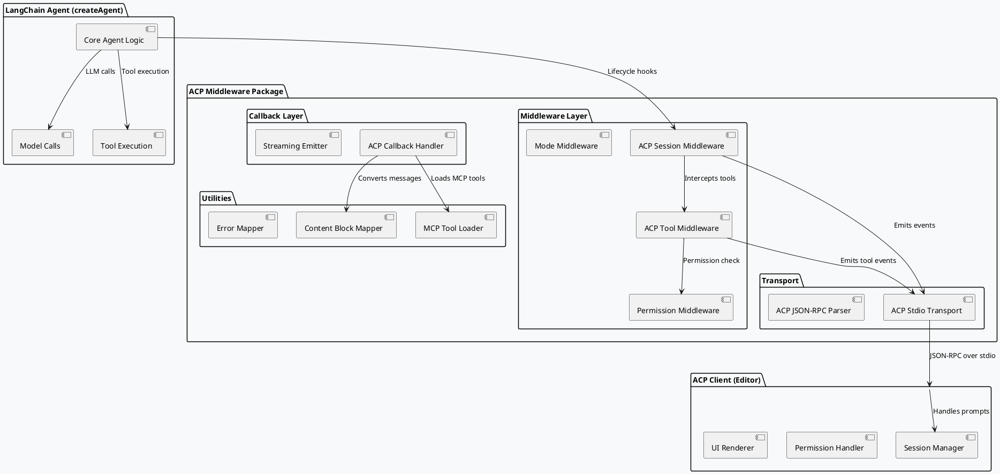

# SPEC-- @skroyc/acp-middleware-callbacks

## 1. Background

### 1.1 Purpose

This project creates a **TypeScript package** that bridges LangChain `createAgent()` implementations to the **Agent Client Protocol (ACP)** for code editors and AI development environments. The package provides:

- **Middleware:** Lifecycle hooks for session management, tool execution, and permission handling
- **Callbacks:** Streaming event emission for real-time agent updates
- **Utilities:** Content block mappers, tool converters, and transport utilities

The core philosophy: **"Make any LangChain agent ACP-compliant with minimal configuration."**

### 1.2 Why ACP?

ACP is a protocol standardizing editor-to-agent communication with:
- Structured session management (`newSession`, `prompt`, `loadSession`)
- Permission-based tool execution (`requestPermission` workflow)
- Rich content blocks (text, image, audio, resources)
- Standardized updates (`sessionUpdate` notifications)

By implementing ACP on top of LangChain, agents built with `createAgent()` become compatible with any ACP-compliant frontend (VS Code extension, Zed, etc.).

### 1.3 Relationship to Existing Work

This package uses the **same architectural pattern** as `@skroyc/ag-ui-middleware-callbacks`:
- Monorepo structure with `packages/acp-middleware-callbacks/`
- ESM-only, universal JavaScript runtime support
- Middleware + Callbacks pattern for lifecycle + streaming
- Transport abstraction for stdio communication

**However, this package is 100% self-contained.** It does not share code with the AG-UI package because:

1. **Different Protocol Semantics:** AG-UI emits events to a frontend; ACP requires bidirectional communication (handling incoming requests like `session/prompt`)
2. **Different Data Models:** ACP has session state, permissions, tool metadata that AG-UI doesn't have
3. **Different Transport:** AG-UI uses SSE/WebSocket; ACP uses stdio with JSON-RPC 2.0

**Conceptual Similarity:**
- Both wrap LangChain `createAgent()` with middleware
- Both use callbacks for streaming events
- Both provide transport abstractions

**Conceptual Differences:**
- AG-UI = "Backend → Frontend" event streaming
- ACP = "Editor ↔ Agent" bidirectional protocol with session management

### 1.4 LangChain + LangGraph Relationship

**LangChain v1.0.0+** integrates LangGraph under the hood for stateful agent workflows. Key concepts:

- **`createAgent()`**: High-level API that compiles a StateGraph with middleware support
- **`thread_id`**: Session identifier passed via `configurable.thread_id` for checkpoint retrieval
- **Checkpoint**: Persisted state snapshot containing messages, custom state, and middleware state
- **Checkpointer**: Storage backend (e.g., `MemorySaver`, database) that manages checkpoints

This package works with **high-level `createAgent()` APIs**, not lower-level LangGraph APIs directly.

---

## 1.5 Version Compatibility

| Component | Version | Notes |
|-----------|---------|-------|
| **LangChain** | ^1.0.0 | Middleware API introduced in v1.0.0 |
| **@langchain/core** | ^1.1.0 | Content block system required |
| **@agentclientprotocol/sdk** | ^1.0.0 | ACP protocol types |
| **Node.js** | >=18.0.0 | Universal runtime minimum |
| **Bun** | >=1.0.0 | Fully supported |
| **Deno** | >=1.40.0 | Via npm: specifier |
| **TypeScript** | >=5.0.0 | Strict mode required |
| **ACP Protocol** | v1 | Current stable version |

**Minimum Runtime Requirement:** Node.js 18 (for `structuredClone`, `ReadableStream`, `TextEncoder`)

---

## 2. Requirements

### 2.1 MoSCoW Prioritization

| Priority | Requirement | Description |
|----------|-------------|-------------|
| **MUST** | ACP Session Integration | Support `session/new`, `session/prompt`, `session/update` flow |
| **MUST** | Tool Call Lifecycle | Emit `tool_call`, `tool_call_update` events with ACP format |
| **MUST** | Permission Handling | Implement HITL-style interruption for ACP `requestPermission` |
| **MUST** | Content Block Mapping | Convert LangChain messages to ACP content blocks |
| **MUST** | MCP Server Support | Integrate `@langchain/mcp-adapters` for MCP tool loading |
| **MUST** | Stdio Transport | ACP-compliant stdio communication pattern |
| **MUST** | Error Mapping | Map LangChain errors to ACP `stopReason` values |
| **SHOULD** | Agent Thought Chunks | Map LangChain `reasoning` blocks to ACP `agent_thought_chunk` |
| **SHOULD** | Mode Middleware | Optional middleware for `current_mode_update` handling |
| **SHOULD** | Plan Updates | Optional middleware for `plan` session updates |
| **COULD** | Multi-Modal Support | Pass through image/audio content blocks |
| **WON'T** | Client Implementation | Only backend ACP layer, no frontend code |

### 2.2 Functional Requirements

**REQ-1:** A LangChain agent wrapped with this package must respond to ACP `session/prompt` requests by:
- Emitting streaming `sessionUpdate` notifications
- Handling permission requests via interruption
- Returning a valid `stopReason`

**REQ-2:** The package must automatically convert LangChain `AIMessage` content to ACP `agent_message_chunk` and `agent_thought_chunk` events.

**REQ-3:** The package must convert LangChain `ToolMessage` to ACP `tool_call_update` events with proper status lifecycle.

**REQ-4:** The package must accept MCP server configurations and dynamically load tools using `@langchain/mcp-adapters`.

### 2.3 Non-Functional Requirements

| Category | Requirement |
|----------|-------------|
| **Performance** | Sub-millisecond middleware overhead; zero overhead when disabled |
| **Compatibility** | Universal JavaScript runtime (Node.js 18+, Bun, Deno) |
| **Type Safety** | 100% TypeScript with strict mode |
| **Tree Shaking** | ESM-only exports for minimal bundle size |
| **Testing** | Unit tests > 90% coverage; integration tests for stdio transport |

---

## 3. Method

### 3.1 High-Level Architecture



### 3.2 Package Structure

```
packages/acp-middleware-callbacks/
├── src/
│   ├── index.ts                    # Main exports
│   │
│   ├── middleware/
│   │   ├── index.ts                # Middleware exports
│   │   ├── createACPSessionMiddleware.ts
│   │   ├── createACPToolMiddleware.ts
│   │   ├── createACPPermissionMiddleware.ts
│   │   └── createACPModeMiddleware.ts
│   │
│   ├── callbacks/
│   │   ├── index.ts                # Callback exports
│   │   └── ACPCallbackHandler.ts
│   │
│   ├── stdio/
│   │   ├── index.ts                # Transport exports
│   │   ├── createACPStdioTransport.ts
│   │   └── types.ts
│   │
│   ├── utils/
│   │   ├── index.ts                # Utility exports
│   │   ├── contentBlockMapper.ts
│   │   ├── mcpToolLoader.ts
│   │   ├── errorMapper.ts
│   │   ├── stopReasonMapper.ts
│   │   └── sessionStateMapper.ts
│   │
│   └── types/
│       ├── index.ts                # Type exports
│       ├── acp.ts                  # ACP protocol types
│       ├── middleware.ts           # Middleware config types
│       └── callbacks.ts            # Callback config types
│
├── tests/
│   ├── unit/
│   │   ├── middleware/
│   │   ├── callbacks/
│   │   └── utils/
│   ├── integration/
│   │   └── stdio.test.ts
│   └── fixtures/
│
├── example/
│   ├── simple-agent.ts             # Basic ACP agent
│   ├── mcp-agent.ts                # MCP-enabled agent
│   └── tsconfig.json
│
├── package.json
├── tsconfig.json
├── tsup.config.ts
└── README.md
```

### 3.3 Middleware Implementation

#### 3.3.1 Session Middleware (`createACPSessionMiddleware`)

**Purpose:** Manages ACP session lifecycle within LangChain execution.

**Responsibilities:**
- Initialize session state from `runtime.config.configurable?.sessionId` or prompt request
- Emit session lifecycle events via transport
- Manage checkpoint → session state mapping
- **ACP session is multi-turn** - maintains conversation history across multiple `session/prompt` calls

**Session Model (ACP Protocol):**
- `session/new`: Creates a new session (called once at conversation start)
- `session/prompt`: Sends user message within existing session (called multiple times)
- Session maintains context, conversation history, and state across all turns
- Agent runs as subprocess, spawned per session, handles one session at a time

**Checkpoint Coupling (HARD REQUIREMENT):**
- ACP sessionId **MUST** equal LangGraph checkpoint thread_id
- Middleware configures checkpointer to use sessionId as thread_id
- Enables full state recovery across all turns in the session
- Without checkpointer: sessionId still used but state not persisted between invocations

**Session Load (`session/load`):**
- Agent restores internal session state (checkpoints, MCP connections)
- Agent **streams the entire conversation history** back to client via notifications
- Historical messages are sent as `user_message_chunk` and `agent_message_chunk`
- Client receives notifications and reconstructs the full conversation UI
- Agent proceeds with next prompt using restored context

**Note:** This is distinct from `session/resume` (UNSTABLE) which does NOT replay history

**Interface:**

```typescript
interface ACPSessionMiddlewareConfig {
  sessionIdExtractor?: (config: RunnableConfig) => string | undefined;
  emitStateSnapshots?: "initial" | "final" | "all" | "none";
  stateMapper?: (state: any) => any;
}

export function createACPSessionMiddleware(
  config: ACPSessionMiddlewareConfig
): AgentMiddleware;
```

**Lifecycle Hooks:**

```typescript
createMiddleware({
  name: "acp-session",
  
  beforeAgent: async (state, runtime) => {
    const sessionId = extractSessionId(runtime.config);
    const runId = extractRunId(runtime.config);
    
    // Emit session start event via transport
    transport.emit({
      type: "session_started",
      sessionId,
      runId,
      timestamp: Date.now(),
    });
    
    return {};
  },
  
  afterAgent: async (state, runtime) => {
    const stopReason = mapToStopReason(state);

    transport.emit({
      type: "session_finished",
      sessionId,
      stopReason,
      timestamp: Date.now(),
    });

    return {};
  },
});
```

**Cancellation Handling (`session/cancel`):**
- Graceful exit: finish current operation, then handle cancellation
- If blocked on permission request: complete permission flow first
- Emit `session_finished` with `stopReason: 'cancelled'`
- Agent process remains available for next prompt in same session

**Session Concurrency:**
- ACP is **strictly sequential** per session - only one `session/prompt` at a time
- If client sends concurrent prompts for the same session, agent implementation MUST handle it
- Recommended pattern: cancel previous prompt when new one arrives (using AbortController)
- For true parallelism: use separate sessions via `session/new` or `session/fork` (UNSTABLE)

#### 3.3.2 Tool Middleware (`createACPToolMiddleware`)

**Purpose:** Intercepts LangChain tool calls and emits ACP `tool_call` / `tool_call_update` events.

**Responsibilities:**
- Convert LangChain tool calls to ACP `ToolCall` format
- Emit `tool_call` (pending) on tool start
- Emit `tool_call_update` (in_progress) during execution
- Emit `tool_call_update` (completed/failed) on completion
- Coordinate with permission middleware for approval flow

**Interface:**

```typescript
interface ACPToolMiddlewareConfig {
  emitToolResults?: boolean;
  emitToolStart?: boolean;
  toolKindMapper?: (toolName: string) => ToolKind;
  contentMapper?: (result: any) => ToolCallContent[];
}

export function createACPToolMiddleware(
  config: ACPToolMiddlewareConfig
): AgentMiddleware;
```

**Tool Call Lifecycle (Atomic):**
- Each tool call is atomic: one request → one result
- Multiple streaming updates within a single call are not supported
- For long-running tools with progress, emit intermediate updates with status='in_progress'

**Tool Call Events:**
```typescript
wrapToolCall: async (request, handler) => {
  const { toolCallId, name, args } = request;

  // 1. Emit pending tool call
  transport.emit({
    type: "tool_call",
    toolCallId,
    title: `Calling ${name}`,
    kind: mapToolKind(name),
    status: "pending",
    locations: extractLocations(args),
    rawInput: args,
  });

  // 2. Emit in_progress
  transport.emit({
    type: "tool_call_update",
    toolCallId,
    status: "in_progress",
  });

  // 3. Execute tool
  try {
    const result = await handler(request);

    // 4. Emit completed with content blocks
    // Note: content is primary; rawOutput is optional (for debug only)
    transport.emit({
      type: "tool_call_update",
      toolCallId,
      status: "completed",
      content: mapToContentBlocks(result),
      rawOutput: result, // Optional: for debugging/audit
    });

    return result;
  } catch (error) {
    // 4. Emit FAILED status (always required for tool failures)
    transport.emit({
      type: "tool_call_update",
      toolCallId,
      status: "failed",
      content: [{ type: "content", content: { type: "text", text: error.message } }],
    });
    throw error;
  }
}
```

**MCP Reconnection:**
- **@langchain/mcp-adapters** (TypeScript) supports reconnection at the connection level
- Stdio transport: `restart: { enabled: true, maxAttempts, delayMs }`
- HTTP/SSE transport: `reconnect: { enabled: true, maxAttempts, delayMs }`
- **Critical:** Reconnection is for **future tool calls only** - in-flight tool calls fail immediately on disconnect
- The tool call that was executing when disconnect occurred fails with `status: 'failed'`
- After successful reconnection, subsequent tool calls proceed normally

#### 3.3.3 Permission Middleware (`createACPPermissionMiddleware`)

**Purpose:** Implements HITL-style interruption for ACP permission requests.

**Responsibilities:**
- Intercept tool calls requiring permission
- Emit ACP `session/request_permission` via stdio transport
- Wait for client response via `await connection.requestPermission()`
- Approve or reject tool calls based on response (throw on denial)

**Interface:**

```typescript
import * as acp from "@agentclientprotocol/sdk";

interface ACPPermissionMiddlewareConfig {
  permissionPolicy: {
    [toolPattern: string]: {
      kind: acp.ToolKind;
      requirePermission: boolean;
    };
  };
  transport: acp.AgentSideConnection;
}

export function createACPPermissionMiddleware(
  config: ACPPermissionMiddlewareConfig
): AgentMiddleware;
```

**Permission Flow (Full Interruption):**
- Agent execution **blocks** on `requestPermission` until client responds
- Uses synchronous `await` pattern - agent pauses, waits for response
- If client denies or cancels: emit `tool_call_update` with `status: 'failed'` and throw to stop execution
- If client allows: continue execution with modified `args` if edits were requested

**Permission Options (Standard 4 Options):**
```typescript
options: [
  { optionId: 'allow', name: 'Allow', kind: 'allow_once' },
  { optionId: 'always', name: 'Always Allow', kind: 'allow_always' },
  { optionId: 'reject', name: 'Deny', kind: 'reject_once' },
  { optionId: 'never', name: 'Never Allow', kind: 'reject_always' },
]
```

#### 3.3.4 Mode Middleware (`createACPModeMiddleware`) - OPTIONAL

**Purpose:** Handles ACP mode changes (`current_mode_update`) via optional middleware.

**How Modes Affect Agent Behavior:**
- Each mode maps to a specific **system prompt** that influences agent behavior
- Modes can restrict available tools, change reasoning depth, or enable/disable planning
- The middleware intercepts `beforeAgent` and updates the runtime configuration

**Supported Mode Types:**
| Mode | Behavior |
|------|----------|
| `agentic` | Full autonomy, can use all tools without restrictions |
| `interactive` | Requires confirmation for sensitive operations |
| `readonly` | No tool execution, only read operations |
| `planning` | Emits `plan` updates; tool execution deferred |

**Interface:**

```typescript
interface ACPModeMiddlewareConfig {
  modes: {
    [modeId: string]: {
      systemPrompt: string;
      description?: string;
      allowedTools?: string[]; // Optional tool whitelist
      requirePermission?: boolean; // Override global permission policy
    };
  };
  defaultMode: string;
}

export function createACPModeMiddleware(
  config: ACPModeMiddlewareConfig
): AgentMiddleware;
```

**Mode Switching Flow:**
- Mode changes take effect on the **next** `session/prompt`, not immediately
- `setSessionMode` updates session state; new mode applies to next invocation

```typescript
createMiddleware({
  name: "acp-mode",

  beforeAgent: async (state, runtime) => {
    const currentMode = getCurrentMode(runtime.config) || this.config.defaultMode;
    const modeConfig = this.config.modes[currentMode];

    // Update system message for this run
    const systemMessage = new SystemMessage(modeConfig.systemPrompt);

    // Inject mode-specific configuration
    runtime.config.configurable = {
      ...runtime.config.configurable,
      acp_mode: currentMode,
      acp_allowedTools: modeConfig.allowedTools,
      acp_requirePermission: modeConfig.requirePermission,
    };

    // Emit mode change event
    transport.emit({
      type: "current_mode_update",
      mode: {
        modeIds: Object.keys(this.config.modes),
        selectedModeId: currentMode,
      },
    });
    
    return {};
  },
});
```

**Handling `session/set_mode` Requests:**
The middleware listens for mode change requests from the client and updates the session state accordingly. The mode change takes effect on the next agent invocation.

#### 3.3.5 Plan Middleware (`createACPPlanMiddleware`) - OPTIONAL

**Purpose:** Manages plan updates for planning-mode agents.

**⚠️ Important:** Plan updates are **NOT part of the standard ACP protocol**. This middleware implements a custom extension using the `extNotification` method. Clients must explicitly support this extension.

**What Triggers Plan Emission:**
- Mode is set to `planning` (see Mode Middleware)
- Agent detects a complex task requiring multi-step execution
- Explicit call to `emitPlan()` utility function
- State contains a `plan` field from previous reasoning

**Plan Structure (ACP Protocol):**
```typescript
interface Plan {
  entries: Array<{
    content: string;
    priority: "high" | "medium" | "low";
    status: "pending" | "in_progress" | "completed";
  }>;
}

interface PlanUpdate {
  sessionId: string;
  update: {
    sessionUpdate: "plan";
    plan: Plan;
  };
}
```

**Plan Lifecycle:**
1. **Plan Creation:** Middleware detects planning phase → emits initial plan with all entries as `pending`
2. **Plan Progress:** As agent works, updates entry status → emits `plan` with `in_progress`/`completed` statuses
3. **Plan Completion:** All entries marked `completed` → final plan emitted

**Interface:**

```typescript
interface ACPPlanMiddlewareConfig {
  // Optional: auto-detect planning mode
  autoDetectPlanning?: boolean;
  
  // Optional: custom plan builder
  buildPlan?: (state: any) => Plan;
  
  // Optional: triggers for plan emission
  emitOn?: ("reasoning" | "tool_calls" | "manual")[];
}

export function createACPPlanMiddleware(
  config: ACPPlanMiddlewareConfig
): AgentMiddleware;
```

**Plan Emission Example:**
```typescript
createMiddleware({
  name: "acp-plan",
  
  wrapToolCall: async (request, handler) => {
    const result = await handler(request);
    
    // Check if we should update plan
    if (this.shouldUpdatePlan(request)) {
      const plan = this.buildPlanFromState();
      
      transport.emit({
        type: "plan",
        plan: {
          entries: plan.entries.map(entry => ({
            content: entry.description,
            priority: entry.priority,
            status: entry.completed ? "completed" : "pending",
          })),
        },
      });
    }
    
    return result;
  },
});
```

---

### 3.4 Callback Handler Implementation

#### 3.4.1 ACPCallbackHandler

**Purpose:** Handles streaming events (token generation, message chunks).

**Responsibilities:**
- Intercept LLM token streaming → emit `agent_message_chunk`
- Map LangChain content blocks to ACP content blocks
- Handle reasoning chunks → emit `agent_thought_chunk`

**Interface:**

```typescript
interface ACPCallbackHandlerConfig {
  transport: ACPLinearTransport;
  emitTextChunks?: boolean;
  emitReasoningChunks?: boolean;
  contentBlockMapper?: ContentBlockMapper;
}

export class ACPCallbackHandler extends BaseCallbackHandler {
  constructor(config: ACPCallbackHandlerConfig);
  
  handleLLMStart(run: Run): void;
  handleLLMNewToken(token: string, run: Run): void;
  handleLLMEnd(output: LLMResult, run: Run): void;
  handleLLMError(error: Error, run: Run): void;
}
```

**Content Block Mapping:**

```typescript
class ACPCallbackHandler {
  async handleLLMStart(run: Run) {
    // No messageId in ACP - chunks are independent and ordered by streaming
  }

  async handleLLMNewToken(token: string, run: Run) {
    // Skip empty tokens
    if (!token) return;

    transport.emit({
      type: "agent_message_chunk",
      content: { type: "text", text: token },
    });
  }

  async handleLLMEnd(output: LLMResult, run: Run) {
    // End marker - ACP doesn't require explicit end marker
    // Agent proceeds to next phase (tools) or returns stopReason
  }
}
```

**Empty Response Handling:**
- Skip `agent_message_chunk` events with empty text
- If agent produces no output (no text, no tools, no reasoning), skip all chunk events
- Just return the `stopReason` in the response

---

### 3.5 Content Block Mapping

#### 3.5.1 LangChain → ACP Mapping

| LangChain Content Block | ACP Session Update | Notes |
|-------------------------|-------------------|-------|
| `text` | `agent_message_chunk` | User-facing response content |
| `reasoning` | `agent_thought_chunk` | Internal reasoning traces (always exposed to users) |
| `image` | `agent_message_chunk` (image content) | Pass through with base64 |
| `audio` | `agent_message_chunk` (audio content) | Pass through with base64 |
| `file` (reference only) | `resource_link` | Reference without content |
| `file` (with content) | `resource` | Embedded resource with data |
| `tool_call` | `tool_call` | Via tool middleware |
| `server_tool_call_result` | `tool_call_update` | Via tool middleware |

**Key Distinction: `agent_message_chunk` vs `agent_thought_chunk`**
- **`agent_message_chunk`**: User-facing response content that should be displayed prominently
- **`agent_thought_chunk`**: Internal reasoning traces (from o1/o3 style models)
- **Protocol has NO enforcement** for thought chunk visibility - purely semantic convention
- **This implementation always exposes thoughts** to users for full transparency

**Content Block Mapping Rule:**
- AIMessage with `text` blocks → emit `agent_message_chunk`
- AIMessage with `reasoning` blocks → emit **separate** `agent_thought_chunk` events
- Both are sent concurrently as the model streams different content types

**Note on `user_message_chunk`:** Per ACP protocol, `user_message_chunk` is used **ONLY for session/load** (replaying conversation history). During normal `session/prompt` flow, the client already displays user input - agents should NOT echo it back.

#### 3.5.2 Content Block Mapper Implementation

```typescript
interface ContentBlockMapper {
  // Maps to ACP ContentBlock for message chunks
  toACP(block: LangChainContentBlock): ACPContentBlock;

  // Indicates if this block requires a separate event (like reasoning)
  requiresSeparateEvent(block: LangChainContentBlock): boolean;

  // Maps to SessionUpdate type for blocks that need separate events
  // Note: messageId does NOT exist in ACP - chunks are independent and ordered by streaming
  toSessionUpdate(block: LangChainContentBlock): SessionUpdate | null;
}

class DefaultContentBlockMapper implements ContentBlockMapper {
  requiresSeparateEvent(block: LangChainContentBlock): boolean {
    // Only reasoning blocks require separate agent_thought_chunk events
    // user_message blocks are NOT echoed (handled by client)
    return block.type === "reasoning";
  }

  toSessionUpdate(block: LangChainContentBlock): SessionUpdate | null {
    switch (block.type) {
      case "reasoning":
        return {
          sessionUpdate: "agent_thought_chunk",
          content: {
            type: "text",
            text: block.reasoning,
          },
        };

      default:
        return null;
    }
  }
  
  toACP(block: LangChainContentBlock): ACPContentBlock {
    switch (block.type) {
      case "text":
        return {
          type: "text",
          text: block.text,
          annotations: mapAnnotations(block.annotations),
        };

      case "reasoning":
        // Note: reasoning blocks are sent via toSessionUpdate, not here
        return {
          type: "text",
          text: block.reasoning,
        };

      case "image":
        return {
          type: "image",
          data: block.url || block.data,
          mimeType: block.mimeType || "image/png",
        };

      case "file":
        // If file has content, use embedded resource; otherwise use link
        if (block.content) {
          return {
            type: "resource",
            resource: {
              uri: block.uri || block.url,
              mimeType: block.mimeType || "application/octet-stream",
              blob: block.content, // Base64 encoded
            },
          };
        } else {
          return {
            type: "resource_link",
            uri: block.uri || block.url,
            name: block.name || "file",
            title: block.title,
            description: block.description,
            mimeType: block.mimeType,
            size: block.size,
          };
        }

      default:
        return { type: "text", text: String(block) };
    }
  }
}
```

---

### 3.6 MCP Tool Loader

**Purpose:** Integrates `@langchain/mcp-adapters` to load MCP tools.

**Implementation:**

```typescript
interface MCPToolLoaderConfig {
  // Server configurations (matches MultiServerMCPClient)
  mcpServers: {
    [serverName: string]: MCPStdioConnection | MCPHTTPConnection | MCPSSEConnection;
  };
  // Client-level options
  throwOnLoadError?: boolean;
  prefixToolNameWithServerName?: boolean;
  additionalToolNamePrefix?: string;
  useStandardContentBlocks?: boolean;
  onConnectionError?: "throw" | "ignore" | ((params: { serverName: string; error: Error }) => void);
  outputHandling?: OutputHandling;
  defaultToolTimeout?: number;
}

type MCPStdioConnection = {
  transport: "stdio";
  command: string;
  args: string[];
  env?: Record<string, string>;
  cwd?: string;
  encoding?: string;
  stderr?: "overlapped" | "pipe" | "ignore" | "inherit";
  restart?: {
    enabled?: boolean;
    maxAttempts?: number;
    delayMs?: number;
  };
  outputHandling?: OutputHandling;
  defaultToolTimeout?: number;
};

type MCPHTTPConnection = {
  transport: "http" | "sse";
  url: string;
  headers?: Record<string, string>;
  reconnect?: {
    enabled?: boolean;
    maxAttempts?: number;
    delayMs?: number;
  };
  automaticSSEFallback?: boolean;
  outputHandling?: OutputHandling;
  defaultToolTimeout?: number;
};

type OutputHandling = {
  text?: "content" | "artifact";
  image?: "content" | "artifact";
  audio?: "content" | "artifact";
  resource?: "content" | "artifact";
  resource_link?: "content" | "artifact";
};

export async function loadMcpTools(
  config: MCPToolLoaderConfig
): Promise<StructuredTool[]>;
```

**Usage in Middleware:**

```typescript
import { MultiServerMCPClient } from "@langchain/mcp-adapters";

const mcpClient = new MultiServerMCPClient({
  mcpServers: {
    filesystem: {
      transport: "stdio",
      command: "npx",
      args: ["-y", "@modelcontextprotocol/server-filesystem"],
      restart: { enabled: true, maxAttempts: 3 },
      outputHandling: {
        text: "content",
        image: "artifact",
        resource: "artifact",
        resource_link: "content",
      },
    },
    math: {
      transport: "stdio",
      command: "npx",
      args: ["-y", "@modelcontextprotocol/server-math"],
    },
  },
  prefixToolNameWithServerName: true,
  additionalToolNamePrefix: "mcp",
  onConnectionError: (params) => {
    console.warn(`MCP connection failed: ${params.serverName}`, params.error);
  },
});

const tools = await mcpClient.getTools();
// Tool names like: "mcp__filesystem__read_file", "mcp__math__add"
```

#### 3.6.1 MCP Tool Kind Mapping

The package should map MCP tools to ACP tool kinds based on their characteristics:

| Tool Pattern | ACP Tool Kind | Examples |
|--------------|---------------|----------|
| `read*`, `get*`, `list*`, `search*` | `read` | read_file, get_config, list_dir, search_files |
| `write*`, `create*`, `update*`, `edit*` | `edit` | write_file, create_file, edit_content |
| `delete*`, `remove*` | `delete` | delete_file, remove_dir |
| `move*`, `rename*` | `move` | move_file, rename_file |
| `run*`, `exec*`, `execute*`, `command*` | `execute` | run_command, exec_script |
| `think*`, `reason*`, `analyze*` | `think` | think_step, analyze_problem |
| `fetch*`, `get*url*`, `download*` | `fetch` | fetch_url, download_file |
| `switch*mode*`, `change*mode*` | `switch_mode` | switch_mode, change_mode |
| Default | `other` | Unknown tool types |

**Implementation Reference:** See `@langchain/mcp-adapters` documentation for tool conversion patterns. The tool's description and input schema should inform the kind mapping.

**Tool Name Prefixing:**
When using `prefixToolNameWithServerName: true` with `@langchain/mcp-adapters`, tool names follow this pattern:

```
additionalToolNamePrefix + "__" + serverName + "__" + toolName
```

**Examples:**
- `mcp__filesystem__read_file`
- `mcp__filesystem__write_file`
- `mcp__math__add`
- `mcp__calculator__multiply`

Permission policies should match the prefixed names when required.

---

### 3.7 Stdio Transport Implementation

**Purpose:** ACP-compliant stdio communication for subprocess/parent communication.

The stdio transport implements JSON-RPC 2.0 over stdin/stdout for bidirectional communication between the ACP agent (subprocess) and the editor client (parent process).

#### 3.7.1 Initialization Handshake

The agent must perform an initialization handshake before processing any requests:

```typescript
// Agent initialization sequence
async function initializeTransport(
  transport: ACPStdioTransport
): Promise<void> {
  // 1. Read initialization request from stdin
  const initRequest = await transport.readMessage<InitializeRequest>();
  
  // 2. Validate protocol version
  if (initRequest.protocolVersion !== 1) {
    throw new Error(`Unsupported protocol version: ${initRequest.protocolVersion}`);
  }
  
  // 3. Extract client capabilities
  const clientCapabilities = initRequest.clientCapabilities;
  
  // 4. Prepare agent capabilities
  const agentCapabilities = {
    loadSession: true,
    promptCapabilities: {
      image: true,
      audio: true,
      embeddedContext: true,
    },
  };
  
  // 5. Send initialization response
  await transport.send({
    id: initRequest.id,
    result: {
      protocolVersion: 1,
      agentInfo: {
        name: "acp-middleware-callbacks-agent",
        version: "0.1.0",
      },
      agentCapabilities,
      authMethods: [], // No authentication by default
    } as InitializeResponse,
  });
  
  // 6. Transport is now ready for session/prompt requests
}
```

#### 3.7.2 ACP JSON-RPC Protocol Messages

**Outgoing messages (agent → client):**

```typescript
type AgentToClientMessage =
  | { jsonrpc: "2.0"; method: "session/update"; params: SessionNotification }
  | { jsonrpc: "2.0"; method: "session/request_permission"; params: RequestPermissionRequest };

// Notification (no response required)
type SessionUpdateNotification = {
  jsonrpc: "2.0";
  method: "session/update";
  params: SessionNotification;
};

// SessionUpdate types (discriminated union)
type SessionUpdate =
  | { sessionUpdate: "user_message_chunk"; content: ContentBlock }
  | { sessionUpdate: "agent_message_chunk"; content: ContentBlock }
  | { sessionUpdate: "agent_thought_chunk"; content: ContentBlock }
  | { sessionUpdate: "tool_call"; toolCallId: string; /* ToolCall fields */ }
  | { sessionUpdate: "tool_call_update"; /* ToolCallUpdate fields */ }
  | { sessionUpdate: "plan"; /* Custom extension - not standard */ }
  | { sessionUpdate: "available_commands_update"; commands: string[] }
  | { sessionUpdate: "current_mode_update"; mode: { modeIds: string[]; selectedModeId: string } }
  | { sessionUpdate: "config_option_update"; configOptions: SessionConfigOption[] } /* @experimental */
  | { sessionUpdate: "session_info_update"; title?: string; updatedAt?: string };
```

**Request (requires response):**
```typescript
type PermissionRequest = {
  jsonrpc: "2.0";
  method: "session/request_permission";
  params: RequestPermissionRequest;
  id: number;
};
```

**Incoming messages (client → agent):**

```typescript
type ClientToAgentMessage =
  | { jsonrpc: "2.0"; id: number; result: InitializeResponse }
  | { jsonrpc: "2.0"; id: number; result: RequestPermissionResponse }
  | { jsonrpc: "2.0"; method: "session/prompt"; params: PromptRequest }
  | { jsonrpc: "2.0"; method: "session/cancel"; params: CancelNotification }
  | { jsonrpc: "2.0"; method: "session/set_mode"; params: SetSessionModeRequest }
  | { jsonrpc: "2.0"; method: "session/load"; params: LoadSessionRequest };
```

**Message Ordering:**
- ACP protocol provides **NO ordering guarantee** for `session/update` notifications
- JSON-RPC notifications are fire-and-forget; messages may arrive out of order
- Clients should handle out-of-order messages by:
  - Merging partial tool call updates (all fields except `toolCallId` are optional)
  - Appending content chunks regardless of arrival order
  - Using `_meta` field for client-side sequencing if needed

#### 3.7.3 Error Response Format

All JSON-RPC errors follow this format:

```typescript
interface ACPErrorResponse {
  jsonrpc: "2.0";
  id: number | null; // null for notification errors
  error: {
    code: number;
    message: string;
    data?: unknown;
  };
}

// Standard JSON-RPC error codes
const ERROR_CODES = {
  PARSE_ERROR: -32700,
  INVALID_REQUEST: -32600,
  METHOD_NOT_FOUND: -32601,
  INVALID_PARAMS: -32602,
  INTERNAL_ERROR: -32603,
  // ACP-specific errors
  AUTH_REQUIRED: -32000,
  RESOURCE_NOT_FOUND: -32002,
};
```

**Error Response Examples:**

```typescript
// Invalid request
await transport.sendError(null, {
  code: ERROR_CODES.INVALID_REQUEST,
  message: "Missing required field: sessionId",
});

// Session not found
await transport.sendError(request.id, {
  code: ERROR_CODES.SESSION_NOT_FOUND,
  message: `Session not found: ${sessionId}`,
});

// Permission denied (use stopReason "refusal" or tool_call_update status "failed")
// ACP has no specific permission denied error code
```

#### 3.7.4 Permission Request Flow with Command Pattern

**Permission Request (agent → client):**

```typescript
const permissionRequest = {
  jsonrpc: "2.0",
  method: "session/request_permission",
  params: {
    sessionId: "session-123",
    toolCall: {
      toolCallId: "call-456",
      title: "Reading config file",
      kind: "read",
      status: "in_progress",
      locations: [{ path: "/etc/config.json" }],
      rawInput: { path: "/etc/config.json" },
    },
    options: [
      { optionId: "allow", name: "Allow", kind: "allow_once" },
      { optionId: "always", name: "Always Allow", kind: "allow_always" },
      { optionId: "reject", name: "Deny", kind: "reject_once" },
      { optionId: "never", name: "Never Allow", kind: "reject_always" },
    ],
  },
  id: 123,
};
```

**Permission Response (client → agent):**

```typescript
// User approved
const approvalResponse = {
  jsonrpc: "2.0",
  id: 123,
  result: {
    outcome: {
      outcome: "selected",
      optionId: "allow",
    },
  },
};

// User denied
const denialResponse = {
  jsonrpc: "2.0",
  id: 123,
  result: {
    outcome: {
      outcome: "selected",
      optionId: "reject",
    },
  },
};

// User cancelled (dialog dismissed)
const cancellationResponse = {
  jsonrpc: "2.0",
  id: 123,
  result: {
    outcome: {
      outcome: "cancelled",
    },
  },
};
```

**Integration with Permission Middleware:**

When using permission middleware, the agent execution is interrupted:

```typescript
// Permission middleware flow
wrapToolCall: async (request, handler) => {
  const toolCall = request.toolCall;

  // 1. Emit permission request
  const response = await transport.requestPermission({
    sessionId: runtime.config.configurable?.sessionId,
    toolCall: formatToolCallForACP(toolCall),
    options: getPermissionOptions(toolCall.name),
  });

  // 2. Wait for response (transport handles stdin blocking)
  if (response.outcome.outcome === "cancelled") {
    // User dismissed dialog - emit failed and throw
    transport.emit({
      type: "tool_call_update",
      toolCallId: toolCall.id,
      status: "failed",
      content: [{ type: "content", content: { type: "text", text: "Permission request cancelled" } }],
    });
    throw new Error("Permission cancelled by user");
  }

  if (response.outcome.outcome === "selected" &&
      (response.outcome.optionId === "reject" || response.outcome.optionId === "never")) {
    // User denied - emit failed and throw
    transport.emit({
      type: "tool_call_update",
      toolCallId: toolCall.id,
      status: "failed",
      content: [{ type: "content", content: { type: "text", text: "Permission denied" } }],
    });
    throw new Error("Permission denied");
  }

  // User approved (allow or always) - continue execution
  return await handler(request);
}
```

#### 3.7.5 Transport Integration

**IMPORTANT:** This package uses the ACP SDK's built-in transport layer. Do not implement custom transport.

The ACP SDK provides `AgentSideConnection` which handles all protocol communication, JSON-RPC encoding, and stdio streaming.

**Using ACP SDK Transport:**

```typescript
import * as acp from "@agentclientprotocol/sdk";
import { Writable, Readable } from "stream";

// Create NDJSON stdio stream
const stream = acp.ndJsonStream(
  Writable.toWeb(process.stdin),
  Readable.toWeb(process.stdout)
);

// Create agent connection
const connection = new acp.AgentSideConnection(
  (conn) => agentImplementation,
  stream
);

// Middleware receives connection for protocol operations
const middleware = createACPPermissionMiddleware({
  permissionPolicy: {...},
  transport: connection,  // ACP AgentSideConnection instance
});
```

**Available Transport Methods (from AgentSideConnection):**

```typescript
// Session updates (notifications)
await connection.sessionUpdate({
  sessionId: string,
  update: SessionUpdate,
});

// Permission requests (wait for response)
const response = await connection.requestPermission({
  sessionId: string,
  toolCall: ToolCallUpdate,
  options: PermissionOption[],
});

// Client resources
const fileContent = await connection.readTextFile({
  sessionId: string,
  path: string,
  line?: number,
  limit?: number,
});

await connection.writeTextFile({
  sessionId: string,
  path: string,
  content: string,
});

// Terminal operations
const { terminalId } = await connection.createTerminal({
  sessionId: string,
  command: string,
  args?: string[],
  cwd?: string,
});
```

**Transport Configuration Interface:**

```typescript
interface ACPStdioTransportConfig {
  mode: "agent"; // Only agent mode is implemented
  sessionId?: string; // Optional default session ID
}
```

**Do NOT Implement Custom Transport:**
- The ACP SDK provides complete transport implementation
- All JSON-RPC 2.0 protocol details are handled internally
- Stdio NDJSON encoding is built-in
- Error handling and reconnection are managed automatically


---

### 3.8 Error & stopReason Mapping

#### 3.8.1 stopReason Values

```typescript
type ACPStopReason =
  | "end_turn"              // Normal completion
  | "max_tokens"            // Context window exceeded
  | "max_turn_requests"     // Step limit reached
  | "refusal"               // Agent refused to respond
  | "cancelled"             // User cancelled the operation
```

#### 3.8.2 Mapper Implementation

```typescript
export function mapToStopReason(state: any): ACPStopReason {
  // Check for explicit error - ACP doesn't have "error" stop reason
  // Errors are communicated via sessionUpdate events, not stopReason
  if (state.error) {
    // Return end_turn and emit error via sessionUpdate instead
    return "end_turn";
  }

  // Check last message for tool calls
  // ACP agents return control to client after tools, so this is end_turn
  const lastMessage = state.messages?.[state.messages.length - 1];
  if (lastMessage?.tool_calls?.length > 0) {
    // Tool calls are handled via tool_call/tool_call_update events
    // The agent returns end_turn after tools complete
    return "end_turn";
  }

  // Check for context length signal
  if (state.llmOutput?.finish_reason === "length") {
    return "max_tokens";
  }

  // Check for user cancellation
  if (state.cancelled || state.permissionDenied) {
    return "cancelled";
  }

  // Check for refusal from model
  if (state.llmOutput?.finish_reason === "refusal") {
    return "refusal";
  }

  // Default to normal completion
  return "end_turn";
}
```

#### 3.8.3 Error Mapping

**ACP Error Communication:**

ACP has no 'error' stopReason. Errors are communicated through:

| Error Scenario | Mechanism |
|---------------|-----------|
| Method execution failure | JSON-RPC error response |
| Agent refuses to respond | `stopReason: "refusal"` in PromptResponse |
| Client cancels operation | `stopReason: "cancelled"` |
| Tool execution failure | `tool_call_update` with `status: "failed"` |
| Custom agent errors | Extension notification via `_method` (not `sessionUpdate`) |

**Note:** ACP does NOT allow custom `sessionUpdate` types. For custom error reporting, use the extension notification pattern:

```typescript
// Custom error notification (via _method extension, NOT sessionUpdate)
await connection.extNotification("agent_error", {
  code: "VALIDATION_ERROR",
  message: "Invalid input provided",
  details: { field: "email", issue: "invalid format" }
});
```

**Tool-Level Errors:**
- Use `tool_call_update` with `status: "failed"` (see Tool Call Lifecycle)

```typescript
export function mapErrorToContent(error: Error): ToolCallContent[] {
  return [
    {
      type: "content",
      content: {
        type: "text",
        text: error.message,
        annotations: {
          priority: 3, // High priority for errors
        },
      },
    },
  ];
}
```

---

### 3.9 Type Definitions

#### 3.9.1 Core ACP Types (Re-exported)

```typescript
import * as acp from "@agentclientprotocol/sdk";

export type {
  SessionNotification,
  SessionUpdate,
  AgentMessageChunk,
  AgentThoughtChunk,
  ToolCall,
  ToolCallUpdate,
  ToolCallStatus,
  ToolKind,
  ContentBlock,
  TextContent,
  ImageContent,
  AudioContent,
  ResourceLink,
  EmbeddedResource,
  RequestPermissionRequest,
  RequestPermissionResponse,
  PermissionOption,
  PermissionOptionKind,
  StopReason,
  InitializeRequest,
  InitializeResponse,
  NewSessionRequest,
  NewSessionResponse,
  PromptRequest,
  PromptResponse,
} from "@agentclientprotocol/sdk";
```

#### 3.9.2 Package-Specific Types

```typescript
export interface ACPMiddlewareConfig {
  // Session
  sessionIdExtractor?: (config: RunnableConfig) => string | undefined;
  emitStateSnapshots?: "initial" | "final" | "all" | "none";
  stateMapper?: (state: any) => any;
  
  // Tools
  emitToolResults?: boolean;
  emitToolStart?: boolean;
  toolKindMapper?: (toolName: string) => ToolKind;
  
  // Permissions
  permissionPolicy?: Record<string, PermissionPolicyConfig>;
  
  // MCP
  mcpServers?: MCPServerConfig;
  mcpToolOptions?: MCPToolOptions;
}

export interface ACPCallbackHandlerConfig {
  transport: ACPTransport;
  emitTextChunks?: boolean;
  emitReasoningChunks?: boolean;
  contentBlockMapper?: ContentBlockMapper;
}

export interface ACPAgentConfig {
  model: LanguageModel;
  tools?: StructuredTool[];
  middleware?: AgentMiddleware[];
  callbacks?: CallbackHandler[];
  transport: ACPTransport;
}
```

---

### 4. Implementation

### 4.1 Agent Implementation Pattern

This package provides middleware and callbacks, but the ACP agent must implement the `Agent` interface from the ACP SDK.

#### 4.1.1 Required Agent Methods

All ACP agents must implement these methods:

| Method | Purpose | Return |
|--------|---------|--------|
| `initialize` | Connection handshake, capability negotiation | `InitializeResponse` |
| `newSession` | Create new conversation session | `NewSessionResponse` with `sessionId` |
| `prompt` | Process user input | `PromptResponse` with `stopReason` |
| `cancel` | Handle cancellation | `void` |
| `setSessionMode` | Change agent mode | `SetSessionModeResponse` |
| `loadSession` | Resume existing session (optional) | `LoadSessionResponse` |

#### 4.1.2 Initialization Handshake

The `initialize` method is called first. It must return:

```typescript
async initialize(params: acp.InitializeRequest): Promise<acp.InitializeResponse> {
  return {
    agentInfo: {
      name: 'my-agent',
      title: 'My ACP Agent',
      version: '0.1.0',
    },
    agentCapabilities: {
      loadSession: true,  // Optional: support session loading
      promptCapabilities: {
        image: true,
        audio: true,
        embeddedContext: true,
      },
      mcp: {
        http: true,  // If using MCP via HTTP
        sse: true,   // If using MCP via SSE
      },
    },
    authMethods: [],  // Empty if no authentication
  };
}
```

#### 4.1.3 Session Management

Create LangChain agent instances per session:

```typescript
const sessionStore = new Map<string, SessionState>();

async newSession(params: acp.NewSessionRequest): Promise<acp.NewSessionResponse> {
  const sessionId = crypto.randomUUID();

  const session: SessionState = {
    sessionId,
    cwd: params.cwd,
    mcpServers: params.mcpServers,
    // Agent created on first prompt
    agent: null,
  };

  sessionStore.set(sessionId, session);
  return { sessionId };
}

async prompt(params: acp.PromptRequest): Promise<acp.PromptResponse> {
  const session = sessionStore.get(params.sessionId);
  if (!session) {
    throw new Error(`Session not found: ${params.sessionId}`);
  }

  // Get or create agent
  const agent = await getOrCreateAgent(session);

  // Convert ACP content to LangChain messages
  const messages = params.prompt.map(block =>
    contentBlockMapper.toLangChain(block)
  );

  // Invoke with callbacks
  await agent.invoke({ messages }, {
    callbacks: [new ACPCallbackHandler({ transport: connection })],
  });

  return { stopReason: 'end_turn' };
}
```

### 4.2 Build Instructions

```bash
# Install dependencies
cd packages/acp-middleware-callbacks
bun install

# Build with tsup (ESM only)
bun run build

# Run tests
bun test

# Run linting
bun run lint
```

### 4.3 Dependencies

```json
{
  "name": "@skroyc/acp-middleware-callbacks",
  "version": "0.1.0",
  "dependencies": {
    "@agentclientprotocol/sdk": "^1.0.0",
    "@langchain/core": "^1.1.0",
    "@langchain/mcp-adapters": "^1.1.0",
    "zod": "^3.25.0"
  },
  "peerDependencies": {
    "typescript": ">=5"
  }
}
```

**Note:** `@langchain/mcp-adapters` v1.1.0 provides `MultiServerMCPClient` with full stdio and HTTP/SSE transport support.

### 4.4 Usage Examples

#### 4.3.1 Basic ACP Agent

This example shows how to implement a complete ACP agent that wraps a LangChain agent.

```typescript
import * as acp from "@agentclientprotocol/sdk";
import { createAgent } from "langchain";
import { createACPSessionMiddleware, ACPCallbackHandler } from "@skroyc/acp-middleware-callbacks";

// 1. Implement ACP Agent interface
const acpAgentImplementation: acp.Agent = {
  // Required: Initialize connection handshake
  async initialize(params: acp.InitializeRequest): Promise<acp.InitializeResponse> {
    console.log(`Initializing with ${params.clientInfo?.name}`);

    if (params.clientCapabilities) {
      console.log('Client capabilities:', params.clientCapabilities);
    }

    return {
      agentInfo: {
        name: 'acp-middleware-agent',
        title: 'ACP LangChain Agent',
        version: '0.1.0',
      },
      agentCapabilities: {
        loadSession: true,
        promptCapabilities: {
          image: true,
          audio: true,
          embeddedContext: true,
        },
        mcp: {
          http: true,
          sse: true,
        },
      },
      authMethods: [], // No authentication required
    };
  },

  // Required: Create new session
  async newSession(params: acp.NewSessionRequest): Promise<acp.NewSessionResponse> {
    const sessionId = crypto.randomUUID();

    // Store session state
    sessionStore.set(sessionId, {
      sessionId,
      cwd: params.cwd,
      mcpServers: params.mcpServers,
    });

    return { sessionId };
  },

  // Required: Process prompt
  async prompt(params: acp.PromptRequest): Promise<acp.PromptResponse> {
    const session = sessionStore.get(params.sessionId);
    if (!session) {
      throw new Error(`Session not found: ${params.sessionId}`);
    }

    // Get or create LangChain agent for this session
    const agent = await getOrCreateAgent(session);

    // Convert ACP content blocks to LangChain messages
    const messages = params.prompt.map(block =>
      contentBlockMapper.toLangChain(block)
    );

    // Invoke agent with callback handler for streaming
    await agent.invoke({
      messages,
    }, {
      callbacks: [new ACPCallbackHandler({ transport: connection })],
    });

    // Return when complete
    return { stopReason: 'end_turn' };
  },

  // Required: Handle cancellation
  async cancel(params: acp.CancelNotification): Promise<void> {
    const session = sessionStore.get(params.sessionId);
    if (session && session.abortController) {
      session.abortController.abort();
      console.log(`Session ${params.sessionId} cancelled`);
    }
  },

  // Required: Handle mode changes
  async setSessionMode(params: acp.SetSessionModeRequest): Promise<acp.SetSessionModeResponse> {
    const session = sessionStore.get(params.sessionId);
    if (session) {
      session.mode = params.modeId;
      console.log(`Session ${params.sessionId} mode set to ${params.modeId}`);
    }
    return {};
  },

  // Optional: Load existing session
  async loadSession(params: acp.LoadSessionRequest): Promise<acp.LoadSessionResponse> {
    const session = sessionStore.get(params.sessionId);
    if (!session) {
      throw new Error(`Session not found: ${params.sessionId}`);
    }
    return {};
  },
};

// 2. Create ACP connection with stdio transport
const connection = new acp.AgentSideConnection(
  (conn) => acpAgentImplementation,
  acp.ndJsonStream(
    Writable.toWeb(process.stdin),
    Readable.toWeb(process.stdout)
  )
);

// 3. Helper: Get or create LangChain agent per session
async function getOrCreateAgent(session: SessionState) {
  if (session.agent) {
    return session.agent;
  }

  const middleware = createACPSessionMiddleware({
    emitStateSnapshots: "initial",
  });

  const agent = createAgent({
    model: "openai:gpt-4o",
    tools: [readFileTool, writeFileTool],
    middleware: [middleware],
  });

  session.agent = agent;
  return agent;
}

// 4. Session state management
interface SessionState {
  sessionId: string;
  cwd: string;
  mcpServers: acp.McpServer[];
  mode?: string;
  agent?: any;
  abortController?: AbortController;
}

const sessionStore = new Map<string, SessionState>();

// 5. Start listening (this runs the agent process)
console.log('ACP Agent ready');
```

**Key Points:**
- Agent implements all required ACP methods: `initialize`, `newSession`, `prompt`, `cancel`, `setSessionMode`
- Connection uses ACP SDK's `AgentSideConnection` with NDJSON stdio stream
- Each session gets its own LangChain agent instance
- Callback handler streams updates via `connection.sessionUpdate()`

#### 4.3.2 ACP Agent with MCP Servers

This example shows integration with MCP servers using `@langchain/mcp-adapters`.

```typescript
import * as acp from "@agentclientprotocol/sdk";
import { MultiServerMCPClient } from "@langchain/mcp-adapters";
import { createAgent } from "langchain";
import { createACPSessionMiddleware } from "@skroyc/acp-middleware-callbacks";

// MCP client (shared across sessions)
const mcpClient = new MultiServerMCPClient({
  mcpServers: {
    filesystem: {
      transport: "stdio",
      command: "npx",
      args: ["-y", "@modelcontextprotocol/server-filesystem"],
      restart: { enabled: true, maxAttempts: 3 },
      outputHandling: {
        text: "content",
        image: "artifact",
        resource: "artifact",
        resource_link: "content",
      },
    },
    math: {
      transport: "stdio",
      command: "npx",
      args: ["-y", "@modelcontextprotocol/server-math"],
    },
  },
  prefixToolNameWithServerName: true,
  additionalToolNamePrefix: "mcp",
  onConnectionError: (params) => {
    console.warn(`MCP connection failed: ${params.serverName}`, params.error);
  },
});

const acpAgentImplementation: acp.Agent = {
  async initialize(params: acp.InitializeRequest): Promise<acp.InitializeResponse> {
    return {
      agentInfo: {
        name: 'acp-mcp-agent',
        title: 'ACP Agent with MCP',
        version: '0.1.0',
      },
      agentCapabilities: {
        loadSession: true,
        promptCapabilities: {
          image: true,
          audio: true,
          embeddedContext: true,
        },
        mcp: {
          http: true,
          sse: true,
        },
      },
      authMethods: [],
    };
  },

  async newSession(params: acp.NewSessionRequest): Promise<acp.NewSessionResponse> {
    const sessionId = crypto.randomUUID();

    // Load MCP tools for this session's servers
    const tools = await mcpClient.getTools();

    // Store session with tools
    sessionStore.set(sessionId, {
      sessionId,
      cwd: params.cwd,
      mcpServers: params.mcpServers,
      tools,
    });

    return { sessionId };
  },

  async prompt(params: acp.PromptRequest): Promise<acp.PromptResponse> {
    const session = sessionStore.get(params.sessionId);
    if (!session) {
      throw new Error(`Session not found: ${params.sessionId}`);
    }

    const agent = await getOrCreateAgent(session);

    const messages = params.prompt.map(block =>
      contentBlockMapper.toLangChain(block)
    );

    await agent.invoke({
      messages,
    }, {
      callbacks: [new ACPCallbackHandler({ transport: connection })],
    });

    return { stopReason: 'end_turn' };
  },

  async cancel(params: acp.CancelNotification): Promise<void> {
    const session = sessionStore.get(params.sessionId);
    if (session && session.abortController) {
      session.abortController.abort();
    }
  },

  async setSessionMode(params: acp.SetSessionModeRequest): Promise<acp.SetSessionModeResponse> {
    const session = sessionStore.get(params.sessionId);
    if (session) {
      session.mode = params.modeId;
    }
    return {};
  },
};

async function getOrCreateAgent(session: SessionState) {
  if (session.agent) {
    return session.agent;
  }

  const middleware = createACPSessionMiddleware({
    emitStateSnapshots: "initial",
  });

  const agent = createAgent({
    model: "anthropic:claude-sonnet-4",
    tools: session.tools, // MCP tools
    middleware: [middleware],
  });

  session.agent = agent;
  return agent;
}

const connection = new acp.AgentSideConnection(
  (conn) => acpAgentImplementation,
  acp.ndJsonStream(
    Writable.toWeb(process.stdin),
    Readable.toWeb(process.stdout)
  )
);

console.log('ACP MCP Agent ready');
```

**Tool Name Pattern:**
With `prefixToolNameWithServerName: true` and `additionalToolNamePrefix: "mcp"`:
- `mcp__filesystem__read_file`
- `mcp__filesystem__write_file`
- `mcp__math__add`
- `mcp__math__multiply`

#### 4.3.3 ACP Agent with Permission Handling

This example shows how to implement human-in-the-loop approval for tool calls.

```typescript
import * as acp from "@agentclientprotocol/sdk";
import { createAgent } from "langchain";
import {
  createACPSessionMiddleware,
  createACPPermissionMiddleware,
  ACPCallbackHandler
} from "@skroyc/acp-middleware-callbacks";

const permissionPolicy = {
  "write_file": {
    kind: "edit" as const,
    requirePermission: true,
  },
  "read_file": {
    kind: "read" as const,
    requirePermission: false, // Auto-approved
  },
  "execute_command": {
    kind: "execute" as const,
    requirePermission: true,
  },
  "mcp__filesystem__write_file": {
    kind: "edit" as const,
    requirePermission: true,
  },
  "mcp__filesystem__read_file": {
    kind: "read" as const,
    requirePermission: false,
  },
};

const acpAgentImplementation: acp.Agent = {
  async initialize(params: acp.InitializeRequest): Promise<acp.InitializeResponse> {
    return {
      agentInfo: {
        name: 'acp-permission-agent',
        title: 'ACP Agent with Permissions',
        version: '0.1.0',
      },
      agentCapabilities: {
        loadSession: true,
        promptCapabilities: {
          image: true,
          audio: true,
          embeddedContext: true,
        },
      },
      authMethods: [],
    };
  },

  async newSession(params: acp.NewSessionRequest): Promise<acp.NewSessionResponse> {
    const sessionId = crypto.randomUUID();
    sessionStore.set(sessionId, { sessionId, cwd: params.cwd });
    return { sessionId };
  },

  async prompt(params: acp.PromptRequest): Promise<acp.PromptResponse> {
    const session = sessionStore.get(params.sessionId);
    if (!session) {
      throw new Error(`Session not found: ${params.sessionId}`);
    }

    const agent = await getOrCreateAgent(session);

    const messages = params.prompt.map(block =>
      contentBlockMapper.toLangChain(block)
    );

    await agent.invoke({
      messages,
    }, {
      callbacks: [new ACPCallbackHandler({ transport: connection })],
    });

    return { stopReason: 'end_turn' };
  },

  async cancel(params: acp.CancelNotification): Promise<void> {
    const session = sessionStore.get(params.sessionId);
    if (session && session.abortController) {
      session.abortController.abort();
    }
  },

  async setSessionMode(params: acp.SetSessionModeRequest): Promise<acp.SetSessionModeResponse> {
    const session = sessionStore.get(params.sessionId);
    if (session) {
      session.mode = params.modeId;
    }
    return {};
  },
};

async function getOrCreateAgent(session: SessionState) {
  if (session.agent) {
    return session.agent;
  }

  // Create permission middleware with ACP transport integration
  const permissionMiddleware = createACPPermissionMiddleware({
    permissionPolicy,
    transport: connection, // ACP AgentSideConnection instance
  });

  const sessionMiddleware = createACPSessionMiddleware({
    emitStateSnapshots: "initial",
  });

  const agent = createAgent({
    model,
    tools: [writeFileTool, readFileTool, executeCommandTool],
    middleware: [permissionMiddleware, sessionMiddleware],
  });

  session.agent = agent;
  return agent;
}

const connection = new acp.AgentSideConnection(
  (conn) => acpAgentImplementation,
  acp.ndJsonStream(
    Writable.toWeb(process.stdin),
    Readable.toWeb(process.stdout)
  )
);

console.log('ACP Permission Agent ready');
```

**Permission Flow:**
1. Agent generates tool call
2. Permission middleware checks policy
3. If required, middleware calls `connection.requestPermission()`
4. Client shows permission dialog to user
5. User selects option (Allow Once, Allow Always, Deny Once, Deny Always)
6. Client sends response back via ACP protocol
7. Middleware receives response and:
   - If denied/cancelled: emits `tool_call_update` with `status: 'failed'` and throws
   - If approved: continues execution with original or modified tool arguments

---

## 5. Milestones

### 5.1 Sequential Delivery

| Phase | Deliverable | Description |
|-------|-------------|-------------|
| **M1: Core Types** | `types/` directory | ACP type definitions, middleware config types, callback types |
| **M2: Utilities** | `utils/` directory | Content block mapper, stop reason mapper, error mapper |
| **M3: Middleware Layer** | `middleware/` directory | Session middleware, tool middleware, permission middleware |
| **M4: Callback Handler** | `callbacks/` directory | ACPCallbackHandler for streaming events |
| **M5: MCP Integration** | `utils/mcpToolLoader.ts` | MCP server configuration and tool loading |
| **M6: Transport** | `stdio/` directory | ACP stdio transport implementation |
| **M7: Integration Tests** | `tests/integration/` | End-to-end stdio communication tests |
| **M8: Documentation** | `README.md`, `example/` | Usage examples and API documentation |

### 5.2 Acceptance Criteria

| Milestone | Criteria |
|-----------|----------|
| M1 | All ACP types from `@agentclientprotocol/sdk` re-exported and tested |
| M2 | Content block mapper handles all LangChain → ACP conversions |
| M3 | Middleware emits correct events; permission interruption works |
| M4 | Token streaming → `agent_message_chunk`; reasoning → `agent_thought_chunk` |
| M5 | MCP tools load correctly; prefixing and content blocks work |
| M6 | JSON-RPC protocol validated; bidirectional communication works |
| M7 | Agent responds to `session/prompt`; emits correct `session_update` events |
| M8 | Working examples for basic agent, MCP agent, and permission agent |

---

## 6. Gathering Results

### 6.1 Success Metrics

| Metric | Target | Measurement |
|--------|--------|-------------|
| **Protocol Compliance** | 100% | All ACP methods implemented per spec |
| **Test Coverage** | > 90% | Unit + integration tests |
| **Type Safety** | 100% | Zero TypeScript errors with strict mode |
| **Bundle Size** | < 50KB minified | ESM tree-shakeable |
| **Latency** | < 1ms middleware overhead | Performance benchmark |

### 6.2 Validation Tests

**Protocol Conformance Test:**
```typescript
// Verify all ACP sessionUpdate types are supported
const sessionUpdates: acp.SessionUpdate[] = [
  { sessionUpdate: "agent_message_chunk", content: textContent },
  { sessionUpdate: "agent_thought_chunk", content: textContent },
  { sessionUpdate: "tool_call", toolCallId: "call-1", /* ... */ },
  { sessionUpdate: "tool_call_update", toolCallId: "call-1", /* ... */ },
  { sessionUpdate: "current_mode_update", mode: { modeIds: [], selectedModeId: "agentic" } },
  { sessionUpdate: "config_option_update", configOptions: [] },
  { sessionUpdate: "session_info_update", title: "New title", updatedAt: "2026-01-08" },
];

// All must serialize/deserialize correctly
for (const update of sessionUpdates) {
  expect(validateACPEvent(update)).toBe(true);
}
```

**Middleware Integration Test:**
```typescript
// Verify middleware emits correct events
import * as acp from "@agentclientprotocol/sdk";

const mockConnection: Partial<acp.AgentSideConnection> = {
  sessionUpdate: jest.fn().mockResolvedValue(undefined),
  requestPermission: jest.fn().mockResolvedValue({
    outcome: { outcome: 'selected', optionId: 'allow' }
  }),
};

const agent = createAgent({
  middleware: [createACPSessionMiddleware({
    transport: mockConnection as acp.AgentSideConnection,
  })],
});

await agent.invoke({ messages: [new HumanMessage("test")] });

expect(mockConnection.sessionUpdate).toHaveBeenCalledWith(
  expect.objectContaining({
    sessionId: expect.any(String),
    update: expect.objectContaining({
      sessionUpdate: expect.any(String),
    }),
  })
);
```

**Permission Flow Test:**
```typescript
// Verify permission interruption works
import * as acp from "@agentclientprotocol/sdk";

const mockConnection: Partial<acp.AgentSideConnection> = {
  requestPermission: jest.fn().mockResolvedValue({
    outcome: { outcome: 'selected', optionId: 'allow' }
  }),
  sessionUpdate: jest.fn().mockResolvedValue(undefined),
};

const permissionMiddleware = createACPPermissionMiddleware({
  permissionPolicy: {
    write_file: { kind: 'edit', requirePermission: true },
  },
  transport: mockConnection as acp.AgentSideConnection,
});

const agent = createAgent({
  middleware: [permissionMiddleware],
  tools: [writeFileTool],
});

// Mock permission response
mockConnection.requestPermission.mockResolvedValue({
  outcome: { outcome: 'selected', optionId: 'allow' }
});

const result = await agent.invoke({
  messages: [new HumanMessage("Write to file")],
});

expect(mockConnection.requestPermission).toHaveBeenCalledWith(
  expect.objectContaining({
    sessionId: expect.any(String),
    toolCall: expect.objectContaining({
      toolCallId: expect.any(String),
      kind: 'edit',
    }),
    options: expect.arrayContaining([
      expect.objectContaining({ kind: 'allow_once' }),
      expect.objectContaining({ kind: 'allow_always' }),
      expect.objectContaining({ kind: 'reject_once' }),
      expect.objectContaining({ kind: 'reject_always' }),
    ]),
  })
);
```

### 6.3 Post-Production Validation

| Validation | Method |
|------------|--------|
| **Protocol Compliance** | Run ACP SDK conformance tests |
| **Runtime Compatibility** | Test on Node.js 18+, Bun, Deno |
| **Performance** | Benchmark middleware overhead with 1000 invocations |
| **Bundle Analysis** | Verify tree-shaking with Rollup/Webpack |

---

## Appendix A: ACP Event Reference

### A.1 Session Update Events

| Event | Direction | Description |
|-------|-----------|-------------|
| `agent_message_chunk` | Agent → Client | Streaming text from agent |
| `agent_thought_chunk` | Agent → Client | Reasoning/thinking output |
| `user_message_chunk` | Client → Agent | Streaming user input |
| `tool_call` | Agent → Client | Tool call notification |
| `tool_call_update` | Agent → Client | Tool execution progress |
| `plan` | Agent → Client | Planning mode output |
| `current_mode_update` | Agent → Client | Mode change notification |
| `config_option_update` | Agent → Client | Configuration change (UNSTABLE/@experimental) |
| `available_commands_update` | Agent → Client | Available commands list |
| `session_info_update` | Agent → Client | Session metadata update |

### A.2 Request/Response Methods

| Method | Direction | Description |
|--------|-----------|-------------|
| `session/new` | Client → Agent | Create new session |
| `session/prompt` | Client → Agent | Process user prompt |
| `session/load` | Client → Agent | Load existing session |
| `session/set_mode` | Client → Agent | Change agent mode |
| `session/request_permission` | Agent → Client | Request user approval |
| `session/update` | Agent → Client | Streaming notifications |

---

## Appendix B: LangChain → ACP Mapping Reference

### B.1 Message Role Mapping

| LangChain Message | ACP Event | Notes |
|-------------------|-----------|-------|
| `AIMessage` (text) | `agent_message_chunk` | User-facing response |
| `AIMessage` (reasoning) | `agent_thought_chunk` | Internal reasoning |
| `HumanMessage` | Not echoed | Client displays user input |
| `ToolMessage` | `tool_call_update` | Status: completed/failed |
| `SystemMessage` | Ignored | Merged into context |

**Note on `user_message_chunk`:** Per ACP protocol, this is used ONLY for `session/load` (replaying history). Normal `session/prompt` flow does NOT echo user input.

### B.2 Tool Status Mapping

| LangChain State | ACP Status |
|-----------------|------------|
| Tool call initiated | `tool_call` (pending) |
| Tool executing | `tool_call_update` (in_progress) |
| Tool completed | `tool_call_update` (completed) |
| Tool failed | `tool_call_update` (failed) |
| Permission denied | `tool_call_update` (failed) + rejection reason |

### B.3 StopReason Mapping

| LangChain State | ACP StopReason |
|----------------|----------------|
| Normal completion | `end_turn` |
| Context window exceeded | `max_tokens` |
| User cancelled | `cancelled` |
| Model refused to respond | `refusal` |
| Step/turn limit reached | `max_turn_requests` |

**Note:** In ACP, errors are communicated via JSON-RPC error responses, `tool_call_update` (status: failed), or extension notifications - NOT via `stopReason`. The stopReason indicates why the agent returned control to the client.

---

**END OF SPEC** (Updated: 2026-01-08 - Comprehensive interview with ACP protocol research via librarian)

**Key Updates from Interview:**
- LangChain v1.0.0+ uses LangGraph under the hood for stateful agents
- ACP sessionId **MUST** equal LangGraph checkpoint thread_id (hard requirement)
- `createAgent()` uses high-level APIs - this package works at that level, not LangGraph directly
- session/load **streams conversation history** via user_message_chunk and agent_message_chunk notifications
- session/resume (UNSTABLE) does NOT replay history - just restores state
- messageId does NOT exist in ACP - chunks are independent and ordered by streaming
- agent_thought_chunk visibility: **NO protocol enforcement** - purely semantic convention; this implementation always shows thoughts
- user_message_chunk is ONLY for session/load (no echo during normal prompts)
- Permission flow: throws on denial/cancellation, no `jumpTo` in ACP SDK
- **ACP is strictly sequential** per session - concurrent prompts require separate sessions
- **NO message ordering guarantee** in ACP - clients handle out-of-order via merging
- Tool calls are atomic (one request → one result)
- Tool failures always emit tool_call_update with status='failed'
- MCP reconnection: **connection-level only** - in-flight tool calls still fail immediately
- Cancellation: graceful exit with stopReason='cancelled'