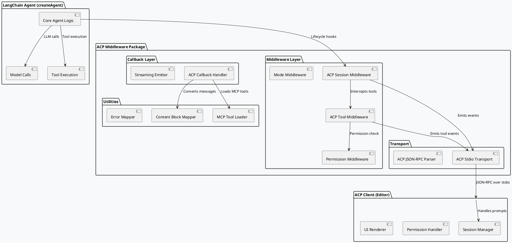

# SPEC-- @skroyc/acp-middleware-callbacks

## 1. Background

### 1.1 Purpose

This project creates a **TypeScript package** that bridges LangChain `createAgent()` implementations to the **Agent Client Protocol (ACP)** for code editors and AI development environments. The package provides:

- **Middleware:** Lifecycle hooks for session management, tool execution, and permission handling
- **Callbacks:** Streaming event emission for real-time agent updates
- **Utilities:** Content block mappers, tool converters, and transport utilities

The core philosophy: **"Make any LangChain agent ACP-compliant with minimal configuration."**

### 1.2 Why ACP?

ACP is a protocol standardizing editor-to-agent communication with:
- Structured session management (`newSession`, `prompt`, `loadSession`)
- Permission-based tool execution (`requestPermission` workflow)
- Rich content blocks (text, image, audio, resources)
- Standardized updates (`sessionUpdate` notifications)

By implementing ACP on top of LangChain, agents built with `createAgent()` become compatible with any ACP-compliant frontend (VS Code extension, Zed, etc.).

### 1.3 Relationship to Existing Work

This package uses the **same architectural pattern** as `@skroyc/ag-ui-middleware-callbacks`:
- Monorepo structure with `packages/acp-middleware-callbacks/`
- ESM-only, universal JavaScript runtime support
- Middleware + Callbacks pattern for lifecycle + streaming
- Transport abstraction for stdio communication

**However, this package is 100% self-contained.** It does not share code with the AG-UI package because:

1. **Different Protocol Semantics:** AG-UI emits events to a frontend; ACP requires bidirectional communication (handling incoming requests like `session/prompt`)
2. **Different Data Models:** ACP has session state, permissions, tool metadata that AG-UI doesn't have
3. **Different Transport:** AG-UI uses SSE/WebSocket; ACP uses stdio with JSON-RPC 2.0

**Conceptual Similarity:**
- Both wrap LangChain `createAgent()` with middleware
- Both use callbacks for streaming events
- Both provide transport abstractions

**Conceptual Differences:**
- AG-UI = "Backend → Frontend" event streaming
- ACP = "Editor ↔ Agent" bidirectional protocol with session management

---

## 1.4 Version Compatibility

| Component | Version | Notes |
|-----------|---------|-------|
| **LangChain** | ^1.0.0 | Middleware API introduced in v1.0.0 |
| **@langchain/core** | ^1.1.0 | Content block system required |
| **@agentclientprotocol/sdk** | ^1.0.0 | ACP protocol types |
| **Node.js** | >=18.0.0 | Universal runtime minimum |
| **Bun** | >=1.0.0 | Fully supported |
| **Deno** | >=1.40.0 | Via npm: specifier |
| **TypeScript** | >=5.0.0 | Strict mode required |
| **ACP Protocol** | v1 | Current stable version |

**Minimum Runtime Requirement:** Node.js 18 (for `structuredClone`, `ReadableStream`, `TextEncoder`)

---

## 2. Requirements

### 2.1 MoSCoW Prioritization

| Priority | Requirement | Description |
|----------|-------------|-------------|
| **MUST** | ACP Session Integration | Support `session/new`, `prompt`, `session/update` flow |
| **MUST** | Tool Call Lifecycle | Emit `tool_call`, `tool_call_update` events with ACP format |
| **MUST** | Permission Handling | Implement HITL-style interruption for ACP `requestPermission` |
| **MUST** | Content Block Mapping | Convert LangChain messages to ACP content blocks |
| **MUST** | MCP Server Support | Integrate `@langchain/mcp-adapters` for MCP tool loading |
| **MUST** | Stdio Transport | ACP-compliant stdio communication pattern |
| **MUST** | Error Mapping | Map LangChain errors to ACP `stopReason` values |
| **SHOULD** | Agent Thought Chunks | Map LangChain `reasoning` blocks to ACP `agent_thought_chunk` |
| **SHOULD** | Mode Middleware | Optional middleware for `current_mode_update` handling |
| **SHOULD** | Plan Updates | Optional middleware for `plan` session updates |
| **COULD** | Multi-Modal Support | Pass through image/audio content blocks |
| **WON'T** | Client Implementation | Only backend ACP layer, no frontend code |

### 2.2 Functional Requirements

**REQ-1:** A LangChain agent wrapped with this package must respond to ACP `session/prompt` requests by:
- Emitting streaming `sessionUpdate` notifications
- Handling permission requests via interruption
- Returning a valid `stopReason`

**REQ-2:** The package must automatically convert LangChain `AIMessage` content to ACP `agent_message_chunk` and `agent_thought_chunk` events.

**REQ-3:** The package must convert LangChain `ToolMessage` to ACP `tool_call_update` events with proper status lifecycle.

**REQ-4:** The package must accept MCP server configurations and dynamically load tools using `@langchain/mcp-adapters`.

### 2.3 Non-Functional Requirements

| Category | Requirement |
|----------|-------------|
| **Performance** | Sub-millisecond middleware overhead; zero overhead when disabled |
| **Compatibility** | Universal JavaScript runtime (Node.js 18+, Bun, Deno) |
| **Type Safety** | 100% TypeScript with strict mode |
| **Tree Shaking** | ESM-only exports for minimal bundle size |
| **Testing** | Unit tests > 90% coverage; integration tests for stdio transport |

---

## 3. Method

### 3.1 High-Level Architecture



### 3.2 Package Structure

```
packages/acp-middleware-callbacks/
├── src/
│   ├── index.ts                    # Main exports
│   │
│   ├── middleware/
│   │   ├── index.ts                # Middleware exports
│   │   ├── createACPSessionMiddleware.ts
│   │   ├── createACPToolMiddleware.ts
│   │   ├── createACPPermissionMiddleware.ts
│   │   └── createACPModeMiddleware.ts
│   │
│   ├── callbacks/
│   │   ├── index.ts                # Callback exports
│   │   └── ACPCallbackHandler.ts
│   │
│   ├── stdio/
│   │   ├── index.ts                # Transport exports
│   │   ├── createACPStdioTransport.ts
│   │   └── types.ts
│   │
│   ├── utils/
│   │   ├── index.ts                # Utility exports
│   │   ├── contentBlockMapper.ts
│   │   ├── mcpToolLoader.ts
│   │   ├── errorMapper.ts
│   │   ├── stopReasonMapper.ts
│   │   └── sessionStateMapper.ts
│   │
│   └── types/
│       ├── index.ts                # Type exports
│       ├── acp.ts                  # ACP protocol types
│       ├── middleware.ts           # Middleware config types
│       └── callbacks.ts            # Callback config types
│
├── tests/
│   ├── unit/
│   │   ├── middleware/
│   │   ├── callbacks/
│   │   └── utils/
│   ├── integration/
│   │   └── stdio.test.ts
│   └── fixtures/
│
├── example/
│   ├── simple-agent.ts             # Basic ACP agent
│   ├── mcp-agent.ts                # MCP-enabled agent
│   └── tsconfig.json
│
├── package.json
├── tsconfig.json
├── tsup.config.ts
└── README.md
```

### 3.3 Middleware Implementation

#### 3.3.1 Session Middleware (`createACPSessionMiddleware`)

**Purpose:** Manages ACP session lifecycle within LangChain execution.

**Responsibilities:**
- Initialize session state from `configurable.sessionId` or prompt request
- Emit session lifecycle events via transport
- Manage checkpoint → session state mapping
- Handle session forking/loading if required by agent capabilities

**Interface:**

```typescript
interface ACPSessionMiddlewareConfig {
  sessionIdExtractor?: (config: RunnableConfig) => string | undefined;
  emitStateSnapshots?: "initial" | "final" | "all" | "none";
  stateMapper?: (state: any) => any;
}

export function createACPSessionMiddleware(
  config: ACPSessionMiddlewareConfig
): AgentMiddleware;
```

**Lifecycle Hooks:**

```typescript
createMiddleware({
  name: "acp-session",
  
  beforeAgent: async (state, runtime) => {
    const sessionId = extractSessionId(runtime.config);
    const runId = extractRunId(runtime.config);
    
    // Emit session start event via transport
    transport.emit({
      type: "session_started",
      sessionId,
      runId,
      timestamp: Date.now(),
    });
    
    return {};
  },
  
  afterAgent: async (state, runtime) => {
    const stopReason = mapToStopReason(state);
    
    transport.emit({
      type: "session_finished",
      sessionId,
      stopReason,
      timestamp: Date.now(),
    });
    
    return {};
  },
});
```

#### 3.3.2 Tool Middleware (`createACPToolMiddleware`)

**Purpose:** Intercepts LangChain tool calls and emits ACP `tool_call` / `tool_call_update` events.

**Responsibilities:**
- Convert LangChain tool calls to ACP `ToolCall` format
- Emit `tool_call` (pending) on tool start
- Emit `tool_call_update` (in_progress) during execution
- Emit `tool_call_update` (completed/failed) on completion
- Coordinate with permission middleware for approval flow

**Interface:**

```typescript
interface ACPToolMiddlewareConfig {
  emitToolResults?: boolean;
  emitToolStart?: boolean;
  toolKindMapper?: (toolName: string) => ToolKind;
  contentMapper?: (result: any) => ToolCallContent[];
}

export function createACPToolMiddleware(
  config: ACPToolMiddlewareConfig
): AgentMiddleware;
```

**Tool Call Lifecycle:**

```typescript
wrapToolCall: async (request, handler) => {
  const { toolCallId, name, args } = request;
  
  // 1. Emit pending tool call
  transport.emit({
    type: "tool_call",
    toolCallId,
    title: `Calling ${name}`,
    kind: mapToolKind(name),
    status: "pending",
    locations: extractLocations(args),
    rawInput: args,
  });
  
  // 2. Emit in_progress
  transport.emit({
    type: "tool_call_update",
    toolCallId,
    status: "in_progress",
  });
  
  // 3. Execute tool
  try {
    const result = await handler(request);
    
    // 4. Emit completed
    transport.emit({
      type: "tool_call_update",
      toolCallId,
      status: "completed",
      content: mapToContent(result),
      rawOutput: result,
    });
    
    return result;
  } catch (error) {
    // 4. Emit failed
    transport.emit({
      type: "tool_call_update",
      toolCallId,
      status: "failed",
      content: [{ type: "content", content: { type: "text", text: error.message } }],
    });
    throw error;
  }
}
```

#### 3.3.3 Permission Middleware (`createACPPermissionMiddleware`)

**Purpose:** Implements HITL-style interruption for ACP permission requests.

**Responsibilities:**
- Intercept tool calls requiring permission
- Emit ACP `session/request_permission` via stdio transport
- Wait for client response via `Command({ resume })`
- Approve, edit, or reject tool calls based on response

**Interface:**

```typescript
interface ACPPermissionMiddlewareConfig {
  permissionPolicy: {
    [toolPattern: string]: {
      kind: ToolKind;
      requirePermission: boolean;
      allowedDecisions?: ("approve" | "edit" | "reject")[];
    };
  };
  transport: ACPLinearTransport;
}

export function createACPPermissionMiddleware(
  config: ACPPermissionMiddlewareConfig
): AgentMiddleware;
```

**Permission Flow:**

```typescript
beforeModel: {
  canJumpTo: ["tools", "end"],
  hook: async (state, runtime) => {
    const pendingTools = extractPendingTools(state);
    
    for (const tool of pendingTools) {
      if (requiresPermission(tool.name)) {
        // Emit permission request
        await transport.requestPermission({
          sessionId: getSessionId(runtime),
          toolCall: {
            toolCallId: tool.id,
            title: `Permission: ${tool.name}`,
            kind: getToolKind(tool.name),
            status: "in_progress",
            locations: extractLocations(tool.args),
            rawInput: tool.args,
          },
          options: [
            { optionId: "approve", name: "Approve", kind: "allow_once" },
            { optionId: "deny", name: "Deny", kind: "reject_once" },
          ],
        });
        
        // Interrupt execution
        const decision = await waitForDecision();
        
        if (decision.outcome === "selected" && decision.optionId === "deny") {
          return { jumpTo: "end" }; // Reject
        }
      }
    }
  },
}
```

#### 3.3.4 Mode Middleware (`createACPModeMiddleware`) - OPTIONAL

**Purpose:** Handles ACP mode changes (`current_mode_update`) via optional middleware.

**How Modes Affect Agent Behavior:**
- Each mode maps to a specific **system prompt** that influences agent behavior
- Modes can restrict available tools, change reasoning depth, or enable/disable planning
- The middleware intercepts `beforeAgent` and updates the runtime configuration

**Supported Mode Types:**
| Mode | Behavior |
|------|----------|
| `agentic` | Full autonomy, can use all tools without restrictions |
| `interactive` | Requires confirmation for sensitive operations |
| `readonly` | No tool execution, only read operations |
| `planning` | Emits `plan` updates; tool execution deferred |

**Interface:**

```typescript
interface ACPModeMiddlewareConfig {
  modes: {
    [modeId: string]: {
      systemPrompt: string;
      description?: string;
      allowedTools?: string[]; // Optional tool whitelist
      requirePermission?: boolean; // Override global permission policy
    };
  };
  defaultMode: string;
}

export function createACPModeMiddleware(
  config: ACPModeMiddlewareConfig
): AgentMiddleware;
```

**Mode Switching Flow:**
```typescript
createMiddleware({
  name: "acp-mode",
  
  beforeAgent: async (state, runtime) => {
    const currentMode = getCurrentMode(runtime.config) || this.config.defaultMode;
    const modeConfig = this.config.modes[currentMode];
    
    // Update system message for this run
    const systemMessage = new SystemMessage(modeConfig.systemPrompt);
    
    // Inject mode-specific configuration
    runtime.config.configurable = {
      ...runtime.config.configurable,
      acp_mode: currentMode,
      acp_allowedTools: modeConfig.allowedTools,
      acp_requirePermission: modeConfig.requirePermission,
    };
    
    // Emit mode change event
    transport.emit({
      type: "current_mode_update",
      mode: {
        modeIds: Object.keys(this.config.modes),
        selectedModeId: currentMode,
      },
    });
    
    return {};
  },
});
```

**Handling `session/set_mode` Requests:**
The middleware listens for mode change requests from the client and updates the session state accordingly. The mode change takes effect on the next agent invocation.

#### 3.3.5 Plan Middleware (`createACPPlanMiddleware`) - OPTIONAL

**Purpose:** Manages ACP plan updates for planning-mode agents.

**What Triggers Plan Emission:**
- Mode is set to `planning` (see Mode Middleware)
- Agent detects a complex task requiring multi-step execution
- Explicit call to `emitPlan()` utility function
- State contains a `plan` field from previous reasoning

**Plan Structure (ACP Protocol):**
```typescript
interface Plan {
  entries: Array<{
    content: string;
    priority: "high" | "medium" | "low";
    status: "pending" | "in_progress" | "completed";
  }>;
}

interface PlanUpdate {
  sessionId: string;
  update: {
    sessionUpdate: "plan";
    plan: Plan;
  };
}
```

**Plan Lifecycle:**
1. **Plan Creation:** Middleware detects planning phase → emits initial plan with all entries as `pending`
2. **Plan Progress:** As agent works, updates entry status → emits `plan` with `in_progress`/`completed` statuses
3. **Plan Completion:** All entries marked `completed` → final plan emitted

**Interface:**

```typescript
interface ACPPlanMiddlewareConfig {
  // Optional: auto-detect planning mode
  autoDetectPlanning?: boolean;
  
  // Optional: custom plan builder
  buildPlan?: (state: any) => Plan;
  
  // Optional: triggers for plan emission
  emitOn?: ("reasoning" | "tool_calls" | "manual")[];
}

export function createACPPlanMiddleware(
  config: ACPPlanMiddlewareConfig
): AgentMiddleware;
```

**Plan Emission Example:**
```typescript
createMiddleware({
  name: "acp-plan",
  
  wrapToolCall: async (request, handler) => {
    const result = await handler(request);
    
    // Check if we should update plan
    if (this.shouldUpdatePlan(request)) {
      const plan = this.buildPlanFromState();
      
      transport.emit({
        type: "plan",
        plan: {
          entries: plan.entries.map(entry => ({
            content: entry.description,
            priority: entry.priority,
            status: entry.completed ? "completed" : "pending",
          })),
        },
      });
    }
    
    return result;
  },
});
```

---

### 3.4 Callback Handler Implementation

#### 3.4.1 ACPCallbackHandler

**Purpose:** Handles streaming events (token generation, message chunks).

**Responsibilities:**
- Intercept LLM token streaming → emit `agent_message_chunk`
- Map LangChain content blocks to ACP content blocks
- Handle reasoning chunks → emit `agent_thought_chunk`

**Interface:**

```typescript
interface ACPCallbackHandlerConfig {
  transport: ACPLinearTransport;
  emitTextChunks?: boolean;
  emitReasoningChunks?: boolean;
  contentBlockMapper?: ContentBlockMapper;
}

export class ACPCallbackHandler extends BaseCallbackHandler {
  constructor(config: ACPCallbackHandlerConfig);
  
  handleLLMStart(run: Run): void;
  handleLLMNewToken(token: string, run: Run): void;
  handleLLMEnd(output: LLMResult, run: Run): void;
  handleLLMError(error: Error, run: Run): void;
}
```

**Content Block Mapping:**

```typescript
class ACPCallbackHandler {
  async handleLLMStart(run: Run) {
    const messageId = generateMessageId();
    
    transport.emit({
      type: "agent_message_chunk",
      messageId,
      content: { type: "text", text: "" }, // Start of message
    });
  }
  
  async handleLLMNewToken(token: string, run: Run) {
    transport.emit({
      type: "agent_message_chunk",
      messageId: getMessageId(run),
      content: { type: "text", text: token },
    });
  }
  
  async handleLLMEnd(output: LLMResult, run: Run) {
    transport.emit({
      type: "agent_message_chunk",
      messageId: getMessageId(run),
      content: { type: "text", text: "" }, // End marker
    });
  }
}
```

---

### 3.5 Content Block Mapping

#### 3.5.1 LangChain → ACP Mapping

| LangChain Content Block | ACP Content Block | Notes |
|-------------------------|-------------------|-------|
| `text` | `text` | Direct mapping |
| `reasoning` | `agent_thought_chunk` | Separate event type |
| `image` | `image` | Pass through with base64 |
| `audio` | `audio` | Pass through with base64 |
| `file` | `resource_link` | Reference without content |
| `tool_call` | `tool_call` | Via tool middleware |
| `server_tool_call_result` | `tool_call_update` | Via tool middleware |

#### 3.5.2 Content Block Mapper Implementation

```typescript
interface ContentBlockMapper {
  toACP(block: LangChainContentBlock): ACPContentBlock;
  toLangChain(block: ACPContentBlock): LangChainContentBlock;
}

class DefaultContentBlockMapper implements ContentBlockMapper {
  toACP(block: LangChainContentBlock): ACPContentBlock {
    switch (block.type) {
      case "text":
        return {
          type: "text",
          text: block.text,
          annotations: mapAnnotations(block.annotations),
        };
      
      case "reasoning":
        // Emit via separate event, not as message chunk
        return null; // Special handling
      
      case "image":
        return {
          type: "image",
          data: block.url || block.data,
          mimeType: block.mimeType || "image/png",
        };
      
      case "file":
        return {
          type: "resource_link",
          uri: block.uri || block.url,
          name: block.name || "file",
        };
      
      default:
        return { type: "text", text: String(block) };
    }
  }
}
```

---

### 3.6 MCP Tool Loader

**Purpose:** Integrates `@langchain/mcp-adapters` to load MCP tools.

**Implementation:**

```typescript
interface MCPToolLoaderConfig {
  mcpServers: {
    [serverName: string]: {
      transport: "stdio" | "http" | "sse";
      command?: string;
      args?: string[];
      url?: string;
      headers?: Record<string, string>;
    };
  };
  toolOptions?: {
    prefixToolNameWithServerName?: boolean;
    useStandardContentBlocks?: boolean;
  };
}

export async function loadMCPTools(
  config: MCPToolLoaderConfig
): Promise<StructuredTool[]>;
```

**Usage in Middleware:**

```typescript
const acpMiddleware = createACPSessionMiddleware({
  mcpServers: {
    filesystem: {
      transport: "stdio",
      command: "npx",
      args: ["-y", "@modelcontextprotocol/server-filesystem"],
    },
    math: {
      transport: "stdio", 
      command: "npx",
      args: ["-y", "@modelcontextprotocol/server-math"],
    },
  },
  mcpToolOptions: {
    prefixToolNameWithServerName: true,
    useStandardContentBlocks: true,
  },
});
```

#### 3.6.1 MCP Tool Kind Mapping

The package should map MCP tools to ACP tool kinds based on their characteristics:

| Tool Pattern | ACP Tool Kind | Examples |
|--------------|---------------|----------|
| `read*`, `get*`, `list*`, `search*` | `read` | read_file, get_config, list_dir |
| `write*`, `create*`, `update*`, `edit*` | `edit` | write_file, create_file, edit_content |
| `delete*`, `remove*` | `delete` | delete_file, remove_dir |
| `move*`, `rename*` | `move` | move_file, rename_file |
| `run*`, `exec*`, `execute*`, `command*` | `execute` | run_command, exec_script |
| `think*`, `reason*`, `analyze*` | `think` | think_step, analyze_problem |
| `fetch*`, `get*url*`, `download*` | `fetch` | fetch_url, download_file |
| Default | `other` | Unknown tool types |

**Implementation Reference:** See `@langchain/mcp-adapters` documentation for tool conversion patterns. The tool's description and input schema should inform the kind mapping.

---

### 3.7 Stdio Transport Implementation

**Purpose:** ACP-compliant stdio communication for subprocess/parent communication.

The stdio transport implements JSON-RPC 2.0 over stdin/stdout for bidirectional communication between the ACP agent (subprocess) and the editor client (parent process).

#### 3.7.1 Initialization Handshake

The agent must perform an initialization handshake before processing any requests:

```typescript
// Agent initialization sequence
async function initializeTransport(
  transport: ACPStdioTransport
): Promise<void> {
  // 1. Read initialization request from stdin
  const initRequest = await transport.readMessage<InitializeRequest>();
  
  // 2. Validate protocol version
  if (initRequest.protocolVersion !== 1) {
    throw new Error(`Unsupported protocol version: ${initRequest.protocolVersion}`);
  }
  
  // 3. Extract client capabilities
  const clientCapabilities = initRequest.clientCapabilities;
  
  // 4. Prepare agent capabilities
  const agentCapabilities = {
    loadSession: true,
    promptCapabilities: {
      image: true,
      audio: true,
      embeddedContext: true,
    },
  };
  
  // 5. Send initialization response
  await transport.send({
    id: initRequest.id,
    result: {
      protocolVersion: 1,
      agentInfo: {
        name: "acp-middleware-callbacks-agent",
        version: "0.1.0",
      },
      agentCapabilities,
      authMethods: [], // No authentication by default
    } as InitializeResponse,
  });
  
  // 6. Transport is now ready for session/prompt requests
}
```

#### 3.7.2 ACP JSON-RPC Protocol Messages

**Outgoing messages (agent → client):**

```typescript
type AgentToClientMessage =
  | { jsonrpc: "2.0"; method: "session/update"; params: SessionNotification }
  | { jsonrpc: "2.0"; method: "session/request_permission"; params: RequestPermissionRequest };

// Notification (no response required)
type SessionUpdateNotification = {
  jsonrpc: "2.0";
  method: "session/update";
  params: SessionNotification;
};

// Request (requires response)
type PermissionRequest = {
  jsonrpc: "2.0";
  method: "session/request_permission";
  params: RequestPermissionRequest;
  id: number;
};
```

**Incoming messages (client → agent):**

```typescript
type ClientToAgentMessage =
  | { jsonrpc: "2.0"; id: number; result: InitializeResponse }
  | { jsonrpc: "2.0"; id: number; result: RequestPermissionResponse }
  | { jsonrpc: "2.0"; method: "session/prompt"; params: PromptRequest }
  | { jsonrpc: "2.0"; method: "session/cancel"; params: CancelNotification }
  | { jsonrpc: "2.0"; method: "session/set_mode"; params: SetSessionModeRequest }
  | { jsonrpc: "2.0"; method: "session/load"; params: LoadSessionRequest };
```

#### 3.7.3 Error Response Format

All JSON-RPC errors follow this format:

```typescript
interface ACPErrorResponse {
  jsonrpc: "2.0";
  id: number | null; // null for notification errors
  error: {
    code: number;
    message: string;
    data?: unknown;
  };
}

// Standard JSON-RPC error codes
const ERROR_CODES = {
  PARSE_ERROR: -32700,
  INVALID_REQUEST: -32600,
  METHOD_NOT_FOUND: -32601,
  INVALID_PARAMS: -32602,
  INTERNAL_ERROR: -32603,
  // ACP-specific errors
  SESSION_NOT_FOUND: -32000,
  PERMISSION_DENIED: -32001,
  TOOL_EXECUTION_FAILED: -32002,
};
```

**Error Response Examples:**

```typescript
// Invalid request
await transport.sendError(null, {
  code: ERROR_CODES.INVALID_REQUEST,
  message: "Missing required field: sessionId",
});

// Session not found
await transport.sendError(request.id, {
  code: ERROR_CODES.SESSION_NOT_FOUND,
  message: `Session not found: ${sessionId}`,
});

// Permission denied
await transport.sendError(request.id, {
  code: ERROR_CODES.PERMISSION_DENIED,
  message: "User denied permission for tool execution",
});
```

#### 3.7.4 Permission Request Flow with Command Pattern

**Permission Request (agent → client):**

```typescript
const permissionRequest = {
  jsonrpc: "2.0",
  method: "session/request_permission",
  params: {
    sessionId: "session-123",
    toolCall: {
      toolCallId: "call-456",
      title: "Reading config file",
      kind: "read",
      status: "in_progress",
      locations: [{ path: "/etc/config.json" }],
      rawInput: { path: "/etc/config.json" },
    },
    options: [
      { optionId: "allow", name: "Allow", kind: "allow_once" },
      { optionId: "deny", name: "Deny", kind: "reject_once" },
    ],
  },
  id: 123,
};
```

**Permission Response (client → agent):**

```typescript
// User approved
const approvalResponse = {
  jsonrpc: "2.0",
  id: 123,
  result: {
    outcome: {
      outcome: "selected",
      optionId: "allow",
    },
  },
};

// User denied
const denialResponse = {
  jsonrpc: "2.0",
  id: 123,
  result: {
    outcome: {
      outcome: "selected",
      optionId: "deny",
    },
  },
};

// User cancelled (dialog dismissed)
const cancellationResponse = {
  jsonrpc: "2.0",
  id: 123,
  result: {
    outcome: {
      outcome: "cancelled",
    },
  },
};
```

**Integration with HITL Command Pattern:**

When using permission middleware, the agent execution is interrupted:

```typescript
// Permission middleware flow
beforeModel: {
  canJumpTo: ["tools", "end"],
  hook: async (state, runtime) => {
    const toolCall = extractPendingToolCall(state);
    
    // 1. Emit permission request
    const response = await transport.requestPermission({
      sessionId: runtime.config.configurable?.sessionId,
      toolCall: formatToolCallForACP(toolCall),
      options: getPermissionOptions(toolCall.name),
    });
    
    // 2. Wait for response (transport handles stdin blocking)
    if (response.outcome.outcome === "cancelled") {
      // User dismissed dialog - treat as denial
      return { jumpTo: "end" };
    }
    
    if (response.outcome.outcome === "selected" && 
        response.outcome.optionId === "deny") {
      // User denied - skip tool execution
      return { jumpTo: "end" };
    }
    
    // User approved - continue execution
    return {};
  },
}
```

#### 3.7.5 Transport Interface

```typescript
interface ACPStdioTransportConfig {
  mode: "agent"; // We only implement "agent" mode
  sessionId?: string; // Optional default session ID
  onPrompt?: (params: PromptRequest) => Promise<PromptResponse>;
  onCancel?: (params: CancelNotification) => Promise<void>;
  onSetMode?: (params: SetSessionModeRequest) => Promise<void>;
  onLoadSession?: (params: LoadSessionRequest) => Promise<LoadSessionResponse>;
}

interface ACPTransport {
  // Lifecycle
  start(): Promise<void>;
  close(): Promise<void>;
  
  // Send message (no response)
  emit(method: string, params: unknown): void;
  
  // Send request and wait for response
  request<T>(method: string, params: unknown, timeout?: number): Promise<T>;
  
  // Read single message
  readMessage<T>(): Promise<T>;
  
  // Send error
  sendError(id: number | null, error: { code: number; message: string; data?: unknown }): void;
}

export function createACPStdioTransport(
  config: ACPStdioTransportConfig
): ACPTransport;
```

---

### 3.8 Error & stopReason Mapping

#### 3.8.1 stopReason Values

```typescript
type ACPStopReason = 
  | "completion"        // Normal completion
  | "error"             // Execution error
  | "max_tokens"        // Token limit reached
  | "content_filter"    // Content filtered
  | "tool_use"          // Tool invocation
  | "stop_sequence"     // Stop sequence encountered
  | "other";            // Unknown reason
```

#### 3.8.2 Mapper Implementation

```typescript
export function mapToStopReason(state: any): ACPStopReason {
  // Check for explicit error
  if (state.error) {
    return "error";
  }
  
  // Check last message for tool calls
  const lastMessage = state.messages?.[state.messages.length - 1];
  if (lastMessage?.tool_calls?.length > 0) {
    return "tool_use";
  }
  
  // Check for max tokens signal
  if (state.llmOutput?.finish_reason === "length") {
    return "max_tokens";
  }
  
  // Default to completion
  return "completion";
}
```

#### 3.8.3 Error Mapping

```typescript
export function mapErrorToContent(error: Error): ACPContentBlock[] {
  return [
    {
      type: "content",
      content: {
        type: "text",
        text: error.message,
        annotations: {
          priority: 3, // High priority for errors
        },
      },
    },
  ];
}
```

---

### 3.9 Type Definitions

#### 3.9.1 Core ACP Types (Re-exported)

```typescript
import * as acp from "@agentclientprotocol/sdk";

export type {
  SessionNotification,
  SessionUpdate,
  AgentMessageChunk,
  AgentThoughtChunk,
  ToolCall,
  ToolCallUpdate,
  ToolCallStatus,
  ToolKind,
  ContentBlock,
  TextContent,
  ImageContent,
  AudioContent,
  ResourceLink,
  EmbeddedResource,
  RequestPermissionRequest,
  RequestPermissionResponse,
  PermissionOption,
  PermissionOptionKind,
  StopReason,
  InitializeRequest,
  InitializeResponse,
  NewSessionRequest,
  NewSessionResponse,
  PromptRequest,
  PromptResponse,
} from "@agentclientprotocol/sdk";
```

#### 3.9.2 Package-Specific Types

```typescript
export interface ACPMiddlewareConfig {
  // Session
  sessionIdExtractor?: (config: RunnableConfig) => string | undefined;
  emitStateSnapshots?: "initial" | "final" | "all" | "none";
  stateMapper?: (state: any) => any;
  
  // Tools
  emitToolResults?: boolean;
  emitToolStart?: boolean;
  toolKindMapper?: (toolName: string) => ToolKind;
  
  // Permissions
  permissionPolicy?: Record<string, PermissionPolicyConfig>;
  
  // MCP
  mcpServers?: MCPServerConfig;
  mcpToolOptions?: MCPToolOptions;
}

export interface ACPCallbackHandlerConfig {
  transport: ACPTransport;
  emitTextChunks?: boolean;
  emitReasoningChunks?: boolean;
  contentBlockMapper?: ContentBlockMapper;
}

export interface ACPAgentConfig {
  model: LanguageModel;
  tools?: StructuredTool[];
  middleware?: AgentMiddleware[];
  callbacks?: CallbackHandler[];
  transport: ACPTransport;
}
```

---

## 4. Implementation

### 4.1 Build Instructions

```bash
# Install dependencies
cd packages/acp-middleware-callbacks
bun install

# Build with tsup (ESM only)
bun run build

# Run tests
bun test

# Run linting
bun run lint
```

### 4.2 Dependencies

```json
{
  "name": "@skroyc/acp-middleware-callbacks",
  "version": "0.1.0",
  "dependencies": {
    "@agentclientprotocol/sdk": "^1.0.0",
    "@langchain/core": "^1.1.0",
    "@langchain/mcp-adapters": "^1.1.0",
    "zod": "^3.25.0"
  },
  "peerDependencies": {
    "typescript": ">=5"
  }
}
```

### 4.3 Usage Examples

#### 4.3.1 Basic ACP Agent

```typescript
import { createAgent } from "langchain";
import { createACPSessionMiddleware, ACPCallbackHandler } from "@skroyc/acp-middleware-callbacks";
import { createACPStdioTransport } from "@skroyc/acp-middleware-callbacks/stdio";

// Create ACP transport
const transport = createACPStdioTransport({
  mode: "agent",
  sessionId: process.env.ACP_SESSION_ID || "default",
  onPermissionRequest: async (request) => {
    // In stdio mode, permissions are handled via interruption
    throw new Error("Permissions not implemented in basic mode");
  },
});

// Create middleware
const middleware = createACPSessionMiddleware({
  emitStateSnapshots: "initial",
});

// Create agent
const agent = createAgent({
  model: "openai:gpt-4o",
  tools: [readFileTool, writeFileTool],
  middleware: [middleware],
  callbacks: [new ACPCallbackHandler({ transport })],
});

// Start listening for prompts (stdio)
transport.start();
```

#### 4.3.2 ACP Agent with MCP Servers

```typescript
import { createACPSessionMiddleware } from "@skroyc/acp-middleware-callbacks";
import { MultiServerMCPClient } from "@langchain/mcp-adapters";

const mcpClient = new MultiServerMCPClient({
  mcpServers: {
    filesystem: {
      transport: "stdio",
      command: "npx",
      args: ["-y", "@modelcontextprotocol/server-filesystem"],
    },
  },
});

const tools = await mcpClient.getTools();

const middleware = createACPSessionMiddleware({
  mcpServers: {
    filesystem: {
      transport: "stdio",
      command: "npx",
      args: ["-y", "@modelcontextprotocol/server-filesystem"],
    },
  },
});

const agent = createAgent({
  model: "anthropic:claude-sonnet-4",
  tools,
  middleware: [middleware],
});
```

#### 4.3.3 ACP Agent with Permission Handling

```typescript
import { createACPSessionMiddleware, createACPPermissionMiddleware } from "@skroyc/acp-middleware-callbacks";

const permissionMiddleware = createACPPermissionMiddleware({
  permissionPolicy: {
    "write_file": {
      kind: "edit",
      requirePermission: true,
      allowedDecisions: ["approve", "reject"],
    },
    "read_file": {
      kind: "read",
      requirePermission: false, // Auto-approved
    },
    "execute_command": {
      kind: "execute",
      requirePermission: true,
      allowedDecisions: ["approve", "edit", "reject"],
    },
  },
  transport,
});

const agent = createAgent({
  model,
  tools: [writeFileTool, readFileTool, executeCommandTool],
  middleware: [permissionMiddleware],
});
```

---

## 5. Milestones

### 5.1 Sequential Delivery

| Phase | Deliverable | Description |
|-------|-------------|-------------|
| **M1: Core Types** | `types/` directory | ACP type definitions, middleware config types, callback types |
| **M2: Utilities** | `utils/` directory | Content block mapper, stop reason mapper, error mapper |
| **M3: Middleware Layer** | `middleware/` directory | Session middleware, tool middleware, permission middleware |
| **M4: Callback Handler** | `callbacks/` directory | ACPCallbackHandler for streaming events |
| **M5: MCP Integration** | `utils/mcpToolLoader.ts` | MCP server configuration and tool loading |
| **M6: Transport** | `stdio/` directory | ACP stdio transport implementation |
| **M7: Integration Tests** | `tests/integration/` | End-to-end stdio communication tests |
| **M8: Documentation** | `README.md`, `example/` | Usage examples and API documentation |

### 5.2 Acceptance Criteria

| Milestone | Criteria |
|-----------|----------|
| M1 | All ACP types from `@agentclientprotocol/sdk` re-exported and tested |
| M2 | Content block mapper handles all LangChain → ACP conversions |
| M3 | Middleware emits correct events; permission interruption works |
| M4 | Token streaming → `agent_message_chunk`; reasoning → `agent_thought_chunk` |
| M5 | MCP tools load correctly; prefixing and content blocks work |
| M6 | JSON-RPC protocol validated; bidirectional communication works |
| M7 | Agent responds to `session/prompt`; emits correct `session_update` events |
| M8 | Working examples for basic agent, MCP agent, and permission agent |

---

## 6. Gathering Results

### 6.1 Success Metrics

| Metric | Target | Measurement |
|--------|--------|-------------|
| **Protocol Compliance** | 100% | All ACP methods implemented per spec |
| **Test Coverage** | > 90% | Unit + integration tests |
| **Type Safety** | 100% | Zero TypeScript errors with strict mode |
| **Bundle Size** | < 50KB minified | ESM tree-shakeable |
| **Latency** | < 1ms middleware overhead | Performance benchmark |

### 6.2 Validation Tests

**Protocol Conformance Test:**
```typescript
// Verify all ACP sessionUpdate types are supported
const sessionUpdates: SessionUpdate[] = [
  { sessionUpdate: "agent_message_chunk", content: textContent },
  { sessionUpdate: "agent_thought_chunk", content: textContent },
  { sessionUpdate: "tool_call", ... },
  { sessionUpdate: "tool_call_update", ... },
  { sessionUpdate: "plan", ... },
  { sessionUpdate: "current_mode_update", ... },
];

// All must serialize/deserialize correctly
for (const update of sessionUpdates) {
  expect(validateACPEvent(update)).toBe(true);
}
```

**Middleware Integration Test:**
```typescript
// Verify middleware emits correct events
const transport = createMockTransport();
const agent = createAgent({
  middleware: [createACPSessionMiddleware({ transport })],
});

await agent.invoke({ messages: [new HumanMessage("test")] });

expect(transport.emittedEvents).toContainEqual({
  type: "session_started",
  // ...
});

expect(transport.emittedEvents).toContainEqual({
  type: "session_finished",
  stopReason: "completion",
  // ...
});
```

**Permission Flow Test:**
```typescript
// Verify permission interruption works
const permissionMiddleware = createACPPermissionMiddleware({
  permissionPolicy: {
    write_file: { kind: "edit", requirePermission: true },
  },
});

const agent = createAgent({
  middleware: [permissionMiddleware],
  tools: [writeFileTool],
});

// Mock permission response
transport.mockPermissionResponse({
  outcome: "selected",
  optionId: "approve",
});

const result = await agent.invoke({
  messages: [new HumanMessage("Write to file")],
});

expect(result.status).toBe("approved");
```

### 6.3 Post-Production Validation

| Validation | Method |
|------------|--------|
| **Protocol Compliance** | Run ACP SDK conformance tests |
| **Runtime Compatibility** | Test on Node.js 18+, Bun, Deno |
| **Performance** | Benchmark middleware overhead with 1000 invocations |
| **Bundle Analysis** | Verify tree-shaking with Rollup/Webpack |

---

## Appendix A: ACP Event Reference

### A.1 Session Update Events

| Event | Direction | Description |
|-------|-----------|-------------|
| `agent_message_chunk` | Agent → Client | Streaming text from agent |
| `agent_thought_chunk` | Agent → Client | Reasoning/thinking output |
| `user_message_chunk` | Client → Agent | Streaming user input |
| `tool_call` | Agent → Client | Tool call notification |
| `tool_call_update` | Agent → Client | Tool execution progress |
| `plan` | Agent → Client | Planning mode output |
| `current_mode_update` | Agent → Client | Mode change notification |
| `config_option_update` | Agent → Client | Configuration change |
| `available_commands_update` | Agent → Client | Available commands list |
| `session_info_update` | Agent → Client | Session metadata update |

### A.2 Request/Response Methods

| Method | Direction | Description |
|--------|-----------|-------------|
| `session/new` | Client → Agent | Create new session |
| `session/prompt` | Client → Agent | Process user prompt |
| `session/load` | Client → Agent | Load existing session |
| `session/set_mode` | Client → Agent | Change agent mode |
| `session/request_permission` | Agent → Client | Request user approval |
| `session/update` | Agent → Client | Streaming notifications |

---

## Appendix B: LangChain → ACP Mapping Reference

### B.1 Message Role Mapping

| LangChain Message | ACP Event |
|-------------------|-----------|
| `AIMessage` | `agent_message_chunk` + `agent_thought_chunk` |
| `HumanMessage` | `user_message_chunk` (if streaming) |
| `ToolMessage` | `tool_call_update` (status: completed/failed) |
| `SystemMessage` | Ignored (merged into context) |

### B.2 Tool Status Mapping

| LangChain State | ACP Status |
|-----------------|------------|
| Tool call initiated | `tool_call` (pending) |
| Tool executing | `tool_call_update` (in_progress) |
| Tool completed | `tool_call_update` (completed) |
| Tool failed | `tool_call_update` (failed) |
| Permission denied | `tool_call_update` (failed) + rejection reason |

---

**END OF SPEC**