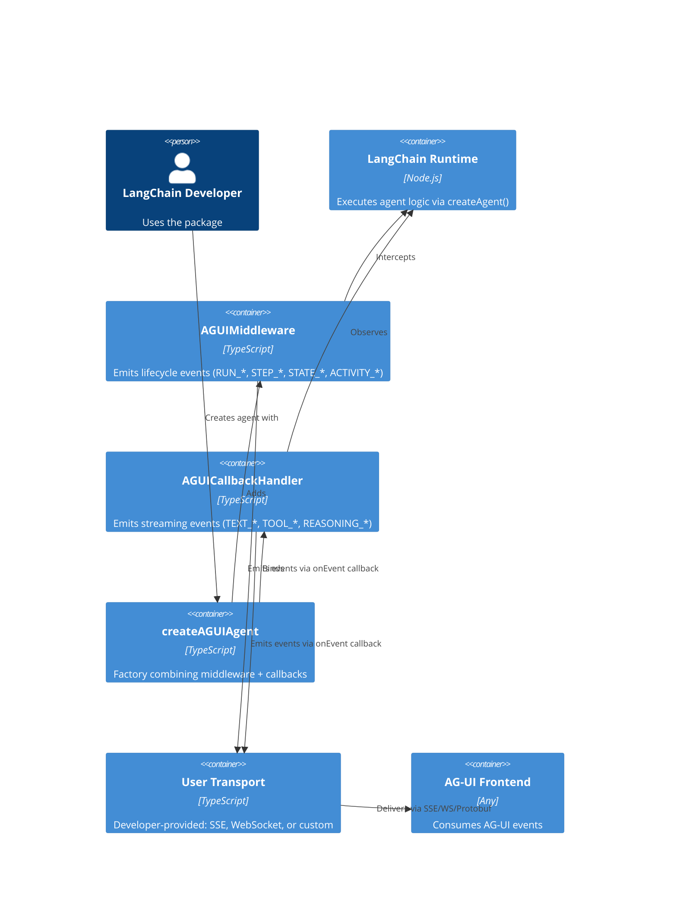
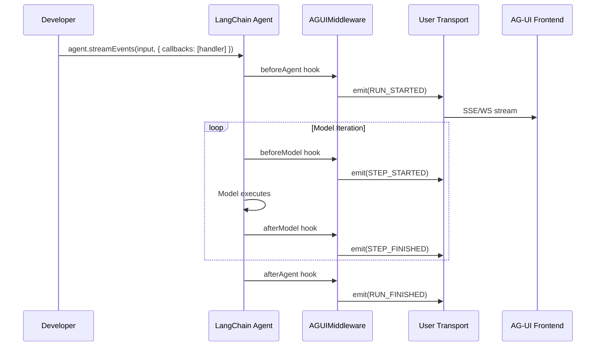
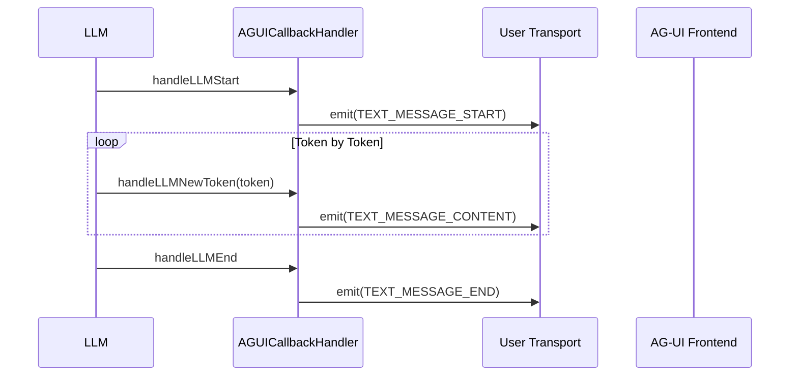
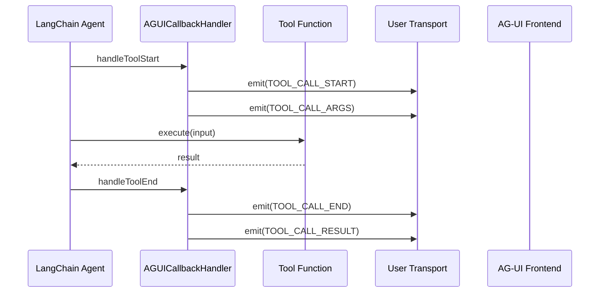

# Architecture.md - Logical Architecture

## @skroyc/ag-ui-middleware-callbacks

---

## 1. Architectural Strategy

### Pattern: Hybrid Event Handler

This package implements a **Hybrid Event Handler** pattern, combining LangChain's Middleware and Callbacks systems to achieve complete AG-UI protocol coverage.

**Justification (Martin Fowler):**
The hybrid approach is necessitated by LangChain's architectural separation between middleware (for agent lifecycle and state) and callbacks (for observability and streaming). This follows the **Separate Interface** pattern - each mechanism has a distinct responsibility and cannot be unified due to LangChain's API constraints.

### Key Architectural Decision

**Why two mechanisms?**

LangChain.js intentionally separates middleware from callbacks:
- **Middleware** operates at the agent orchestration level, with full access to state and runtime
- **Callbacks** operate at the streaming level, observing events without modifying them

This separation is by design (per LangChain's architecture), not a flaw. Our hybrid approach works within these constraints.

---

## 2. System Containers

| Container | Type | Responsibility |
|-----------|------|----------------|
| **AGUIMiddleware** | Middleware | Intercepts agent lifecycle, emits lifecycle/state/activity events |
| **AGUICallbackHandler** | Callback Handler | Observes streaming events, emits text/tool/reasoning events |
| **createAGUIAgent** | Factory | Combines middleware + callbacks into unified agent creation |
| **Event Normalizer** | Utility | Transforms internal events to AG-UI protocol format; expands convenience events (TEXT_MESSAGE_CHUNK → START/CONTENT/END) |
| **State Manager** | Utility | Computes state snapshots and deltas |

---

## 2.1 Middleware vs Callbacks Separation

This package uses two distinct LangChain mechanisms because no single mechanism can emit all required AG-UI events.

### LangChain Middleware (Agent Integration Layer)

**When to use:** Agent lifecycle, state management, activity tracking

| Hook | AG-UI Events |
|------|--------------|
| `beforeAgent` | RUN_STARTED |
| `afterAgent` | RUN_FINISHED, RUN_ERROR |
| `beforeModel` | STEP_STARTED, ACTIVITY_SNAPSHOT |
| `afterModel` | STEP_FINISHED, ACTIVITY_DELTA |

#### Execution Order

LangChain middleware hooks execute in a predictable sequence:

```
beforeAgent (forward) → beforeModel → wrapModelCall → model
    → afterModel (reverse) → wrapToolCall → tool(s) → repeat → afterAgent (reverse)
```

- **Forward order:** `beforeAgent`, `beforeModel` run middleware[0] → middleware[n]
- **Reverse order:** `afterAgent`, `afterModel` run middleware[n] → middleware[0]

> **Design Decision:** This package uses only simple hooks (`beforeAgent`, `afterAgent`, `beforeModel`, `afterModel`). The `wrapModelCall` and `wrapToolCall` hooks are intentionally not used because:
> - They require calling `handler(request)` to continue execution, adding complexity
> - The package's purpose is event emission (observability), not execution control
> - Simple hooks are sufficient for emitting lifecycle and state events

#### JumpTo Control Flow

LangChain middleware supports `jumpTo` for controlling execution flow:

- `jumpTo: "end"` - Skip to afterAgent (exit the run)
- `jumpTo: "tools"` - Skip afterModel, go directly to tool execution
- `jumpTo: "model"` - Skip tools, go to next model call

Requires `canJumpTo` declaration in middleware configuration.

> **Technical Debt:** JumpTo is not implemented. This is tracked as future work (M-2) for advanced control flow patterns like rate limiting and conditional routing.

#### Private State

Fields prefixed with `_` are internal and excluded from invoke results:

```typescript
stateSchema = z.object({
  publicCounter: z.number().default(0),
  _internalFlag: z.boolean().default(false), // Private - not exposed
})
```

**Capabilities:**
- ✅ Full access to agent state
- ✅ Full access to runtime
- ✅ Can modify execution flow
- ❌ Cannot access streaming tokens

### LangChain Callbacks (Observability Layer)

**When to use:** Streaming events, token-by-token emission

| Callback | AG-UI Events |
|----------|--------------|
| `handleLLMStart` | TEXT_MESSAGE_START, REASONING_START |
| `handleLLMNewToken` | TEXT_MESSAGE_CONTENT |
| `handleLLMEnd` | TEXT_MESSAGE_END |
| `handleToolStart` | TOOL_CALL_START, TOOL_CALL_ARGS |
| `handleToolEnd` | TOOL_CALL_END, TOOL_CALL_RESULT |
| `handleToolError` | TOOL_CALL_ERROR |
| `handleChainStart` | CHAIN_STARTED |
| `handleChainEnd` | CHAIN_FINISHED |
| `handleChainError` | CHAIN_ERROR |

**Capabilities:**
- ✅ Access to streaming tokens
- ✅ Message boundaries
- ❌ Cannot access agent state
- ❌ Cannot modify execution

### Why Both Are Required

LangChain intentionally separates these systems:
- **Middleware** = Agent orchestration (state, flow control)
- **Callbacks** = Observability (streaming, logging)

This separation is mandated by LangChain's API architecture, not an arbitrary choice.

---

## 3. Container Diagram



---

## 4. Critical Execution Flows

### Flow 1: Agent Invocation



### Flow 2: Token Streaming



### Flow 3: Tool Execution



---

## 5. Resilience & Cross-Cutting Concerns

### Event Ordering Strategy

**Challenge:** Middleware and callbacks are separate systems with different emission paths.

**Solution:** The package guarantees ordering by:
1. Middleware hooks always fire before callbacks for the same logical operation
2. RUN_STARTED is emitted in `beforeAgent` (first hook)
3. RUN_FINISHED is emitted in `afterAgent` (last hook)

### Error Handling

| Layer | Strategy |
|-------|----------|
| **Middleware** | Try-catch in every hook; emit RUN_ERROR on failure |
| **Callbacks** | Return Promise; errors logged but not thrown |
| **Transport** | Fail-silent - errors caught, never crash agent |

### Observability

- **Correlation IDs:** All events include `runId`, `threadId` for tracing
- **Metadata:** Events include optional `metadata` for debugging

---

## 6. Logical Risks

### Constraint 1: Two Event Sources

**Issue:** Events come from two different mechanisms (middleware + callbacks).

**Mitigation:** 
- Clear documentation of which events come from where
- Event ordering guarantees (see above)
- Unified factory (`createAGUIAgent`) to reduce cognitive load

### Constraint 2: No State Access in Callbacks

**Issue:** Callbacks cannot access or modify agent state.

**Mitigation:**
- State events (STATE_SNAPSHOT) emitted via middleware only
- Message IDs passed through metadata or generated independently

### Constraint 3: Streaming Only via Callbacks

**Issue:** Middleware cannot access token streaming.

**Mitigation:**
- Text content events emitted via callbacks only
- Clear documentation of mechanism requirements
