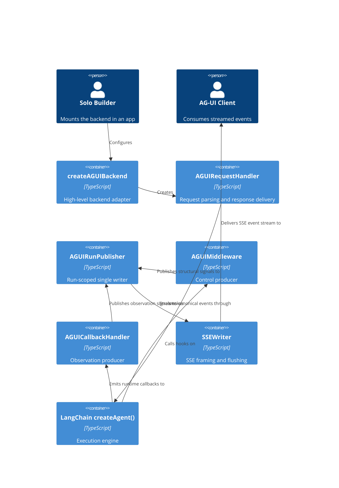
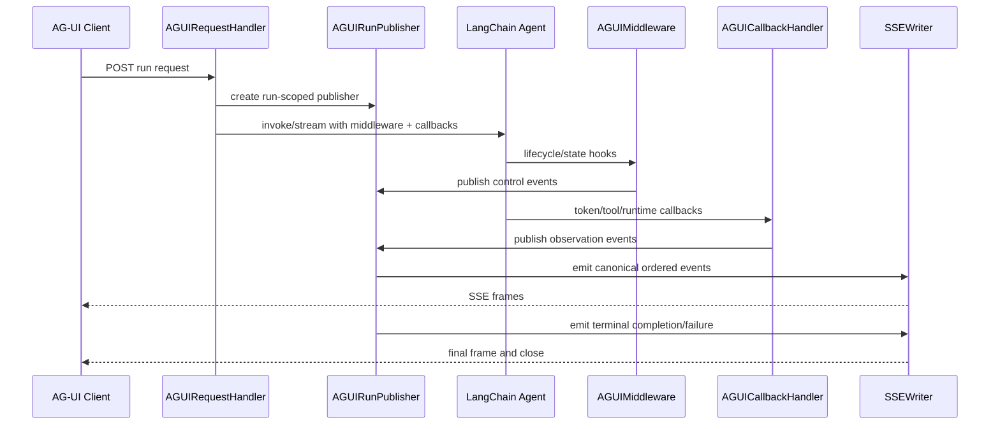
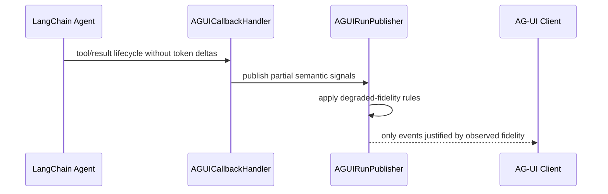
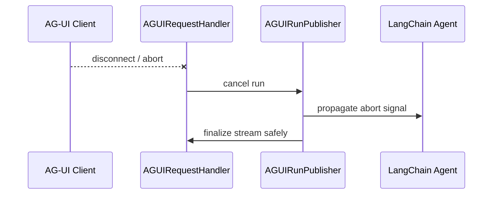

# Architecture.md - Logical Architecture

## @skroyc/ag-ui-middleware-callbacks

---

## 1. Architectural Strategy

### Pattern

**Layered Backend Adapter with Single-Writer Publication**

### Why This Pattern

The package goal is plug-and-play backend compatibility, not merely low-level event emission. That requires an explicit publication boundary between:

- LangChain execution internals
- AG-UI protocol semantics
- transport and serving concerns

The package therefore adopts five layers:

1. **Execution Layer** - LangChain `createAgent()` runtime
2. **Control Layer** - middleware for lifecycle, state, policy, and orchestration metadata
3. **Observation Layer** - callbacks for tokens, tool calls, and runtime observation
4. **Publication Layer** - run-scoped single writer that merges producer signals into one canonical AG-UI stream
5. **Serving Layer** - request handling and transport delivery

### Core Architectural Claims

1. **Middleware is not the streaming layer.**
   It owns execution control and state visibility, not token chunks.
2. **Callbacks are not the transport layer.**
   They provide rich observation, but they do not own public ordering or terminal behavior.
3. **The publication layer is the truth boundary.**
   The frontend must trust only the canonical stream produced there.
4. **Serving is part of the product surface.**
   AG-UI is transport-agnostic, but a batteries-included backend package must still ship a default serving path.

---

## 2. Layer Responsibilities

### 2.1 Execution Layer

**Component:** LangChain `createAgent()` runtime

**Owns**

- model calls
- tool execution
- agent loop progression
- final runtime result

**Must not own**

- AG-UI protocol publication
- SSE framing
- canonical event ordering

**Why**

LangChain remains the execution engine. Treating it as the public protocol implementation would couple frontend behavior to runtime internals and provider quirks.

### 2.2 Control Layer

**Component:** `createAGUIMiddleware()` and related control producers

**Owns**

- lifecycle boundaries
- step boundaries
- state snapshots and deltas
- activity state
- request metadata propagation
- cancellation wiring into runtime context

**Must not own**

- token streaming
- direct socket writes
- public terminal rules

**Why**

Middleware has authoritative access to orchestration and state, but not to token chunks. It is the correct producer for structural runtime facts.

### 2.3 Observation Layer

**Component:** `AGUICallbackHandler`

**Owns**

- text token observation
- tool argument observation
- tool result observation
- runtime failure observation
- provider-specific streaming fidelity capture

**Must not own**

- request serving
- public ordering
- transport framing

**Why**

Callbacks are required for token and tool-call richness, but they are still producers. They should never become direct transport writers.

### 2.4 Publication Layer

**Component:** new run-scoped publisher / serializer

**Owns**

- one canonical event queue per run
- merge of control and observation signals
- ID normalization and correlation
- ordering guarantees
- duplicate suppression
- degraded fidelity rules
- terminal completion and failure semantics

**Must not own**

- LangChain execution control
- HTTP framework coupling
- frontend presentation

**Why**

This is the missing layer in the current package. Without it, protocol logic leaks into middleware and callbacks, and transport correctness becomes ad hoc.

### 2.5 Serving Layer

**Component:** backend request handler and transport helpers

**Owns**

- request parsing
- AG-UI input validation
- content negotiation
- SSE framing and flushing
- future WebSocket or binary delivery helpers
- disconnect and abort propagation
- mapping transport failures into safe shutdown behavior

**Must not own**

- LangChain runtime observation
- semantic event invention

**Why**

The package is meant to be plug-and-play from the backend side. A default serving path is therefore part of the product.

---

## 3. System Containers

| Container | Type | Responsibility |
|-----------|------|----------------|
| **createAGUIBackend** | Factory | High-level entrypoint that wires execution, publication, and serving together |
| **AGUIRequestHandler** | Serving | Accepts AG-UI-compatible requests and returns streamed responses |
| **SSEWriter** | Transport Helper | Serializes canonical events into SSE frames and closes safely |
| **AGUIRunPublisher** | Publication | Single writer for one run; merges producer events and exposes canonical stream |
| **AGUIMiddleware** | Control Producer | Emits lifecycle, state, and activity signals |
| **AGUICallbackHandler** | Observation Producer | Emits token, tool, and runtime observation signals |
| **LangChain Runtime** | Execution | Executes `createAgent()` runs |

---

## 4. Container Diagram

---

## 5. Critical Execution Flows

### Flow 1: Default HTTP Request

### Flow 2: Honest Degraded Streaming

### Flow 3: Client Disconnect

---

## 6. Cross-Cutting Concerns

### Ordering

- Only the publication layer may decide public event order.
- Middleware and callbacks may emit concurrently, but they are not allowed to write directly to the client.

### Run Isolation

- All mutable publication state must be scoped to one run.
- Shared middleware closure state is not acceptable for canonical publication.

### Error Handling

| Layer | Strategy |
|-------|----------|
| **Control Layer** | Fail-safe producer; never crash execution because event publication failed |
| **Observation Layer** | Fail-safe producer; tolerate provider differences and missing callbacks |
| **Publication Layer** | Convert producer signals into truthful completion/failure semantics |
| **Serving Layer** | Close streams safely and propagate aborts/cancellation |

### Degraded Fidelity

The package must never fabricate token or tool deltas to appear richer than the upstream runtime actually is.

Rule:

- missing deltas may degrade to final events
- invented deltas are forbidden

---

## 7. Logical Risks

### Risk 1: Provider Callback Fidelity Varies

**Issue**

Different models and providers may expose different callback richness.

**Mitigation**

- publication layer applies degraded-fidelity rules
- tests cover both full-fidelity and reduced-fidelity runs

### Risk 2: Concurrent Runs Corrupt Shared State

**Issue**

Shared mutable middleware state can leak between runs.

**Mitigation**

- move canonical state into run-scoped publisher instances
- keep middleware and callbacks as stateless or run-local producers

### Risk 3: Transport Failures Create Protocol Lies

**Issue**

A stream can fail after publication has started.

**Mitigation**

- serving layer owns flush/close rules
- publication layer owns terminal event policy

---

## 8. Architectural Consequence

This package is no longer modeled as "middleware plus callbacks with an `onEvent` sink."

The contract freeze also removes `createAGUIAgent` from the intended published
surface. The public package should converge on backend, publication, and
producer entrypoints without preserving a legacy helper purely for backward
compatibility.

It is modeled as:

**LangChain bridge producers + run-scoped publisher + default serving path**

That is the minimum architecture that supports the intended plug-and-play backend goal without collapsing protocol concerns into LangChain internals.
