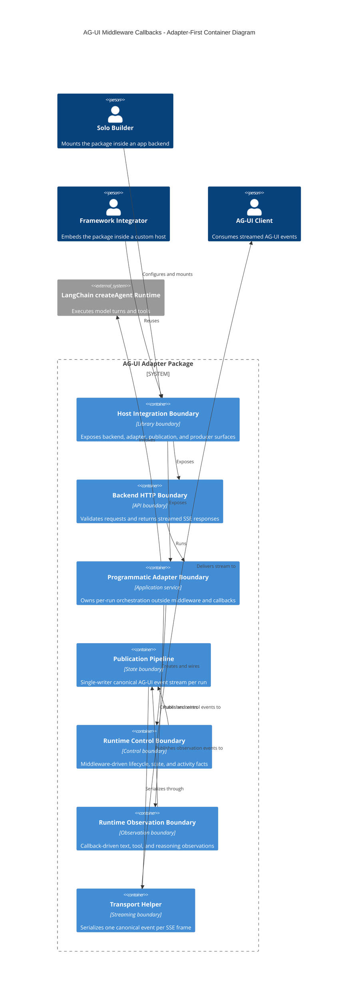
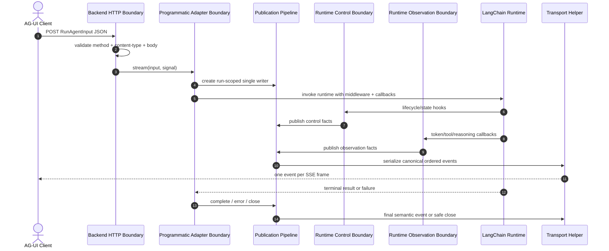
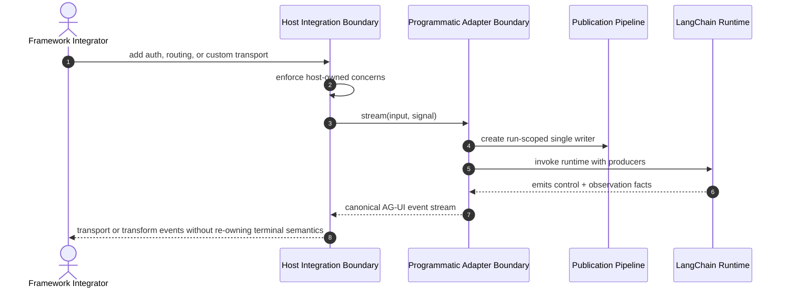
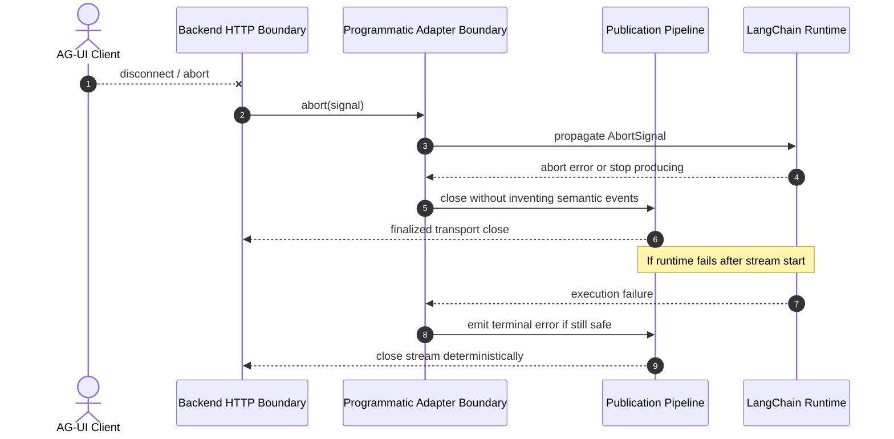
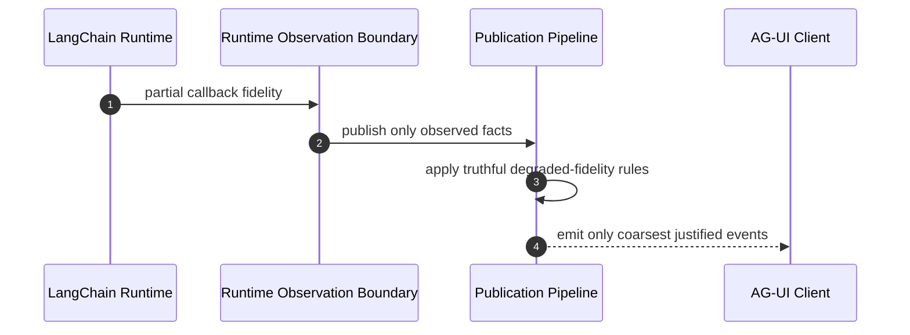

# Solution Architecture

## 0. Version History & Changelog
- v2.1.0 - Recorded the shipped adapter boundary after `createAGUIAdapter()`, backend wrapping, and custom-host reuse landed in code.
- v2.0.0 - Rebuilt the logical architecture around the missing adapter boundary above middleware and callbacks, preserving brownfield continuity and clarifying the active convergence work.
- v1.1.0 - Recorded the layered backend-adapter direction after publication and serving landed in the codebase.
- v1.0.0 - Shifted the logical design away from a pure event-emitter mental model toward a backend-adapter architecture.
- ... [Older history truncated, refer to git logs]

## 1. Architectural Strategy & Archetype Alignment
- **Architectural Pattern:** Adapter-first layered library with shared run orchestration and single-writer publication.
- **Why this pattern fits the PRD:** The product is a library package adopted inside an existing backend, not a hosted platform and not a producer-only utility. That requires one builder-facing adapter boundary that owns runtime wiring and canonical public semantics while still allowing lower-level producer access for advanced users.
- **Core trade-offs accepted:** The package accepts more explicit orchestration structure than the original hook-centric design in order to eliminate duplicated host glue, reduce semantic leakage from LangChain internals, and make custom-host reuse trustworthy.

### Standards Posture
- AG-UI remains the governing external protocol surface for run input and public event semantics.
- LangChain remains the execution engine and producer source, not the public protocol authority.
- The architecture is transport-agnostic in principle but must still ship a default HTTP plus SSE path in practice because plug-and-play backend adoption is a product requirement.

### Brownfield Starting Point
- The current codebase already contains a default backend path, a run-scoped publisher, middleware and callback producers, examples, and a legacy `createAGUIAgent` compatibility surface.
- The current codebase now converges on one reusable adapter boundary. `createAGUIBackend()` wraps it for HTTP plus SSE, while the advanced custom-host path reuses the same orchestration and keeps only host concerns local.
- The planning artifacts still mix historical target-state language with current-state implementation reality, which makes the architecture slightly harder to trust than the code until the remaining publication and verification epics are closed.

### Brownfield Rules Carried Forward
- Middleware and callbacks remain producer surfaces only.
- One publication pipeline remains the single writer for public AG-UI truth.
- Serving must wrap the adapter boundary, not substitute for it.
- Any retained legacy compatibility surface must not redefine the product’s public mental model.

## 2. System Containers
### Host Integration Boundary
- **Logical Type:** Library boundary
- **Responsibility:** Expose builder-facing integration surfaces for the default backend path, the reusable programmatic adapter path, and the lower-level publication and producer escape hatches.
- **Inputs:** Builder configuration, runtime factory, host request context, host transport decisions
- **Outputs:** Mounted backend handlers, canonical event streams, lower-level composition primitives
- **Depends on:** Backend HTTP Boundary, Programmatic Adapter Boundary, Publication Pipeline

### Backend HTTP Boundary
- **Logical Type:** API boundary
- **Responsibility:** Own strict AG-UI HTTP request validation, content negotiation, pre-stream error mapping, SSE response creation, and HTTP-specific abort wiring.
- **Inputs:** `Request`, builder configuration, canonical adapter events
- **Outputs:** `Response`, streamed `text/event-stream` bodies, JSON pre-stream failures
- **Depends on:** Programmatic Adapter Boundary, Transport Helper

### Programmatic Adapter Boundary
- **Logical Type:** Application service
- **Responsibility:** Create one run-scoped publication pipeline, instantiate control and observation producers, invoke the runtime, coordinate completion and abort semantics, and expose the canonical AG-UI event stream independently of HTTP serving.
- **Inputs:** `RunAgentInput`, runtime factory, adapter options, host abort signal
- **Outputs:** Canonical per-run AG-UI event stream, terminal completion outcome, adapter-owned failure behavior
- **Depends on:** Publication Pipeline, Runtime Control Boundary, Runtime Observation Boundary, LangChain Runtime

### Publication Pipeline
- **Logical Type:** State and publication boundary
- **Responsibility:** Own event validation, ordering, duplicate suppression, open-stream tracking, degraded-fidelity terminalization, and public terminal semantics for one run.
- **Inputs:** Control events, observation events, terminal outcomes
- **Outputs:** Canonical AG-UI events and transport-ready serialized output
- **Depends on:** None

### Runtime Control Boundary
- **Logical Type:** Control boundary
- **Responsibility:** Emit lifecycle, state, step, activity, and execution metadata facts from LangChain middleware into the publication pipeline.
- **Inputs:** Runtime lifecycle hooks, state snapshots, execution metadata
- **Outputs:** Control-plane AG-UI events
- **Depends on:** None

### Runtime Observation Boundary
- **Logical Type:** Observation boundary
- **Responsibility:** Emit text, tool, reasoning, and runtime observation facts from LangChain callbacks into the publication pipeline without writing directly to transports.
- **Inputs:** Callback events, streaming chunks, final model outputs, tool observations
- **Outputs:** Observation-plane AG-UI events
- **Depends on:** None

### Transport Helper
- **Logical Type:** Streaming transport boundary
- **Responsibility:** Frame canonical AG-UI events into SSE output and close safely without inventing semantic behavior.
- **Inputs:** Canonical AG-UI events
- **Outputs:** Ordered SSE frames
- **Depends on:** Publication Pipeline

### LangChain Runtime
- **Logical Type:** Execution boundary
- **Responsibility:** Execute `createAgent()` runs, model turns, tool calls, and final agent outcomes.
- **Inputs:** Canonical runtime input, middleware, callbacks, abort signal
- **Outputs:** Runtime execution, callback emissions, terminal result or failure
- **Depends on:** None

## 3. Container Diagram (Mermaid)

```mermaid
C4Container
title AG-UI Middleware Callbacks - Adapter-First Container Diagram

Person(builder, "Solo Builder", "Mounts the package inside an app backend")
Person(integrator, "Framework Integrator", "Embeds the package inside a custom host")
Person(client, "AG-UI Client", "Consumes streamed AG-UI events")

System_Boundary(system, "AG-UI Adapter Package") {
    Container(host, "Host Integration Boundary", "Library boundary", "Exposes backend, adapter, publication, and producer surfaces")
    Container(backend, "Backend HTTP Boundary", "API boundary", "Validates requests and returns streamed SSE responses")
    Container(adapter, "Programmatic Adapter Boundary", "Application service", "Owns per-run orchestration outside middleware and callbacks")
    Container(publication, "Publication Pipeline", "State boundary", "Single-writer canonical AG-UI event stream per run")
    Container(control, "Runtime Control Boundary", "Control boundary", "Middleware-driven lifecycle, state, and activity facts")
    Container(observe, "Runtime Observation Boundary", "Observation boundary", "Callback-driven text, tool, and reasoning observations")
    Container(sse, "Transport Helper", "Streaming boundary", "Serializes one canonical event per SSE frame")
}

System_Ext(runtime, "LangChain createAgent Runtime", "Executes model turns and tools")

Rel(builder, host, "Configures and mounts")
Rel(integrator, host, "Reuses")
Rel(host, backend, "Exposes")
Rel(host, adapter, "Exposes")
Rel(backend, adapter, "Runs")
Rel(adapter, control, "Creates and wires")
Rel(adapter, observe, "Creates and wires")
Rel(control, publication, "Publishes control events to")
Rel(observe, publication, "Publishes observation events to")
Rel(adapter, runtime, "Invokes")
Rel(publication, sse, "Serializes through")
Rel(sse, client, "Delivers stream to")
```

## 4. Critical Execution Flows
### 4.1 Default HTTP Backend Request
- **Maps to PRD capability:** AGC-001, AGC-003

```mermaid
sequenceDiagram
    autonumber
    actor Client as AG-UI Client
    participant Backend as Backend HTTP Boundary
    participant Adapter as Programmatic Adapter Boundary
    participant Publisher as Publication Pipeline
    participant MW as Runtime Control Boundary
    participant CB as Runtime Observation Boundary
    participant Runtime as LangChain Runtime
    participant SSE as Transport Helper

    Client->>Backend: POST RunAgentInput JSON
    Backend->>Backend: validate method + content-type + body
    Backend->>Adapter: stream(input, signal)
    Adapter->>Publisher: create run-scoped single writer
    Adapter->>Runtime: invoke runtime with middleware + callbacks
    Runtime->>MW: lifecycle/state hooks
    MW->>Publisher: publish control facts
    Runtime->>CB: token/tool/reasoning callbacks
    CB->>Publisher: publish observation facts
    Publisher->>SSE: serialize canonical ordered events
    SSE-->>Client: one event per SSE frame
    Runtime-->>Adapter: terminal result or failure
    Adapter->>Publisher: complete / error / close
    Publisher->>SSE: final semantic event or safe close
```

### 4.2 Custom Host Reusing the Adapter Boundary
- **Maps to PRD capability:** AGC-002, AGC-006

```mermaid
sequenceDiagram
    autonumber
    actor Builder as Framework Integrator
    participant Host as Host Integration Boundary
    participant Adapter as Programmatic Adapter Boundary
    participant Publisher as Publication Pipeline
    participant Runtime as LangChain Runtime

    Builder->>Host: add auth, routing, or custom transport
    Host->>Host: enforce host-owned concerns
    Host->>Adapter: stream(input, signal)
    Adapter->>Publisher: create run-scoped single writer
    Adapter->>Runtime: invoke runtime with producers
    Runtime-->>Adapter: emits control + observation facts
    Adapter-->>Host: canonical AG-UI event stream
    Host-->>Builder: transport or transform events without re-owning terminal semantics
```

### 4.3 Abort and Post-Start Failure
- **Maps to PRD capability:** AGC-003, AGC-007

```mermaid
sequenceDiagram
    autonumber
    actor Client as AG-UI Client
    participant Backend as Backend HTTP Boundary
    participant Adapter as Programmatic Adapter Boundary
    participant Publisher as Publication Pipeline
    participant Runtime as LangChain Runtime

    Client--xBackend: disconnect / abort
    Backend->>Adapter: abort(signal)
    Adapter->>Runtime: propagate AbortSignal
    Runtime-->>Adapter: abort error or stop producing
    Adapter->>Publisher: close without inventing semantic events
    Publisher-->>Backend: finalized transport close

    Note over Runtime,Publisher: If runtime fails after stream start
    Runtime-->>Adapter: execution failure
    Adapter->>Publisher: emit terminal error if still safe
    Publisher-->>Backend: close stream deterministically
```

### 4.4 Reduced-Fidelity Observation
- **Maps to PRD capability:** AGC-003, AGC-004

```mermaid
sequenceDiagram
    autonumber
    participant Runtime as LangChain Runtime
    participant Observe as Runtime Observation Boundary
    participant Publisher as Publication Pipeline
    participant Client as AG-UI Client

    Runtime->>Observe: partial callback fidelity
    Observe->>Publisher: publish only observed facts
    Publisher->>Publisher: apply truthful degraded-fidelity rules
    Publisher-->>Client: emit only coarsest justified events
```

## 5. Resilience & Cross-Cutting Concerns
- **Security / Identity Strategy:** Authentication, authorization, and routing remain host-owned concerns applied before the adapter boundary executes. The package treats these as opaque host decisions.
- **Failure Handling Strategy:** Pre-stream validation failures remain HTTP JSON failures at the backend boundary. Post-start runtime failures are coordinated through the adapter and publication pipeline so the stream closes truthfully and deterministically.
- **Observability Strategy:** Verification and logging must center the adapter-owned public surfaces, not just middleware or callback behavior in isolation. Built-package checks and example verifiers remain first-class signals.
- **Configuration Strategy:** Builder configuration enters at the host integration boundary and is translated into runtime factory options, publication settings, and callback behavior by the adapter boundary.
- **Data Integrity / Consistency Notes:** One publisher exists per run. Producers do not share canonical mutable state across runs. Event ordering and terminal semantics are finalized in one place only.

## 6. Logical Risks & Technical Debt
- **Risk:** The missing programmatic adapter boundary remains implicit in code rather than explicit in the public structure.
- **Why it matters:** Custom hosts will continue copying backend internals, which reintroduces the original architectural mistake under a different name.
- **Mitigation or follow-up:** Extract and formalize a reusable adapter boundary that both `createAGUIBackend()` and advanced hosts consume.

- **Risk:** The legacy `createAGUIAgent` path continues to dominate mental models and test weight.
- **Why it matters:** The package can appear architecturally settled while still validating the wrong product boundary.
- **Mitigation or follow-up:** Isolate compatibility behavior, remove it from public docs and release gates, and treat it as transition-only.

- **Risk:** Truthful publication rules remain partly implicit in callback and publisher behavior.
- **Why it matters:** Builders cannot confidently extend or verify event families whose degraded modes are not explicitly codified.
- **Mitigation or follow-up:** Record and test an explicit publication policy for the in-scope AG-UI event families, including legacy thinking and modern reasoning behavior.
