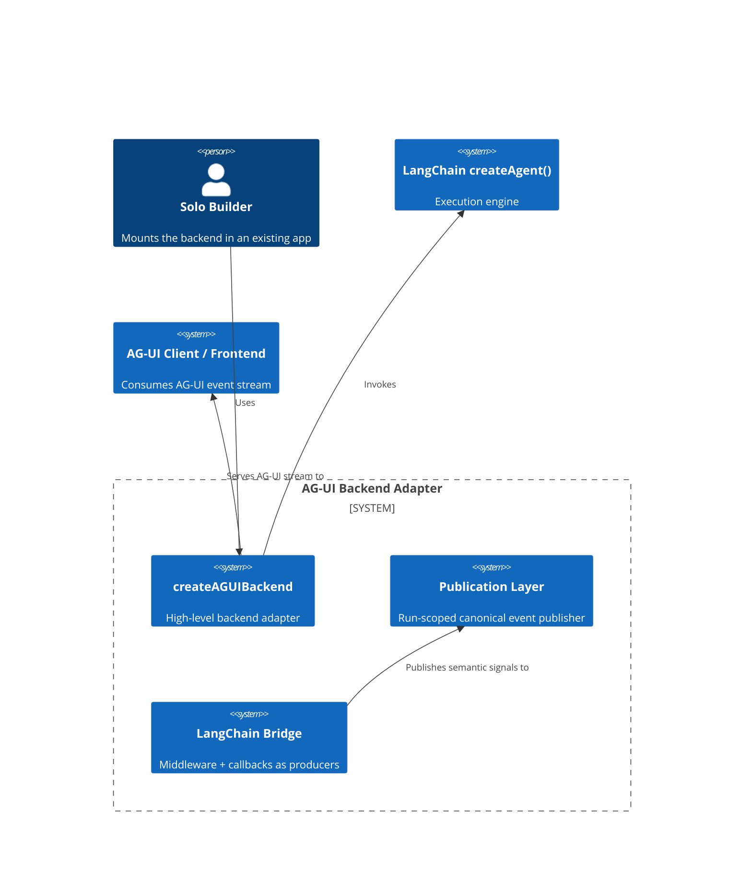

# PRD.md - Product Requirements Document

## @skroyc/ag-ui-middleware-callbacks

---

## 1. Executive Summary

### The Vision
A batteries-included backend adapter that lets a LangChain.js agent created with `createAgent()` behave like an AG-UI-compatible backend with minimal developer code.

### The Problem
The current package shape is too thin for the product goal. Emitting AG-UI-compatible event objects is useful, but it does not by itself guarantee:
- truthful token streaming
- deterministic event ordering
- correct terminal behavior, meaning the package truthfully decides how a run ends across success, failure, disconnect, final lifecycle events, and stream closure
- disconnect and abort propagation
- plug-and-play backend setup

This creates the exact failure mode we want to avoid: too much protocol logic leaks into LangChain internals, while too much serving logic is left to every consuming app.

### Product Goal
Provide a default backend path that is as close as possible to:

```typescript
const backend = createAGUIBackend({ agent });
return backend.handle(request);
```

while still exposing lower-level building blocks for custom hosts.

### Jobs To Be Done

| # | Job Statement | Priority |
|:---:|:---------------|:----------:|
| 1 | "I want my `createAgent()` backend to become AG-UI-compatible without building the serving pipeline myself." | P0 |
| 2 | "I need token and tool-call streaming to be published truthfully to the frontend." | P0 |
| 3 | "I want one package to own ordering, IDs, and terminal behavior so my frontend can trust the stream." | P0 |
| 4 | "I need a low-level escape hatch when my app has custom transport or auth requirements." | P1 |
| 5 | "I want state and activity updates to remain available without conflating them with token delivery." | P1 |
| 6 | "I want extensibility for custom events and future transports without rewriting the core bridge." | P2 |

---

## 2. Ubiquitous Language

| Term | Definition | Do Not Use |
|------|------------|------------|
| **Execution Layer** | The LangChain `createAgent()` runtime that performs model and tool work | Protocol, Transport |
| **Control Layer** | LangChain middleware responsible for execution policy, state, and lifecycle boundaries | Streaming Layer |
| **Observation Layer** | LangChain callbacks responsible for observing token, tool, and runtime events | Transport |
| **Publication Layer** | The run-scoped component that merges control and observation signals into one canonical AG-UI event stream | Callback Transport |
| **Serving Layer** | The HTTP or connection-facing layer that accepts AG-UI input and delivers the canonical event stream | Business Logic |
| **Backend Adapter** | The full package surface that exposes a `createAgent()` runtime as an AG-UI-compatible backend | Event Emitter |
| **Transport Helper** | A concrete delivery helper such as SSE, WebSocket, or binary framing | Core Protocol |
| **Event Producer** | A component that emits internal semantic events into the publication layer | Publisher |
| **Single Writer** | The only component allowed to decide public event order and terminal behavior for one run | Global Emitter |

---

## 3. Actors & Personas

### Primary Actor: The Solo Builder

- **Profile:** Maintains their own app backend and wants AG-UI compatibility quickly
- **Psychographics:**
  - Optimizes for momentum and correctness
  - Prefers a package that owns the boring transport details
  - Wants low ceremony but not hidden magic
- **Goals:**
  - Mount a working AG-UI backend with minimal code
  - Trust the event stream in production
  - Avoid per-project reinvention of SSE and ordering rules

### Secondary Actor: The Framework Integrator

- **Profile:** Wants to embed the bridge into a custom backend or platform
- **Psychographics:**
  - Accepts more configuration in exchange for control
  - Needs reusable primitives rather than one rigid server
- **Goals:**
  - Reuse the publication pipeline with custom routing/auth
  - Swap transports without rewriting LangChain integration

---

## 4. Functional Capabilities

### Epic 1: Batteries-Included Backend Path (P0)

| Capability | Description | Acceptance Criteria |
|------------|-------------|-------------------|
| Backend Factory | Create a high-level backend adapter around an existing `createAgent()` runtime | `createAGUIBackend(config)` returns a backend object |
| Request Handling | Accept AG-UI-compatible input over HTTP | Backend exposes a `handle(request)` or equivalent request entrypoint |
| Minimal Setup | Require minimal host code to publish a working AG-UI backend | User can mount one handler without building a publisher manually |

### Epic 2: Publication Layer (P0)

| Capability | Description | Acceptance Criteria |
|------------|-------------|-------------------|
| Single Writer | Use one response-scoped publisher per run | No public event is written directly from middleware or callbacks |
| Canonical Ordering | Merge control and observation signals deterministically | Public event order is stable and testable |
| ID Management | Normalize run, thread, message, and tool call identifiers | IDs remain consistent across lifecycle, text, and tool events |
| Terminal Semantics | Own completion and failure termination rules | Stream ends truthfully on success, failure, or disconnect |
| Degraded Fidelity Rules | Publish only events supported by upstream runtime fidelity | Missing token deltas degrade honestly rather than being fabricated |

### Epic 3: LangChain Integration Layers (P0)

| Capability | Description | Acceptance Criteria |
|------------|-------------|-------------------|
| Control Layer | Use middleware for lifecycle, state, activity, and execution metadata | Middleware never claims token visibility |
| Observation Layer | Use callbacks for token, tool, and runtime observation | Callbacks capture token/tool richness without becoming transport writers |
| Per-Run State | Keep run-scoped state out of shared middleware closure state | Concurrent runs do not corrupt each other's publication state |

### Epic 4: Serving & Transport (P0)

| Capability | Description | Acceptance Criteria |
|------------|-------------|-------------------|
| HTTP Serving | Expose an AG-UI-compatible HTTP entrypoint | Accepts POST body matching AG-UI run input and returns streamed response |
| SSE Delivery | Ship a default SSE writer for broad compatibility | SSE output flushes lifecycle/text/tool events in canonical order |
| Abort Propagation | Stop work when the client disconnects or aborts | Disconnect reaches the execution path through cancellation wiring |
| Transport Safety | Map post-start transport failures into safe terminal behavior | Public stream closes predictably |

### Epic 5: Low-Level Escape Hatches (P1)

| Capability | Description | Acceptance Criteria |
|------------|-------------|-------------------|
| Publisher API | Expose the publication layer separately for custom hosts | Advanced user can subscribe to canonical per-run events directly |
| Raw Middleware Export | Continue exposing lower-level middleware for advanced composition | Existing advanced users are not trapped in the high-level API |
| Raw Callback Export | Continue exposing callback handler for advanced composition | Existing advanced users can opt into low-level integration |

### Epic 6: Extensibility (P2)

| Capability | Description | Acceptance Criteria |
|------------|-------------|-------------------|
| Custom Events | Allow application-specific events without bypassing the publisher | Custom events flow through the same publication guarantees |
| Alternative Transports | Support future binary or WebSocket helpers | Core publication semantics are reused across transports |
| Protocol Evolution | Leave room for additional AG-UI events without re-architecting serving | New event families slot into the publication layer cleanly |

---

## 5. Non-Functional Constraints

### Performance

- Event publication must not materially slow agent execution.
- The serving layer must support progressive delivery rather than buffering full responses.

### Reliability

- Middleware and callbacks must be fail-safe producers.
- Only the publication layer may decide public ordering and termination.
- Per-run state must be isolated to support concurrent requests safely.

### Architectural Separation

- **Execution Layer:** LangChain runtime only
- **Control Layer:** Middleware only
- **Observation Layer:** Callbacks only
- **Publication Layer:** Canonical AG-UI event stream only
- **Serving Layer:** Request parsing and transport delivery only

### Compatibility

- Must work with LangChain.js agents created with `createAgent()`.
- Must emit AG-UI-compatible `BaseEvent` objects.
- Must preserve an advanced path for custom hosts, not only the default server path.

### Usability

- Default path should feel plug-and-play from the backend side.
- Low-level APIs should remain available for deliberate customization.

---

## 6. Boundary Analysis

### What This Package IS

- An AG-UI backend adapter for LangChain `createAgent()`
- A package that owns the publication boundary between LangChain internals and frontend delivery
- A package that includes a default serving path and lower-level extension points

### What This Package IS NOT

- A frontend package
- A generic LangChain middleware collection
- A promise that callbacks alone define the public protocol

### In Scope

- Request handling for AG-UI-compatible runs
- Middleware and callback integration as producer layers
- Run-scoped publication and serialization of AG-UI events
- Default SSE delivery path
- Cancellation and disconnect propagation
- Lower-level publisher and bridge exports

### Out of Scope

| Excluded Feature | Reason |
|------------------|--------|
| Frontend rendering | Belongs to AG-UI frontend consumers |
| General-purpose auth framework | Host application concern |
| Durable persistence productization | Separate concern from run publication |
| Replacing LangChain execution | LangChain remains the execution engine |

---

## 7. Conceptual Diagrams

### System Context



### Layer Model

```mermaid
flowchart TD
  A[Execution Layer\nLangChain createAgent()] --> B[Control Layer\nMiddleware]
  A --> C[Observation Layer\nCallbacks]
  B --> D[Publication Layer\nSingle Writer]
  C --> D
  D --> E[Serving Layer\nHTTP / SSE / future transports]
  E --> F[AG-UI Client]
```

---

## Appendix: Product Positioning

This package is no longer framed as "middleware plus callbacks that emit event objects." The target product is:

**"The simplest way to expose a LangChain `createAgent()` backend as an AG-UI-compatible backend."**
