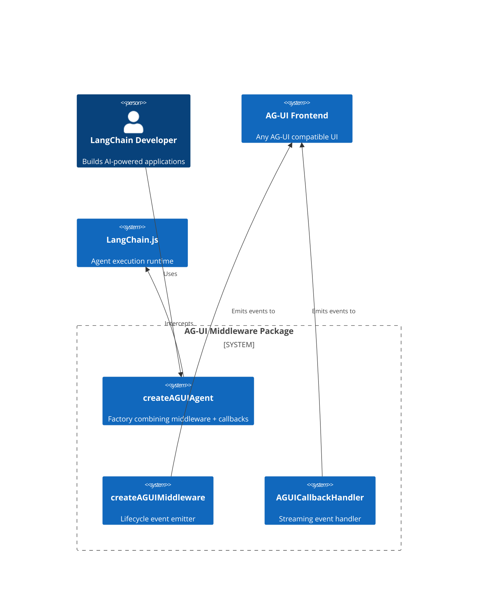
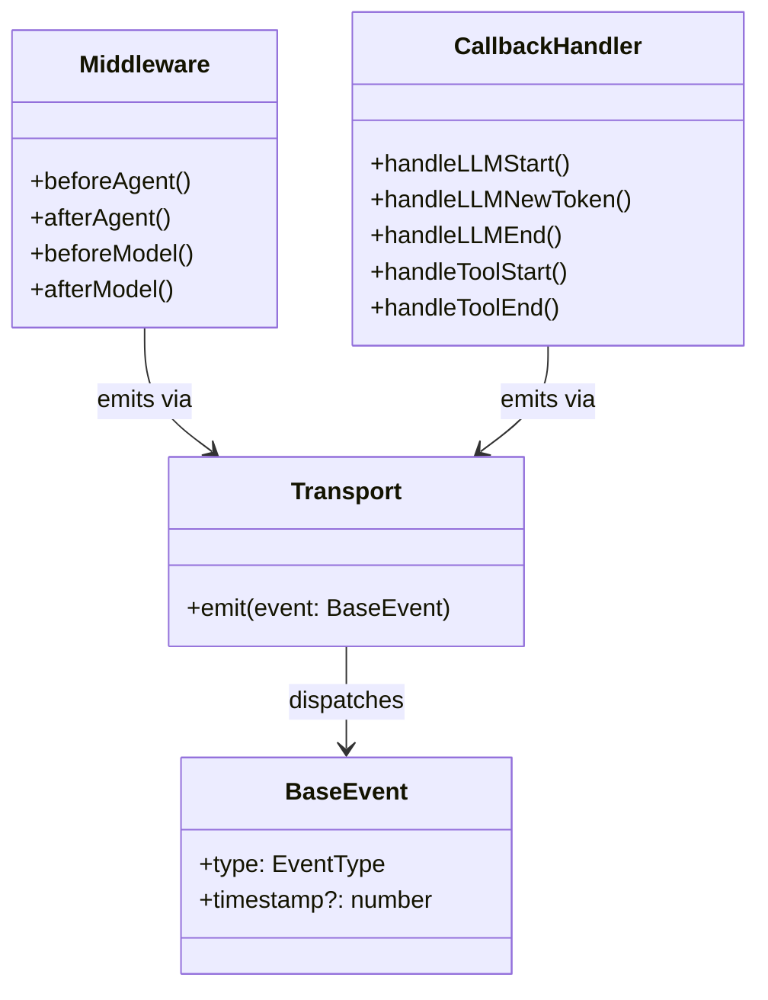

# PRD.md - Product Requirements Document

## @skroyc/ag-ui-middleware-callbacks

---

## 1. Executive Summary

### The Vision
A plug-and-play LangChain.js integration that enables any agent created with `createAgent()` to emit AG-UI protocol events, making it fully compatible with any AG-UI protocol frontend for real-time agent-to-UI communication.

### The Problem
LangChain.js agents lack native support for the AG-UI protocol. Developers building real-time AI interfaces must manually wire up event emission, handling lifecycle events, streaming tokens, tool executions, and state synchronization. This boilerplate is repetitive and error-prone.

### Jobs to be Done

| # | Job Statement | Priority |
|---|--------------|----------|
| 1 | "I want my LangChain agent to emit AG-UI events without writing boilerplate" | P0 |
| 2 | "I need real-time token streaming to display live typing in my UI" | P0 |
| 3 | "I want tool executions to appear in my UI with progress indicators" | P0 |
| 4 | "I need my UI to stay in sync with agent state without full refreshes" | P1 |
| 5 | "I want visibility into the agent's reasoning/thinking process" | P1 |
| 6 | "I want to extend the protocol with custom events for my app" | P2 |

---

## 2. Ubiquitous Language

| Term | Definition | Do Not Use |
|------|------------|------------|
| **Middleware** | LangChain `createMiddleware` hook for intercepting agent lifecycle (beforeAgent, afterAgent, beforeModel, afterModel) | Hooks, Interceptors |
| **Callback** | LangChain `BaseCallbackHandler` for observing streaming events (handleLLMNewToken, handleToolStart, etc.) | Handler, Listener |
| **Transport** | User-provided function to dispatch events to the frontend (SSE, WebSocket, Protobuf) | Socket, Connection, Emitter |
| **Event** | AG-UI protocol message conforming to the 26 event types | Message, Payload, Notification |
| **Agent** | LangChain.js agent created via `createAgent()` | Bot, Assistant, Worker |
| **State** | Agent's mutable state managed via `runtime.state` | Context, Memory, Storage |
| **Private State** | State fields prefixed with `_` that are excluded from invoke results | Internal fields |
| **Built-in Middleware** | LangChain-provided middleware (retry, rate limiting, HITL, summarization) for common patterns | - |

---

## 3. Actors & Personas

### Primary Actor: The LangChain Developer

- **Profile:** Full-stack developer building AI-powered applications
- **Psychographics:**
  - Values "just works" integrations over configuration
  - Prioritizes time-to-market over fine-grained control
  - Familiar with LangChain but not protocol internals
- **Goals:**
  - Connect LangChain agent to AG-UI frontend with minimal code
  - Get streaming working without debugging token pipelines
  - Deploy to production with confidence

### Secondary Actor: The Framework Integrator

- **Profile:** Developer building a reusable component library
- **Psychographics:**
  - Needs low-level control for advanced features
  - Willing to configure for specific requirements
- **Goals:**
  - Customize event emission for specific use cases
  - Add custom event types for application-specific needs

---

## 4. Functional Capabilities

### Epic 1: Core Integration (P0)

| Capability | Description | Acceptance Criteria |
|------------|-------------|-------------------|
| Middleware Factory | Create middleware that intercepts agent lifecycle | `createAGUIMiddleware(opts)` returns middleware |
| Callback Handler | Callback handler for streaming events | `AGUICallbackHandler` extends `BaseCallbackHandler` |
| Agent Factory | Unified factory combining middleware + callbacks | `createAGUIAgent(config)` returns configured agent |
| Lifecycle Events | Emit RUN_STARTED, RUN_FINISHED, RUN_ERROR | Events fire at correct agent lifecycle points |
| Step Events | Emit STEP_STARTED, STEP_FINISHED | Events fire around each model invocation |

### Epic 2: Streaming Events (P0)

| Capability | Description | Acceptance Criteria |
|------------|-------------|-------------------|
| Text Message Start | Emit TEXT_MESSAGE_START with messageId and role | Fires on LLM invocation start |
| Text Message Content | Emit TEXT_MESSAGE_CONTENT with token delta | Fires for each token during streaming |
| Text Message End | Emit TEXT_MESSAGE_END | Fires when LLM stream completes |
| Tool Call Start | Emit TOOL_CALL_START with tool name | Fires when tool execution begins |
| Tool Call Args | Emit TOOL_CALL_ARGS with JSON fragments | Fires during tool argument streaming |
| Tool Call End | Emit TOOL_CALL_END | Fires when tool execution completes |
| Tool Call Result | Emit TOOL_CALL_RESULT with tool output | Fires after tool returns |

### Epic 3: Reasoning/Thinking (P1)

| Capability | Description | Acceptance Criteria |
|------------|-------------|-------------------|
| Legacy Thinking Mode | Emit THINKING_* events | Supported for backward compatibility |
| Modern Reasoning Mode | Emit REASONING_* events (NEW) | Replaces deprecated THINKING_* in AG-UI protocol |
| Reasoning Content | Emit REASONING_MESSAGE_* events | Streams reasoning content |

### Epic 4: State Management (P1)

| Capability | Description | Acceptance Criteria |
|------------|-------------|-------------------|
| State Snapshot | Emit STATE_SNAPSHOT with full state | Configurable timing (initial/final/all) |
| Messages Snapshot | Emit MESSAGES_SNAPSHOT with history | Provides conversation context |
| State Delta | Emit STATE_DELTA with JSON Patch | **Not yet implemented** - Future |

### Epic 5: Activity Events (P1)

| Capability | Description | Acceptance Criteria |
|------------|-------------|-------------------|
| Activity Snapshot | Emit ACTIVITY_SNAPSHOT | Shows "thinking" state in UI |
| Activity Delta | Emit ACTIVITY_DELTA with JSON Patch | Updates activity in real-time |

### Epic 6: Extensibility (P2)

| Capability | Description | Acceptance Criteria |
|------------|-------------|-------------------|
| Custom Events | Allow users to emit CUSTOM events | **Not exposed** - Future |
| Raw Events | Passthrough for external protocols | **Not implemented** - Future |
| Encrypted Reasoning | Support REASONING_ENCRYPTED_VALUE | **Not implemented** - Future |

---

## 5. Non-Functional Constraints

### Performance

- **Latency:** Event emission must not add measurable latency to agent execution
- **Payload Size:** Configurable max payload size (default 50KB) to prevent UI overwhelm

### Reliability

- **Fail-Safe:** Middleware must not crash agent execution; errors must be caught and logged
- **Event Ordering:** Middleware events must emit before callback events for proper lifecycle ordering

### Architectural Separation

- **Middleware vs Callbacks:** This package uses LangChain's middleware for lifecycle/state/activity events and callbacks for streaming events. This separation is mandated by LangChain's API architecture (middleware has state access, callbacks have token access), not an arbitrary choice.
- **AG-UI Scope:** This package handles event emission only. Transport (SSE, WebSocket), HTTP server setup, and wire formatting are developer responsibilities.

### Compatibility

- **LangChain:** Must work with LangChain.js agents created via `createAgent()`
- **AG-UI Protocol:** Event types must conform to `@ag-ui/core` definitions exactly

### Usability

- **Zero Config Mode:** Adding middleware to agent must work without configuration
- **Progressive Disclosure:** Complex options available but not required

---

## 6. Boundary Analysis

### What This Package IS

- An event emission layer that transforms LangChain execution into AG-UI events
- Uses LangChain middleware for lifecycle/state/activity events
- Uses LangChain callbacks for streaming events

### What This Package IS NOT

- AG-UI protocol middleware (event transformation layer - e.g., filtering, enriching)
- Transport implementation (SSE, WebSocket)
- HTTP server

### In Scope

- Intercepting LangChain agent execution
- Transforming LangChain events to AG-UI protocol events
- Providing factory functions for easy integration
- Configuration system with validation

### Out of Scope

| Excluded Feature | Reason |
|------------------|--------|
| Transport implementation | Developer responsibility - SSE, WebSocket, Protobuf |
| HTTP server setup | Developer responsibility |
| Wire formatting | Developer responsibility |
| Frontend implementation | AG-UI frontend libraries handle this |
| Agent persistence | LangChain handles state, we just observe |
| Authentication/Authorization | Outside protocol scope |
| Built-in Middleware (retry, rate limiting, HITL) | Use LangChain's built-in middleware directly |
| JumpTo control flow | Not implemented - advanced middleware pattern |

---

## 7. Conceptual Diagrams

### System Context (C4 Level 1)

### Domain Model

---

## Appendix: Operator Preferences

*Technology preferences documented for reference (not for PRD scope):*

- **Runtime:** Bun / Node.js
- **Build:** tsup (ESM only)
- **Validation:** Zod for configuration schema
- **Event Types:** Re-exported from `@ag-ui/core`
