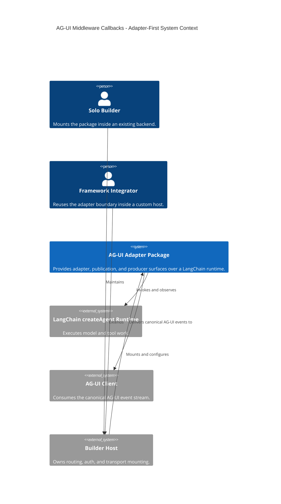
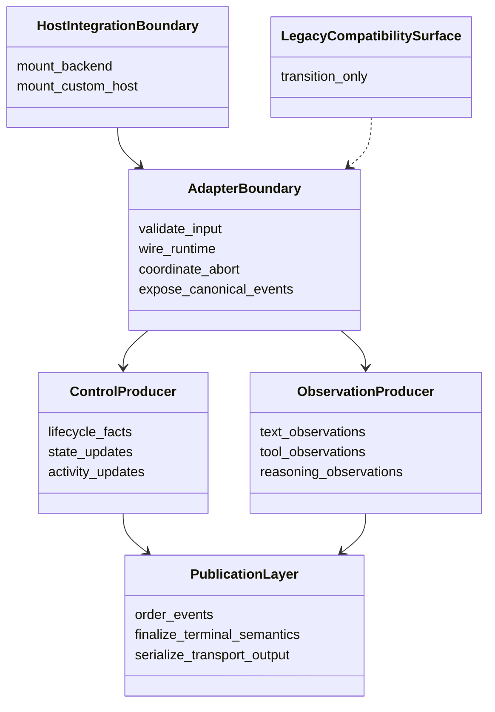

# Product Requirements Document

## 0. Version History & Changelog
- v2.0.0 - Reframed the package around the missing adapter boundary outside middleware and callbacks, preserving brownfield continuity and defining the active success criteria for a successful implementation.
- v1.1.0 - Recorded the MVP backend, publication, and example direction after the package moved beyond the original event-emitter framing.
- v1.0.0 - Shifted the package vision from a low-level event bridge toward an AG-UI backend adapter for LangChain `createAgent()`.
- ... [Older history truncated, refer to git logs]

## 1. Executive Summary & Target Archetype
- **Target Archetype:** Library package that exposes an AG-UI-compatible adapter over an existing LangChain `createAgent()` runtime.
- **Vision:** A solo builder can mount a trustworthy AG-UI backend or reuse the same adapter boundary inside a custom host without rebuilding lifecycle, ordering, abort, or transport semantics by hand.
- **Problem:** The package began with the wrong center of gravity. It treated LangChain middleware and callback hooks as if they were the product surface, when they are only producer surfaces. That mistake makes the package too thin where correctness actually matters: the layer outside those hooks that must own request intake, run orchestration, public event ordering, truthful terminal behavior, and host integration.
- **Jobs to Be Done:** When a builder already has a working LangChain agent runtime, they want to add one library that turns that runtime into an AG-UI-compatible backend, preserves truthful live execution semantics, and still offers a reusable adapter boundary for custom hosts without exposing LangChain internals as the public contract.

### Release-Quality Thresholds
- The built package must support a default HTTP backend path that accepts strict AG-UI `RunAgentInput` JSON and streams canonical AG-UI events over SSE.
- The built package must also expose a reusable adapter boundary above middleware and callbacks so custom hosts do not need to recreate runtime wiring, publisher ownership, terminal semantics, or abort handling by hand.
- The public stream must remain truthful: no invented token deltas, no invented tool-argument chunks, and no invented semantic events on disconnect.
- The adapter-owned stream must be deterministic enough for builders to trust ordering, IDs, and terminal behavior across success, failure, and client abort.
- Local verification must exercise the built package and examples as public surfaces rather than treating hook-level tests alone as sufficient proof.

### Product Posture
- The adapter boundary is the product. Middleware and callbacks are internal producer surfaces and advanced extension seams, not the primary mental model.
- Library-first adoption beats framework sprawl. The package must remain additive over an existing LangChain runtime.
- Host-owned concerns remain host-owned. Authentication, authorization, routing, and durable persistence are outside the package boundary unless explicitly adopted later.
- The package name is historical. The successful product shape is adapter-first even if the published package name still reflects the package’s origin.

### Brownfield Continuity Note
- The current codebase already contains a backend path, a run-scoped publisher, middleware and callback producers, examples, and a legacy `createAGUIAgent` compatibility surface.
- The active product problem is no longer "can the package emit AG-UI events at all?" It is "can the package converge on the correct adapter-first boundary without leaving builders trapped in the old hook-first mental model?"

## 2. Ubiquitous Language (Glossary)
| Term | Definition | Do Not Use |
| --- | --- | --- |
| Solo Builder | The independent developer integrating the package into their own backend or app host. | Team, Enterprise User |
| Framework Integrator | The advanced adopter embedding the package into a custom runtime, framework, or host. | Power User |
| Agent Runtime | The LangChain `createAgent()` runtime that performs model turns, tool calls, and final execution. | Protocol Layer, Backend Brain |
| Adapter Boundary | The run-scoped orchestration layer above middleware and callbacks that owns execution wiring, canonical stream lifecycle, and host-facing integration. | Middleware Layer, Callback Layer |
| Host Integration Boundary | The builder-facing surface that mounts the package inside an HTTP server, custom transport, or other host environment. | Internal Glue |
| Control Producer | Middleware that emits lifecycle, state, activity, and execution metadata into the adapter-owned publication path. | Streaming Layer |
| Observation Producer | Callback handling that emits token, tool, reasoning, and runtime observations into the adapter-owned publication path. | Transport Writer |
| Publication Layer | The single-writer run-scoped component that orders and finalizes public AG-UI events. | Event Bus, Global Sink |
| Serving Layer | The transport-facing layer that accepts AG-UI input and delivers canonical events to a client. | Business Logic |
| Canonical Event Stream | The truthful public AG-UI event sequence produced by the adapter-owned publication layer for one run. | Raw Callback Output |
| Legacy Compatibility Surface | Older package APIs that may remain temporarily for migration or test continuity but do not define the product’s public mental model. | Main API |

## 3. Actors & Personas
### 3.1 Primary Actor
- **Role:** Solo Builder exposing an existing LangChain agent through AG-UI.
- **Context:** Already has a working backend and wants AG-UI compatibility without hand-assembling runtime hooks, SSE details, and terminal semantics.
- **Goals:** Mount the package quickly, trust the public event stream, and avoid per-project reinvention of adapter glue.
- **Frictions:** LangChain hooks expose useful internal signals but do not by themselves define a trustworthy public protocol surface.

### 3.2 Secondary Actor
- **Role:** Framework Integrator embedding the package inside a custom host.
- **Context:** Needs to keep their own routing, auth, or transport choices while still reusing the package’s truthful orchestration and publication behavior.
- **Goals:** Reuse the same adapter-owned run semantics in non-default hosts without copying backend internals.
- **Frictions:** A producer-only package forces advanced users to reconstruct the very layer they were trying to reuse.

### 3.3 Supporting Actor
- **Role:** Package Maintainer guiding the brownfield package toward its correct product boundary.
- **Context:** Maintains a codebase where the implementation has moved forward faster than the planning artifacts and where a legacy compatibility path still influences tests and code shape.
- **Goals:** Converge the product identity, reduce architectural ambiguity, and leave a clear implementation plan that finishes the adapter-first design.
- **Frictions:** Mixed-era docs, duplicated orchestration logic, and the temptation to preserve the old hook-first story because the package name and legacy tests still exist.

## 4. Functional Capabilities
### Epic: Adapter-First Adoption Surface
- **Priority:** P0
- **Capability ID:** AGC-001
- **Capability:** The package must let a builder expose an existing LangChain `createAgent()` runtime as an AG-UI-compatible backend through an adapter-first integration surface rather than through direct hook wiring.
- **Rationale:** The product only succeeds if builders can think in terms of "mount an adapter" rather than "assemble middleware and callbacks into a protocol."

### Epic: Shared Host Integration Boundary
- **Priority:** P0
- **Capability ID:** AGC-002
- **Capability:** The package must provide one reusable adapter-owned run boundary that both the default HTTP backend path and custom hosts can reuse without duplicating runtime orchestration.
- **Rationale:** The missing layer outside middleware and callbacks is what prevents the package from being a trustworthy reusable adapter rather than a collection of low-level parts.

### Epic: Truthful Canonical Publication
- **Priority:** P0
- **Capability ID:** AGC-003
- **Capability:** The system must own a canonical per-run AG-UI event stream that merges control and observation signals deterministically and ends truthfully across success, failure, and abort.
- **Rationale:** Builders and frontends must trust one public stream, not ad hoc callback timing.

### Epic: Producer Boundaries Remain Explicit
- **Priority:** P0
- **Capability ID:** AGC-004
- **Capability:** Middleware and callbacks must remain producer surfaces only. They may contribute execution facts and live observations, but they must not become the product boundary or write directly to transport.
- **Rationale:** The original architectural error came from overloading the hooks with responsibilities they should only inform.

### Epic: Legacy Compatibility Containment
- **Priority:** P1
- **Capability ID:** AGC-005
- **Capability:** Any retained legacy compatibility surface must be clearly isolated from the adapter-first public contract, documentation, examples, and release gates.
- **Rationale:** A package cannot converge on the right product boundary while its public narrative and verification still center the wrong one.

### Epic: Advanced Escape Hatches
- **Priority:** P1
- **Capability ID:** AGC-006
- **Capability:** Advanced adopters must retain lower-level access to publication and producer primitives for deliberate customization after the adapter boundary, not instead of it.
- **Rationale:** The package should remain flexible without forcing every advanced user to rebuild adapter semantics from scratch.

### Epic: In-Scope Verification Confidence
- **Priority:** P1
- **Capability ID:** AGC-007
- **Capability:** Maintainers must be able to verify the in-scope AG-UI contract and adapter semantics using built-package checks, canonical event validation, and end-to-end example verification.
- **Rationale:** Success cannot rest on producer-level tests alone when the product boundary sits above the producers.

### Epic: Extensibility
- **Priority:** P2
- **Capability ID:** AGC-008
- **Capability:** The package should support future event-family expansion, transport helpers, and host adapters without redesigning the core adapter-owned publication boundary.
- **Rationale:** The adapter boundary should absorb future growth cleanly instead of pushing complexity back into host code.

## 5. Non-Functional Constraints
- **Performance:** Canonical publication and transport delivery must remain progressive and must not require buffering a whole run before anything is sent downstream.
- **Reliability:** Only the adapter-owned publication layer may finalize terminal semantics. Concurrent runs must remain isolated.
- **Security & Privacy:** Authentication and authorization remain host concerns. The package must not leak raw internal errors or hidden runtime state as public protocol output.
- **Operability:** Maintainers must be able to distinguish adapter-level proof from hook-level proof and verify both the default backend path and the reusable adapter boundary.
- **Domain-specific Constraints:** The package must stay library-shaped, keep LangChain as the execution engine, and avoid treating provider-native payloads as the public API.

### Prohibited Patterns
- Defining the product as "middleware plus callbacks" instead of "adapter plus producer surfaces"
- Writing to transport directly from middleware or callbacks
- Forcing custom hosts to copy backend orchestration to reuse the package
- Inventing token, tool-argument, or semantic events to appear richer than the runtime truth
- Letting legacy compatibility APIs define the package’s public mental model
- Mixing active scope and archived brownfield context without labeling the difference

## 6. Boundary Analysis
### In Scope
- Adapter-first library integration over an existing LangChain `createAgent()` runtime
- Default HTTP backend path for strict AG-UI `RunAgentInput`
- Reusable non-HTTP adapter boundary for custom hosts
- Run-scoped single-writer publication
- Middleware and callback producers as internal extension seams
- Default SSE delivery
- Truthful abort, failure, and terminal behavior for the in-scope AG-UI event families
- Package-owned verification for the in-scope AG-UI contract and examples

### Out of Scope
- Frontend rendering or AG-UI client implementation
- General-purpose authentication and authorization frameworks
- Durable persistence productization
- Replacing LangChain as the execution engine
- Hosted gateway or platform behavior
- Provider-native wire formats as the public contract

## 7. Conceptual Diagrams (Mermaid)
### 7.1 System Context

```mermaid
C4Context
title AG-UI Middleware Callbacks - Adapter-First System Context

Person(builder, "Solo Builder", "Mounts the package inside an existing backend.")
Person(integrator, "Framework Integrator", "Reuses the adapter boundary inside a custom host.")
System(system, "AG-UI Adapter Package", "Provides adapter, publication, and producer surfaces over a LangChain runtime.")
System_Ext(runtime, "LangChain createAgent Runtime", "Executes model and tool work.")
System_Ext(client, "AG-UI Client", "Consumes the canonical AG-UI event stream.")
System_Ext(host, "Builder Host", "Owns routing, auth, and transport mounting.")

Rel(builder, host, "Maintains")
Rel(integrator, host, "Extends")
Rel(host, system, "Mounts and configures")
Rel(system, runtime, "Invokes and observes")
Rel(system, client, "Delivers canonical AG-UI events to")
```

### 7.2 Domain Model

```mermaid
classDiagram
    class HostIntegrationBoundary {
      mount_backend
      mount_custom_host
    }

    class AdapterBoundary {
      validate_input
      wire_runtime
      coordinate_abort
      expose_canonical_events
    }

    class ControlProducer {
      lifecycle_facts
      state_updates
      activity_updates
    }

    class ObservationProducer {
      text_observations
      tool_observations
      reasoning_observations
    }

    class PublicationLayer {
      order_events
      finalize_terminal_semantics
      serialize_transport_output
    }

    class LegacyCompatibilitySurface {
      transition_only
    }

    HostIntegrationBoundary --> AdapterBoundary
    AdapterBoundary --> ControlProducer
    AdapterBoundary --> ObservationProducer
    ControlProducer --> PublicationLayer
    ObservationProducer --> PublicationLayer
    LegacyCompatibilitySurface ..> AdapterBoundary
```

## Appendix: Operator Preferences
- Use Bun workspace tooling and `bun test` as the default local verification path.
- Prefer explicit subpath exports and import aliases over relative internal imports.
- Preserve important brownfield continuity and historical context rather than reducing the docs to a smaller but less trustworthy summary.
