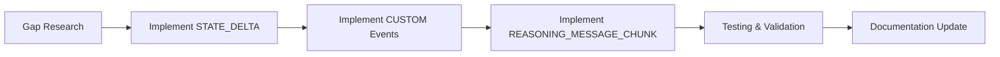

# Tasks.md - Execution Plan

## @skroyc/ag-ui-middleware-callbacks

---

## 1. Executive Summary

### Project Status
- **Current Implementation:** 22/26 AG-UI events implemented
- **Total Estimated Effort:** 23 story points

### Critical Path

```
[G-1] → [G-2] → [G-3] → [T-1] → [T-2]
```

### Build Order



---

## 2. Project Phasing

### Phase 1: MVP (Current State) ✅
- [x] Lifecycle events (RUN_*, STEP_*)
- [x] Text message events (TEXT_MESSAGE_*)
- [x] Tool call events (TOOL_CALL_*)
- [x] State events (STATE_SNAPSHOT, MESSAGES_SNAPSHOT)
- [x] Activity events (ACTIVITY_*)
- [x] Reasoning/Thinking events

### Phase 2: Gap Closure (Next)

**Prioritized by:**
- **Value:** How much the gap impacts production use
- **Feasibility:** How difficult to implement
- **Protocol Compliance:** Required for full AG-UI compliance

---

## 3. Ticket List

### Epic: Gap Closure

---

#### [G-1] Implement STATE_DELTA Events

- **Type:** Feature
- **Effort:** 5 story points
- **Dependencies:** None
- **Description:** Expose STATE_DELTA event for incremental state updates. Currently used internally but not available to users.

- **Acceptance Criteria:**
```gherkin
Given an agent with middleware configured
When agent state changes during execution
Then STATE_DELTA event is emitted with JSON Patch operations
And event includes path, op, value fields per RFC 6902
```

---

#### [G-2] Expose CUSTOM Events for Users

- **Type:** Feature
- **Effort:** 3 story points
- **Dependencies:** None
- **Description:** Allow users to emit custom application-specific events. Currently used internally for LARGE_RESULT_CHUNK but not exposed via public API.

- **Acceptance Criteria:**
```gherkin
Given a user configured with custom event support
When user calls emitCustomEvent(name, value)
Then CUSTOM event is emitted with name and value
And event type is EventType.CUSTOM
```

---

#### [G-3] Implement REASONING_MESSAGE_CHUNK

- **Type:** Feature
- **Effort:** 3 story points
- **Dependencies:** None
- **Description:** Add convenience event for reasoning messages that auto-expands to START/CONTENT/END.

- **Acceptance Criteria:**
```gherkin
Given a reasoning message being emitted
When REASONING_MESSAGE_CHUNK event is sent
Then it automatically expands to START/CONTENT/END events
And follows same pattern as TEXT_MESSAGE_CHUNK
```

---

#### [G-4] Research: RAW Events

- **Type:** Spike
- **Effort:** 2 story points
- **Dependencies:** None
- **Description:** Investigate use cases for RAW event passthrough. Determine if needed for production use or advanced integration only.

- **Acceptance Criteria:**
```gherkin
Given a spike investigation
When research is complete
Then document use cases identified
And recommend: implement, defer, or reject
```

---

#### [G-5] Research: REASONING_ENCRYPTED_VALUE

- **Type:** Spike
- **Effort:** 2 story points
- **Dependencies:** None
- **Description:** Investigate use cases for encrypted reasoning values. Determine if needed for privacy compliance or enterprise use cases.

- **Acceptance Criteria:**
```gherkin
Given a spike investigation
When research is complete
Then document use cases identified
And recommend: implement, defer, or reject
```

---

### Epic: Testing & Validation

---

#### [T-1] Event Validation Tests

- **Type:** Feature
- **Effort:** 3 story points
- **Dependencies:** G-1, G-2, G-3 (requires gap implementation)
- **Description:** Add comprehensive tests for event validation against @ag-ui/core schemas.

- **Acceptance Criteria:**
```gherkin
Given validateEvents enabled
When invalid event is emitted
Then in strict mode: error is thrown
And in normal mode: warning is logged
```

---

#### [T-2] Event Ordering Tests

- **Type:** Feature
- **Effort:** 3 story points
- **Dependencies:** G-1, G-2, G-3 (requires gap implementation)
- **Description:** Add tests verifying correct event emission order between middleware and callbacks.

- **Acceptance Criteria:**
```gherkin
Given an agent execution
When events are emitted
Then RUN_STARTED appears before any TEXT_MESSAGE_START
And all STEP_STARTED appear before RUN_FINISHED
```

---

### Epic: Documentation

---

#### [D-1] Migrate Usage Examples

- **Type:** Chore
- **Effort:** 2 story points
- **Dependencies:** None
- **Description:** Move usage examples from old SPEC.md to README.md and docs/.

- **Acceptance Criteria:**
```gherkin
Given the package documentation
When a new user reads it
Then they can find working examples for:
  - Basic setup
  - Custom transport
  - Configuration options
```
