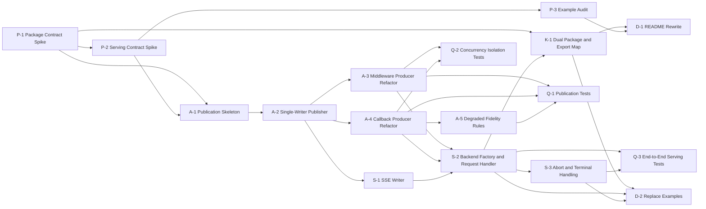

# Tasks.md - Execution Plan

## @skroyc/ag-ui-middleware-callbacks

---

## 1. Executive Summary

- **Total Estimation:** 58 story points
- **Critical Path:** `[P-1] -> [P-2] -> [A-1] -> [A-2] -> [A-3] -> [A-4] -> [S-1] -> [S-2] -> [S-3] -> [Q-3] -> [K-1] -> [D-1] -> [D-2]`

This plan is grounded in the verified mismatch between the current codebase and the target `TechSpec.md`. The codebase already has meaningful control-layer and observation-layer logic, but it does not yet have:

- a run-scoped publication layer
- a high-level backend API
- reusable serving/transport code
- package exports aligned to the new backend-adapter shape

Per Goldratt's Theory of Constraints, the bottleneck is the missing publication boundary. No serving or packaging work should be treated as stable until that boundary exists.

---

## 2. Project Phasing Strategy

### Phase 1 (MVP)

- Freeze the public package and serving contract so implementation does not drift
- Introduce a run-scoped single-writer publication layer
- Refactor middleware into a control producer
- Refactor callbacks into an observation producer
- Ship a default SSE-based backend path via `createAGUIBackend().handle(request)`
- Verify ordering, degraded fidelity, concurrency isolation, and end-to-end serving behavior
- Align package exports and distribution with the intended reusable-library surface
- Replace stale README and examples with validated backend-adapter documentation

### Phase 2 (Post-Launch)

- Additional AG-UI event families beyond the current MVP bridge
- Alternative transports beyond the default SSE path
- Custom event publication ergonomics
- Raw passthrough and encrypted reasoning exploration
- Additional serialization niceties for low-level callback classes

---

## 3. Build Order (Dependency Graph)



---

## 4. The Ticket List

### Epic: Contract Freezing

> **[P-1] Freeze Package Surface and Export Contract**
> - **Type:** Spike
> - **Effort:** 3 story points
> - **Dependencies:** None
> - **Description:** Define the authoritative public package surface for MVP, including whether `createAGUIBackend`, `createAGUIRunPublisher`, and subpath exports such as `./backend` or `./server` are part of the first release.
> - **Acceptance Criteria (Gherkin):**
> ```gherkin
> Given the target TechSpec and the current package exports
> When the package contract spike is completed
> Then the MVP export map is documented explicitly
> And the role of createAGUIAgent as a compatibility API is decided
> And the ESM plus CJS distribution target is confirmed
> ```

> **[P-2] Freeze HTTP Serving Contract and Terminal Semantics**
> - **Type:** Spike
> - **Effort:** 3 story points
> - **Dependencies:** P-1
> - **Description:** Define the exact request and response contract for the default backend path, including request body shape, SSE framing assumptions, success and failure termination rules, and disconnect handling.
> - **Acceptance Criteria (Gherkin):**
> ```gherkin
> Given the target backend-adapter architecture
> When the serving contract spike is completed
> Then the request shape for handle(request) is documented
> And the SSE response contract is documented
> And post-start failure and disconnect behavior are documented
> ```

> **[P-3] Audit and Rebaseline Example Assumptions**
> - **Type:** Chore
> - **Effort:** 2 story points
> - **Dependencies:** P-2
> - **Description:** Audit the current example and README snippets, identify stale API assumptions, and document which demo-local serving logic can be reused versus discarded.
> - **Acceptance Criteria (Gherkin):**
> ```gherkin
> Given the current example and README
> When the audit is completed
> Then every stale API assumption is documented
> And reusable serving behaviors are identified separately from stale signatures
> ```

### Epic: Publication Core

> **[A-1] Introduce Publication Module Skeleton**
> - **Type:** Feature
> - **Effort:** 5 story points
> - **Dependencies:** P-1, P-2
> - **Description:** Create the `publication/` module boundary, including run-scoped context, publisher interfaces, and serializer seams required by the TechSpec.
> - **Acceptance Criteria (Gherkin):**
> ```gherkin
> Given the agreed package and serving contracts
> When the publication module is introduced
> Then the codebase contains a dedicated publication boundary
> And run-scoped publisher instances can be created independently of transport
> ```

> **[A-2] Implement Single-Writer Publisher**
> - **Type:** Feature
> - **Effort:** 5 story points
> - **Dependencies:** A-1
> - **Description:** Implement `AGUIRunPublisher` as the canonical writer for one run, including event validation hooks, ordering coordination, and terminal completion or error handling.
> - **Acceptance Criteria (Gherkin):**
> ```gherkin
> Given one run-scoped publisher
> When control and observation producers publish events
> Then all public events flow through one canonical writer
> And ordering is coordinated in one place
> And terminal completion or error is finalized by the publisher
> ```

> **[A-3] Refactor Middleware into a Control Producer**
> - **Type:** Feature
> - **Effort:** 5 story points
> - **Dependencies:** A-2
> - **Description:** Refactor `createAGUIMiddleware()` so it publishes lifecycle, state, and activity signals into the publisher without keeping canonical run state in shared closure variables.
> - **Acceptance Criteria (Gherkin):**
> ```gherkin
> Given concurrent agent runs using the same middleware factory
> When middleware emits lifecycle, state, and activity events
> Then run-scoped correlation state is not shared across runs
> And middleware publishes into the publisher instead of writing to a direct sink
> ```

> **[A-4] Refactor Callback Handler into an Observation Producer**
> - **Type:** Feature
> - **Effort:** 5 story points
> - **Dependencies:** A-2
> - **Description:** Refactor `AGUICallbackHandler` so token, tool, and reasoning observations publish into the run-scoped publisher rather than acting as a direct public event sink.
> - **Acceptance Criteria (Gherkin):**
> ```gherkin
> Given a streaming model run
> When token and tool callbacks fire
> Then the callback layer publishes observation signals into the publisher
> And callbacks do not write directly to transport
> ```

> **[A-5] Encode Degraded Fidelity Rules**
> - **Type:** Feature
> - **Effort:** 3 story points
> - **Dependencies:** A-4
> - **Description:** Implement publisher rules for partial upstream fidelity so the package degrades honestly when token chunks or tool argument chunks are missing.
> - **Acceptance Criteria (Gherkin):**
> ```gherkin
> Given a provider that emits partial callback fidelity
> When a run is published
> Then the publisher emits only events justified by observed runtime behavior
> And it never fabricates token or tool argument deltas
> ```

### Epic: Default Serving Path

> **[S-1] Implement Reusable SSE Writer**
> - **Type:** Feature
> - **Effort:** 3 story points
> - **Dependencies:** A-2, P-2
> - **Description:** Extract a reusable SSE transport helper from the demo-local serving ideas and align it to the publisher contract.
> - **Acceptance Criteria (Gherkin):**
> ```gherkin
> Given canonical events from the publisher
> When the SSE writer serializes them
> Then events are emitted progressively as SSE frames
> And the transport helper does not invent or reorder semantic events
> ```

> **[S-2] Implement Backend Factory and Request Handler**
> - **Type:** Feature
> - **Effort:** 5 story points
> - **Dependencies:** A-3, A-4, S-1
> - **Description:** Implement `createAGUIBackend()` and the default `handle(request)` entrypoint that creates a run-scoped publisher, invokes the agent, and returns a streamed response.
> - **Acceptance Criteria (Gherkin):**
> ```gherkin
> Given an existing LangChain createAgent runtime
> When a developer creates an AG-UI backend and calls handle(request)
> Then the backend parses the request
> And it creates a run-scoped publisher
> And it invokes the runtime through the control and observation producers
> And it returns a streamed AG-UI-compatible response
> ```

> **[S-3] Wire Abort, Disconnect, and Post-Start Failure Handling**
> - **Type:** Feature
> - **Effort:** 3 story points
> - **Dependencies:** S-2
> - **Description:** Propagate client abort and disconnect into the execution path and implement the final transport behavior for failures that occur after streaming has started.
> - **Acceptance Criteria (Gherkin):**
> ```gherkin
> Given a client that disconnects or aborts during a run
> When the serving layer observes the cancellation
> Then upstream execution receives the abort signal
> And the stream is finalized according to the documented terminal rules
> ```

### Epic: Verification

> **[Q-1] Add Publication Ordering and Fidelity Tests**
> - **Type:** Feature
> - **Effort:** 3 story points
> - **Dependencies:** A-3, A-4, A-5
> - **Description:** Add tests that verify canonical ordering, terminal event behavior, and degraded fidelity behavior for the publication layer.
> - **Acceptance Criteria (Gherkin):**
> ```gherkin
> Given interleaved lifecycle, text, and tool events
> When the publisher emits the canonical stream
> Then RUN_STARTED appears before any text or tool event
> And terminal completion or error behavior is deterministic
> And degraded-fidelity publication never fabricates deltas
> ```

> **[Q-2] Add Concurrency Isolation Tests**
> - **Type:** Feature
> - **Effort:** 3 story points
> - **Dependencies:** A-3, A-4
> - **Description:** Add tests proving that concurrent runs do not share step state, message correlation, or terminal publication state.
> - **Acceptance Criteria (Gherkin):**
> ```gherkin
> Given two simultaneous runs against the same package surface
> When both runs publish events concurrently
> Then message IDs, step state, and terminal state remain isolated per run
> ```

> **[Q-3] Add End-to-End HTTP and SSE Tests**
> - **Type:** Feature
> - **Effort:** 5 story points
> - **Dependencies:** S-2, S-3
> - **Description:** Add end-to-end tests for the default backend path, covering request parsing, SSE output, disconnect handling, and failure handling after streaming starts.
> - **Acceptance Criteria (Gherkin):**
> ```gherkin
> Given the default AG-UI backend handler
> When a valid HTTP request is sent
> Then the response is a streamed SSE response
> And the event sequence is AG-UI-compatible
> And disconnect and post-start failure behavior follow the documented contract
> ```

### Epic: Package Alignment

> **[K-1] Align Build and Export Surface with the TechSpec**
> - **Type:** Feature
> - **Effort:** 3 story points
> - **Dependencies:** P-1, S-2
> - **Description:** Update package exports, build configuration, and distribution outputs so the package exposes the new backend-adapter surface and ships dual ESM plus CJS artifacts with type declarations.
> - **Acceptance Criteria (Gherkin):**
> ```gherkin
> Given the finalized MVP package contract
> When the package is built
> Then the package exports the agreed root and subpath entrypoints
> And both import and require consumers resolve supported outputs
> And type declarations are published for the supported entrypoints
> ```

### Epic: Documentation and Examples

> **[D-1] Rewrite README Around the Backend-Adapter Product**
> - **Type:** Chore
> - **Effort:** 2 story points
> - **Dependencies:** K-1, P-3
> - **Description:** Rewrite README and package-level messaging so the default path is the backend adapter, while preserving clear guidance for low-level consumers.
> - **Acceptance Criteria (Gherkin):**
> ```gherkin
> Given a new package reader
> When they read the README
> Then the default mental model is a plug-and-play backend adapter
> And the low-level bridge APIs are clearly positioned as advanced escape hatches
> ```

> **[D-2] Replace the Stale Example Set**
> - **Type:** Chore
> - **Effort:** 3 story points
> - **Dependencies:** K-1, S-2, S-3
> - **Description:** Replace the stale demo and validation examples with one validated default-backend example and one advanced custom-host example.
> - **Acceptance Criteria (Gherkin):**
> ```gherkin
> Given the examples directory
> When a developer inspects the examples
> Then they find a validated default backend example
> And they find a validated advanced custom-host example
> And neither example depends on stale API signatures
> ```

