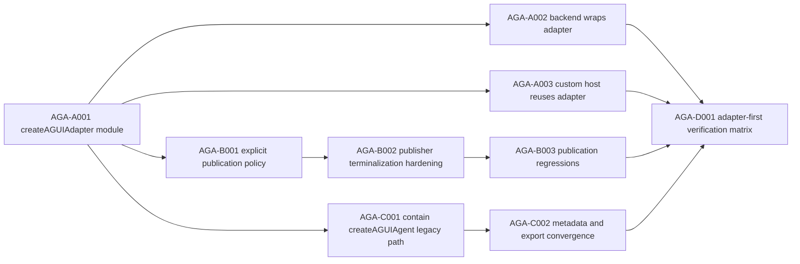

# Engineering Execution Plan

## 0. Version History & Changelog
- v2.1.0 - Recorded Epic A as implemented and shifted the active critical path to publication hardening, legacy containment, and verification.
- v2.0.0 - Rebased the plan around the remaining adapter-first convergence work and archived the earlier MVP backlog as brownfield context.
- v1.1.0 - Recorded the MVP completion state after backend, publication, verification, and examples landed.
- v1.0.0 - Planned the first backend-adapter implementation pass after the package moved beyond the original event-emitter framing.
- ... [Older history truncated, refer to git logs]

## 1. Executive Summary & Active Critical Path
- **Total Active Story Points:** 21
- **Critical Path:** `AGA-B001 -> AGA-B002 -> AGA-B003 -> AGA-D001`
- **Planning Assumptions:** The package remains library-shaped, keeps LangChain as the execution engine, preserves the current backend behavior for consumers, and treats `createAGUIAgent` as a legacy compatibility surface rather than active product scope.

The active delta is no longer "build a backend adapter from scratch." That work is now implemented in the package. The remaining work is to harden truthful publication, contain legacy compatibility, and rebuild release confidence around the converged adapter-first architecture.

### Brownfield Continuity Note
- The package already contains a working backend path, a run-scoped publisher, producer layers, examples, and end-to-end tests.
- The active plan does not reopen those completed foundations. It now concentrates on hardening truthful publication for the in-scope event families and moving release confidence to the right public surfaces.
- Historical work items from the earlier MVP backlog remain useful context and are preserved below as archived scope rather than active execution.

### Active Dependency Notes
- **Adapter branch:** `AGA-A001` through `AGA-A003` is implemented in the current codebase.
- **Publication hardening branch:** `AGA-B001` through `AGA-B003` makes truthful publication policy explicit and closes the remaining reasoning and legacy-thinking edge cases.
- **Compatibility branch:** `AGA-C001` through `AGA-C002` prevents the legacy `createAGUIAgent` path from continuing to define the package’s public identity.
- **Verification branch:** `AGA-D001` is intentionally last because it should validate the converged product surfaces, not the transitional ones.

## 2. Project Phasing & Iteration Strategy
### Current Active Scope
- Encode and harden explicit truthful publication modes for the in-scope AG-UI event families, including legacy `THINKING_*` compatibility and modern `REASONING_*` behavior.
- Move release confidence to the adapter-first public surfaces, examples, and built-package checks.
- Contain `createAGUIAgent` as a legacy surface so it no longer drives the public mental model.

### Future / Deferred Scope
- Alternative transports beyond the default HTTP plus SSE path.
- Additional AG-UI event families beyond the current in-scope publication matrix.
- Stronger long-term compatibility decisions such as removing `createAGUIAgent` entirely in a future breaking release.
- Historical package-name cleanup or republishing under a new adapter-first package identity.

### Archived or Already Completed Scope
- Contract-freeze, publication core, default backend path, verification coverage, package alignment, README rewrite, and example replacement work from the earlier MVP backlog.
- Adapter extraction, backend rebasing, and advanced custom-host convergence from Epic A.
- The completed MVP chain proved that the package could ship backend, publisher, and producer surfaces. Epic A closed the deeper architectural boundary issue around the missing adapter layer outside the hooks.

### Archived MVP Ticket Families
- `P-*`: package and serving contract freezing
- `A-*`: publication boundary and producer refactors
- `S-*`: default SSE backend path
- `Q-*`: ordering, concurrency, and end-to-end verification
- `K-*`: build and export alignment
- `D-*`: README and example replacement

## 3. Build Order (Mermaid)

```mermaid
flowchart LR
    AGAA001[AGA-A001 createAGUIAdapter module] --> AGAA002[AGA-A002 backend wraps adapter]
    AGAA001 --> AGAA003[AGA-A003 custom host reuses adapter]

    AGAA001 --> AGAB001[AGA-B001 explicit publication policy]
    AGAB001 --> AGAB002[AGA-B002 publisher terminalization hardening]
    AGAB002 --> AGAB003[AGA-B003 publication regressions]

    AGAA001 --> AGAC001[AGA-C001 contain createAGUIAgent legacy path]
    AGAC001 --> AGAC002[AGA-C002 metadata and export convergence]

    AGAA002 --> AGAD001[AGA-D001 adapter-first verification matrix]
    AGAA003 --> AGAD001
    AGAB003 --> AGAD001
    AGAC002 --> AGAD001
```

## 4. Ticket List
### Epic A — Adapter Boundary Extraction (AGA)

Status: implemented in the current codebase on 2026-03-30.

**AGA-A001 Introduce the reusable `createAGUIAdapter()` module**
- **Type:** Feature
- **Effort:** 5
- **Status:** Implemented
- **Dependencies:** None
- **Legacy Issue ID:** S-2, D-2
- **Capability / Contract Mapping:** AGC-001, AGC-002, AGC-006
- **Description:** Extract the run-scoped orchestration logic that currently lives inside `createAGUIBackend()` and the custom-host example into a reusable adapter module and `./adapter` subpath that yields canonical AG-UI events independently of HTTP transport.
- **Acceptance Criteria (Gherkin):**
```gherkin
Given an adapter configuration with an agentFactory and a valid RunAgentInput
When a builder calls createAGUIAdapter(config).stream(input, { signal })
Then the adapter creates one run-scoped publisher, middleware instance, and callback handler internally
And it invokes the LangChain runtime without introducing HTTP-specific concerns
And it yields canonical BaseEvent objects whose completion, error, and abort semantics are owned by the adapter
```

**AGA-A002 Rebase `createAGUIBackend()` on the adapter boundary**
- **Type:** Feature
- **Effort:** 3
- **Status:** Implemented
- **Dependencies:** AGA-A001
- **Legacy Issue ID:** S-2, S-3
- **Capability / Contract Mapping:** AGC-001, AGC-003
- **Description:** Refactor `createAGUIBackend()` so it becomes a thin HTTP plus SSE wrapper over `createAGUIAdapter()` and no longer owns duplicated runtime orchestration logic.
- **Acceptance Criteria (Gherkin):**
```gherkin
Given the default backend surface and the extracted adapter module
When a valid POST request reaches createAGUIBackend(config).handle(request)
Then request validation and SSE response creation remain in the backend layer
And the backend delegates run orchestration to createAGUIAdapter()
And the streamed public behavior remains compatible with the existing backend contract
```

**AGA-A003 Rework the advanced custom-host example to consume the adapter**
- **Type:** Chore
- **Effort:** 2
- **Status:** Implemented
- **Dependencies:** AGA-A001
- **Legacy Issue ID:** D-2
- **Capability / Contract Mapping:** AGC-002, AGC-006
- **Description:** Update the custom-host example and its local helpers so it demonstrates host-owned auth and routing while delegating runtime orchestration to the shared adapter boundary instead of recreating it locally.
- **Acceptance Criteria (Gherkin):**
```gherkin
Given the advanced custom-host example
When a builder inspects or runs it
Then host-owned concerns such as auth remain in example code
And canonical run orchestration is delegated to the shared adapter boundary
And the example no longer manually recreates publisher, middleware, and callback wiring that the package should own
```

### Epic B — Truthful Publication Hardening (AGA)

**AGA-B001 Encode explicit publication modes for the in-scope AG-UI event families**
- **Type:** Feature
- **Effort:** 5
- **Dependencies:** AGA-A001
- **Legacy Issue ID:** A-5, Q-1
- **Capability / Contract Mapping:** AGC-003, AGC-004, AGC-007
- **Description:** Move the current partially implicit truthfulness rules into explicit code-level publication policy for text, tool, reasoning, and legacy thinking families so the adapter and publisher can rely on one declared source of truth.
- **Acceptance Criteria (Gherkin):**
```gherkin
Given the in-scope AG-UI event families defined in TechSpec.md
When the package resolves how to publish text, tool, reasoning, and legacy thinking events
Then one explicit publication policy governs preferred and fallback modes for each in-scope family
And unsupported raw provider payloads are skipped rather than translated into invented public events
And the policy is consumed by the adapter-owned publication path rather than left implicit in scattered branching
```

**AGA-B002 Harden publisher terminalization for `REASONING_*` and legacy `THINKING_*` compatibility**
- **Type:** Feature
- **Effort:** 3
- **Dependencies:** AGA-B001
- **Legacy Issue ID:** A-2, A-5
- **Capability / Contract Mapping:** AGC-003, AGC-004
- **Description:** Extend the run publisher so open reasoning and legacy thinking streams finalize truthfully on completion, error, and abort, with no duplicate terminalizers and no invented semantic events.
- **Acceptance Criteria (Gherkin):**
```gherkin
Given a run that opens reasoning or legacy thinking streams
When the run completes, errors, or is aborted mid-stream
Then the publisher closes only the streams justified by the observed state
And terminal lifecycle events remain deterministic
And no duplicate or invented reasoning or thinking terminal events are emitted
```

**AGA-B003 Add regression coverage for degraded-fidelity and terminal-closure behavior**
- **Type:** Feature
- **Effort:** 3
- **Dependencies:** AGA-B002
- **Legacy Issue ID:** Q-1, Q-3
- **Capability / Contract Mapping:** AGC-003, AGC-007
- **Description:** Add focused tests that prove the explicit publication policy, degraded-fidelity behavior, reasoning/thinking terminalization, and adapter-versus-backend output consistency.
- **Acceptance Criteria (Gherkin):**
```gherkin
Given runs with full-fidelity, reduced-fidelity, reasoning, and legacy thinking observations
When the publication and adapter tests execute
Then the package proves its declared publication modes and terminal closure behavior
And backend and adapter-level canonical event sequences stay consistent for equivalent runs
And no regression test depends on hook-level behavior alone to prove the public contract
```

### Epic C — Legacy Compatibility Containment (AGA)

**AGA-C001 Contain `createAGUIAgent` as a legacy compatibility surface**
- **Type:** Chore
- **Effort:** 3
- **Dependencies:** AGA-A001
- **Legacy Issue ID:** P-1, K-1
- **Capability / Contract Mapping:** AGC-005
- **Description:** Isolate `createAGUIAgent` in tests, metadata, and package messaging so it remains transition-only and no longer defines the release-critical product boundary.
- **Acceptance Criteria (Gherkin):**
```gherkin
Given the retained createAGUIAgent implementation
When package surfaces, tests, and release gates are reviewed
Then createAGUIAgent is treated as a legacy compatibility surface rather than the active product contract
And public adapter-first surfaces remain the release-critical integration path
And compatibility coverage is separated clearly from adapter-first verification
```

**AGA-C002 Align metadata, exports, and source commentary with the adapter-first contract**
- **Type:** Chore
- **Effort:** 2
- **Dependencies:** AGA-C001
- **Legacy Issue ID:** K-1, D-1
- **Capability / Contract Mapping:** AGC-001, AGC-005
- **Description:** Update package metadata, export map, root/source comments, README-facing code snippets, and built-package import expectations so they consistently describe the adapter-first product surface and the new `./adapter` subpath.
- **Acceptance Criteria (Gherkin):**
```gherkin
Given the converged adapter-first contract
When package metadata, exports, and source/package commentary are updated
Then the package publishes the adapter subpath intentionally
And stale producer-only descriptions are removed from package metadata and source comments
And public-facing snippets and import expectations match the adapter-first contract
```

### Epic D — Adapter-First Verification (AGA)

**AGA-D001 Refresh the verification matrix around backend, adapter, and example public surfaces**
- **Type:** Feature
- **Effort:** 5
- **Dependencies:** AGA-A002, AGA-A003, AGA-B003, AGA-C002
- **Legacy Issue ID:** Q-3, D-2
- **Capability / Contract Mapping:** AGC-001, AGC-002, AGC-003, AGC-007
- **Description:** Rebuild the release-quality verification matrix so it exercises the built package’s backend and adapter subpaths, validates emitted events against `@ag-ui/core`, and proves that the default backend and custom-host examples both reuse the converged adapter semantics.
- **Acceptance Criteria (Gherkin):**
```gherkin
Given the built package, the adapter subpath, the backend subpath, and the example applications
When the verification suite executes
Then built-package imports for the public subpaths succeed
And backend and adapter public outputs validate against @ag-ui/core runtime schemas
And the default backend and advanced custom-host examples prove the same adapter-owned semantics rather than divergent local glue
```
