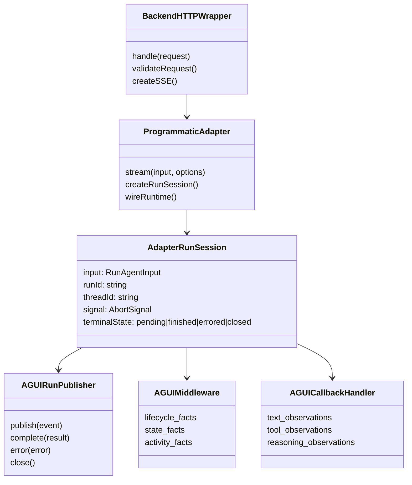

# Technical Specification

## 0. Version History & Changelog
- v2.1.0 - Recorded the shipped `./adapter` subpath, backend rebasing, and custom-host convergence after Epic A implementation.
- v2.0.0 - Rebuilt the technical spec around an explicit adapter boundary above middleware and callbacks, recorded brownfield drift, and defined the remaining implementation contract for convergence.
- v1.1.0 - Captured the MVP backend, publisher, and subpath export shape after the package moved beyond the original event-sink design.
- v1.0.0 - Specified the initial backend-adapter contract after the package was re-scoped away from an `onEvent` bridge.
- ... [Older history truncated, refer to git logs]

## 1. Stack Specification (Bill of Materials)
- **Primary Language / Runtime:** TypeScript 5.9.x targeting modern ESM, with Bun current as the default workspace runtime and Node.js `>=20` as the published engine floor.
- **Primary Frameworks / Libraries:** `langchain` 1.2.17, `@langchain/core` 1.1.31, `@ag-ui/core` 0.0.47, `zod` 4.3.6, `fast-json-patch` 3.1.1.
- **State Stores / Persistence:** No durable store in the current package scope. Per-run state is in-memory and must be isolated to a single run session.
- **Infrastructure / Tooling:** Bun workspaces, `tsup` 8.5.1, Biome 2.3.14, import-alias-based TypeScript configuration, Bun example apps, and schema-backed runtime validation via `@ag-ui/core`.
- **Testing / Quality Tooling:** `bun:test`, built-package smoke via `bun run build`, end-to-end example verification, and package-owned checks that validate emitted AG-UI events against `@ag-ui/core` schemas.
- **Version Pinning / Compatibility Policy:** LangChain and AG-UI contracts are external integration units. Any contract-facing surface change must be checked against the installed `langchain` and `@ag-ui/core` versions in this workspace, not against memory or earlier docs. `createAGUIAgent` remains a brownfield compatibility surface, not the package’s public contract.

### 1.1 Brownfield Audit Summary
- **Current package reality:** The package now exposes `./adapter`, `./backend`, `./publication`, `./middleware`, and `./callbacks` subpaths, plus a working default backend path, examples, and a run-scoped single-writer publisher.
- **Current package reality:** The codebase still contains a legacy `createAGUIAgent` compatibility surface and tests that exercise it heavily, even though the documented public contract no longer centers it.
- **Current package reality:** `createAGUIBackend()` now delegates non-HTTP orchestration to `createAGUIAdapter()` and stays focused on HTTP validation plus SSE response creation.
- **Current package reality:** The advanced custom-host example now reuses the shared adapter boundary and only owns auth, routing, and transport response creation locally.
- **Current package reality:** Planning artifacts still mix historical target-state language with already implemented work. The adapter extraction is done; the remaining convergence work is now publication hardening, compatibility containment, and release-quality verification.

### 1.2 Brownfield Drift Register
| Area | Current Brownfield Reality | Target-State Requirement |
| --- | --- | --- |
| Product boundary | Public narrative still carries hook-first residue | Adapter boundary becomes the explicit product center |
| Non-HTTP orchestration | `createAGUIAdapter()` now owns orchestration and `createAGUIBackend()` wraps it | Keep the adapter as the only non-HTTP orchestration path |
| Custom hosts | Advanced example now consumes the shared adapter boundary | Keep custom hosts aligned with backend semantics instead of local glue |
| Legacy compatibility | `createAGUIAgent` remains in source and tests | Compatibility surface becomes isolated and non-governing |
| Truthful publication policy | Some degraded-fidelity rules exist only as code behavior | In-scope publication modes are recorded and tested explicitly |
| Support artifacts | Main four planning docs are being updated, but older support docs remain historical | Governing artifacts must become trustworthy even when historical support docs remain in the repo |

## 2. Architecture Decision Records (ADRs)
### ADR-001 Product Contract Is Adapter-First
- **Status:** accepted
- **Context:** The original package centered middleware and callbacks as if they were the product surface. That framing made the package too low-level and pushed host orchestration back onto every adopter.
- **Decision:** Treat the package as an adapter-first library. Middleware and callbacks remain internal producer surfaces and advanced extension seams, not the main integration contract.
- **Consequences:** The package must expose a reusable adapter boundary outside the producer layers and align docs, examples, and verification around that contract.

### ADR-002 LangChain Hooks Are Producer Surfaces Only
- **Status:** accepted
- **Context:** Middleware sees lifecycle and state but not token truth; callbacks see rich observations but do not own terminal semantics or transport.
- **Decision:** Middleware is the control producer and callbacks are the observation producer. Neither may define or write the public contract directly.
- **Consequences:** Public semantics must be finalized above the hooks. Hook-level tests are necessary but insufficient product proof.

### ADR-003 Introduce a Reusable Programmatic Adapter Boundary
- **Status:** accepted
- **Context:** `createAGUIBackend()` and the custom-host example currently duplicate the same orchestration responsibilities in different places.
- **Decision:** Introduce a programmatic adapter module and subpath, `./adapter`, that owns run-scoped orchestration independently of HTTP transport.
- **Consequences:** `createAGUIBackend()` becomes a thin HTTP plus SSE wrapper over the adapter, and advanced hosts reuse the same semantics without copying backend internals.

### ADR-004 Publication Remains the Single Writer Per Run
- **Status:** accepted
- **Context:** Public event order and terminal behavior become unreliable when middleware, callbacks, or transports can write directly to the client.
- **Decision:** Retain one run-scoped publisher as the only public writer for one run.
- **Consequences:** Ordering, duplicate suppression, degraded fidelity, and terminal behavior remain centrally testable.

### ADR-005 Default Transport Is HTTP Plus SSE; Serving Wraps the Adapter
- **Status:** accepted
- **Context:** AG-UI supports multiple transport styles, but the package’s adoption value depends on a batteries-included backend path.
- **Decision:** Keep HTTP plus SSE as the default serving path while extracting the orchestration logic into a transport-agnostic adapter module.
- **Consequences:** The backend remains simple for solo builders while custom hosts gain a reusable non-HTTP seam.

### ADR-006 Legacy `createAGUIAgent` Is Transition-Only
- **Status:** accepted
- **Context:** `createAGUIAgent` still exists in the source tree and test suite, but the public package contract no longer centers it.
- **Decision:** Treat `createAGUIAgent` as a legacy compatibility surface. It must not define docs, examples, exports, or release gates for the adapter-first product.
- **Consequences:** Compatibility behavior may remain temporarily, but verification and documentation must move to the adapter-first surfaces.

### ADR-007 Verification Centers the Public Adapter Surfaces
- **Status:** accepted
- **Context:** The package has no official external compliance runner equivalent to the OpenResponses package. Verification must still prove the correct boundary.
- **Decision:** Treat built-package import checks, `@ag-ui/core` schema validation, backend SSE lifecycle tests, adapter-level stream tests, and example verifiers as the release-quality proof set for the in-scope AG-UI contract.
- **Consequences:** Verification must explicitly cover `./backend`, `./adapter`, and the advanced host path rather than only producer internals.

### Brownfield Drift Notes
- `src/backend/create-agui-backend.ts` now owns HTTP handling and SSE response creation only.
- The custom-host example now consumes the shared adapter module instead of reassembling runtime orchestration locally.
- `src/index.ts` and some package comments still describe the package as producer-only even though the backend and publication surfaces already ship.
- Main planning artifacts are being refreshed in this pass. Support artifacts such as `ContractFreeze.md` and `VerificationAudit.md` should be treated as historical context until intentionally updated.

## 3. State & Data Modeling
### 3.1 Run Session Model
- **Purpose:** Represent one adapter-owned execution session from validated input through terminal publication.
- **Storage Shape:** In-memory per-run session consisting of validated `RunAgentInput`, resolved run and thread IDs, one `AGUIRunPublisher`, one middleware instance, one callback handler instance, and terminal completion state.
- **Constraints / Invariants:**
  - One publication pipeline exists per run.
  - A run may finalize only once.
  - Middleware and callback state must be isolated to the run session.
  - Producers may emit facts concurrently, but only the publisher may order and finalize public events.
  - Client abort closes transport safely and must not invent semantic terminal events.
- **Indexes / Access Paths:** Run-scoped IDs are the canonical correlation path. Thread ID and run ID are propagated from validated input to runtime configuration and terminal events.
- **Migration Notes:** The run-session model is additive over the current package. The main migration is extracting the adapter module from backend and example-local orchestration without changing the already published backend behavior.



### 3.2 In-Scope Truthful Publication Policy
| Event Family | Preferred Mode | Allowed Fallbacks | Truth Source |
| --- | --- | --- | --- |
| `RUN_*`, `STEP_*`, `STATE_*`, `MESSAGES_SNAPSHOT`, `ACTIVITY_*` | live control facts | none | middleware lifecycle and state hooks |
| `TEXT_MESSAGE_*` | live delta | terminal finish only on abort or failure | callback token stream and finalized output |
| `TOOL_CALL_START`, `TOOL_CALL_ARGS`, `TOOL_CALL_END` | live observation | done-only publication when only final arguments are available | callback chunks and final structured tool calls |
| `TOOL_CALL_RESULT` | observed completion | final-only result without invented lifecycle chunks | observed tool completion only |
| `REASONING_*` | live structured reasoning | skip unsupported raw provider payloads; terminal completion when final structured truth exists | LangChain structured content blocks and final outputs |
| `THINKING_*` legacy family | compatibility mode using the same truth source as reasoning | compatibility-only degraded closure | same structured reasoning truth source when compatibility mode is enabled |

### 3.3 Publication Rules
- Never fabricate token deltas when none were observed.
- Never fabricate tool-argument chunks when none were observed.
- Do not convert provider-specific raw reasoning payloads into public reasoning events unless they pass through the standardized structured observation path already trusted by the package.
- Terminal success and error semantics belong to the publisher, not to transport helpers, middleware, or callbacks.

## 4. Interface Contract
### 4.1 Programmatic Adapter API
- **Style:** library API
- **Authentication / Authorization:** Host-owned outside the package boundary.
- **Compatibility Strategy:** Additive public subpath, `@skroyc/ag-ui-middleware-callbacks/adapter`. The adapter contract becomes the shared non-HTTP orchestration surface. `createAGUIBackend()` wraps it. Lower-level publication and producer subpaths remain available. `createAGUIAgent` remains legacy and non-governing.
- **Error model:** Promise rejection before stream exposure for invalid adapter configuration; terminal `RUN_ERROR` or safe close after stream start depending on failure timing and abort state.

```ts
import type { BaseEvent, RunAgentInput } from "@ag-ui/core";

interface AGUIAdapterRunOptions {
  signal?: AbortSignal;
}

interface AGUIAdapter {
  stream(
    input: RunAgentInput,
    options?: AGUIAdapterRunOptions
  ): Promise<AsyncIterable<BaseEvent>>;
}

type AGUIAgentFactory = (args: {
  input: RunAgentInput;
  middleware: ReturnType<typeof createAGUIMiddleware>;
}) => AGUIBackendAgentLike | Promise<AGUIBackendAgentLike>;

interface AGUIAdapterConfig {
  agentFactory: AGUIAgentFactory;
  validateEvents?: boolean | "strict";
  emitStateSnapshots?: "initial" | "final" | "all" | "none";
  emitActivities?: boolean;
  errorDetailLevel?: "full" | "message" | "code" | "none";
  callbackOptions?: Omit<AGUICallbackHandlerOptions, "publish">;
}

declare function createAGUIAdapter(
  config: AGUIAdapterConfig
): AGUIAdapter;
```

### 4.2 Default Backend HTTP API
- **Style:** HTTP API
- **Authentication / Authorization:** Host-enforced before the backend wrapper executes.
- **Compatibility Strategy:** Preserve the existing `./backend` subpath and `createAGUIBackend(config).handle(request)` contract while re-implementing it as a thin wrapper over `createAGUIAdapter()`.
- **Error model:** Pre-stream JSON error responses for request validation failures; streamed canonical AG-UI events for successful requests; safe close on abort without invented semantic events.

```yaml
openapi: 3.1.0
info:
  title: AG-UI Backend Wrapper Contract
  version: 2.0.0
paths:
  /agui:
    post:
      operationId: handleAGUIRun
      summary: Accept a strict AG-UI run request and stream canonical AG-UI events
      requestBody:
        required: true
        content:
          application/json:
            schema:
              $ref: "#/components/schemas/RunAgentInput"
      responses:
        "200":
          description: Streamed AG-UI response
          content:
            text/event-stream:
              schema:
                type: string
                description: One canonical AG-UI BaseEvent JSON object per SSE frame.
        "400":
          description: Invalid request body
        "405":
          description: Method not allowed
        "415":
          description: Unsupported content type
components:
  schemas:
    RunAgentInput:
      type: object
      description: Strict AG-UI RunAgentInput validated via @ag-ui/core at runtime.
```

### 4.3 Publication and Producer Escape Hatches
- **Style:** library API
- **Authentication / Authorization:** Not applicable; these are internal composition surfaces exposed for deliberate advanced use.
- **Compatibility Strategy:** Preserve `./publication`, `./middleware`, and `./callbacks` subpaths. These remain advanced escape hatches beneath the adapter boundary, not replacements for it.
- **Error model:** Validation warnings or strict validation exceptions according to configuration; public semantic finalization remains the publisher’s responsibility.

```ts
interface AGUIRunPublisher {
  publish(event: BaseEvent): void;
  complete(result?: unknown): void;
  error(error: unknown): void;
  close(): void;
  subscribe(listener: (event: BaseEvent) => void): () => void;
  toReadableStream(): ReadableStream<Uint8Array>;
}
```

## 5. Implementation Guidelines
### 5.1 Project Structure
```text
.
├── docs/
│   ├── PRD.md
│   ├── Architecture.md
│   ├── TechSpec.md
│   └── Tasks.md
├── src/
│   ├── adapter/
│   │   └── create-agui-adapter.ts
│   ├── backend/
│   │   └── create-agui-backend.ts
│   ├── callbacks/
│   │   └── agui-callback-handler.ts
│   ├── middleware/
│   │   ├── create-agui-middleware.ts
│   │   └── id-resolution.ts
│   ├── publication/
│   │   ├── create-agui-run-publisher.ts
│   │   └── serializer.ts
│   ├── transports/
│   │   └── sse.ts
│   └── utils/
├── example/
│   ├── server.ts
│   ├── custom-host.ts
│   └── verify.ts
└── tests/
```

### 5.2 Coding Standards
- **Formatting / Linting:** Use Bun workspace tooling, Biome checks, and alias-based imports. Avoid relative internal imports when an alias exists.
- **Testing Expectations:** Release-quality checks must cover built-package importability, backend SSE behavior, adapter-level canonical event streaming, degraded-fidelity behavior, abort/failure semantics, and example verification. Producer-only tests remain supporting coverage.
- **Observability Hooks:** Use `@ag-ui/core` schema validation for emitted public events when verification is enabled. Example verifiers should remain truthful public-surface checks rather than internal implementation probes only.
- **Migration / Deployment Notes:** The package name is historical but the product shape is adapter-first. Adding `./adapter` is additive. `createAGUIAgent` must remain out of public docs and release gates and should be treated as a candidate for stronger containment or removal in a future breaking release.
- **Performance / Capacity Notes:** Keep publication progressive, avoid whole-run buffering, and ensure transport framing remains a pure serialization concern above the canonical event pipeline.
