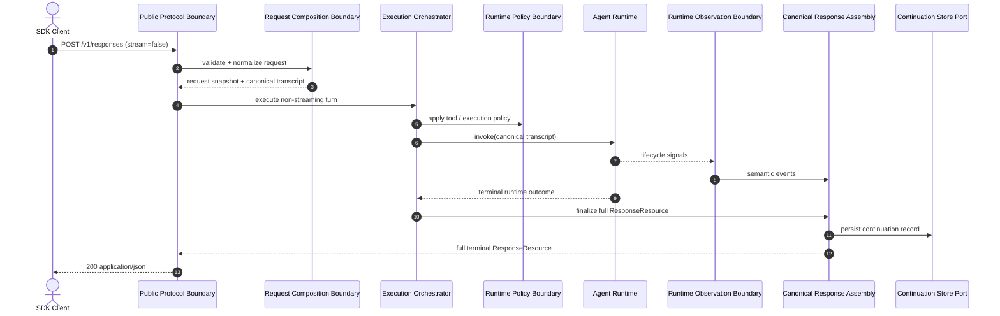
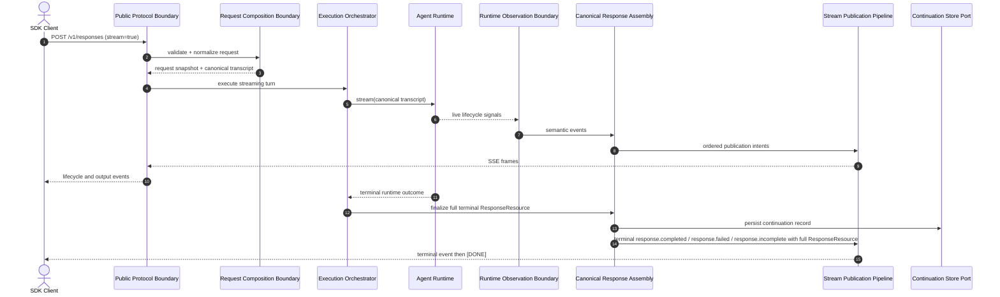
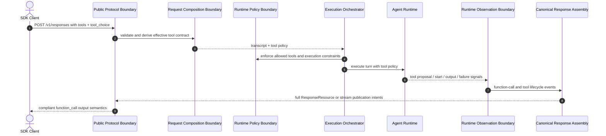
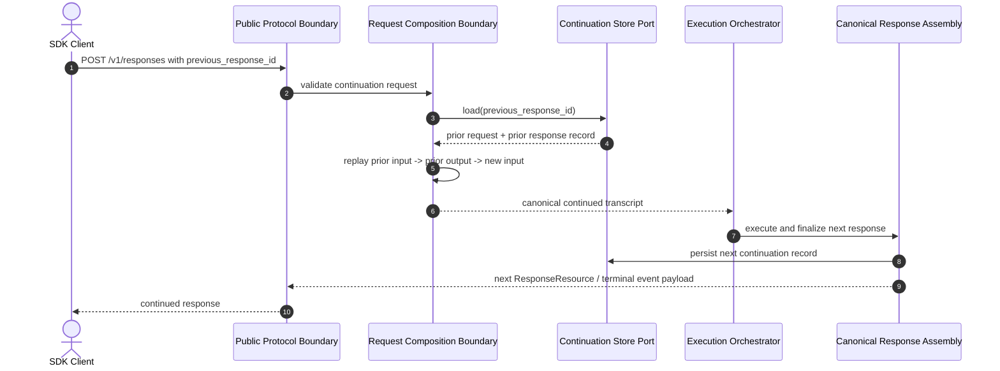
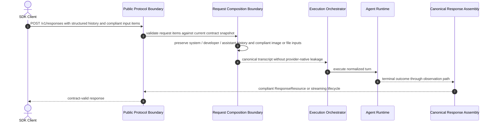
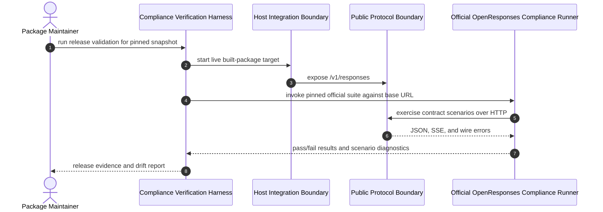

# Solution Architecture

## 0. Version History & Changelog
- v2.0.2 - Restored fuller brownfield architecture rules, added an explicit compliance-validation flow, and expanded cross-cutting failure and media-boundary detail.
- v2.0.1 - Restored bounded-context, request-model, and rejected-pattern detail while preserving the full-compliance direction.
- v2.0.0 - Revised the architecture from a spec-minimal MVP target to a full current OpenResponses compliance target.
- ... [Older history truncated, refer to git logs]

## 1. Architectural Strategy & Archetype Alignment
- **Architectural Pattern:** Contract-authoritative modular monolith library with event-serialized streaming and builder-controlled continuation persistence.
- **Why this pattern fits the PRD:** The product remains a library package adopted inside an existing agent host, so a modular monolith keeps solo-dev operations small while still allowing one authoritative response assembly pipeline to own the full current OpenResponses contract. Full compliance increases contract and state complexity, but it does not justify distributed deployment boundaries.
- **Core trade-offs accepted:** More internal state assembly and contract validation complexity is accepted to eliminate partial public resources, terminal streaming stubs, and drift against the official OpenResponses surface.

### Standards Posture
- The current published OpenResponses contract snapshot and the official OpenResponses compliance runner are governing external constraints.
- The architecture remains vendor-agnostic at the logical layer even though the current brownfield target is an existing LangChain-oriented agent runtime family.
- Public contract fidelity takes precedence over internal convenience or preserving earlier MVP shortcuts.

### Brownfield Starting Point
- The current codebase already contains the core logical pieces required for this architecture: public route publication, request normalization, callback observation, canonical response state, tool policy mediation, and continuation persistence.
- The current codebase does not yet realize the full current contract because non-streaming resources are partial, terminal streaming events carry minimal response stubs, and local compliance checks are narrower than the official runner.

### Brownfield Rules Carried Forward
- The agent runtime remains the execution engine, not the public protocol authority. The package is responsible for request normalization, public contract assembly, and truth-preserving publication.
- Runtime policy and runtime observation remain separate logical concerns. Tool enforcement and retries belong in the control plane; semantic events belong in the observation plane.
- One publication pipeline remains the single writer for JSON and SSE truth. No callback path or policy hook may write directly to the public transport.
- Continuation remains an explicit builder-controlled persistence boundary keyed by response ID, not hidden runtime memory or implicit session state.
- Image-bearing and file-bearing inputs stay bounded to the current OpenResponses contract. Full compliance broadens contract coverage, but it does not turn the package into a general multimodal platform.

## 2. System Containers
### Host Integration Boundary
- **Logical Type:** Library boundary
- **Responsibility:** Expose the package's app factory, handler factory, adapter factory, middleware surface, and persistence port to the builder without forcing a standalone platform deployment model.
- **Inputs:** Builder configuration, runtime instance, request context, persistence implementation
- **Outputs:** Mounted HTTP route surface and execution hooks
- **Depends on:** Public Protocol Boundary, Execution Orchestrator

### Public Protocol Boundary
- **Logical Type:** API boundary
- **Responsibility:** Own `/v1/responses`, request validation, content negotiation, public error mapping, and contract-level validation of emitted response resources and streaming events.
- **Inputs:** HTTP requests, host-provided request context, canonical response resources, publication events
- **Outputs:** `application/json` responses, `text/event-stream` responses, contract-visible errors
- **Depends on:** Request Composition Boundary, Canonical Response Assembly, Stream Publication Pipeline

### Request Composition Boundary
- **Logical Type:** Translation boundary
- **Responsibility:** Normalize request input, preserve current request-contract fields, resolve continuation replay, and derive the effective tool contract from the incoming request.
- **Inputs:** Validated request object, prior continuation record
- **Outputs:** Canonical transcript, request snapshot, effective tool policy
- **Depends on:** Continuation Store Port

### Execution Orchestrator
- **Logical Type:** Application service
- **Responsibility:** Coordinate non-streaming and streaming execution, attach runtime policy and observation hooks, apply timeout budgets, and reconcile runtime completion into the canonical response assembly.
- **Inputs:** Canonical transcript, request snapshot, tool policy, host execution context
- **Outputs:** Runtime invocations, semantic event flow, terminal execution outcome
- **Depends on:** Runtime Policy Boundary, Runtime Observation Boundary, Canonical Response Assembly

### Runtime Policy Boundary
- **Logical Type:** Control boundary
- **Responsibility:** Enforce tool visibility, tool choice, allowed-tool restrictions, and execution serialization requirements without owning public protocol emission.
- **Inputs:** Effective tool policy, execution metadata
- **Outputs:** Runtime control decisions and fail-closed rejections
- **Depends on:** None

### Runtime Observation Boundary
- **Logical Type:** Observation boundary
- **Responsibility:** Translate live runtime lifecycle signals into semantic events without writing directly to public transports.
- **Inputs:** Runtime callbacks, stream progression, tool lifecycle signals, runtime failures
- **Outputs:** Semantic events for text, function calls, refusals, reasoning, and lifecycle transitions
- **Depends on:** None

### Canonical Response Assembly
- **Logical Type:** State boundary
- **Responsibility:** Maintain the authoritative current `ResponseResource`, output item/content state machines, request-echo fields, usage and operational fields, and terminal lifecycle truth for JSON responses, terminal stream events, and persistence.
- **Inputs:** Request snapshot, semantic events, runtime outcomes
- **Outputs:** Authoritative `ResponseResource`, continuation record candidates, publication intents
- **Depends on:** None

### Stream Publication Pipeline
- **Logical Type:** Streaming transport boundary
- **Responsibility:** Serialize semantic and canonical state changes into ordered OpenResponses streaming events, embed full terminal `ResponseResource` payloads where required, and emit terminal `[DONE]` semantics.
- **Inputs:** Publication intents, canonical response assembly state
- **Outputs:** Ordered SSE frames
- **Depends on:** Canonical Response Assembly

### Continuation Store Port
- **Logical Type:** Storage boundary
- **Responsibility:** Load and save continuation records keyed by response ID using a builder-controlled persistence implementation.
- **Inputs:** Response IDs and full continuation records
- **Outputs:** Stored or loaded continuation records
- **Depends on:** None

### Compliance Verification Harness
- **Logical Type:** Test boundary
- **Responsibility:** Validate the built package against the official OpenResponses compliance runner, package-local regressions, and certified-runtime smoke scenarios.
- **Inputs:** Built package artifacts, live server target, contract snapshot version
- **Outputs:** Release-gating pass/fail evidence and drift diagnostics
- **Depends on:** Public Protocol Boundary

## 3. Container Diagram (Mermaid)

```mermaid
C4Container
title OpenResponses Adapter - Full Compliance Container Diagram

Person(builder, "Solo Builder", "Integrates the package into an existing agent host")
Person(client, "SDK Client", "Calls the Open Responses Surface")
Person(maintainer, "Package Maintainer", "Maintains the package and validates contract fidelity")

System_Boundary(system, "OpenResponses Adapter Package") {
    Container(host, "Host Integration Boundary", "Library boundary", "Exposes app, handler, adapter, middleware, and persistence integration points")
    Container(protocol, "Public Protocol Boundary", "API boundary", "Owns /v1/responses, validation, negotiation, and public error mapping")
    Container(compose, "Request Composition Boundary", "Translation boundary", "Normalizes input, resolves continuation, derives tool contract")
    Container(orchestrator, "Execution Orchestrator", "Application service", "Coordinates invoke/stream execution and timeout budgets")
    Container(policy, "Runtime Policy Boundary", "Control boundary", "Enforces tool contract and execution constraints")
    Container(observe, "Runtime Observation Boundary", "Observation boundary", "Translates live runtime signals into semantic events")
    Container(state, "Canonical Response Assembly", "State boundary", "Maintains full ResponseResource and output state")
    Container(streaming, "Stream Publication Pipeline", "Streaming boundary", "Serializes ordered streaming events and terminal full responses")
    Container(store, "Continuation Store Port", "Storage boundary", "Loads and saves response-ID continuation records")
    Container(compliance, "Compliance Verification Harness", "Test boundary", "Runs official compliance and runtime smoke validation")
}

System_Ext(runtime, "Agent Runtime", "Existing runtime that executes model turns and tool calls")
System_Ext(persistence, "Builder Persistence Implementation", "Builder-controlled continuation storage")
System_Ext(runner, "Official OpenResponses Compliance Runner", "External black-box validator")

Rel(builder, host, "Configures and mounts")
Rel(client, protocol, "Calls /v1/responses")
Rel(host, protocol, "Creates and exposes")
Rel(protocol, compose, "Validates and normalizes requests")
Rel(compose, store, "Loads prior response records")
Rel(compose, orchestrator, "Provides canonical transcript and request snapshot")
Rel(orchestrator, policy, "Applies tool and execution policy")
Rel(orchestrator, runtime, "invoke / stream")
Rel(runtime, observe, "Emits lifecycle signals")
Rel(observe, state, "Publishes semantic events")
Rel(orchestrator, state, "Publishes terminal outcomes")
Rel(state, streaming, "Publishes ordered stream intents")
Rel(protocol, state, "Reads terminal JSON response")
Rel(streaming, protocol, "Emits SSE frames")
Rel(state, store, "Persists continuation records")
Rel(store, persistence, "Delegates storage implementation")
Rel(maintainer, compliance, "Runs release validation")
Rel(runner, compliance, "Supplies official test logic")
Rel(compliance, protocol, "Validates built package over HTTP")
```

## 4. Critical Execution Flows
### 4.1 Non-Streaming Full Response
- **Maps to PRD capability:** ORC-001, ORC-007

### 4.2 Streaming Response with Full Terminal Resource
- **Maps to PRD capability:** ORC-002, ORC-003

### 4.3 Tool-Calling Turn
- **Maps to PRD capability:** ORC-005

### 4.4 Continuation Turn by Response ID
- **Maps to PRD capability:** ORC-004

### 4.5 Current Input Coverage Turn
- **Maps to PRD capability:** ORC-006

### 4.6 Compliance Release Validation
- **Maps to PRD capability:** ORC-008, ORC-009

## 5. Resilience & Cross-Cutting Concerns
- **Security / Identity Strategy:** Authentication is enforced by the host before the package route executes. The package may propagate opaque request context internally, but it does not own identity semantics and must never serialize hidden auth state into the public protocol.
- **Failure Handling Strategy:** Pre-stream validation, continuation, and runtime failures return contract-valid JSON errors. Post-stream failures emit contract-valid terminal failure events when the transport still permits them. The architecture requires single-writer stream publication, bounded timeouts at runtime and persistence boundaries, and fail-closed policy behavior for disallowed tool execution.
- **Observability Strategy:** Emit structured logs and metrics keyed by request ID, response ID, and contract snapshot version. Capture official compliance-runner results as release artifacts. Distinguish contract validation failures from runtime failures.
- **Configuration Strategy:** Builder configuration controls runtime integration, continuation persistence, timeout budgets, and request-context propagation. Contract snapshot version and compliance-runner target are build and release settings, not ad hoc runtime guesses.
- **Data Integrity / Consistency Notes:** The same canonical `ResponseResource` must drive non-streaming JSON responses, terminal streaming events, and persisted continuation records. `previous_response_id` replay order is fixed. Duplicate terminal item and response states are prohibited by the canonical response assembly.

### 5.1 Failure-Class Inventory and Streaming Truthfulness
- **Pre-stream request or continuation failures:** Validation, unknown `previous_response_id`, and unusable stored-record failures terminate before transport start and return one contract-valid JSON error response.
- **Pre-stream execution or persistence failures:** Runtime bootstrap, tool-policy setup, and persistence failures before any SSE bytes are published terminate as JSON errors and must not partially open a stream.
- **Post-stream execution failures:** Once SSE has started, runtime or tool failure must collapse to one terminal failure publication path with no contradictory terminal status.
- **Post-stream publication failures:** The architecture attempts best-effort failure publication only while the transport still permits it; otherwise it closes cleanly rather than fabricating recovery semantics.
- **Single-writer discipline:** Callback handlers, runtime-policy hooks, and persistence boundaries must never write directly to the public transport or own `sequence_number` progression.
- **Truthfulness rule:** Live deltas come only from live observations. When the runtime exposes coarser signals, the architecture prefers coarser truthful publication or terminal summary publication over synthetic fine-grained events.
- **Observability signal boundary:** Structured logs, metrics, and optional extension diagnostics are permitted, but they must remain separate from the normative OpenResponses surface unless explicitly namespaced and ignorable by clients.

### 5.2 Bounded Contexts and Responsibility Boundaries
#### A. Protocol Publication Context
- **Includes:** Host Integration Boundary, Public Protocol Boundary, Stream Publication Pipeline
- **Must own:** `/v1/responses`, request parsing and validation, JSON vs SSE branching, public error mapping, sequence numbering, SSE framing, terminal `[DONE]` emission, and public contract validation
- **Must not own:** Runtime steering, hidden runtime memory policy, provider-specific behavior, or tool-policy decision logic beyond publication of already-derived semantics

#### B. Semantic Derivation Context
- **Includes:** Runtime Observation Boundary and the semantic subdomain inside Canonical Response Assembly
- **Must own:** Live semantic event derivation, item and content-part lifecycle truth, refusal/reasoning lifecycle interpretation, and prevention of duplicate terminal publication
- **Must not own:** Direct transport writes, HTTP orchestration, or builder-specific persistence concerns

#### C. Execution Control Context
- **Includes:** Execution Orchestrator and Runtime Policy Boundary
- **Must own:** Runtime invocation, timeout budgets, tool visibility and enforcement, request-scoped execution metadata, and coordination of invoke versus stream paths
- **Must not own:** Public SSE framing, final response serialization authority, or continuation persistence semantics

#### D. Continuation Persistence Context
- **Includes:** Continuation Store Port
- **Must own:** Response-ID keyed loading and saving of full continuation records under a builder-controlled trust boundary
- **Must not own:** Implicit transcript policy hidden inside the runtime, public response serialization, or live event publication

### 5.3 Request and Response Model
#### Request Path
1. Receive the OpenResponses request.
2. Validate shape against the pinned current contract snapshot.
3. Normalize input items into canonical internal transcript form.
4. If `previous_response_id` exists, load prior request and prior response material through the continuation store and replay them in the required semantic order before appending new input.
5. Derive the effective tool contract and execution metadata once.
6. Execute through the runtime policy and runtime observation boundaries.
7. Maintain one canonical `ResponseResource` aggregate.
8. Publish either JSON or SSE from that same aggregate.
9. Persist the full continuation record for future response-ID replay.

#### Canonical Internal Representations
- **Conversation-like content:** Canonical transcript items remain the primary execution-facing representation because the existing runtime ecosystem is message-oriented.
- **Non-message protocol semantics:** Request-echo fields, usage fields, contract-operational fields, and publication state are kept alongside transcript content in the canonical response assembly rather than forced into message bodies.
- **Response resource:** Maintained independently from raw runtime output so the public contract can be complete even when the runtime is sparse.
- **Streaming events:** Derived from live semantic observations and the canonical aggregate together, never from direct callback-to-socket writes.

#### Logical Data Stores
- **Continuation storage category:** Document or key-value persistence remains the logical fit because the primary access pattern is response-resource centric.
- **Recommended stored fields:** response ID, contract snapshot version, normalized request snapshot, full terminal response resource, lifecycle status, timestamps, and terminal error payload when present.
- **Why this still matters:** Full compliance increases the size of the persisted record, but it does not fundamentally change the response-resource-oriented access pattern.

### 5.4 Brownfield Capability Boundary Notes
- **Current contract input-media boundary:** The package must preserve the current contract's image-bearing and file-bearing input forms through validation, normalization, continuation replay, and execution. This is a bounded contract requirement, not a promise of broad multimodal output support.
- **Continuation boundary continuity:** `previous_response_id` remains explicit response-oriented replay, not thread-oriented hidden memory. The architecture still requires stored prior request material plus stored prior response output before new input is appended.
- **Compliance proof boundary:** Package-local regressions remain valuable engineering controls, but they are now supporting signals beneath the official black-box release proof rather than the release proof itself.
- **Preserved MVP architectural assets:** The earlier callback bridge, item accumulator, response lifecycle manager, async event queue, Hono boundary, and smoke examples remain valid assets; the target-state work broadens contract authority and publication correctness rather than replacing those assets wholesale.

### 5.5 Architecture Decisions Explicitly Rejected
- **Rejected: Microservices**
  - The package remains library-shaped and optimized for a solo builder; distributed deployment would add operational burden without solving the contract problem.
- **Rejected: Middleware as the Public Protocol Layer**
  - Middleware remains execution control, not the authoritative publication boundary for the OpenResponses contract.
- **Rejected: Direct Callback-to-Socket Streaming**
  - This would break deterministic ordering and make full terminal response assembly brittle under concurrency and failure.
- **Rejected: Hidden Continuation in Runtime Memory Alone**
  - The public contract requires explicit response-ID replay semantics and builder-controlled persistence boundaries.
- **Rejected: Local-Only Compliance Proof**
  - Package-local regressions are useful, but the architecture no longer treats them as sufficient release evidence.

## 6. Logical Risks & Technical Debt
- **Risk:** Upstream OpenResponses contract churn outpaces local documentation and tests.
- **Why it matters:** A package can appear stable locally while drifting out of black-box compliance.
- **Mitigation or follow-up:** Pin a contract snapshot, run the official compliance runner in CI, and treat upstream snapshot changes as explicit review triggers.

- **Risk:** Some current published event families may have weaker runtime observability than plain text deltas.
- **Why it matters:** Refusal and reasoning-related events can tempt synthetic publication or silent omission.
- **Mitigation or follow-up:** Keep the runtime observation boundary live and truthful, but broaden canonical response assembly so contract-complete terminal resources remain possible without faking live execution.

- **Risk:** Required public fields with weak runtime semantics become a source of dishonest defaults.
- **Why it matters:** Full compliance can be undermined if required fields are filled in inconsistently or semantically misleading ways.
- **Mitigation or follow-up:** Define an explicit preserve, derive, or default field policy in the technical specification and test it at the public boundary.

- **Risk:** Tool policy enforcement remains split between request normalization and runtime control.
- **Why it matters:** Public request semantics and runtime behavior can drift if they are not derived from one authoritative policy.
- **Mitigation or follow-up:** Keep one logical tool contract source in request composition and enforce only through the runtime policy boundary.

- **Risk:** Brownfield local compliance checks remain narrower than the target contract.
- **Why it matters:** Maintainers may keep fixing regressions against an obsolete local proxy instead of the governing external suite.
- **Mitigation or follow-up:** Reframe local compliance tests as regression support only and make the official runner the release gate.

- **Risk:** Continuation persistence becomes a practical single point of failure for multi-turn compatibility.
- **Why it matters:** Response-ID replay cannot silently degrade to partial context without breaking the public contract.
- **Mitigation or follow-up:** Use bounded timeouts, fail-closed continuation errors, and explicit record-shape validation or read-repair before transcript reconstruction.

- **Risk:** Engineers may be tempted to replay finished answers as synthetic live deltas to fill observability gaps.
- **Why it matters:** That breaks the architecture's truthfulness rule and undermines trust in the OpenResponses surface even if some shallow tests still pass.
- **Mitigation or follow-up:** Keep the single-writer publication path tied to live semantic observations and allow only coarser truthful publication modes, never fabricated fine-grained deltas.
