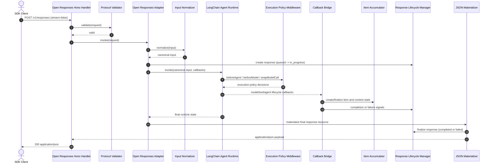
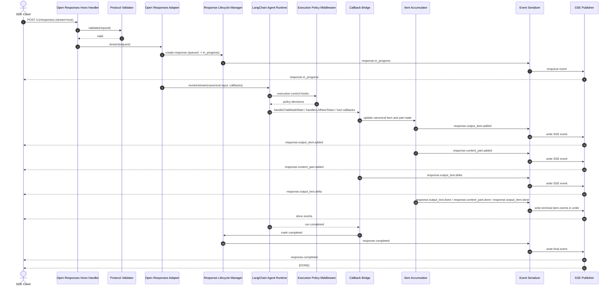
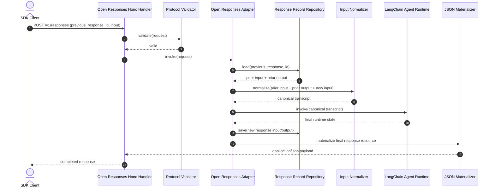

# Architecture.md

> **Derived from:** [PRD.md](./PRD.md)

## 1. Architectural Strategy

### The Pattern

**Modular Monolith with Event-Serialized Streaming and Builder-Controlled Continuation Persistence**

### Justification

This system should be implemented as a **modular monolith**, not as microservices. The package is an adapter that exposes a **spec-minimal / acceptance-suite-targeted MVP** Open Responses surface over an existing LangChain agent runtime. The runtime already exists; the package's job is to normalize requests, derive semantic events, maintain canonical response state, and publish a compliant wire protocol. This implementation follows the normative Open Responses specification, not full reference parity. Splitting those responsibilities into separate deployables would impose the microservices premium without solving a real scaling constraint for the primary actor, who is a solo builder.

LangChain documents `createAgent()` as a **production-ready** agent implementation. It also draws a clean distinction between **middleware** for execution control and **callbacks** for lifecycle observation. That separation maps directly onto the Open Responses problem: middleware remains the control plane, callbacks become the semantic observation plane, and the adapter-owned protocol layer guarantees the public contract.[^lc-agents][^lc-callbacks]

Open Responses imposes strict external semantics: a `POST /v1/responses` route, structured JSON for non-streaming, `text/event-stream` for streaming, semantic events such as `response.in_progress`, `response.output_item.added`, `response.output_text.delta`, and a terminal `[DONE]`. Those guarantees can only be made truthfully by a **single authoritative serializer** that owns ordering, framing, response lifecycle state, and final materialization.[^or-reference]

Per Eric Evans, the design must preserve bounded contexts so protocol concerns do not leak into execution control and runtime observations do not become transport logic.[^evans-ddd] Per Michael Nygard, the architecture must assume partial failure and isolate failures at external boundaries rather than allowing callback, storage, or tool faults to corrupt the public stream.[^nygard-release-it]

### Architectural Decision Record

1. **Use a modular monolith** because the package is library-shaped and optimized for one deployable integration surface.
1. **Treat LangChain as the execution engine**, not as the protocol implementation.[^lc-agents]
1. **Treat middleware as policy only**, never as the canonical source of Open Responses events.[^lc-middleware-custom]
1. **Treat callbacks as a semantic bridge** because they expose a rich lifecycle boundary with correlated run IDs. For actual streaming, we use the agent's `stream()` method; callbacks provide the observation layer for lifecycle events during execution.[^lc-callbacks]
> **Note:** This is an architectural design decision based on LangChain's callback/lifecycle separation, not an explicit LangChain mandate. Middleware could theoretically serve this purpose, but callbacks provide richer lifecycle events for our semantic derivation needs.
1. **Treat the serializer as the single writer** to JSON or SSE output so event order, status transitions, and terminal behavior remain deterministic.[^or-spec]
1. **Treat continuation persistence as a required boundary** because `previous_response_id` requires replay of prior input and output before new input is appended.[^or-spec]
1. **Support only the minimum image-input behavior required for compliance in MVP**, without broad multimodal commitments.[^or-compliance]

## 2. System Containers (C4 Level 2)

**Open Responses Hono Handler**: HTTP Transport Container - Exposes `POST /v1/responses`, validates protocol requests, negotiates JSON vs SSE, and delegates execution to the adapter.

**Open Responses Adapter**: Application Service Container - Orchestrates request normalization, continuation rehydration, invocation wiring, and response materialization.

**Protocol Validator**: Validation Container - Validates request shape, rejects malformed inputs predictably, and enforces protocol-level invariants before execution begins.

**Input Normalizer**: Translation Container - Converts Open Responses `input` into canonical internal structures built primarily on LangChain messages, with explicit handling for text-first items and minimum image-input pass-through required for compliance.

**Continuation Repository Port**: Persistence Port Container - Abstract interface for loading and saving prior response input/output data by response ID.

**Response Record Repository**: Persistence Container - Builder-supplied implementation of the continuation port. Recommended logical category: document store or key-value store because the persistence shape is response-resource oriented rather than relationally transactional.

**LangChain Agent Runtime**: Execution Container - Existing `createAgent()` runtime that performs model turns, tool execution, and agent loop control.[^lc-agents]

**Execution Policy Middleware**: Control Container - LangChain middleware used for prompt shaping, request metadata propagation, tool policy enforcement, retries, and other execution-control rules.[^lc-middleware-custom]

**Callback Bridge**: Observation Container - Implements LangChain callback methods and converts runtime events into internal semantic events such as run started, item started, text delta, function-call arguments delta, tool started, tool completed, and run failed.[^lc-callbacks]

**Item Accumulator**: State Container - Owns canonical item IDs, output indexes, content indexes, delta buffering, part finalization, item finalization, and prevention of illegal duplicate terminal events.

**Response Lifecycle Manager**: State Container - Owns response ID, timestamps, top-level status transitions, error state, metadata, and final response resource assembly.

**Event Serializer**: Serialization Container - Converts internal semantic events plus canonical state into Open Responses event objects with monotonic sequence numbers.

**SSE Publisher**: Streaming Transport Container - Frames serialized events as SSE with `event` equal to the JSON payload `type`, and emits terminal `[DONE]`.[^or-spec]

**JSON Materializer**: Non-Streaming Transport Container - Produces final `application/json` response resources for non-streaming requests.[^or-spec]

**Tool Mapping Adapter**: Translation Container - Maps Open Responses `tools`, `tool_choice`, and `parallel_tool_calls` request semantics into LangChain-compatible runtime configuration and passes enforceable policy constraints into middleware.[^or-reference]

**Observability Pipeline**: Cross-Cutting Container - Collects structured logs, metrics, correlation IDs, and trace events without mutating the public protocol surface.

**Compliance Harness**: Test Container - Runs deterministic tests and the Open Responses acceptance suite against the exposed route shape.[^or-compliance]

## 3. Container Diagram (C4 Level 2)

```mermaid
C4Container
    title OpenResponses Adapter for LangChain Agents — C4 Level 2

    Person(builder, "Solo Builder", "Configures and exposes an existing LangChain agent")
    Person(client, "SDK Client", "Calls the Open Responses API surface")

    System_Boundary(system, "OpenResponses Adapter Package") {
        Container(handler, "Open Responses Hono Handler", "HTTP Transport", "Owns POST /v1/responses, request parsing, JSON vs SSE negotiation")
        Container(validator, "Protocol Validator", "Validation", "Validates request shape and protocol invariants")
        Container(adapter, "Open Responses Adapter", "Application Service", "Normalizes input, rehydrates continuation, orchestrates execution, materializes response")
        Container(normalizer, "Input Normalizer", "Translation", "Maps Open Responses input into canonical internal structures")
        Container(toolmap, "Tool Mapping Adapter", "Translation", "Maps tool semantics into LangChain-compatible runtime config")
        Container(callbacks, "Callback Bridge", "Observation", "Converts runtime callbacks into internal semantic events")
        Container(accumulator, "Item Accumulator", "State", "Maintains canonical item/content state machines")
        Container(lifecycle, "Response Lifecycle Manager", "State", "Maintains response IDs, timestamps, and status transitions")
        Container(serializer, "Event Serializer", "Serialization", "Serializes canonical events into Open Responses event objects")
        Container(sse, "SSE Publisher", "Streaming Transport", "Frames serialized events as SSE and writes terminal [DONE]")
        Container(json, "JSON Materializer", "Non-Streaming Transport", "Builds final application/json response resource")
        Container(obs, "Observability Pipeline", "Cross-Cutting", "Structured logs, metrics, correlation IDs")
    }

    System_Ext(agent, "LangChain Agent Runtime", "Existing createAgent() runtime")
    System_Ext(middleware, "Execution Policy Middleware", "LangChain middleware enforcing execution control")
    System_Ext(repo, "Response Record Repository", "Builder-controlled continuation persistence")
    System_Ext(compliance, "Compliance Harness", "Acceptance suite and deterministic tests")

    Rel(builder, handler, "Configures and mounts", "TypeScript")
    Rel(client, handler, "POST /v1/responses", "HTTPS/JSON or HTTPS/SSE")
    Rel(handler, validator, "Validates request", "In-process call")
    Rel(handler, adapter, "Delegates execution", "In-process call")
    Rel(adapter, normalizer, "Normalizes input", "In-process call")
    Rel(adapter, toolmap, "Maps tool config", "In-process call")
    Rel(adapter, repo, "Load/save prior input/output", "Repository API")
    Rel(adapter, agent, "invoke/stream", "In-process call")
    Rel(agent, middleware, "Execution control hooks", "LangChain middleware API")
    Rel(agent, callbacks, "Lifecycle callbacks", "LangChain callback API")
    Rel(callbacks, accumulator, "Semantic event updates", "In-process event")
    Rel(callbacks, lifecycle, "Run/error notifications", "In-process event")
    Rel(accumulator, serializer, "Canonical item/part events", "In-process event")
    Rel(lifecycle, serializer, "Lifecycle state transitions", "In-process event")
    Rel(serializer, sse, "Serialized stream events", "Async queue")
    Rel(serializer, json, "Final response resource", "In-process call")
    Rel(handler, sse, "Writes streaming response", "text/event-stream")
    Rel(handler, json, "Writes non-streaming response", "application/json")
    Rel(handler, obs, "Emit logs/metrics", "In-process call")
    Rel(adapter, obs, "Emit logs/metrics", "In-process call")
    Rel(compliance, handler, "Validates surface", "HTTP test traffic")
```

## 4. Critical Execution Flows (Sequence Diagrams)

### Flow 1 — Non-Streaming Text Response

### Flow 2 — Streaming Text Response with Live Semantic Deltas

### Flow 3 — Continuation with `previous_response_id`

## 5. Bounded Contexts and Responsibility Boundaries

### A. Protocol Publication Context

Owns the external Open Responses contract.

**Includes:**

- Open Responses Hono Handler
- Protocol Validator
- Event Serializer
- SSE Publisher
- JSON Materializer

**Must own:**

- `POST /v1/responses`
- request parsing and validation
- JSON vs SSE branching
- sequence numbering
- SSE framing
- `event === type`
- terminal `[DONE]`
- canonical final response materialization

**Must not own:**

- agent behavior policy
- LangChain execution decisions
- callback interpretation logic beyond serialization

### B. Semantic Derivation Context

Owns translation from runtime lifecycle to protocol semantics.

**Includes:**

- Callback Bridge
- Item Accumulator
- Response Lifecycle Manager

**Must own:**

- semantic event derivation
- item and content-part state machines
- mapping tokens to text deltas
- mapping tool-call progress to function-call argument deltas
- prevention of duplicate finalizers
- canonical lifecycle truth before serialization

**Must not own:**

- HTTP transport details
- Hono stream writes
- public response framing
- tool policy enforcement

### C. Execution Control Context

Owns runtime steering and policy.

**Includes:**

- LangChain Agent Runtime
- Execution Policy Middleware
- Tool Mapping Adapter

**Must own:**

- model/tool routing decisions
- prompt shaping
- tool visibility and allowed-tool enforcement
- retries and fallbacks at execution boundaries
- request-scoped execution metadata

**Must not own:**

- SSE event emission
- response lifecycle authority
- response serialization

### D. Continuation Persistence Context

Owns prior-response storage and replay boundary.

**Includes:**

- Continuation Repository Port
- Response Record Repository

**Must own:**

- loading prior response input/output by response ID
- persisting current response input/output for future continuation
- explicit builder-controlled trust boundary

**Must not own:**

- transcript policy hidden inside agent memory
- protocol serialization
- item lifecycle semantics

## 6. Request and Response Model

### Request Path

1. Receive Open Responses request.
1. Validate shape and required protocol fields.
1. Normalize `input` into canonical internal form.
1. If `previous_response_id` exists, load prior input/output through the continuation repository and concatenate in required semantic order.[^or-spec]
1. Map tool configuration into runtime-compatible policy structures.
1. Create response lifecycle state.
1. Invoke LangChain agent with middleware and callback bridge attached.
1. Consume semantic events through accumulator and lifecycle manager.
1. Serialize to JSON or SSE.
1. Persist final input/output for future continuation.

### Canonical Internal Representations

- **Conversation-like content:** LangChain messages remain the primary canonical representation because LangChain describes messages as the fundamental unit of model context.[^lc-messages]
- **Non-message protocol semantics:** maintained as internal metadata alongside messages rather than forced into message bodies.
- **Response resource:** maintained independently from agent state.
- **Item and content-part states:** maintained independently from raw callbacks.

### Logical Data Stores

**Continuation storage category:** Document store or key-value store.

**Why not relational by default:** The data access pattern is response-resource centric: load one response by ID, read its stored input and output, append a new response record, and optionally expire development-only records. This is document-shaped, not join-heavy.

**Recommended stored fields:**

- response ID
- created/completed timestamps
- normalized request input
- canonical response output
- status
- error payload if terminal failure occurred
- model identifier
- optional metadata

## 7. Resilience and Cross-Cutting Concerns

### Authentication Strategy

Authentication is not the package’s domain model, but the handler must preserve a clean boundary for host applications to enforce it. The recommended architecture is:

- host application authenticates the incoming request before the route handler executes
- authenticated principal and request metadata are injected into request context
- adapter and observability layers propagate correlation and principal metadata as opaque context only
- no authentication internals are serialized into public Open Responses output unless explicitly configured

### Failure Handling Strategy

Per Nygard, failures must be isolated at boundaries.[^nygard-release-it]

**Required logical protections:**

- **Timeouts** at external boundaries: model call, persistence repository call, and any outbound tool invocation.
- **Retries with bounded backoff** only for idempotent repository operations and explicitly safe tool/network calls.
- **Circuit breakers** around builder-supplied persistence and unstable external tool providers to prevent cascading failures.
- **Bulkheads** between request execution and observability so logging failure does not corrupt response delivery.
- **Single-writer stream discipline** so callback bursts cannot race direct socket writes.
- **Terminal failure mapping** so any streaming error is translated into `response.failed` before stream termination, when still possible within the transport contract.[^or-spec]

### Streaming Truthfulness Rule

The architecture must emit streaming events from **live semantic observations**, not from replayed final output. LangChain exposes streaming modes and fine-grained callbacks suitable for live observation, and the package’s semantic contract depends on those sources rather than post hoc reconstruction.[^lc-streaming]

### Observability Strategy

The package must emit:

- structured logs
- correlation IDs per request and per runtime run
- metrics for response duration, item counts, tool calls, persistence latency, and stream termination mode
- optional trace-style extension events for debugging, provided they remain implementor-prefixed and ignorable by clients

Observability data must never become part of the normative protocol stream unless intentionally emitted as prefixed extension events permitted by the specification.[^or-spec]

## 8. Minimum Image-Input Strategy

The PRD requires only the minimum image-input behavior needed to pass the compliance suite. Therefore the architecture must support **pass-through normalization of compliant image input items** into the canonical internal representation, while keeping the remainder of the package text-first.[^or-compliance]

This is a bounded concession, not a multimodal architecture. The package must:

- accept the minimum image-bearing request forms required by the compliance tests
- preserve them through normalization and continuation replay where applicable
- avoid broad commitments to image generation, multimodal output rendering, or provider-specific media workflows in MVP

## 9. Logical Risks and Technical Debt

### Risk 1 — Callback Semantics May Differ Across Providers

LangChain standardizes the callback interface, but the richness and timing of emitted events can still vary by model/provider behavior. This creates a risk that some providers produce weaker live function-call argument deltas than others.[^lc-callbacks]

**Mitigation:** Keep the semantic bridge provider-agnostic, tolerate degraded granularity where necessary, and treat missing fine-grained argument chunks as reduced fidelity inside the semantic derivation context rather than leaking provider quirks into the public protocol.

### Risk 2 — Streaming Order Corruption Under Concurrency

If callbacks or execution hooks write directly to the network stream, interleaving will eventually violate deterministic order.

**Mitigation:** One serializer, one monotonic sequence, one transport writer.

### Risk 3 — Continuation Repository Becomes a Single Point of Failure

`previous_response_id` replay depends on repository availability.

**Mitigation:** Use circuit breakers, bounded timeouts, and explicit error mapping. Do not silently degrade to partial replay. A failed continuation load must fail the request predictably rather than fabricate context.[^or-spec]

### Risk 4 — Tool Policy Split-Brain

If `tools`, `tool_choice` (including the `allowed_tools` variant), and middleware enforcement are interpreted in different modules without one source of truth, runtime behavior and public semantics will drift.

**Mitigation:** Parse and validate tool semantics in the adapter, translate once in the Tool Mapping Adapter, and enforce only through middleware.

### Risk 5 — Scope Creep into Hosted Memory or Gateway Behavior

Because continuation exists, there will be pressure to add session management, dashboards, hosted persistence, or provider-specific adapters.

**Mitigation:** Hold the boundary: this package is a protocol adapter library, not a platform.

### Risk 6 — Synthetic Delta Temptation

It is easier to emit one final text blob as a fake delta stream.

**Mitigation:** Reject that design. It violates the PRD’s live semantic fidelity requirement and weakens trust in the protocol surface.

## 10. Architecture Decisions That Are Explicitly Rejected

### Rejected: Microservices

Rejected because the system is library-shaped, used by solo builders, and does not justify distributed operational overhead.[^fowler-monolith-first]

### Rejected: Middleware as the Protocol Layer

Rejected because middleware is documented as execution control, not as the richest lifecycle or transport boundary.[^lc-middleware-custom]

### Rejected: Direct Callback-to-Socket Streaming

Rejected because it creates race conditions and breaks deterministic ordering.

### Rejected: Hidden Continuation in Agent Memory Alone

Rejected because Open Responses requires explicit replay of prior input and output, controlled through a persistence boundary, not implicit runtime memory.[^or-spec]

### Rejected: Broad Multimodal MVP

Rejected because the product value is text-first interoperability; MVP supports only the minimum image-input behavior needed for compliance.[^or-compliance]

## 13. Final Architectural Standard

The system shall be judged against this rule:

**This architecture chooses callbacks as the source of Open Responses semantic events (by design, not by vendor mandate). The serializer guarantees Open Responses compliance. Middleware controls execution but never owns the public protocol.**

-----

## Footnotes

### Normative Sources (Product/Framework)

[^lc-agents]: https://docs.langchain.com/oss/javascript/langchain/agents
[^lc-middleware-custom]: https://docs.langchain.com/oss/javascript/langchain/middleware/custom
[^lc-streaming]: https://docs.langchain.com/oss/javascript/langchain-streaming/overview
[^lc-messages]: https://docs.langchain.com/oss/javascript/langchain/messages
[^lc-callbacks]: https://reference.langchain.com/javascript/langchain-core/callbacks/base/CallbackHandlerMethods
[^lc-fake]: https://docs.langchain.com/oss/javascript/integrations/chat/fake
[^or-spec]: https://www.openresponses.org/specification
[^or-reference]: https://www.openresponses.org/reference
[^or-compliance]: https://www.openresponses.org/compliance
[^hono-streaming]: https://hono.dev/docs/helpers/streaming

### Advisory Sources (Design Literature)

[^fowler-monolith-first]: https://martinfowler.com/bliki/MonolithFirst.html
[^evans-ddd]: https://domainlanguage.com/ddd/
[^nygard-release-it]: https://pragprog.com/titles/mnee2/release-it-second-edition/

