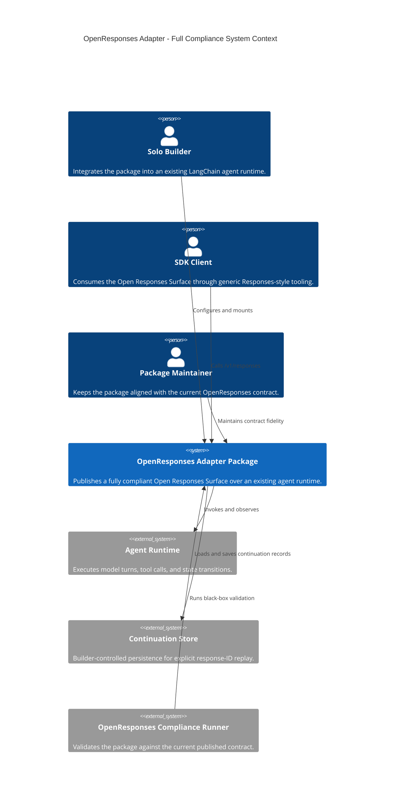
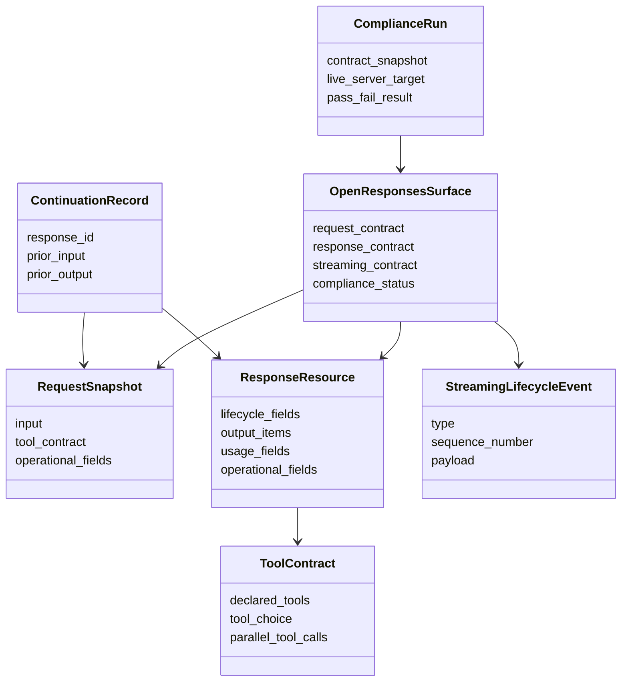

# Product Requirements Document

## 0. Version History & Changelog
- v2.0.2 - Clarified the streaming-family truthfulness boundary so downstream stages cannot silently narrow ORC-003.
- v2.0.1 - Restored brownfield continuity, product-risk framing, and release-quality detail while preserving the full-compliance direction.
- v2.0.0 - Re-scoped the adapter from a spec-minimal MVP to a full current OpenResponses compliance target.
- ... [Older history truncated, refer to git logs]

## 1. Executive Summary & Target Archetype
- **Target Archetype:** Library package that exposes a standards-compliant HTTP adapter over an existing agent runtime.
- **Vision:** A solo builder can expose an existing LangChain agent through a `/v1/responses` surface that satisfies the full current OpenResponses contract and works with Responses-style SDK clients and the official compliance runner without bespoke protocol glue.
- **Problem:** Partial-compatible adapters fail when clients and the official OpenResponses validation workflow expect a full `ResponseResource`, full terminal streaming response payloads, richer event families, and broader contract fidelity than a spec-minimal MVP provides.
- **Jobs to Be Done:** When a builder already has a working agent runtime, they want to mount a package that makes that runtime behave like a fully compliant OpenResponses endpoint, preserves truthful live execution semantics, supports tools and continuation correctly, and gives them a real black-box validation workflow before release.

### Release-Quality Thresholds
- A built package must pass the official OpenResponses CLI compliance runner against a live `/v1/responses` server on the certified runtimes.
- Non-streaming and streaming outputs must validate against the current published OpenResponses contract snapshot rather than a local subset schema.
- Local regression tests are supporting evidence only; they are not sufficient release proof by themselves.

### Product Posture
- Contract truth beats convenience.
- Full current compliance beats partial compatibility.
- Library-first adoption beats platform sprawl.
- Hosted-service scope remains explicitly excluded.

## 2. Ubiquitous Language (Glossary)
| Term | Definition | Do Not Use |
| --- | --- | --- |
| Solo Builder | The independent developer integrating the package into an existing LangChain agent runtime without a platform team. | Team, Organization, Enterprise User |
| Agent Runtime | The existing execution system that performs model turns, tool calls, and state transitions. | Engine, Backend Brain |
| Open Responses Surface | The externally exposed API contract that must match the current published OpenResponses request, response, and streaming behavior. | Wrapper API, Compatible Shim |
| Response Resource | The complete terminal response object clients depend on for non-streaming replies and terminal streaming events. | Final Payload, Response Blob |
| Streaming Lifecycle Event | A semantically meaningful event emitted during live execution, such as lifecycle progress, output item changes, refusal deltas, or reasoning updates. | Token Chunk, Raw Delta |
| Terminal Stream Event | A streaming event that carries the final response status and complete `ResponseResource`, such as `response.completed`, `response.failed`, or `response.incomplete`. | Stream Footer, Done Packet |
| Item | A canonical unit of response output, such as a message, function call, refusal, or reasoning artifact. | Message Object, Payload Entry |
| Continuation | The ability to continue from an earlier response by replaying prior request and output material under explicit response ID semantics. | Memory, Session Resume |
| Tool Contract | The request and response semantics governing `tools`, `tool_choice`, allowed-tool restrictions, and tool-call outputs. | Tool Shim, Tool Glue |
| Contract Snapshot | The pinned current OpenResponses schema and compliance-runner baseline that governs release validation. | Reference Copy, Local Guess |

## 3. Actors & Personas
### 3.1 Primary Actor
- **Role:** Solo Builder integrating an existing LangChain-based agent into a Responses-style ecosystem.
- **Context:** Already has a functioning agent loop and wants standards-compliant interoperability without rewriting the agent itself.
- **Goals:** Mount the package quickly, preserve runtime behavior, pass the official compliance workflow, and ship a trustworthy API surface.
- **Frictions:** Contract drift between local tests and official validation, complex streaming semantics, continuation replay correctness, and required response fields that do not naturally fall out of the runtime.

### 3.2 Secondary Actor — SDK Client
- **Role:** SDK Client consuming the exposed Open Responses Surface.
- **Context:** Talks to `/v1/responses` through a generic client or SDK and assumes contract fidelity rather than provider-specific behavior.
- **Goals:** Receive complete response resources, valid streaming events, predictable continuation, and tool-call semantics that match the published contract.
- **Frictions:** Breakage when the server omits required fields, emits partial terminal events, or exposes provider-native quirks instead of contract-level semantics.

### 3.3 Supporting Actor — Package Maintainer
- **Role:** Package Maintainer responsible for keeping the library aligned with the evolving OpenResponses contract.
- **Context:** Maintains a brownfield package whose current implementation already exposes the core route, callback bridge, and continuation boundary.
- **Goals:** Prevent drift against the official contract, detect upstream changes early, and keep the package maintainable for a solo developer.
- **Frictions:** Moving upstream schema targets, incomplete local validation, and the temptation to overfit to today's narrow acceptance tests instead of the current published contract.

## 4. Functional Capabilities
### Epic: Full Response Resource Fidelity
- **Priority:** P0
- **Capability ID:** ORC-001
- **Capability:** The system must return a full current OpenResponses `ResponseResource` for non-streaming requests, including currently required lifecycle, request-echo, usage, and operational fields even when some values are null, defaulted, or host-controlled.
- **Rationale:** The official compliance runner and real clients validate the full resource shape rather than a spec-minimal subset.

### Epic: Full Terminal Streaming Fidelity
- **Priority:** P0
- **Capability ID:** ORC-002
- **Capability:** The system must emit streaming terminal events that carry the complete terminal `ResponseResource`, not a minimal status stub, and must still terminate with a literal `[DONE]` where the contract permits.
- **Rationale:** Current compliance validation treats terminal streaming events as the authoritative final response surface.

### Epic: Current Streaming Event Family Coverage
- **Priority:** P0
- **Capability ID:** ORC-003
- **Capability:** The system must support the current published OpenResponses streaming event families required for compliant execution, including lifecycle, output text, function-call arguments, refusal, and reasoning-related event categories where they are part of the current contract. When the runtime exposes only coarser live truth, the system must still emit the coarsest contract-valid truthful representation rather than silently omitting a required family or inventing synthetic deltas.
- **Rationale:** Passing only today's narrow acceptance paths is insufficient if the published contract exposes additional event families that clients may rely on, and truthfulness rules must constrain how coverage is achieved.

### Epic: Continuation Fidelity by Response ID
- **Priority:** P0
- **Capability ID:** ORC-004
- **Capability:** The system must continue conversations using explicit response-ID semantics, replaying prior request input and prior response output in the required order before applying new input.
- **Rationale:** Continuation is part of the public contract and cannot be delegated to hidden runtime memory alone.

### Epic: Tool Contract Fidelity
- **Priority:** P0
- **Capability ID:** ORC-005
- **Capability:** The system must honor the current OpenResponses tool contract for declared tools, tool choice, allowed-tool restrictions, tool-call outputs, and serialization constraints such as `parallel_tool_calls`.
- **Rationale:** Tool calls are a core interoperability feature and an area where partial support quickly becomes observable client breakage.

### Epic: Current Input Coverage
- **Priority:** P0
- **Capability ID:** ORC-006
- **Capability:** The system must accept the current published request forms needed for compliant operation, including string input, structured message history, assistant and developer history where valid, compliant function-call items, image-bearing inputs, and other currently published input-item families in scope for the contract.
- **Rationale:** Full compliance requires broader input acceptance than the earlier MVP boundary.

### Epic: Library-First Adoption Surface
- **Priority:** P0
- **Capability ID:** ORC-007
- **Capability:** The Solo Builder must be able to adopt the package as an additive library over an existing LangChain agent runtime instead of migrating to a hosted platform or rewriting the runtime loop.
- **Rationale:** The product still wins only if it preserves existing runtime investment and keeps user code small.

### Epic: Official Compliance Validation Workflow
- **Priority:** P0
- **Capability ID:** ORC-008
- **Capability:** The builder must be able to validate the package against the official OpenResponses compliance runner using a live built package rather than only package-local test doubles.
- **Rationale:** Local-only validation has already proven insufficient as a release signal.

### Epic: Upstream Contract Drift Management
- **Priority:** P1
- **Capability ID:** ORC-009
- **Capability:** The maintainer must be able to track and respond to upstream OpenResponses contract changes through an explicit snapshot and review process rather than silent drift.
- **Rationale:** A moving external standard needs governance, not memory.

### Epic: Richer Contract Surface Beyond Narrow Acceptance Paths
- **Priority:** P1
- **Capability ID:** ORC-010
- **Capability:** The system should be architected so current published response item families and event families beyond the six official acceptance scenarios can be implemented without logical redesign.
- **Rationale:** The package should not pass the official suite by accident while still being structurally unable to honor the broader current contract.

## 5. Non-Functional Constraints
- **Performance:** Streaming publication must remain live and ordered under typical solo-builder production traffic. Contract completeness must not force whole-response recomputation on each token-sized update.
- **Reliability:** The built package must produce deterministic public behavior across non-streaming, streaming, continuation, and tool-calling paths on the certified runtimes. Failures before stream start must be reported predictably; failures after stream start must resolve within the contract's terminal semantics.
- **Security & Privacy:** Authentication remains host-controlled. The package must not leak hidden execution state, raw stack traces, or private request data into the public protocol. Continuation data must only cross an explicit builder-controlled persistence boundary.
- **Operability:** Maintainers must be able to pin, review, and revalidate the current OpenResponses contract snapshot. Structured logs and compliance artifacts must support debugging of black-box contract failures.
- **Domain-specific Constraints:** The package must stay library-shaped, preserve an existing LangChain agent runtime rather than replacing it, and avoid provider-native chunk formats as the public API.
- **Accessibility & Adoption:** The integration surface must remain understandable to a solo builder without requiring deep protocol archaeology. Documentation and examples must optimize for fast adoption despite the broader contract target.
- **Maintainability:** Full compliance must not dissolve the package’s core boundary between execution control, semantic derivation, and protocol publication. The product still fails if compliance is achieved only through brittle, opaque glue.
- **Interoperability:** The package must behave predictably with generic Responses-style SDK clients and the official OpenResponses validation workflow, not just with the package’s own regression harness.

### Prohibited Patterns
- Claiming compliance based only on local subset tests
- Emitting partial terminal response resources
- Replaying final answers as synthetic live deltas
- Hiding continuation inside implicit runtime memory only
- Expanding into hosted gateway or platform scope as part of contract work

### 5.1 Product Risks
- **Value Risk:** The package fails if it turns into specification theater instead of solving the builder’s adoption problem. Full compliance only matters insofar as it makes real clients and real validation workflows work against an existing runtime with minimal glue.
- **Usability Risk:** The package fails if broader contract coverage forces a confusing integration surface, excessive configuration, or a hidden matrix of “required unless you know the caveat” behaviors.
- **Feasibility Risk:** The hardest part remains truthful streaming, full terminal resource assembly, continuation fidelity, and tool semantics without leaking provider-specific assumptions or fabricating live behavior.
- **Viability Risk:** As a pure OSS utility, the package must stay narrow even while broadening the protocol contract. Hosted persistence, platform features, or framework sprawl would create maintenance cost disproportionate to ecosystem value.

### 5.2 Release Priorities & Success Criteria
- **Release Now:** Full current `/v1/responses` contract fidelity, full terminal streaming resources, current tool-contract fidelity, explicit response-ID continuation, current compliant input coverage, and official compliance-runner pass as a release gate.
- **Phase 2:** Broader runtime bindings, richer advanced integration surfaces, stronger observability and contract-drift tooling, and additional contract coverage beyond the current official acceptance scenarios.
- **Deferred:** Hosted platform behavior, non-generic provider-native capabilities, and broader multimodal ambitions outside the current published OpenResponses contract.
- **Primary Success Metric:** A built package passes the official OpenResponses compliance suite against a live server on the certified runtimes.
- **Secondary Success Signals:** A solo builder can adopt the package with minimal custom glue, existing Responses-style SDK clients interoperate without protocol-specific workarounds, and the package preserves an existing runtime rather than forcing migration.

## 6. Boundary Analysis
### In Scope
- Full current OpenResponses `/v1/responses` contract fidelity for the current published contract snapshot
- Full non-streaming `ResponseResource` shape
- Full terminal streaming response payloads
- Current published streaming event families required for compliant operation
- Tool contract fidelity, including request and output semantics
- Continuation via explicit response-ID replay semantics
- Current compliant input coverage, including image-bearing inputs and structured history
- Official compliance-runner validation against the built package
- Library-first adoption over an existing LangChain agent runtime

### Out of Scope
- Hosted persistence, hosted session management, or managed gateway product features
- A managed UI, dashboard, or SaaS platform around the adapter
- Behavioral parity with any single proprietary response provider where the OpenResponses contract leaves room for variation
- Provider-native built-in tools beyond the contract-level surface the package can expose generically
- Broader multimodal output generation outside the current published OpenResponses contract

## 7. Conceptual Diagrams (Mermaid)
### 7.1 System Context

### 7.2 Domain Model

## Appendix: Operator Preferences
- Prefer Bun workspace tooling and `bun test` over other JavaScript package-manager and test-runner combinations.
- Preserve ESM-first dual-package publishing so the library remains easy to consume from mixed JavaScript and TypeScript environments.
