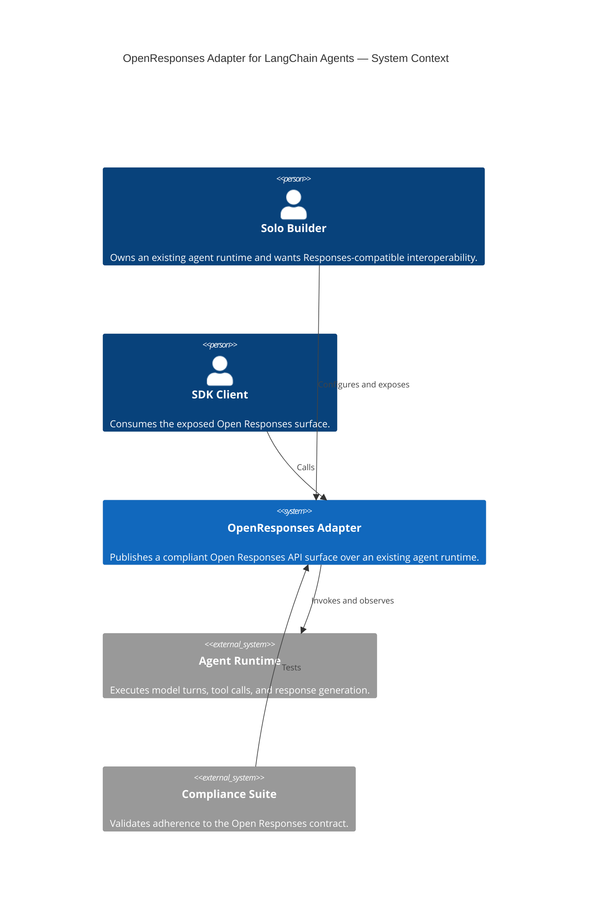
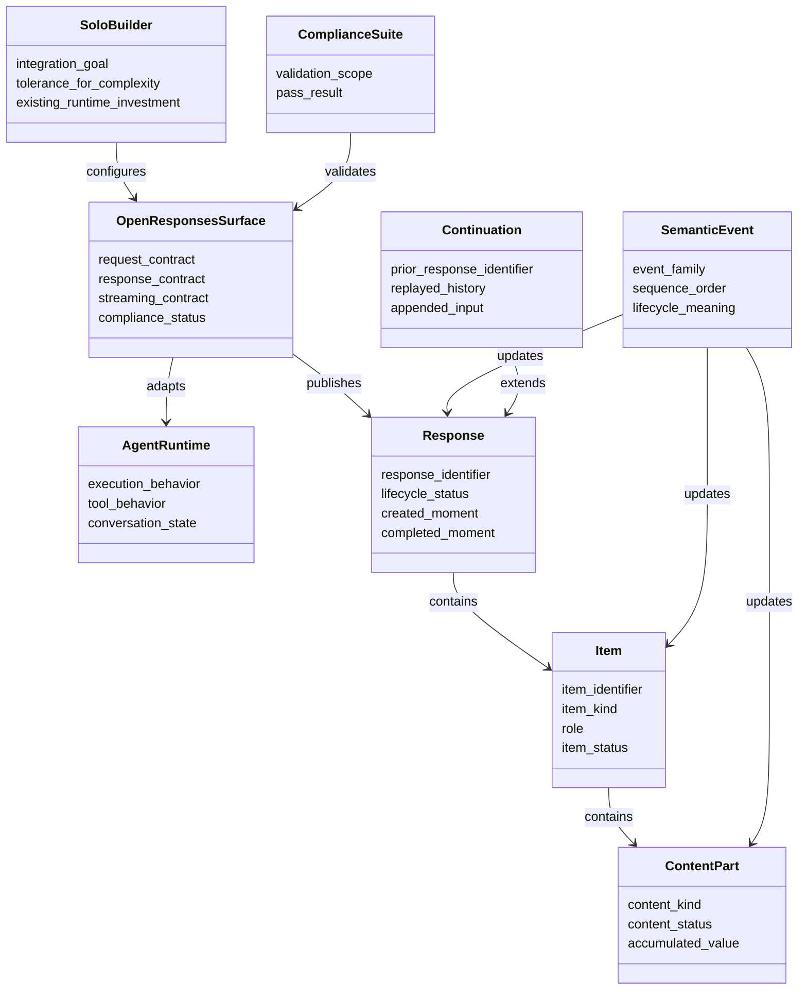

# PRD — OpenResponses Adapter for LangChain Agents

## 1. Executive Summary

### The Vision

A solo builder with an existing LangChain TypeScript agent can expose a **spec-minimal / acceptance-suite-targeted MVP** Open Responses API surface with minimal custom code, allowing existing Responses-compatible SDK clients and tooling to work against that agent without rewriting runtime behavior. This implementation targets the normative Open Responses specification, not full reference parity.

### The Problem

Solo builders who already use LangChain agents often face a costly integration gap: their agent runtime works, but client applications and SDKs increasingly expect an Open Responses spec-minimal API contract. Today, bridging that gap usually requires hand-rolled HTTP handlers, SSE framing, request normalization, event ordering, response lifecycle state, and compliance logic. That work is repetitive, error-prone, and distracts from product development.

### Jobs to Be Done

When a solo builder already has a LangChain agent, they want to make that agent an Open Responses spec-minimal / acceptance-suite-targeted MVP so they can use Responses API SDK clients without reinventing protocol glue, streaming behavior, and schema handling.

## 2. Ubiquitous Language (Glossary)

|Term                  |Definition                                                                                                                             |Do Not Use                         |
|----------------------|---------------------------------------------------------------------------------------------------------------------------------------|-----------------------------------|
|Solo Builder          |The independent developer integrating and shipping the package without a platform team.                                                |Team, Organization, Enterprise User|
|Agent Runtime         |The existing execution system that performs model turns, tool calls, and state transitions.                                            |Engine, Backend Brain              |
|Open Responses Surface|The externally exposed API contract that matches Open Responses request, response, and streaming expectations.                         |Wrapper API, Compatible Shim       |
|Protocol Contract     |The public behavior clients depend on, including route shape, JSON schema, SSE framing, ordering, and terminal semantics.              |Transport Glue, Endpoint Logic     |
|Semantic Event        |A meaningful runtime event derived from execution, such as response start, text delta, item completion, or tool-call argument progress.|Raw Chunk, Token Event             |
|Item                  |A canonical unit of output within a response lifecycle.                                                                                |Message Object, Payload Entry      |
|Content Part          |A streamable or finalizable unit contained within an Item.                                                                             |Segment, Fragment                  |
|Compliance Suite      |The acceptance tests that validate whether the exposed surface behaves according to the Open Responses contract.                       |Smoke Test, Basic Check            |
|Continuation          |The ability to continue a conversation from a prior response using stored request/output history.                                      |Memory, Session Resume             |
|Operator Preference   |A non-binding implementation preference supplied by the builder for later engineering stages.                                          |Requirement                        |

## 3. Actors & Personas

### Primary Actor: The Solo Builder

**Psychographics:**

- Values leverage over abstraction theater.
- Wants interoperability without surrendering an existing agent runtime.
- Prefers a small, obvious package surface over deep configuration.
- Cares more about standards compliance and predictable behavior than framework novelty.
- Has limited time and will reject solutions that require rewriting working agent code.

### Secondary Actor: The SDK Consumer

**Psychographics:**

- Expects a stable Responses-style contract.
- Does not care how the agent works internally.
- Assumes request/response semantics, SSE behavior, and event ordering are reliable.

## 4. Functional Capabilities

### Epic A — Expose a Spec-Minimal / Acceptance-Suite-Targeted Responses Endpoint

**P0 — Critical Path**

- The Solo Builder can expose an existing LangChain agent through a single Open Responses-compatible API route.
- The system can accept Open Responses-style request bodies and return compliant non-streaming JSON responses.
- The system can return compliant streaming responses with correct event framing, deterministic ordering, and terminal completion behavior.
- The system can materialize canonical response resources with stable lifecycle states.

### Epic B — Normalize Runtime Activity into Protocol Semantics

**P0 — Critical Path**

- The system can translate agent execution into semantic response events such as lifecycle start, output item creation, content-part creation, text delta emission, item completion, and terminal response completion.
- The system can derive semantic streaming events without requiring the builder to manually map runtime callbacks.
- The system can preserve a clear separation between execution control and protocol publication.

**P1 — Should Have**

- The system can expose an advanced integration surface for builders who want to own the server layer while reusing request normalization, semantic derivation, and response serialization.

### Epic C — Preserve Existing Agent Investment

**P0 — Critical Path**

- The Solo Builder can use an existing LangChain agent runtime without rewriting it to match Open Responses internals.
- The system can minimize required user code so adoption feels additive rather than migratory.
- The system can support continuation from a prior response through stored conversation history and replay semantics.
- The system can support tool calling semantics required by the compliance suite.

**P1 — Should Have**

- The system can expose an advanced integration surface for builders who want more control while preserving the core adapter behavior.

### Epic D — Enforce Confidence Through Compatibility Validation

**P0 — Critical Path**

- The builder can verify that the exposed API surface passes the Open Responses compliance suite.
- The system can be tested deterministically against stable execution scenarios.

**P1 — Should Have**

- The system can provide a lightweight compliance runner or equivalent developer workflow to validate changes.

### Epic E — Keep the Product Bounded

**P0 — Critical Path**

- The system can support the minimum image-input behavior required to pass the Open Responses compliance suite.
- The system must provide streaming behavior that reflects live execution state rather than replayed or synthetic output.

**P2 — Nice to Have**

- The system can later extend to broader multimodal inputs and outputs beyond the minimum compliance requirement without breaking its core protocol model.

## 5. Non-Functional Constraints

### Scalability

- Must support typical solo-builder production workloads without requiring architectural distribution.
- Must preserve correct event order and response state under concurrent requests.

### Security

- Must not expose hidden execution data unless explicitly configured.
- Must validate request shapes and reject malformed protocol inputs predictably.
- Must preserve safe boundaries between public protocol output and internal runtime state.
- Must ensure continuation history is loaded only through an explicit persistence boundary controlled by the builder.

### Availability

- Must support reliable non-streaming and streaming execution for production web usage.
- Streaming failure behavior must terminate in a well-defined protocol state.
- Streaming output must be emitted in step with actual execution progress closely enough that clients can rely on it as a truthful live protocol surface.

### Accessibility

- Must present a small and intelligible integration surface.
- Documentation must optimize for fast adoption by a single developer with limited setup time.

### Maintainability

- Must keep a strict separation between execution control, semantic derivation, and public protocol serialization.
- Must avoid product scope that forces a rewrite of the underlying agent runtime.

### Interoperability

- Must behave predictably with Responses-style SDK clients that depend on contract fidelity rather than provider-specific chunk formats.

## 6. Boundary Analysis

### In Scope

- Exposing an existing LangChain agent through an Open Responses-compatible API surface.
- Non-streaming JSON response compliance.
- Streaming SSE response compliance with live, trustworthy semantic progress.
- Canonical response lifecycle handling.
- Text-first semantic event mapping.
- Tool-calling support required for compliance.
- Continuation support through prior-response replay via a builder-controlled persistence boundary.
- Minimum image-input support required for compliance.
- Compliance-suite-driven validation.

### Out of Scope

- Broad multimodal capability beyond the minimum image-input behavior needed for compliance.
- Reimplementing the underlying agent runtime.
- Forcing builders to abandon their existing agent creation patterns.
- Publishing provider-native chunk formats as the public API.
- Building a hosted platform, gateway product, or managed service.

## 7. Product Risks

### Value Risk

The product fails if it solves specification elegance rather than adoption pain. The primary value must remain: “make my existing agent usable with Responses-compatible clients quickly.”

### Usability Risk

The product fails if the integration surface requires too many concepts, too much configuration, or deep knowledge of protocol details.

### Feasibility Risk

The most likely implementation strain is preserving strict streaming semantics, event ordering, continuation behavior, and tool-call fidelity without leaking provider-specific assumptions.

### Viability Risk

As a pure OSS utility, the product must stay narrow. Overexpansion into multimodal support, hosted state, or framework proliferation could create maintenance cost disproportionate to ecosystem value.

## 8. Release Priorities

### MVP

- Text-first Open Responses-compatible route
- Non-streaming JSON compliance
- Streaming SSE compliance with live semantic fidelity
- Tool-calling support needed for compliance
- Continuation support needed for multi-turn compliance through a pluggable persistence boundary
- Minimum image-input support needed for compliance
- Compliance-suite pass as release gate

### Phase 2

- Broader runtime bindings
- More ergonomic advanced adapter surfaces
- Extension-event support for richer observability

### Deferred

- Broader multimodal support beyond minimum compliance needs

## 9. Success Criteria

### Primary Success Metric

- The package passes the full Open Responses compliance suite.

### Secondary Success Signals

- A solo builder can adopt the package with minimal custom code.
- Existing Responses-style SDK clients can interoperate without protocol-specific glue written by the builder.
- The package preserves an existing LangChain runtime rather than forcing migration.

## 10. Conceptual Diagrams

### Diagram A: Context (C4 Level 1)

### Diagram B: Domain Model

## 11. Appendix: Operator Preferences

- Preferred implementation language: TypeScript
- Preferred agent ecosystem: LangChain
- Preferred initial ergonomic posture: plug-and-play handler with minimal user code
- Preferred binding direction: existing agent runtime first, not a rewritten runtime model
- Preferred first-class initial server binding: Hono
- Preferred compliance posture: include continuation support in the initial release rather than deferring it
- Preferred continuation posture: builder-controlled pluggable persistence, with any bundled ephemeral option treated as development-only
- Preferred streaming posture: live semantic deltas, not buffered or synthetic replay

