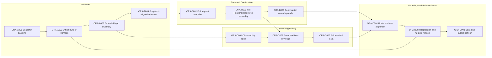

# Engineering Execution Plan

## 0. Version History & Changelog
- v2.0.1 - Expanded dependency notes and archived ORL execution detail while tightening the full-compliance sequencing and coverage language.
- v2.0.0 - Rebuilt the execution plan around full current OpenResponses compliance and preserved the completed ORL MVP backlog as archived brownfield context.
- v1.1.0 - Recorded the MVP completion state and the final ORL critical-path outcome.
- ... [Older history truncated, refer to git logs]

## 1. Executive Summary & Active Critical Path
- **Total Active Story Points:** 42
- **Critical Path:** `ORA-A001 -> ORA-A002 -> ORA-A003 -> ORA-A004 -> ORA-B001 -> ORA-B002 -> ORA-B003 -> ORA-C001 -> ORA-C002 -> ORA-C003 -> ORA-D001 -> ORA-D002 -> ORA-D003`
- **Archived MVP Critical Path:** `ORL-001 -> ORL-002 -> ORL-003 -> ORL-004 -> ORL-005 -> ORL-006 -> ORL-007 -> ORL-008 -> ORL-009 -> ORL-010 -> ORL-011 -> ORL-012 -> ORL-013 -> ORL-015 -> ORL-016 -> ORL-017 -> ORL-018 -> ORL-020 -> ORL-021`
- **Planning Assumptions:** The pinned upstream OpenResponses snapshot is the contract authority; the package remains library-shaped with root, `./server`, and `./testing` entrypoints; certified release verification remains Node.js 24.x plus Bun current.

The active plan still follows the original constraint logic from the MVP phase: the real risk concentration is truthful semantic publication under a broader contract. The pacing chain remains contract authority -> canonical state -> publication breadth -> release proof. Request broadening, stored-record migration, and release documentation are sequenced to support that path rather than compete with it.

### Legacy Issue Mapping Policy
- `ORL-*` remains the archived MVP baseline that produced the current brownfield package.
- `ORA-*` covers only the delta required to reach the new full-compliance target authorized by `PRD.md`, `Architecture.md`, and `TechSpec.md`.
- Each active ticket keeps a `Legacy Issue ID` so the maintainer can trace which existing asset, earlier constraint, or completed MVP decision it extends.

### Brownfield Continuity Note
- The current package already contains the route boundary, callback bridge, state machine, async event queue, tool-policy enforcement, continuation replay, minimum image-input support, local regressions, and Node/Bun smoke examples.
- The active plan does not reopen those completed foundations. It concentrates on contract broadening, full terminal resource publication, snapshot governance, and official black-box release proof.
- `ORA-B003` is a required join blocker before `ORA-D001`, but the longer pacing branch remains the streaming-fidelity work through `ORA-C003`.

### Active Dependency Notes
- **Baseline chain:** `ORA-A001` through `ORA-A004` creates the contract authority, the repeatable external measurement loop, and the schema boundary every later ticket depends on.
- **State and continuation chain:** `ORA-B001` through `ORA-B003` upgrades the normalized request snapshot, the canonical terminal response, and the stored-record contract needed for replay-safe full compliance.
- **Streaming chain:** `ORA-C001` through `ORA-C003` broadens truthful publication to every required family and then upgrades terminal SSE output. This remains the highest semantic-risk branch.
- **Release chain:** `ORA-D001` through `ORA-D003` is intentionally late because it hardens the public wire boundary only after the state and streaming branches have converged.
- **Join rule:** `ORA-D001` may not start until both `ORA-B003` and `ORA-C003` are complete. The route boundary cannot honestly align to the pinned contract until both persistence and terminal streaming are already corrected.

## 2. Project Phasing & Iteration Strategy
### Current Active Scope
- Pin the official OpenResponses contract snapshot and compliance-runner baseline inside the repository.
- Stand up a repeatable official compliance harness against the built package before the main implementation pass.
- Expand public schemas, request normalization, canonical response assembly, continuation persistence, and streaming publication to emit a full current `ResponseResource`.
- Broaden truthful output-item and event-family coverage to every snapshot-required family, using live, coarse, or terminal publication rules as needed rather than silent omission.
- Promote official compliance, import smoke, and certified runtime checks to release gates and public package claims.

### Future / Deferred Scope
- Additional runtime bindings beyond the current LangChain-oriented host family and the certified Node 24 plus Bun verification path.
- Optional packaged persistence adapters beyond the development in-memory store.
- Richer contract-drift automation beyond the pinned snapshot, update script, and review documentation required for this release.
- Coverage for upstream contract changes introduced after the pinned snapshot is refreshed again.

### Archived or Already Completed Scope
- `ORL-001` through `ORL-004`: feasibility spike, package scaffold, subset contract, and deterministic test harness.
- `ORL-005` through `ORL-014`: continuation boundary, request normalization, tool policy, canonical state, callback bridge, and subset JSON response materialization.
- `ORL-015` through `ORL-021`: truthful SSE streaming, Hono publication, minimum image input, error hardening, local regressions, smoke examples, and initial CI automation.

### Explicit Gap Inventory
- Full terminal `ResponseResource` fields are still missing or incomplete in the current public schema and persisted record shape.
- Terminal SSE events currently emit partial response stubs instead of full terminal resources.
- Official black-box compliance is not yet wired into the repository as a first-class release gate.
- Snapshot-required item and event families beyond the current text and function-call center need a checked truthful-publication policy before implementation.

### Active Verification Milestones
- **Milestone 1:** The pinned contract snapshot and official runner harness execute mechanically against a live built package, even while failing semantically.
- **Milestone 2:** Local regressions and official black-box compliance both exercise the broadened response, continuation, and streaming surface without conflating their roles.
- **Milestone 3:** CI, import smoke, examples, and release-facing docs all reflect the full-compliance posture rather than the old MVP subset claim.

## 3. Build Order (Mermaid)


## 4. Ticket List
### Epic A — Contract Baseline & Gap Inventory (ORA)

**ORA-A001 Pin the upstream contract snapshot and compliance baseline**
- **Type:** Chore
- **Effort:** 2
- **Dependencies:** None
- **Legacy Issue ID:** ORL-020, ORL-021
- **Capability / Contract Mapping:** ORC-008, ORC-009
- **Description:** Vendor the current OpenResponses OpenAPI snapshot and official compliance-runner baseline into `contracts/openresponses/`, record exact upstream provenance, and add the local script entrypoints needed for the rest of the package to resolve one contract authority.
- **Acceptance Criteria (Gherkin):**
```gherkin
Given the repository without a vendored upstream contract authority
When the pinned OpenResponses snapshot and compliance baseline are added
Then the repo contains the canonical snapshot files, exact upstream provenance, and local script entrypoints that resolve the same snapshot version for docs, tests, and CI
```

**ORA-A002 Stand up the official compliance harness against the built package**
- **Type:** Chore
- **Effort:** 2
- **Dependencies:** ORA-A001
- **Legacy Issue ID:** ORL-021
- **Capability / Contract Mapping:** ORC-008, ORC-009
- **Description:** Add a runnable harness that builds the package, starts a live local server from the built artifacts, and executes the pinned official compliance runner so the maintainer can measure real black-box behavior throughout the implementation pass.
- **Acceptance Criteria (Gherkin):**
```gherkin
Given the pinned runner baseline and the package build output
When the official compliance harness executes against a live local server
Then the run succeeds mechanically, records the scenario-level pass or fail result, and can be rerun without hand-crafted one-off commands
```

**ORA-A003 Spike the brownfield contract and observability gap**
- **Type:** Spike
- **Effort:** 3
- **Dependencies:** ORA-A002
- **Legacy Issue ID:** ORL-001
- **Capability / Contract Mapping:** ORC-001, ORC-002, ORC-003, ORC-009, ORC-010
- **Description:** Time-box a checked contract diff between the current package and the pinned snapshot, including which fields, item families, and event families are already implemented, which need explicit field-policy defaults, and what truthful publication mode each required family will use.
- **Acceptance Criteria (Gherkin):**
```gherkin
Given the pinned snapshot, the built-package compliance harness, and the current brownfield implementation
When the spike compares request fields, response fields, output-item families, stream-event families, and stored-record shapes
Then it produces a checked-in gap inventory that classifies each public element as already implemented, preserve, derive, default, read-repair, or a specific truthful publication mode
```

**ORA-A004 Replace subset schema authority with snapshot-aligned validators and types**
- **Type:** Feature
- **Effort:** 5
- **Dependencies:** ORA-A003
- **Legacy Issue ID:** ORL-003
- **Capability / Contract Mapping:** ORC-001, ORC-006, ORC-009
- **Description:** Rework `src/core` and the new contract-alignment helpers so request, response, error, and event validation follows the vendored snapshot rather than the earlier subset schema, while keeping snapshot-version visibility available to downstream modules and tests.
- **Acceptance Criteria (Gherkin):**
```gherkin
Given requests, responses, errors, and stream events built against the pinned snapshot
When the package validators and exported public types parse them
Then contract-valid payloads are accepted, required fields cannot be silently omitted, and the resolved snapshot version is visible to downstream modules and verification code
```

### Epic B — Request, State, and Continuation Upgrade (ORA)

**ORA-B001 Preserve the full request snapshot and broaden normalization**
- **Type:** Feature
- **Effort:** 5
- **Dependencies:** ORA-A004
- **Legacy Issue ID:** ORL-006, ORL-012, ORL-018
- **Capability / Contract Mapping:** ORC-004, ORC-005, ORC-006
- **Description:** Expand normalization so the effective request snapshot preserves current contract fields, structured history, compliant assistant and developer context, tool contract inputs, operational fields, and image-bearing inputs needed for response echo and continuation replay.
- **Acceptance Criteria (Gherkin):**
```gherkin
Given requests that use the current supported input forms, tool fields, operational fields, and image-bearing parts
When normalization builds the canonical transcript and request snapshot
Then the effective request preserves the contract fields needed for response echo, tool enforcement, and previous_response_id replay without leaking provider-specific transport details
```

**ORA-B002 Build full terminal `ResponseResource` assembly with explicit field policy**
- **Type:** Feature
- **Effort:** 5
- **Dependencies:** ORA-B001
- **Legacy Issue ID:** ORL-007, ORL-008, ORL-014
- **Capability / Contract Mapping:** ORC-001, ORC-005, ORC-010
- **Description:** Extend the canonical aggregate and terminal materializer so one authoritative response model owns the full terminal `ResponseResource`, request-echo fields, usage accounting, operational fields, and the preserve or derive or default policy defined in `TechSpec.md`.
- **Acceptance Criteria (Gherkin):**
```gherkin
Given completed, failed, and incomplete executions with canonical runtime observations
When the aggregate materializes the terminal response
Then the same full ResponseResource is valid for JSON output, terminal SSE publication, and persistence, and every required public field is preserved, derived, null, or defaulted according to the documented field policy
```

**ORA-B003 Upgrade continuation records and read-repair behavior**
- **Type:** Feature
- **Effort:** 3
- **Dependencies:** ORA-B002
- **Legacy Issue ID:** ORL-005, ORL-006
- **Capability / Contract Mapping:** ORC-004, ORC-009
- **Description:** Upgrade `StoredResponseRecord` and `PreviousResponseStore` handling so continuation records persist the full normalized request and full terminal response with the contract snapshot version, while older records are either repaired predictably or rejected deterministically.
- **Acceptance Criteria (Gherkin):**
```gherkin
Given continuation records created before and after the full-compliance migration
When previous_response_id replay loads a stored record
Then current-shape records round-trip losslessly and older records are either read-repaired into a contract-valid shape or rejected through a deterministic 409-compatible error path
```

### Epic C — Streaming Fidelity Expansion (ORA)

**ORA-C001 Spike truthful publication boundaries for additional event families**
- **Type:** Spike
- **Effort:** 2
- **Dependencies:** ORA-A003
- **Legacy Issue ID:** ORL-001, ORL-011
- **Capability / Contract Mapping:** ORC-003, ORC-010
- **Description:** Validate how each snapshot-required output-item and streaming-event family will be represented truthfully from the current LangChain callback surface, documenting live-delta, coarse-live, or terminal-summary publication rules before widening the public stream union.
- **Acceptance Criteria (Gherkin):**
```gherkin
Given the pinned event families and the current LangChain callback surface
When the spike exercises candidate refusal, reasoning, and auxiliary publication paths
Then the checked-in note states for each required family whether it is emitted as live delta, coarse live completion, or terminal summary, without fabricating nonexistent observations
```

**ORA-C002 Implement snapshot-required semantic event and output-item coverage**
- **Type:** Feature
- **Effort:** 5
- **Dependencies:** ORA-B002, ORA-C001
- **Legacy Issue ID:** ORL-010, ORL-011, ORL-015, ORL-016
- **Capability / Contract Mapping:** ORC-003, ORC-005, ORC-010
- **Description:** Extend the callback bridge, canonical state, and public event union to represent every snapshot-required output-item and stream-event family using the truthful publication rules defined by the observability spike.
- **Acceptance Criteria (Gherkin):**
```gherkin
Given runtime executions that produce text, function calls, and any additional snapshot-required families identified by the observability spike
When live callbacks are translated into semantic events
Then the aggregate and public stream represent every required family with truthful ordering, no synthetic deltas, and contract-valid payload shapes using the documented publication mode for each family
```

**ORA-C003 Publish full terminal stream events and preserve compliant ordering**
- **Type:** Feature
- **Effort:** 3
- **Dependencies:** ORA-C002
- **Legacy Issue ID:** ORL-015, ORL-016
- **Capability / Contract Mapping:** ORC-002, ORC-003
- **Description:** Upgrade the serializer and streaming adapter so `response.completed`, `response.failed`, and `response.incomplete` embed the same full terminal `ResponseResource` used elsewhere, while `sequence_number` and `[DONE]` ordering remain compliant.
- **Acceptance Criteria (Gherkin):**
```gherkin
Given a streaming request that completes, fails after stream start, or ends incomplete
When the serializer emits terminal lifecycle events
Then the terminal event contains the same full ResponseResource used for persistence and JSON output, sequence ordering remains monotonic, and literal [DONE] is emitted only after the terminal event when the contract permits
```

### Epic D — Boundary Hardening and Release Gating (ORA)

**ORA-D001 Align route orchestration and wire error mapping to the pinned contract**
- **Type:** Feature
- **Effort:** 3
- **Dependencies:** ORA-B003, ORA-C003
- **Legacy Issue ID:** ORL-017, ORL-019
- **Capability / Contract Mapping:** ORC-001, ORC-002, ORC-004, ORC-005
- **Description:** Update the Hono boundary and adapter orchestration so JSON versus SSE paths, content negotiation, 404 and 409 continuation failures, 415 content-type failures, and pre-stream versus post-stream runtime failures match the pinned contract and the new canonical response assembly.
- **Acceptance Criteria (Gherkin):**
```gherkin
Given valid and invalid non-streaming and streaming requests, including missing or stale previous_response_id records
When the route boundary processes them
Then successful requests publish contract-valid JSON or SSE outputs, pre-stream failures use the documented wire errors, and post-stream failures resolve through one terminal failure path without contradictory terminal states
```

**ORA-D002 Rework regressions, import smoke, and CI around the official pass gate**
- **Type:** Chore
- **Effort:** 3
- **Dependencies:** ORA-A002, ORA-D001
- **Legacy Issue ID:** ORL-020, ORL-021
- **Capability / Contract Mapping:** ORC-007, ORC-008, ORC-009
- **Description:** Split package-local compliance regressions from the official runner path, add import smoke for supported entrypoints, and make the official black-box pass a required CI gate on the certified runtimes.
- **Acceptance Criteria (Gherkin):**
```gherkin
Given the built package, the local regression suites, and the pinned official runner harness
When local verification and CI execute
Then package-local regressions remain separate from black-box compliance, ESM and CJS entrypoints are smoke-tested, and the official runner pass blocks release on the certified runtimes
```

**ORA-D003 Refresh README, examples, and package claims for the full-compliance release**
- **Type:** Chore
- **Effort:** 1
- **Dependencies:** ORA-D002
- **Legacy Issue ID:** ORL-021
- **Capability / Contract Mapping:** ORC-007, ORC-008, ORC-009
- **Description:** Update the README, examples, package description, and release-facing claims so the published package explains the full-compliance surface truthfully and no longer advertises the old spec-minimal MVP posture.
- **Acceptance Criteria (Gherkin):**
```gherkin
Given the completed implementation and release-gating workflow
When the release-facing docs, examples, and package metadata are refreshed
Then the published package describes the current contract truthfully, demonstrates the supported library-first integration path, and removes stale MVP-only compliance claims
```

## 5. Legacy ORL Archive Summary
| Legacy Issue ID | Title | Status |
| --- | --- | --- |
| ORL-001 | Spike callback and streaming feasibility | Implemented |
| ORL-002 | Create the workspace package skeleton | Implemented |
| ORL-003 | Define the core protocol contract | Implemented |
| ORL-004 | Build the deterministic testing harness | Implemented |
| ORL-005 | Implement the continuation persistence port and dev store | Implemented |
| ORL-006 | Implement exact previous_response_id replay semantics | Implemented |
| ORL-007 | Implement the response lifecycle state machine | Implemented |
| ORL-008 | Implement the item accumulator and part finalizer guards | Implemented |
| ORL-009 | Implement the single-writer async event queue | Implemented |
| ORL-010 | Bridge text and message callbacks into semantic events | Implemented |
| ORL-011 | Bridge tool and function-call callbacks into semantic events | Implemented |
| ORL-012 | Normalize requests and map tool policy once | Implemented |
| ORL-013 | Enforce tool policy during execution | Implemented |
| ORL-014 | Materialize the final JSON response resource | Implemented |
| ORL-015 | Implement the event serializer and SSE framing | Implemented |
| ORL-016 | Implement the truthful streaming execution path | Implemented |
| ORL-017 | Implement the Hono route boundary | Implemented |
| ORL-018 | Implement the minimum image-input path | Implemented |
| ORL-019 | Harden public error mapping and structured logging | Implemented |
| ORL-020 | Build the release-blocker regression suite | Implemented |
| ORL-021 | Wire the compliance workflow, runtime smoke coverage, and publishable examples | Implemented |

## 6. Archived ORL Detailed Execution Notes
### Epic 0 — Risk Mitigation and Foundation
- `ORL-001` remains the historical source for callback richness assumptions, degraded-fidelity rules, and post-stream failure semantics. `ORA-A003` and `ORA-C001` should treat that spike as prior art rather than rediscovering first principles.
- `ORL-002` established the publishable package shape, tsup/export layout, and workspace script conventions. `ORA-A001`, `ORA-D002`, and `ORA-D003` must preserve those adoption-critical surfaces.
- `ORL-003` created the original Zod-backed contract and public types. `ORA-A004` replaces its authority source, but not the need for one shared validation and typing boundary.
- `ORL-004` produced the deterministic clocks, IDs, fake agents, and test harnesses that still anchor all later regression and compliance work.

### Epic 1 — Continuation Persistence Boundary
- `ORL-005` introduced `PreviousResponseStore` and the in-memory store. `ORA-B003` broadens the stored shape; it does not remove the explicit builder-owned boundary.
- `ORL-006` proved the exact replay rule `prior input -> prior output -> new input`. That semantic ordering remains fixed and is not reopened by the full-compliance migration.

### Epic 2 — Canonical State and Semantic Derivation
- `ORL-007` established the response lifecycle state machine. `ORA-B002` extends its public field breadth but should preserve its single-terminal-state discipline.
- `ORL-008` established item and content-part finalizer guards. `ORA-C002` relies on those guards as it broadens output-item families.
- `ORL-009` created the single-writer async queue. `ORA-C003` still depends on this queue-backed serialization discipline to keep terminal publication deterministic.
- `ORL-010` created the text callback bridge. Its no-direct-transport-write rule remains mandatory for truthful streaming.
- `ORL-011` created the tool and function-call bridge plus degraded-fidelity handling. `ORA-C001` and `ORA-C002` extend this precedent to refusal, reasoning, and other required families.

### Epic 3 — Request Normalization and Execution Control
- `ORL-012` established one normalization pass and one tool-policy derivation pass. `ORA-B001` broadens the request snapshot but must keep that single-source-of-truth discipline.
- `ORL-013` enforced tool policy at execution time. `ORA-D001` and `ORA-B001` must preserve that fail-closed posture while the richer request contract is carried end to end.
- `ORL-014` materialized the earlier subset JSON response. `ORA-B002` upgrades this path to the full terminal `ResponseResource` rather than introducing a second materializer.

### Epic 4 — Transport Serialization and Route Publication
- `ORL-015` established response-scoped `sequence_number`, outgoing event validation, and SSE framing. `ORA-C003` broadens terminal payload shape on top of that existing serializer discipline.
- `ORL-016` established live callback-derived streaming with canonical state accumulation in parallel. The full-compliance plan still assumes this truthful streaming posture.
- `ORL-017` established the Hono route boundary with content-type checks, JSON parsing, timeout budgets, and opaque context propagation. `ORA-D001` aligns that same boundary to the broader contract.

### Epic 5 — Bounded Capability Completion
- `ORL-018` established the minimum image-input path through validation, normalization, invocation, and continuation. `ORA-B001` preserves and broadens around that existing path instead of re-scoping it.
- `ORL-019` established structured logging and sanitized public error mapping. `ORA-D001` and `ORA-D002` should extend these observability guarantees to the new snapshot versioning and official compliance signals.

### Epic 6 — Verification, Release Gates, and Consumer Integration
- `ORL-020` established the deterministic local regression suite. In the new plan, those tests remain necessary but explicitly secondary to the official black-box gate.
- `ORL-021` established Node/Bun examples, smoke entrypoints, README drift checks, and the first CI workflow. `ORA-A002`, `ORA-D002`, and `ORA-D003` all build directly on this release-integration base.
