# Tasks.md

## 1. Executive Summary

- **Total Estimation:** 75 story points
- **Progress Snapshot:** 14 implemented, 4 partial, 3 planned
- **Original Critical Path:** ORL-001 → ORL-002 → ORL-003 → ORL-004 → ORL-005 → ORL-006 → ORL-007 → ORL-008 → ORL-009 → ORL-010 → ORL-011 → ORL-012 → ORL-013 → ORL-015 → ORL-016 → ORL-017 → ORL-018 → ORL-020 → ORL-021
- **Remaining Critical Path:** ORL-015 → ORL-016 → ORL-017 → ORL-018 → ORL-019 → ORL-020 → ORL-021

The plan is intentionally shaped around the real bottleneck: truthful live semantic streaming. Based on Goldratt’s Theory of Constraints, the highest-risk and highest-coupling path is callback fidelity → canonical state → single-writer serialization → transport failure semantics. Non-streaming JSON, continuation persistence, and release packaging are sequenced to support that path rather than compete with it.

## 2. Project Phasing Strategy

### Phase 1 (MVP)

The MVP is complete when all of the following outcomes exist in one releasable package:

- A Hono-mounted `POST /v1/responses` route exposes an existing LangChain `createAgent()` runtime without requiring an agent rewrite.
- The package accepts the defined spec-minimal Open Responses request subset and returns compliant non-streaming JSON responses.
- The package returns compliant streaming SSE responses with live semantic fidelity, deterministic event ordering, and correct terminal behavior.
- The package supports tool-calling semantics required by the compliance suite, including normalized `tool_choice` handling and execution-time enforcement.
- The package supports `previous_response_id` continuation through a builder-controlled `PreviousResponseStore`.
- The package supports the minimum image-input path required for compliance.
- The package passes the release-blocker test suite, compliance workflow, and dual-runtime smoke checks.

### Phase 2 (Post-Launch)

The following capabilities are deliberately deferred to prevent scope creep:

- Broader runtime bindings beyond the initial certified Node.js and Bun target.
- Richer advanced adapter surfaces beyond the initial handler plus adapter factory.
- Extension events for richer observability and debugging.
- Broader multimodal support beyond minimum image input.
- Optional packaged persistence adapters beyond the development-only in-memory store.

## 3. Build Order (Dependency Graph)

There is no standalone product UI in this package. The **FRONTEND** lane below represents consumer-facing example integration and runtime smoke coverage.

```mermaid
flowchart LR
    subgraph INFRA[INFRA]
        ORL001[ORL-001 Spike callback + stream feasibility]
        ORL002[ORL-002 Workspace/package scaffold]
        ORL003[ORL-003 Core protocol contract]
        ORL004[ORL-004 Deterministic test harness]
        ORL001 --> ORL002 --> ORL003 --> ORL004
    end

    subgraph DB[DB / Persistence Boundary]
        ORL005[ORL-005 PreviousResponseStore + in-memory store]
        ORL006[ORL-006 previous_response_id replay]
        ORL005 --> ORL006
    end

    subgraph BACKEND[BACKEND]
        ORL007[ORL-007 ResponseLifecycle]
        ORL008[ORL-008 ItemAccumulator]
        ORL009[ORL-009 Async event queue]
        ORL010[ORL-010 Text callback bridge]
        ORL011[ORL-011 Tool callback bridge]
        ORL012[ORL-012 Request normalization + tool mapping]
        ORL013[ORL-013 Tool enforcement middleware]
        ORL014[ORL-014 Final response materializer + JSON path]
        ORL015[ORL-015 Event serializer + SSE framing]
        ORL016[ORL-016 Streaming execution path]
        ORL017[ORL-017 Hono route orchestration]
        ORL018[ORL-018 Minimum image-input path]
        ORL019[ORL-019 Logging + error hardening]
        ORL020[ORL-020 Release-blocker test suite]
    end

    subgraph FRONTEND[FRONTEND / Consumer Integration]
        ORL021[ORL-021 Compliance CI examples README]
    end

    ORL003 --> ORL005
    ORL003 --> ORL007
    ORL003 --> ORL012
    ORL004 --> ORL010
    ORL004 --> ORL020

    ORL006 --> ORL012
    ORL007 --> ORL008 --> ORL009 --> ORL010 --> ORL011
    ORL012 --> ORL013
    ORL012 --> ORL014
    ORL008 --> ORL014
    ORL009 --> ORL015
    ORL010 --> ORL015
    ORL011 --> ORL015
    ORL013 --> ORL016
    ORL014 --> ORL016
    ORL015 --> ORL016
    ORL016 --> ORL017 --> ORL018 --> ORL019 --> ORL020 --> ORL021

    classDef implemented fill:#dff3e4,stroke:#2f6f44,color:#14311f
    classDef partial fill:#fff3cd,stroke:#8a6d1d,color:#4a3700
    classDef planned fill:#edf2f7,stroke:#5c6b7a,color:#24313d

    class ORL001,ORL002,ORL003,ORL004,ORL005,ORL006,ORL007,ORL008,ORL009,ORL010,ORL011,ORL012,ORL013,ORL014 implemented
    class ORL017,ORL018,ORL019,ORL020 partial
    class ORL015,ORL016,ORL021 planned
```



## 4. The Ticket List

## Epic 0 — Risk Mitigation and Foundation

> **[ORL-001] Spike callback and streaming feasibility**
> - **Type:** Spike
> - **Status:** Implemented
> - **Effort:** Story Points: 3
> - **Dependencies:** None
> - **Description:** Time-box a proof of feasibility around LangChain callback richness, live streaming observability, and Hono’s post-stream error boundary. The output is a written engineering note that defines the exact live events the package can publish truthfully, the degraded-fidelity rule for weak provider callbacks, and the failure rule after SSE has started.
> - **Acceptance Criteria (Gherkin):**
> ```gherkin
> Given a minimal LangChain createAgent runtime and a Hono streaming prototype
> When the spike exercises text generation, tool invocation, and failures before and after stream start
> Then the resulting engineering note identifies the observable callback surface, the permitted degraded-fidelity behavior, and the exact terminal failure rule to carry into implementation
> ```

> **[ORL-002] Create the workspace package skeleton**
> - **Type:** Chore
> - **Status:** Implemented
> - **Effort:** Story Points: 2
> - **Dependencies:** [ORL-001]
> - **Description:** Create the publishable workspace package, package-local file layout, root and package scripts, tsup build config, exports map, tsconfig, and Biome/Bun wiring required by the Tech Spec.
> - **Acceptance Criteria (Gherkin):**
> ```gherkin
> Given an empty workspace package
> When the package skeleton, build scripts, typecheck script, lint script, test script, and export map are added
> Then the package builds to ESM and CJS, emits declaration files, and the workspace commands run without requiring application code
> ```

> **[ORL-003] Define the core protocol contract**
> - **Type:** Feature
> - **Status:** Implemented
> - **Effort:** Story Points: 5
> - **Dependencies:** [ORL-002]
> - **Description:** Implement `src/core` with Zod-backed request, response, event, and error schemas; exported TypeScript types; public factory signatures; and the internal/public error taxonomy needed by all downstream modules.
> - **Acceptance Criteria (Gherkin):**
> ```gherkin
> Given valid and invalid Open Responses request and response payloads within the MVP scope
> When the core schemas parse them
> Then supported fields are accepted, malformed or out-of-scope combinations are rejected, and the exported TypeScript surfaces compile without `any` in public contracts
> ```

> **[ORL-004] Build the deterministic testing harness**
> - **Type:** Chore
> - **Status:** Implemented
> - **Effort:** Story Points: 2
> - **Dependencies:** [ORL-002]
> - **Description:** Create deterministic test helpers and fakes, including injectable clock and ID generation, fake model/agent behavior, and an in-memory harness usable by all package-local tests.
> - **Acceptance Criteria (Gherkin):**
> ```gherkin
> Given the package-local test suite
> When a test injects the deterministic clock, deterministic ID generator, and fake runtime doubles
> Then the test can assert exact timestamps, response IDs, and event ordering without non-deterministic failures
> ```

## Epic 1 — Continuation Persistence Boundary

> **[ORL-005] Implement the continuation persistence port and dev store**
> - **Type:** Feature
> - **Status:** Implemented
> - **Effort:** Story Points: 3
> - **Dependencies:** [ORL-003]
> - **Description:** Implement `StoredResponseRecord`, `PreviousResponseStore`, and `InMemoryPreviousResponseStore` as the explicit continuation boundary. Enforce the invariant that top-level convenience fields stay synchronized with the authoritative nested response resource.
> - **Acceptance Criteria (Gherkin):**
> ```gherkin
> Given a canonical stored response record
> When the record is saved and immediately loaded through InMemoryPreviousResponseStore
> Then the authoritative response resource and projected top-level fields round-trip without drift and the read is strongly consistent for the just-written record
> ```

> **[ORL-006] Implement exact previous_response_id replay semantics**
> - **Type:** Feature
> - **Status:** Implemented
> - **Effort:** Story Points: 3
> - **Dependencies:** [ORL-005]
> - **Description:** Implement the adapter logic that loads and validates prior response records and reconstructs continuation input using the exact required order: prior request input + prior response output + new request input.
> - **Acceptance Criteria (Gherkin):**
> ```gherkin
> Given a request that includes previous_response_id
> When the adapter resolves continuation input
> Then it loads the prior record, validates that the stored record is usable, concatenates prior input plus prior output plus new input in the exact required order, and returns 404 or 409 for missing or unusable records
> ```

## Epic 2 — Canonical State and Semantic Derivation

> **[ORL-007] Implement the response lifecycle state machine**
> - **Type:** Feature
> - **Status:** Implemented
> - **Effort:** Story Points: 2
> - **Dependencies:** [ORL-003]
> - **Description:** Implement `ResponseLifecycle` with the permitted response states and single-transition semantics for completion, failure, and incompletion.
> - **Acceptance Criteria (Gherkin):**
> ```gherkin
> Given a new response lifecycle
> When start, complete, fail, or incomplete transitions are applied
> Then only valid state transitions are accepted, completion metadata is written once, and the terminal error payload is retained exactly once when failure occurs
> ```

> **[ORL-008] Implement the item accumulator and part finalizer guards**
> - **Type:** Feature
> - **Status:** Implemented
> - **Effort:** Story Points: 3
> - **Dependencies:** [ORL-007]
> - **Description:** Implement `ItemAccumulator` so canonical message items, function call items, and output text parts can be opened, appended, finalized, and snapshotted while enforcing duplicate-finalizer and close-order rules.
> - **Acceptance Criteria (Gherkin):**
> ```gherkin
> Given canonical message and function-call items in progress
> When text deltas or function-call argument deltas are appended and terminal operations are invoked
> Then the accumulator returns canonical snapshots, closes text parts before items, and rejects duplicate terminal events for the same item or content part
> ```

> **[ORL-009] Implement the single-writer async event queue**
> - **Type:** Feature
> - **Status:** Implemented
> - **Effort:** Story Points: 2
> - **Dependencies:** [ORL-008]
> - **Description:** Implement the in-process async queue that decouples callback bursts from transport writes and gives the serializer a single ordered consumption path.
> - **Acceptance Criteria (Gherkin):**
> ```gherkin
> Given multiple semantic events produced concurrently by runtime callbacks
> When they are pushed into the async event queue and drained by one consumer
> Then the consumer receives them in queue order and the queue finalizes exactly once on completion or failure
> ```

> **[ORL-010] Bridge text and message callbacks into semantic events**
> - **Type:** Feature
> - **Status:** Implemented
> - **Effort:** Story Points: 5
> - **Dependencies:** [ORL-004, ORL-009]
> - **Description:** Implement the callback bridge path for message start, model token deltas, model completion, and runtime failure. This ticket is the first half of live semantic derivation and must remain provider-agnostic.
> - **Acceptance Criteria (Gherkin):**
> ```gherkin
> Given a text-only agent invocation
> When model start, token, completion, and error callbacks fire
> Then the callback bridge emits semantic events that start a message item, produce live text deltas, finalize the content part and item in the correct order, and never write directly to the HTTP response
> ```

> **[ORL-011] Bridge tool and function-call callbacks into semantic events**
> - **Type:** Feature
> - **Status:** Implemented
> - **Effort:** Story Points: 5
> - **Dependencies:** [ORL-010]
> - **Description:** Implement the callback bridge path for agent actions, tool start/end/error, and function-call argument progress. Encode the degraded-fidelity rule so weak provider granularity never causes synthetic deltas.
> - **Acceptance Criteria (Gherkin):**
> ```gherkin
> Given an agent invocation that proposes and executes tools
> When action, tool, and runtime callbacks fire with strong or weak argument granularity
> Then the callback bridge emits semantically truthful function-call lifecycle events, preserves name and call_id continuity, and degrades to truthful done-only behavior instead of fabricating argument delta chunks
> ```

## Epic 3 — Request Normalization and Execution Control

> **[ORL-012] Normalize requests and map tool policy once**
> - **Type:** Feature
> - **Status:** Implemented
> - **Effort:** Story Points: 5
> - **Dependencies:** [ORL-003, ORL-006]
> - **Description:** Implement request normalization for string and array input, role-specific message handling, minimum supported input parts, tool parsing, duplicate/unknown tool rejection, and runtime-facing `NormalizedToolPolicy`.
> - **Acceptance Criteria (Gherkin):**
> ```gherkin
> Given requests that use string input, array input, system or developer messages, user image-bearing input, and multiple tool_choice variants
> When normalizeRequest runs
> Then the request is converted into canonical messages, tool policy is derived exactly once, duplicate or unknown tool names are rejected with 400 behavior, and the normalized result is free of provider-specific transport leakage
> ```

> **[ORL-013] Enforce tool policy during execution**
> - **Type:** Security
> - **Status:** Implemented
> - **Effort:** Story Points: 5
> - **Dependencies:** [ORL-012]
> - **Description:** Implement the middleware or execution-config layer that enforces `tool_choice`, `allowed_tools`, `parallel_tool_calls`, and the fail-closed posture for `required` where clean enforcement is not fully available upstream.
> - **Acceptance Criteria (Gherkin):**
> ```gherkin
> Given normalized tool policies for none, required, specific function, allowed_tools, and parallel_tool_calls false
> When the runtime attempts tool execution
> Then disallowed tools are rejected, allowed tool names are enforced from one canonical policy source, tool decisions are serialized when required, and unsupported required-tool situations fail closed where feasible instead of silently relaxing policy
> ```

> **[ORL-014] Materialize the final JSON response resource**
> - **Type:** Feature
> - **Status:** Implemented
> - **Effort:** Story Points: 3
> - **Dependencies:** [ORL-008, ORL-012]
> - **Description:** Implement final response materialization from canonical item state and lifecycle state for the non-streaming path, including error projection and stable metadata and timestamps.
> - **Acceptance Criteria (Gherkin):**
> ```gherkin
> Given canonical lifecycle state and canonical output items after a non-streaming invocation
> When materializeFinalResponse runs
> Then it returns a spec-minimal OpenResponsesResponse with stable identifiers, correct status, canonical output items, synchronized previous_response_id and metadata behavior, and schema-valid error projection when failures occur
> ```

## Epic 4 — Transport Serialization and Route Publication

> **[ORL-015] Implement the event serializer and SSE framing**
> - **Type:** Feature
> - **Status:** Planned
> - **Effort:** Story Points: 5
> - **Dependencies:** [ORL-003, ORL-009, ORL-010, ORL-011]
> - **Current State:** No serializer module or SSE framing path exists yet; sequence-numbered public event serialization remains unimplemented.
> - **Description:** Implement the single serializer that owns response-scoped sequence numbers, converts canonical and internal events into public Open Responses events, validates outgoing events in non-production paths, and formats compliant SSE frames.
> - **Acceptance Criteria (Gherkin):**
> ```gherkin
> Given canonical text and function-call state changes for one response
> When the serializer converts them into public events
> Then sequence_number increases by exactly one each time, event ordering matches the defined state machines, every SSE frame uses event equal to type, and the terminal payload format is compatible with literal [DONE]
> ```

> **[ORL-016] Implement the truthful streaming execution path**
> - **Type:** Feature
> - **Status:** Planned
> - **Effort:** Story Points: 5
> - **Dependencies:** [ORL-013, ORL-014, ORL-015]
> - **Current State:** The adapter still rejects `stream: true`; live callback-derived SSE publication and post-stream failure semantics are not wired.
> - **Description:** Implement the adapter’s streaming path so live callback-derived semantic events are serialized and published while canonical state accumulates in parallel. This ticket also owns post-stream terminal failure behavior.
> - **Acceptance Criteria (Gherkin):**
> ```gherkin
> Given a request with stream set to true
> When live callbacks arrive or the runtime fails after the SSE stream has started
> Then the adapter emits events from live semantic observations, never replays final output as synthetic deltas, emits response.failed before [DONE] when failure occurs after stream start, and leaves the final canonical response state consistent with the terminal stream event
> ```

> **[ORL-017] Implement the Hono route boundary**
> - **Type:** Feature
> - **Status:** Partial
> - **Effort:** Story Points: 3
> - **Dependencies:** [ORL-014, ORL-016]
> - **Current State:** The Hono boundary handles non-streaming JSON requests with validation and error mapping, but the `stream` branch is still explicitly rejected.
> - **Description:** Implement `createOpenResponsesHandler` and the Hono server boundary that verifies content type, parses JSON, validates requests, branches on `stream`, propagates auth and host context opaquely, applies abort budgets, and orchestrates persistence and transport without embedding business logic.
> - **Acceptance Criteria (Gherkin):**
> ```gherkin
> Given POST requests to /v1/responses with valid and invalid content types and request bodies
> When the Hono handler processes them
> Then it returns the correct JSON or SSE response shape and HTTP status, keeps orchestration logic in the handler without moving business rules into transport code, and avoids relying on generic stream timeout middleware
> ```

## Epic 5 — Bounded Capability Completion

> **[ORL-018] Implement the minimum image-input path**
> - **Type:** Feature
> - **Status:** Partial
> - **Effort:** Story Points: 2
> - **Dependencies:** [ORL-017]
> - **Current State:** Image-bearing user input is schema-valid and preserved through normalization, but the dedicated continuation plus route-level image path is not yet proven end-to-end.
> - **Description:** Complete the minimum image-input path by validating `input_image`, preserving image-bearing parts through normalization and continuation replay, and passing those parts through without inventing a broader multimodal abstraction.
> - **Acceptance Criteria (Gherkin):**
> ```gherkin
> Given requests and continuation records that contain input_image parts
> When the request is validated, normalized, replayed, and invoked
> Then image-bearing parts are preserved end to end, passed through to the runtime integration without adapter-level transformation promises, and no broader multimodal output capability is introduced
> ```

> **[ORL-019] Harden public error mapping and structured logging**
> - **Type:** Security
> - **Status:** Partial
> - **Effort:** Story Points: 2
> - **Dependencies:** [ORL-017]
> - **Current State:** Internal-to-public error mapping is in place, but structured logging, correlation fields, and token-safe logging discipline are still missing.
> - **Description:** Implement the final public error mapping path, request and response correlation fields, and structured logging discipline so failures are observable without leaking internal state or token content.
> - **Acceptance Criteria (Gherkin):**
> ```gherkin
> Given validation, persistence, runtime, and serializer failures across streaming and non-streaming requests
> When the package maps errors and emits logs
> Then internal error codes map to the specified public error types and statuses, request_id and response_id are present in structured logs, token content is excluded by default, and clients do not receive raw internal stack traces
> ```

## Epic 6 — Verification, Release Gates, and Consumer Integration

> **[ORL-020] Build the release-blocker regression suite**
> - **Type:** Feature
> - **Status:** Partial
> - **Effort:** Story Points: 5
> - **Dependencies:** [ORL-018, ORL-019]
> - **Current State:** The package has deterministic unit coverage, including Epic 3, but still lacks the full release-blocker matrix for streaming, image continuation, and compliance/golden-stream gates.
> - **Description:** Implement the package-local regression suite covering event order, terminal states, tool-calling, continuation, image input, and every event union branch required by the Tech Spec’s release blockers.
> - **Acceptance Criteria (Gherkin):**
> ```gherkin
> Given the deterministic test doubles and package entrypoints
> When the release-blocker test suite runs
> Then basic text response, streaming response, system and developer message handling, tool calling, previous_response_id continuation, image input, event union coverage, terminal state coverage, and event-order regression all pass
> ```

> **[ORL-021] Wire the compliance workflow, runtime smoke coverage, and publishable examples**
> - **Type:** Chore
> - **Status:** Planned
> - **Effort:** Story Points: 5
> - **Dependencies:** [ORL-020]
> - **Current State:** CI workflows, runtime smoke jobs, consumer examples, and a real package README are still absent.
> - **Description:** Add the compliance workflow, CI jobs, Node and Bun smoke coverage, optional Deno smoke coverage, and minimal examples and README so a solo builder can adopt the package quickly and release criteria are automated.
> - **Acceptance Criteria (Gherkin):**
> ```gherkin
> Given the completed package and examples for Node, Bun, and optional Deno
> When CI runs install, typecheck, lint, unit, golden-stream, compliance, build, node-24-smoke, and bun-smoke jobs
> Then all required gates pass, the examples demonstrate minimal-user-code integration, and the README documents the supported MVP scope and known degraded-fidelity boundaries
> ```
