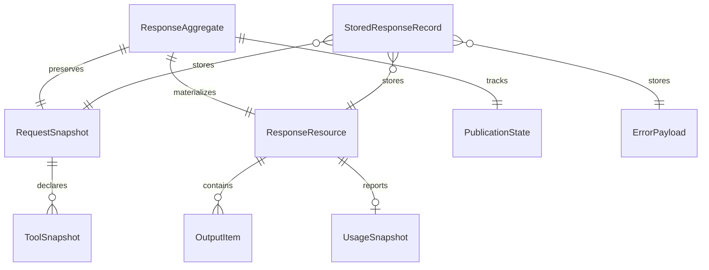

# Technical Specification

## 0. Version History & Changelog
- v2.0.2 - Restored fuller migration and module detail, removed the lingering request-snapshot ambiguity, and tightened required event-family coverage language.
- v2.0.1 - Restored detailed brownfield drift registers, field-policy, module-boundary, and release-gate detail while preserving the full-compliance direction.
- v2.0.0 - Reframed the package from an MVP subset implementation to a full current OpenResponses compliance target with explicit brownfield drift controls.
- ... [Older history truncated, refer to git logs]

## 1. Stack Specification (Bill of Materials)
- **Primary Language / Runtime:** TypeScript 5.9.x targeting ES2022; certified runtimes are Node.js 24.x LTS and Bun current; minimum supported Node runtime remains `>=20` because of peer dependency constraints.
- **Primary Frameworks / Libraries:** `langchain` 1.2.x, `@langchain/core` 1.1.x, optional `@langchain/langgraph` 1.2.x for builder integrations, `hono` 4.12.x, `zod` 4.3.x, `@hono/node-server` 1.19.x for Node examples and smoke coverage.
- **State Stores / Persistence:** Builder-supplied `PreviousResponseStore` backed by a document or key-value persistence category; shipped in-memory development store remains part of the package for local testing only.
- **Infrastructure / Tooling:** Bun workspaces, `tsup` 8.5.x, GitHub Actions, vendored current OpenResponses contract snapshot under `contracts/openresponses/`, and a pinned official compliance-runner integration.
- **Testing / Quality Tooling:** `bun:test`, Biome 2.4.x, package-local regression tests, official OpenResponses CLI runner executed against a live built package, and Node/Bun smoke scripts.
- **Version Pinning / Compatibility Policy:** The package must pin the current upstream OpenResponses OpenAPI snapshot and official compliance-runner baseline by upstream commit or release reference. Any snapshot refresh requires a compatibility review, live compliance run, and docs update. The first full-compliance release must be treated as contract-breaking relative to package version `0.0.1`.

### 1.1 Brownfield Audit Summary
- **Current package reality:** The package already contains the core machinery needed for the target state: request normalization, callback-driven semantic observation, canonical state accumulation, continuation persistence, Hono publication, and dual-runtime smoke coverage.
- **Current package reality:** The package does not yet satisfy the target contract because the public response schema and terminal streaming events remain narrower than the current official OpenResponses contract.
- **Current release reality:** `tests/compliance.spec.ts` is a useful package-local regression harness, but it is not equivalent to the official OpenResponses CLI runner and must not be treated as contract proof.
- **Target-state implication:** The technical work is primarily contract broadening and publication correctness, not a wholesale rewrite of the package’s topology.

## 2. Architecture Decision Records (ADRs)
### ADR-001 Contract Authority Is the Upstream OpenResponses Snapshot
- **Status:** accepted
- **Context:** The current package-local schemas and local compliance subset have drifted from the official OpenResponses contract and official CLI runner, producing false confidence.
- **Decision:** Vendor the current upstream OpenResponses OpenAPI snapshot as the canonical HTTP contract source and pin the official OpenResponses CLI runner as the external release validator.
- **Consequences:** The public contract gains a trustworthy authority and reproducible validation target. Upstream changes become explicit maintenance work instead of silent drift.

### ADR-002 Full `ResponseResource` Is the Only Public Terminal Resource
- **Status:** accepted
- **Context:** The official compliance runner validates the complete `ResponseResource`, not a subset shaped around earlier MVP trade-offs.
- **Decision:** Every non-streaming terminal response and every terminal streaming lifecycle event must carry a full current `ResponseResource` with all currently required contract fields present.
- **Consequences:** Public contract fidelity improves, but the package must assemble and maintain a broader canonical state model than before.

### ADR-003 Terminal Streaming Events Embed Full Terminal Responses
- **Status:** accepted
- **Context:** The current implementation emits terminal lifecycle events with only `id`, `object`, and `status`, which fails the official parser and leaves clients without the final response resource on the stream.
- **Decision:** `response.completed`, `response.failed`, and `response.incomplete` must embed the complete terminal `ResponseResource`.
- **Consequences:** Streaming publication requires a tighter relationship with canonical response assembly and terminal-state validation, but it becomes black-box compliant and client-usable.

### ADR-004 One Canonical Aggregate Owns Public Truth
- **Status:** accepted
- **Context:** JSON responses, SSE publication, and continuation persistence can drift if they are materialized from different partial views of execution state.
- **Decision:** A single response-scoped canonical aggregate owns request snapshot, lifecycle state, output items, operational fields, usage fields, and publication state.
- **Consequences:** Correctness and traceability improve. The package accepts additional in-memory complexity to eliminate contract split-brain.

### ADR-005 Field Completion Uses an Explicit Preserve / Derive / Default Policy
- **Status:** accepted
- **Context:** Full compliance introduces required public fields that are not always directly emitted by the underlying runtime.
- **Decision:** Every public field must be categorized as preserved from the request, derived from runtime observations, or emitted using a documented contract-legal default or null policy. No required public field may be silently omitted.
- **Consequences:** The implementation must document field semantics precisely and test them at the boundary. Ambiguous defaults become an explicit design surface instead of a hidden shortcut.

### ADR-006 Continuation Persistence Stores Full Contract Records
- **Status:** accepted
- **Context:** `previous_response_id` continuation depends on replaying prior request and prior response material under explicit response-ID semantics, not hidden runtime memory.
- **Decision:** Persist the full normalized request snapshot and the full terminal `ResponseResource` in continuation records.
- **Consequences:** Builders retain storage freedom, but persisted-record shape becomes richer and may require read-repair for older records.

### ADR-007 Library-First Packaging Remains Stable
- **Status:** accepted
- **Context:** The product wins only if builders can adopt it as an additive library over their existing runtime rather than moving to a hosted platform.
- **Decision:** Preserve the publishable package shape with root, `./server`, and `./testing` entrypoints while implementing full compliance within the same library form factor.
- **Consequences:** Adoption remains simple, but the internal implementation must grow without breaking the package’s external integration surface unnecessarily.

### ADR-008 Official Black-Box Compliance Is a Release Gate
- **Status:** accepted
- **Context:** Package-local compliance tests mirror an earlier subset and are insufficient as a release gate.
- **Decision:** CI and release verification must execute the official OpenResponses CLI runner against a live server built from the package artifacts on the certified runtimes.
- **Consequences:** CI becomes slower and stricter, but release confidence becomes meaningful and auditable.

### Brownfield Drift Notes
- **Current state reality:** The package currently omits multiple fields required by the official `ResponseResource` and emits terminal streaming events with partial response payloads.
- **Current state reality:** The package-local `tests/compliance.spec.ts` suite validates an earlier narrow subset and is not equivalent to the official OpenResponses CLI runner.
- **Target state contract:** `src/core/schemas.ts`, `src/server/event-serializer.ts`, `src/server/previous-response.ts`, and release validation must converge on the same vendored upstream contract snapshot.
- **Separately owned integration units:** `openresponses/openresponses` OpenAPI snapshot and official compliance runner are external integration units that govern the public contract but are not maintained inside this repository.

## 3. State & Data Modeling
### 3.1 Canonical Response Aggregate
- **Purpose:** Maintain one authoritative per-request state model that can produce contract-valid non-streaming responses, contract-valid terminal streaming events, and contract-valid continuation records from the same source of truth.
- **Storage Shape:** An in-memory `ResponseAggregate` backed by a persisted `StoredResponseRecord`.
  - `RequestSnapshot` preserves the effective request contract after validation and normalization, including `input`, `tools`, `tool_choice`, `parallel_tool_calls`, `include`, `instructions`, `store`, `background`, `truncation`, `text`, `reasoning`, `top_p`, `temperature`, `max_output_tokens`, `max_tool_calls`, `service_tier`, `safety_identifier`, `prompt_cache_key`, and `metadata`.
  - `ResponseResource` stores the full current public terminal response, including lifecycle fields, output items, operational fields, and any required nullable/defaultable fields.
  - `PublicationState` stores the sequence counter, emitted terminal-event flag, and `[DONE]` emission state.
  - `StoredResponseRecord` stores `response_id`, timestamps, request snapshot, response resource, status, error, and contract snapshot version.
- **Constraints / Invariants:**
  - The same `ResponseResource` must be used for non-streaming JSON output, terminal streaming events, and persisted continuation records.
  - `response.completed`, `response.failed`, and `response.incomplete` may only be emitted once per response and must reference the full terminal `ResponseResource`.
  - Required public fields may be null or defaulted only where the pinned upstream contract permits it; they may not be omitted.
  - `previous_response_id` replay order is exact: prior request input, then prior response output, then new request input.
  - Tool contract echo fields in the response must reflect the effective request contract, not an inferred or stale copy.
- **Indexes / Access Paths:** Primary lookup by `response_id` is mandatory. Optional secondary access by `created_at` or TTL is acceptable for builder-controlled storage implementations. Contract snapshot version must be readable from persisted records for migration and audit purposes.
- **Migration Notes:** Existing stored records created by the MVP subset may lack newly required fields. The target implementation must either read-repair those records into contract-valid terminal shapes before replay or reject them predictably as unusable continuation records.



### 3.2 Brownfield Contract Drift Register
#### Current Request Drift
| Area | Current Brownfield Reality | Target-State Requirement |
| --- | --- | --- |
| Request extensions | Local request schema does not model the full current upstream request surface | Vendored upstream snapshot governs request validation |
| Operational request fields | Several current upstream fields are absent from the local contract or not preserved end to end | Required request fields and currently supported optional fields must be preserved, validated, and echoed where the contract requires |
| Continuation replay | Response-ID replay exists and is directionally correct | Replay semantics must remain exact while working against the full request and response contract |

#### Current Response Drift
| Area | Current Brownfield Reality | Target-State Requirement |
| --- | --- | --- |
| Full `ResponseResource` | Local public response omits numerous currently required fields | Every terminal response must include the full current resource shape |
| Omitted fields explicitly observed in the previous brownfield implementation | `incomplete_details`, `instructions`, `tools`, `tool_choice`, `truncation`, `parallel_tool_calls`, `text`, `top_p`, `presence_penalty`, `frequency_penalty`, `top_logprobs`, `temperature`, `reasoning`, `usage`, `max_output_tokens`, `max_tool_calls`, `store`, `background`, `service_tier`, `safety_identifier`, `prompt_cache_key` | These fields must be present, null, defaulted, or derived exactly as allowed by the pinned upstream contract |
| Output item families | The local implementation is strongest on message and function-call items | The canonical aggregate must be able to represent the current published item families required by the pinned contract snapshot |

#### Current Streaming Drift
| Area | Current Brownfield Reality | Target-State Requirement |
| --- | --- | --- |
| Terminal stream event payloads | `response.completed` and `response.failed` publish minimal response stubs | Terminal stream events must embed the full terminal `ResponseResource` |
| Event-family breadth | Local event union centers on text and function-call events | Every snapshot-required event family must have a defined truthful publication mode, whether live delta, coarser live done-only publication, or terminal-only summary publication; no required family may be silently dropped |
| Release proof | Local event-order and subset regressions pass | Official black-box compliance run must pass against the built package |

### 3.3 Field Completion Policy
| Field Class | Completion Rule | Examples |
| --- | --- | --- |
| Preserve from request | Preserve exactly from the validated request snapshot | `tools`, `tool_choice`, `parallel_tool_calls`, `metadata`, `store`, `background`, `truncation` |
| Derive from runtime and canonical state | Compute from execution and aggregate state | `status`, `output`, `error`, timestamps, tool-call outputs |
| Derive from accounting | Compute from aggregate counters and usage observations when available | `usage` and related accounting fields |
| Contract-legal default or null | Emit explicit null/default only where the pinned contract permits it | optional operational fields with defined nullable semantics |
| Forbidden behavior | Never omit a currently required field solely because the runtime did not provide it | any required field in the vendored `ResponseResource` |

### 3.4 Field-Specific Compatibility Notes
- **Request snapshot persistence:** `StoredResponseRecord.request` is the normalized `RequestSnapshot` described in section 3.1, not the raw HTTP request body. Persistence implementations must not assume it round-trips to the exact original wire payload.
- **Continuation compatibility check:** `previous_response_id` replay must validate stored snapshot version and record shape before transcript assembly. Read-repair occurs before replay or the record is rejected predictably.
- **Event-family coverage policy:** The implementation must record for each snapshot-required event family whether it is emitted as live delta, coarser live completion, or terminal-only summary. This policy governs truthful publication breadth; it does not authorize omission.
- **Terminal resource identity:** Non-streaming JSON output, terminal stream events, and stored continuation records must reference the same semantic terminal response, even when serialized into separate transport or storage representations.

### 3.5 Ordering and Lifecycle Invariants
- **Response lifecycle:** `queued -> in_progress -> completed | failed | incomplete`
- **Output item lifecycle:** `in_progress -> completed | incomplete`
- **Content-part lifecycle:** `created -> delta* -> done -> closed`
- **Message-item stream order:** `response.output_item.added -> response.content_part.added -> response.output_text.delta* -> response.output_text.done -> response.content_part.done -> response.output_item.done`
- **Function-call stream order:** `response.output_item.added -> response.function_call_arguments.delta* -> response.function_call_arguments.done -> response.output_item.done`
- **Terminal envelope order:** `response.in_progress -> zero or more content/item events -> terminal response event -> [DONE]`
- **Duplicate-finalizer rule:** Neither output items nor content parts may emit more than one terminal event.

## 4. Interface Contract
### 4.1 Public HTTP API
- **Style:** HTTP API
- **Authentication / Authorization:** Host-enforced before the package route executes. The package treats auth headers and request context as opaque inputs and does not define wire-level identity semantics beyond accepting the host’s chosen auth header.
- **Compatibility Strategy:** The canonical public contract is the vendored current OpenResponses OpenAPI snapshot under `contracts/openresponses/openapi.json`. The local contract excerpt below defines the package’s release-gating surface and local overlay rules. Any public contract change must be evaluated against the pinned snapshot and the official compliance runner before release.
- **Error model:** The wire error model follows the OpenResponses error object, not RFC 9457 Problem Details, because the upstream OpenResponses contract is the governing public standard for this package.

```yaml
openapi: 3.1.0
info:
  title: OpenResponses Adapter Public Contract
  version: 2.0.0
  description: >
    The canonical HTTP contract is the vendored current OpenResponses snapshot
    at contracts/openresponses/openapi.json. This local overlay defines the
    package's release-gating endpoint and the terminal streaming guarantees that
    must hold for the implementation to be considered compliant.
paths:
  /v1/responses:
    post:
      operationId: createResponse
      summary: Create or stream an OpenResponses-compliant response
      security:
        - ApiKeyAuth: []
      requestBody:
        required: true
        content:
          application/json:
            schema:
              $ref: "./contracts/openresponses/openapi.json#/components/schemas/CreateResponseBody"
      responses:
        "200":
          description: Contract-valid non-streaming response or SSE stream
          content:
            application/json:
              schema:
                $ref: "#/components/schemas/ResponseResource"
            text/event-stream:
              schema:
                type: string
                description: >
                  SSE frames whose JSON payloads conform to the current
                  OpenResponses streaming-event union. The stream terminates with
                  a literal [DONE] frame when the contract allows it.
        "400":
          description: Request validation failure
          content:
            application/json:
              schema:
                $ref: "#/components/schemas/ErrorObject"
        "404":
          description: Unknown previous response
          content:
            application/json:
              schema:
                $ref: "#/components/schemas/ErrorObject"
        "409":
          description: Unusable continuation record
          content:
            application/json:
              schema:
                $ref: "#/components/schemas/ErrorObject"
        "415":
          description: Unsupported content type
          content:
            application/json:
              schema:
                $ref: "#/components/schemas/ErrorObject"
        "500":
          description: Internal execution or persistence failure before stream start
          content:
            application/json:
              schema:
                $ref: "#/components/schemas/ErrorObject"
components:
  securitySchemes:
    ApiKeyAuth:
      type: apiKey
      in: header
      name: Authorization
  schemas:
    CreateResponseBody:
      $ref: "./contracts/openresponses/openapi.json#/components/schemas/CreateResponseBody"
    ResponseResource:
      $ref: "./contracts/openresponses/openapi.json#/components/schemas/ResponseResource"
    ErrorObject:
      $ref: "./contracts/openresponses/openapi.json#/components/schemas/Error"
    ResponseCompletedEvent:
      type: object
      required: [type, sequence_number, response]
      properties:
        type:
          const: response.completed
        sequence_number:
          type: integer
          minimum: 1
        response:
          $ref: "#/components/schemas/ResponseResource"
    ResponseFailedEvent:
      type: object
      required: [type, sequence_number, response, error]
      properties:
        type:
          const: response.failed
        sequence_number:
          type: integer
          minimum: 1
        response:
          $ref: "#/components/schemas/ResponseResource"
        error:
          $ref: "#/components/schemas/ErrorObject"
    ResponseIncompleteEvent:
      type: object
      required: [type, sequence_number, response]
      properties:
        type:
          const: response.incomplete
        sequence_number:
          type: integer
          minimum: 1
        response:
          $ref: "#/components/schemas/ResponseResource"
```

### 4.2 Public Library Surface
- **Style:** library API
- **Authentication / Authorization:** Not owned by the library API. Builders supply host-authenticated request context through handler options.
- **Compatibility Strategy:** Preserve the root, `./server`, and `./testing` entrypoints. Breaking changes to public signatures or persisted-record contracts require explicit migration notes and a compatibility review.
- **Error model:** Internal typed errors map to OpenResponses wire errors at the HTTP boundary; library consumers receive typed exceptions and contract-valid error mapping hooks.

```ts
export interface OpenResponsesCompatibleAgent {
  invoke(
    input: { messages: LangChainMessageLike[] },
    config?: Record<string, unknown>
  ): Promise<unknown>;

  stream(
    input: { messages: LangChainMessageLike[] },
    config?: Record<string, unknown>
  ): Promise<AsyncIterable<unknown>> | AsyncIterable<unknown>;
}

export interface OpenResponsesRequestSnapshot {
  model: string;
  input: Array<Record<string, unknown>>;
  previous_response_id: string | null;
  tools: Array<Record<string, unknown>>;
  tool_choice: string | Record<string, unknown> | null;
  parallel_tool_calls: boolean;
  include: string[];
  instructions: string | null;
  store: boolean | null;
  background: boolean | null;
  truncation: string | null;
  text: Record<string, unknown> | null;
  reasoning: Record<string, unknown> | null;
  top_p: number | null;
  temperature: number | null;
  max_output_tokens: number | null;
  max_tool_calls: number | null;
  service_tier: string | null;
  safety_identifier: string | null;
  prompt_cache_key: string | null;
  metadata: Record<string, string>;
}

export interface PreviousResponseStore {
  load(
    responseId: string,
    signal?: AbortSignal
  ): Promise<StoredResponseRecord | null>;

  save(
    record: StoredResponseRecord,
    signal?: AbortSignal
  ): Promise<void>;
}

export interface StoredResponseRecord {
  response_id: string;
  request: OpenResponsesRequestSnapshot;
  response: OpenResponsesResponse;
  status: "completed" | "failed" | "incomplete";
  created_at: number;
  completed_at: number | null;
  contract_snapshot_version: string;
}

export interface OpenResponsesHandlerOptions {
  agent: OpenResponsesCompatibleAgent;
  previousResponseStore?: PreviousResponseStore;
  callbacks?: Record<string, unknown>[];
  toolPolicySupport?: "metadata" | "middleware";
  timeoutBudgets?: Partial<TimeoutBudgetConfig>;
  getRequestContext?: (
    context: unknown
  ) => Record<string, unknown> | undefined;
  onError?: (error: InternalError) => ErrorObject;
}

export declare function buildOpenResponsesApp(
  options: OpenResponsesHandlerOptions
): Promise<{ fetch: (request: Request) => Promise<Response> }>;

export declare function createOpenResponsesHandler(
  options: OpenResponsesHandlerOptions
): (context: unknown) => Promise<Response>;

export declare function createOpenResponsesAdapter(
  options: OpenResponsesHandlerOptions
): {
  invoke(
    request: OpenResponsesRequest,
    signalOrOptions?: AbortSignal | OpenResponsesExecutionOptions
  ): Promise<OpenResponsesResponse>;
  stream(
    request: OpenResponsesRequest,
    signalOrOptions?: AbortSignal | OpenResponsesExecutionOptions
  ): Promise<AsyncIterable<OpenResponsesEvent | "[DONE]">>;
};

export declare function createOpenResponsesToolPolicyMiddleware(): unknown;
```

### 4.3 Error Mapping Specification
| Source failure | HTTP status | Wire behavior | Notes |
| --- | ---: | --- | --- |
| Invalid JSON body | 400 | JSON error object | No stream started |
| Contract validation failure | 400 | JSON error object | Must reference pinned snapshot semantics |
| Unsupported content type | 415 | JSON error object | `application/json` only unless upstream contract changes |
| Unknown `previous_response_id` | 404 | JSON error object | No partial replay |
| Unusable stored continuation record | 409 | JSON error object | Deterministic failure, not silent degradation |
| Runtime failure before stream start | 500 | JSON error object | No SSE emitted |
| Runtime failure after stream start | 200 stream already open | terminal failure event, then `[DONE]` when contract permits | Terminal event must carry full `ResponseResource` |
| Publication failure after stream start | 200 stream already open | best-effort terminal failure event, then close | Must not emit contradictory terminal states |
| Unexpected internal failure | 500 before stream; best-effort terminal failure after stream | Contract-valid wire error semantics | Never leak raw stack traces |

### 4.4 Streaming Truthfulness Standard
- Streaming lifecycle events must come from live runtime observations and canonical state transitions, not from replaying a finished response as synthetic live output.
- Full contract terminal resources do not relax the truthfulness rule; they are terminal summaries assembled from the same canonical aggregate that was updated live.
- Function-call, refusal, and reasoning publication may degrade in granularity only when the runtime does not expose finer-grained truth, but the implementation must not fabricate nonexistent live deltas.

## 5. Implementation Guidelines
### 5.1 Project Structure
```text
.
├── contracts/
│   └── openresponses/
│       ├── openapi.json
│       ├── SNAPSHOT.md
│       └── compliance-runner.md
├── docs/
│   ├── PRD.md
│   ├── Architecture.md
│   └── TechSpec.md
├── examples/
│   ├── bun.ts
│   ├── node.ts
│   ├── bun-smoke.ts
│   └── node-smoke.mjs
├── scripts/
│   ├── update-openresponses-contract.ts
│   └── run-official-compliance.ts
├── src/
│   ├── callbacks/
│   ├── contract/
│   │   ├── field-policy.ts
│   │   ├── snapshot.ts
│   │   └── upstream-alignment.ts
│   ├── core/
│   ├── middleware/
│   ├── server/
│   ├── state/
│   ├── testing/
│   └── index.ts
├── tests/
│   ├── compliance/
│   │   ├── local-regression.spec.ts
│   │   └── official-runner.spec.ts
│   ├── integration/
│   ├── unit/
│   └── helpers/
├── package.json
├── tsconfig.json
└── tsup.config.ts
```

### 5.2 Coding Standards
- **Formatting / Linting:** Biome remains the canonical formatter and linter, executed through `bun run lint`. Source remains ESM-first, ASCII by default, and must avoid Node-only built-ins in runtime-neutral modules.
- **Testing Expectations:** Every release candidate must pass package-local unit and regression tests, official OpenResponses CLI validation against a live built package, and Node 24 plus Bun smoke coverage. Local compliance regressions remain useful but must never substitute for the official runner.
- **Observability Hooks:** Structured logs must include `request_id`, `response_id`, `contract_snapshot_version`, streaming terminal status, and timeout or persistence failure classification. Token content and tool payload content remain excluded by default.
- **Migration / Deployment Notes:** The first full-compliance release is a breaking contract milestone relative to package version `0.0.1`. Persisted continuation records must include the contract snapshot version and support read-repair or predictable incompatibility failure for older record shapes. README and downstream planning artifacts must be updated after this tech-spec revision is approved.
- **Performance / Capacity Notes:** Maintain one mutable response aggregate per request and avoid whole-response cloning on each live delta. Validate public events and resources exhaustively in tests and compliance runs; any production-time validation should be scoped so it does not dominate per-token latency.

### 5.3 Brownfield Migration Notes
- **Schema authority migration:** The current public response schema in `src/core/schemas.ts` must be expanded or replaced so that the vendored upstream contract snapshot, the runtime validators, and the official compliance runner converge on the same public shape.
- **Canonical aggregate migration:** `src/state` and `src/server/adapter.ts` must stop materializing partial public truth from multiple views. One aggregate must own request echo, output items, lifecycle state, usage accounting, and terminal operational fields.
- **Stored-record migration:** `src/server/previous-response.ts` and storage implementers must migrate from raw-request-shaped assumptions to normalized request snapshots plus full terminal responses, carrying `contract_snapshot_version` on every persisted record.
- **Streaming serializer migration:** `src/server/event-serializer.ts` must upgrade terminal publication so `response.completed`, `response.failed`, and `response.incomplete` embed the same full terminal `ResponseResource` used by JSON output and persistence.
- **Coverage-policy migration:** `src/callbacks` and `src/state` must add an explicit publication-mode decision for each required output-item and event family so truthful coarse publication is documented and tested rather than hidden in ad hoc branching.
- **Verification migration:** The current package-local compliance workflow in CI must be supplemented with a black-box official compliance run against the built package artifacts, and package-local compliance tests must be reclassified as regression support only.

### 5.4 Runtime Compatibility & Packaging Rules
- Certified support remains Node.js 24.x LTS and Bun current; portability claims outside those runtimes are non-certified until exercised in release verification.
- Shared modules must remain on Web Platform primitives where feasible: `Request`, `Response`, `Headers`, `ReadableStream`, `AbortSignal`, and `crypto.randomUUID()`.
- Source remains ESM-native; `tsup` emits both ESM and CJS outputs with explicit `exports` mapping.
- The package continues to publish root, `./server`, and `./testing` subpath entrypoints.

### 5.5 Internal Module Responsibilities
- **`src/core`** owns provider-agnostic public schemas, internal error taxonomy, semantic event types, and contract snapshot alignment helpers. Its migration focus is replacing subset schema authority with snapshot-backed validators and request-snapshot types.
- **`src/callbacks`** owns runtime observation and internal semantic event derivation. Callback handlers must never write directly to HTTP transports, and their migration focus is extending truthful observation for refusal, reasoning, and other required event families.
- **`src/state`** owns canonical response truth, output item state machines, lifecycle state, and publication sequencing primitives. Its migration focus is full terminal resource assembly, field policy application, and one semantic response object shared across JSON, SSE, and persistence.
- **`src/server`** owns Hono route orchestration, request parsing, JSON versus SSE branching, terminal response publication, continuation integration, and timeout enforcement. Its migration focus is terminal SSE correctness, stored-record compatibility checks, and contract-accurate wire error mapping.
- **`src/middleware`** owns execution-time tool-policy enforcement and related runtime-control hooks. Its migration focus is keeping one authoritative tool-policy interpretation while the broader request snapshot is preserved end to end.
- **`src/testing`** owns deterministic fakes and helpers; it does not define the public contract. Its migration focus is separating local regression proof from official black-box compliance proof while preserving deterministic event-order coverage.

### 5.6 CI, Quality Gates, and Release Criteria
- Required CI jobs include install, typecheck, lint, package-local unit/regression coverage, build, Node 24 smoke, Bun smoke, and an official OpenResponses black-box compliance run.
- Release blockers include:
  - official compliance-runner pass against a live built package
  - deterministic event-order regressions
  - continuation replay regressions
  - tool-policy and tool-call output regressions
  - import smoke for ESM and CJS package consumers
- Local regression suites remain supporting signals. They are not a substitute for the black-box official runner.
