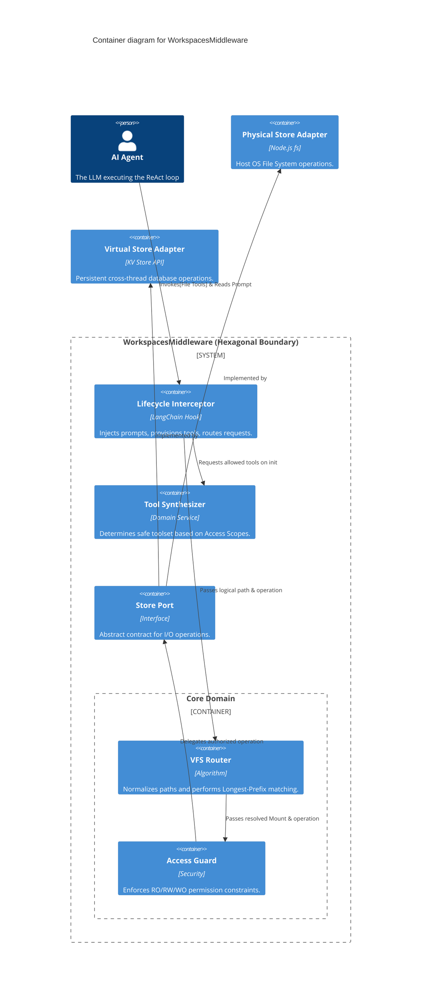
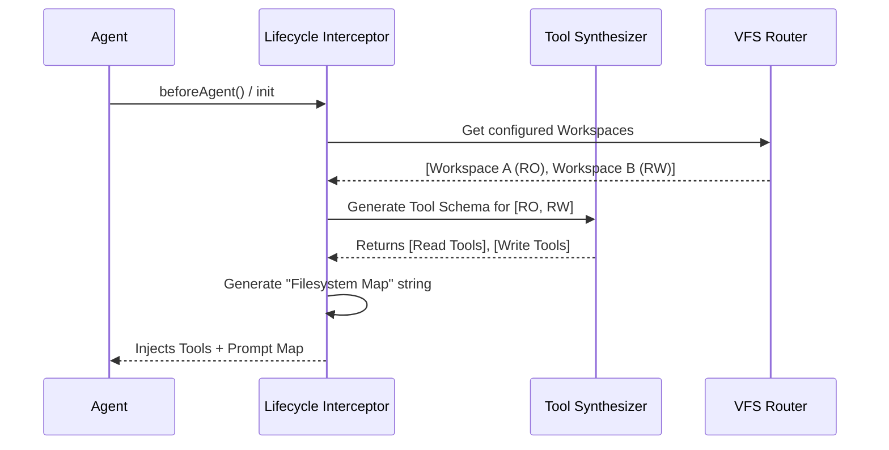
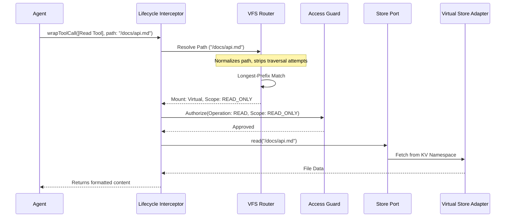
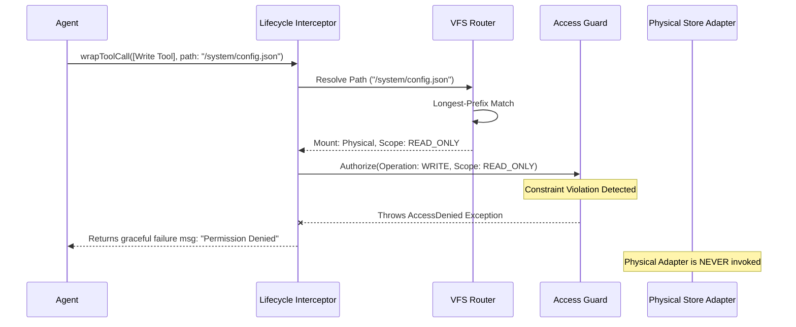

# Architecture.md

## 1. ARCHITECTURAL STRATEGY

**The Pattern:** Hexagonal Architecture (Ports and Adapters) within a Modular Monolith.

**Justification:** 
As noted by Alistair Cockburn, the Hexagonal Architecture allows an application to equally be driven by users, programs, or automated tests, and to be developed and tested in isolation from its eventual run-time devices and databases. 

By applying this pattern to the `WorkspacesMiddleware`:
1.  We isolate the **Core Domain** (VFS Routing, Longest-Prefix Matching, and Access Scope validation).
2.  We treat the LangChain.js agent loop as a **Driving Adapter** (initiating requests).
3.  We treat the Host OS and LangGraph KV Stores as **Driven Adapters** (fulfilling requests).

This ensures that if the underlying LangGraph state implementation changes, or if we need to support a new type of remote filesystem (e.g., S3), the core routing and security logic remains entirely untouched. Furthermore, as Martin Fowler advocates, keeping this as a highly cohesive Modular Monolith avoids the "Microservices Premium," delivering maximum maintainability for a solo developer.

## 2. SYSTEM CONTAINERS (C4 LEVEL 2)

Within the boundary of the `WorkspacesMiddleware`, the system is decomposed into the following logical containers (modules):

*   **[Lifecycle Interceptor]**: *Driving Adapter* - Hooks into the agent execution lifecycle. Intercepts prompts to inject the "Filesystem Map" and intercepts tool invocations to route them to the VFS.
*   **[Tool Synthesizer]**: *Domain Service* - Evaluates the aggregate `AccessScope` of all registered Workspaces to dynamically provision the allowed toolset (TBD signatures) for the agent.
*   **[VFS Router]**: *Core Domain* - Receives normalized POSIX paths. Executes Longest-Prefix Match algorithms to resolve a requested logical path to a specific `Mount`.
*   **[Access Guard]**: *Security Bulkhead* - Sits between the VFS Router and the Store Ports. Cross-references the requested operation type (Read vs. Write) against the resolved Workspace's `AccessScope` (`READ_ONLY`, `READ_WRITE`, `WRITE_ONLY`). Preemptively rejects violations.
*   **[Store Port]**: *Driven Port* - The abstract interface defining standard data operations (Read, Write, List, Search) that all persistence mechanisms must implement.
*   **[Physical Store Adapter]**: *Driven Adapter* - Implements the Store Port. Translates normalized logical paths to host-specific OS paths (handling Windows/POSIX differences) and executes native file I/O.
*   **[Virtual Store Adapter]**: *Driven Adapter* - Implements the Store Port. Translates logical paths to namespace keys and executes operations against an external/cross-thread Key-Value database (e.g., LangGraph `BaseStore`).

## 3. THE CONTAINER DIAGRAM

## 4. CRITICAL EXECUTION FLOWS

### Flow 1: Initialization & Context Injection
*Shows how the middleware provisions the agent safely before the first LLM token is generated.*

### Flow 2: Authorized Virtual File Read
*Shows a successful read operation routed to an abstracted KV store.*

### Flow 3: Unauthorized Physical Write Attempt
*Shows the Access Guard acting as a bulkhead, rejecting the request before touching infrastructure.*

## 5. RESILIENCE & CROSS-CUTTING CONCERNS

*   **The Timeout Pattern (Michael Nygard):** 
    Network-backed adapters (like the `VirtualStoreAdapter` interacting with an external Postgres database) must implement strict timeouts at the `StorePort` boundary. An unresponsive database must not hang the LangChain execution thread indefinitely. If a timeout is reached, the adapter must fail gracefully and return a `"Filesystem unresponsive"` message to the agent.
*   **Path Sanitization & Normalization Bulkhead:**
    Path traversal (`../../`) and null-byte injection are critical failure modes. The `VFS Router` acts as the definitive sanitization boundary. All paths must be coerced into absolute POSIX formats (`/foo/bar`) internally. Adapters receive guaranteed safe, normalized paths.
*   **Fail-Fast Unmapped Routes:**
    If the `VFS Router` cannot match a requested path to an explicitly defined Workspace prefix, the operation fails immediately. There is no implicit fallback to the root directory.

## 6. LOGICAL RISKS & TECHNICAL DEBT

*   **Risk: In-Memory Payload Limits during I/O:**
    While we have explicitly banned storing large files in the ephemeral *graph state*, reading a massive file (e.g., a 500MB log file) via the `StorePort` will still pull that data into the Node.js V8 memory heap before truncating it for the LLM context window. 
    *Mitigation strategy for physical layer:* The `StorePort` contract must eventually support pagination, offsets, or streaming by default, so large files are never buffered entirely in memory.
*   **Risk: Cross-Platform Adapter Leaks:**
    Node.js handles paths differently on Windows vs. Linux. If the `VFS Router` relies on `path.resolve()` without forcing POSIX standards, the longest-prefix match algorithm will break on Windows machines. 
    *Mitigation strategy for physical layer:* The Core Domain must exclusively use POSIX logical paths. Only the `PhysicalStoreAdapter` is allowed to translate logical POSIX paths into OS-specific backslashes.
