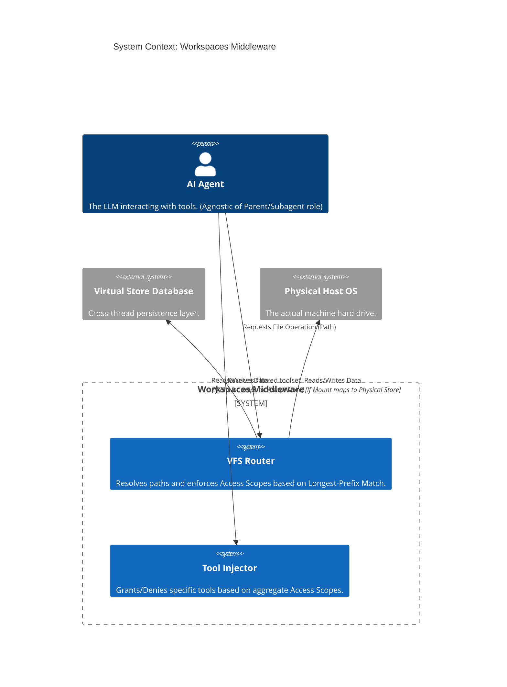
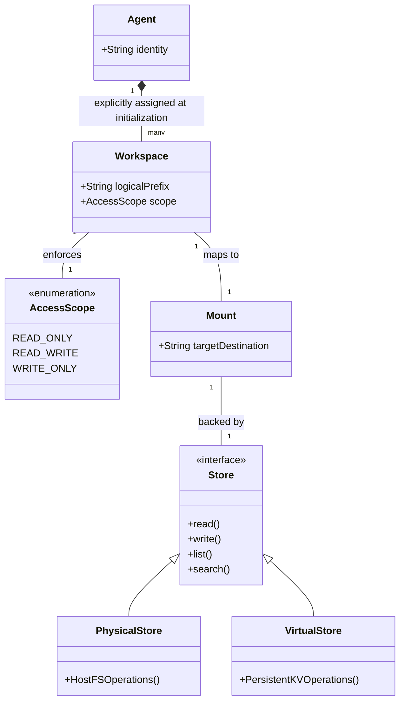

# Product Requirements Document (PRD): WorkspacesMiddleware

## 1. EXECUTIVE SUMMARY

**The Vision:** 
A paradigm shift in how AI agents interact with data. We envision a secure, modular Virtual File System (VFS) where agents operate within strictly bounded, purpose-built environments. Agents should read, write, and analyze data safely and concurrently without the risk of system corruption, cross-agent pollution, or context-window bloat.

**The Problem:** 
Current agent filesystem implementations treat the host machine as a monolithic, shared global namespace. This leads to destructive race conditions, security vulnerabilities (unrestricted file access), and massive token inefficiencies (storing massive files in ephemeral conversation state). 

**Jobs to be Done (JTBD):** 
- *When I attach data access to an AI agent*, I want to *map specific logical directories to isolated physical or virtual storage locations with granular permissions*, so that *the agent's operational blast radius is strictly contained and my system is safe from hallucinations or malicious prompt injections.*
- *When I design multi-agent workflows*, I want *a highly configurable data boundary system*, so that *I can safely provision shared read-only contexts alongside isolated read-write scratchpads without state pollution.*

## 2. UBIQUITOUS LANGUAGE (GLOSSARY)

Strict adherence to these terms is mandatory. Synonyms are forbidden.

| Term | Definition | Do Not Use |
| :--- | :--- | :--- |
| **Workspace** | The logical directory path exposed to the agent (e.g., `/project/docs`), paired with a strict Access Scope. This is the *only* file structure the agent perceives. | Root, Folder, Environment |
| **Access Scope** | The immutable permissions bound to a Workspace. Must be exactly one of: Read-Only (RO), Read-Write (RW), or Write-Only (WO). | Permissions, Rights |
| **Mount** | The underlying target destination that backs a Workspace. This is the translation layer mapping the logical Workspace to a specific Virtual Namespace or Physical Path. | Target, Binding |
| **Store** | The implementation capability that executes file operations (Read, Write, List, Search) against a Mount. Stores are strictly data-centric and incapable of arbitrary compute/execution. | Backend, Adapter |
| **Physical Store** | A Store capability that interacts with the actual host machine's hard drive. | FS Backend, LocalFS |
| **Virtual Store** | A Store capability that interacts with an abstracted, ephemeral, or persistent key-value database, keeping data entirely off the host's physical hard drive. | State Backend, DB Store |

## 3. ACTORS & PERSONAS

**1. The Safety-Conscious Developer (Primary)**
- *Psychographics:* Values predictability and explicit control over magic and automation. Wants to know exactly what an agent can and cannot touch to prevent catastrophic overwrites.

**2. The Multi-Agent Orchestrator (Secondary)**
- *Psychographics:* Builds complex systems where "Planner," "Coder," and "Reviewer" agents interact. Relies on the middleware to provide the foundational isolation necessary to build safe parallel workflows.

## 4. FUNCTIONAL CAPABILITIES

### Epic 1: The VFS Router & Overlapping Boundaries
- **Capability 1.1 - Longest-Prefix Resolution:** The system must evaluate all file operations against configured Workspaces. If Workspaces overlap (e.g., `/home` is RO, `/home/src` is RW), the system must route the operation using longest-prefix match logic.
- **Capability 1.2 - Path Jailbreaking Defense:** The system must intercept and neutralize any directory traversal attempts (e.g., `../../`) ensuring the agent can never escape the logical boundary of a Workspace.

### Epic 2: Strict Access Scope Enforcement
- **Capability 2.1 - Pre-Emptive Rejection:** If an agent attempts an operation that violates a Workspace's Access Scope (e.g., editing a file in an RO Workspace), the system must reject the operation at the routing layer and return a graceful failure message to the agent, without invoking the underlying Store.
- **Capability 2.2 - Dynamic Tool Injection:** The system must intelligently provision tools to the agent based on the aggregate Access Scopes of its Workspaces. (e.g., If an agent only possesses RO Workspaces, "Edit" and "Write" tools must not be injected into its prompt or tool schema).
- **Capability 2.3 - Prompt Map Injection:** The system must dynamically append a "Filesystem Map" to the agent's system prompt, explicitly detailing its available Workspaces and their Access Scopes.

## 5. NON-FUNCTIONAL CONSTRAINTS

- **Separation of Concerns (No Compute):** The system must strictly handle data operations. Arbitrary shell execution or compute must be entirely decoupled from the Store and Workspace capabilities.
- **State Efficiency:** The Virtual Store must not persist large file data inside the agent's ephemeral conversation state (graph state). It must utilize an external or cross-thread persistence layer to prevent Out-Of-Memory (OOM) errors and payload bloat.
- **Failsafe Default (Deny-by-Default):** Any path requested by an agent that does not resolve to an explicitly configured Workspace must be aggressively denied. If the middleware is initialized with an empty configuration, the agent has zero access.

## 6. BOUNDARY ANALYSIS

**In Scope:**
- Logical-to-Physical/Virtual path mapping.
- Granular permission enforcement (RO, RW, WO).
- Dynamic tool availability based on permissions.
- Hierarchical path overrides.

**Explicit Anti-Scope (Out of Scope):**
- **Subagent Lifecycle Management:** The middleware will not manage subagent state, spawning, or automatic permission inheritance. It evaluates the Workspaces it is initialized with, entirely agnostic of whether the caller is a parent or subagent.
- **Shell Execution:** Arbitrary command line execution (e.g., `npm install`, `python script.py`) is fundamentally opposed to file-system operations and is permanently banned from this middleware.
- **State-Based Ephemeral Storage:** Passing the entire file system back and forth through the agent's conversational state payload is banned.

## 7. CONCEPTUAL DIAGRAMS

### Diagram A: The Context (C4 Level 1)

### Diagram B: Domain Model

## 8. ARCHITECTURAL SYNERGY: THE SUBAGENT VISION
*Note: While `WorkspacesMiddleware` is strictly bounded to VFS routing and does not orchestrate subagents, its architecture is the critical enabler for a safe multi-agent paradigm.*

By enforcing explicit Workspace configurations and "Deny-by-Default" isolation, this middleware paves the way for future orchestration layers (e.g., `SubAgentMiddleware`) to provision highly secure, parallelized workflows. 
- **The Isolation Pattern:** An orchestrator can pass a parent agent's codebase as a Read-Only Workspace, alongside a brand new Virtual Store Read-Write Workspace. This acts as a "Copy-on-Write" scratchpad, ensuring the subagent can safely explore and draft code without mutating the parent's environment.
- **The Principle of Least Privilege:** Because Workspaces do not inherit automatically, orchestrators are forced to explicitly grant only the necessary data access to specialized workers, dramatically reducing the security footprint of autonomous systems.

---

### APPENDIX: OPERATOR PREFERENCES (TECHNICAL MAPPING)
*This section provides technical grounding based on the solo developer's expressed preferences.*

1.  **Virtual Store Implementation:** The "Virtual Store" capability maps to the `BaseStore` abstraction in LangGraph (specifically avoiding LangGraph's `State` channels to prevent payload bloat).
2.  **Physical Store Implementation:** The "Physical Store" capability maps to Node.js `fs` / `fs/promises` native APIs.
3.  **Middleware Integration:** The entire system is meant to be implemented as a LangChain.js `AgentMiddleware` utilizing the `wrapToolCall` and `wrapModelCall` hooks.
