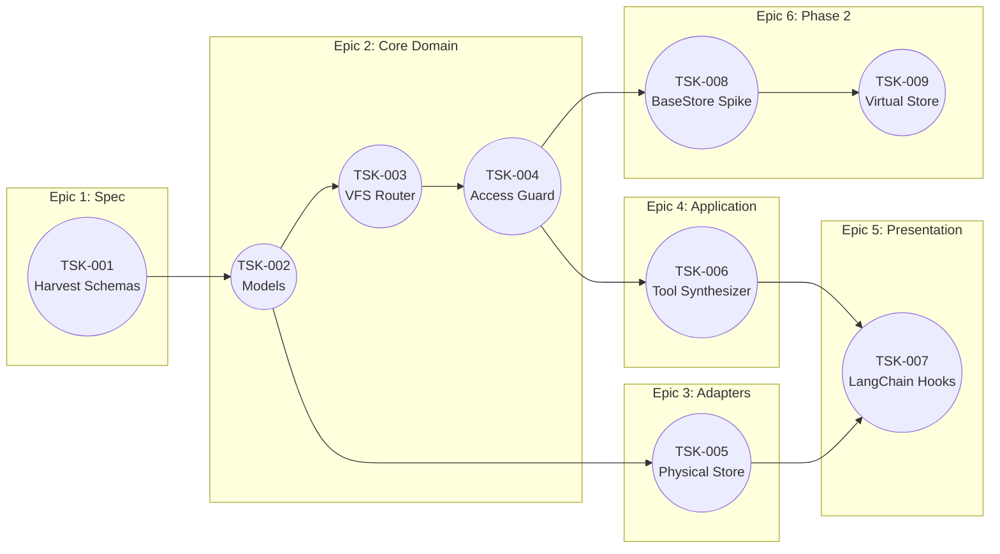

# Tasks.md

## 1. EXECUTIVE SUMMARY
- **Total Estimation:** 32 Story Points
- **Critical Path:** TSK-001 -> TSK-002 -> TSK-003 -> TSK-004 -> TSK-005 -> TSK-006 -> TSK-007

## 2. PROJECT PHASING STRATEGY
- **Phase 1 (MVP - Local Execution):** Focuses on the Core Domain (VFS Routing, Access Guards), the Physical Store Adapter (Node FS), and the LangChain Presentation Layer. Delivers a fully working middleware for local agents.
- **Phase 2 (Persistence & Scale):** Focuses on the Virtual Store Adapter via LangGraph KV stores. Sequenced last to prevent context switching between local path logic and remote database pagination.

## 3. BUILD ORDER (DEPENDENCY GRAPH)



## 4. THE TICKET LIST

### EPIC 1: Specification Harvest

> **(TSK-001) Harvest Reference Tool Signatures**
> - **Type:** Spike
> - **Effort:** 2
> - **Dependencies:** None
> - **Description:** Extract the exact Zod schemas for the file operations (Read, Write, Edit, List, Search) from the reference project. Translate these into the final TypeScript interfaces within `TechSpec.md`.
> - **Acceptance Criteria (Gherkin):**
> ```gherkin
> Given the reference project codebase
> When the developer inspects the tool definitions
> Then the TechSpec.md is updated with concrete TypeScript interfaces for all tool contracts
> And the exact properties for pagination (offset/limit) and string replacement are finalized
> ```

### EPIC 2: Core Domain (Pure TypeScript, No LangChain)

> **(TSK-002) Define Domain Models and Errors**
> - **Type:** Feature
> - **Effort:** 1
> - **Dependencies:** (TSK-001)
> - **Description:** Implement the `AccessScope` enumeration, `MountConfig`, `Workspace` interfaces, and custom Error classes (e.g., `PathTraversalError`, `AccessDeniedError`).
> - **Acceptance Criteria (Gherkin):**
> ```gherkin
> Given a new TypeScript module in src/domain
> When the types are compiled
> Then no external dependencies (including LangChain) are present in the imports
> And custom error classes correctly extend the native Error object
> ```

> **(TSK-003) Implement VFS Router**
> - **Type:** Feature
> - **Effort:** 5
> - **Dependencies:** (TSK-002)
> - **Description:** Implement longest-prefix matching and strict POSIX path normalization. The router must neutralize traversal attempts.
> - **Acceptance Criteria (Gherkin):**
> ```gherkin
> Given a configuration of overlapping Workspace prefixes (e.g., /home and /home/src)
> When a request is made for /home/src/file.txt
> Then the router resolves to the /home/src Workspace
> 
> Given a request path containing traversal sequences (e.g., /home/../etc/passwd)
> When the router normalizes the path
> Then it throws a PathTraversalError if it attempts to escape the root
> ```

> **(TSK-004) Implement Access Guard**
> - **Type:** Feature
> - **Effort:** 3
> - **Dependencies:** (TSK-003)
> - **Description:** Cross-reference requested file operations (READ, WRITE) against the resolved Workspace's `AccessScope`.
> - **Acceptance Criteria (Gherkin):**
> ```gherkin
> Given a Workspace configured with READ_ONLY scope
> When the router passes a WRITE operation to the Access Guard
> Then the Guard throws an AccessDeniedError immediately
> 
> Given a Workspace configured with READ_WRITE scope
> When the router passes a WRITE operation
> Then the Guard returns authorization success
> ```

### EPIC 3: Physical Store Adapter

> **(TSK-005) Implement Physical Store Adapter (Node FS)**
> - **Type:** Feature
> - **Effort:** 5
> - **Dependencies:** (TSK-002)
> - **Description:** Map the `StorePort` interface to native `node:fs/promises` operations. Must safely translate POSIX logical paths to Host OS paths.
> - **Acceptance Criteria (Gherkin):**
> ```gherkin
> Given an authorized READ operation for a valid physical path
> When the PhysicalStoreAdapter executes the request
> Then it returns the file contents using node:fs/promises
> 
> Given an edit request with old_string and new_string
> When the adapter executes the replacement
> Then it successfully overwrites the target string and returns the occurrence count
> ```

### EPIC 4: Application Layer

> **(TSK-006) Implement Tool Synthesizer**
> - **Type:** Feature
> - **Effort:** 3
> - **Dependencies:** (TSK-004)
> - **Description:** A domain service that analyzes the aggregate `AccessScopes` of all registered Workspaces and returns the safe subset of Tool Schemas.
> - **Acceptance Criteria (Gherkin):**
> ```gherkin
> Given a middleware configuration with only READ_ONLY mounts
> When the Tool Synthesizer generates the schema
> Then it returns only read_file, ls, and search tools
> 
> Given a configuration containing at least one READ_WRITE mount
> When the Synthesizer generates the schema
> Then it returns the full suite of read and write tools
> ```

### EPIC 5: Presentation Layer (LangChain Interop)

> **(TSK-007) Implement LangChain Middleware Hooks**
> - **Type:** Feature
> - **Effort:** 5
> - **Dependencies:** (TSK-005), (TSK-006)
> - **Description:** Implement `createWorkspacesMiddleware`. Wire `wrapModelCall` to inject the dynamically generated Filesystem Map prompt. Wire `wrapToolCall` to catch Domain Errors and return them as graceful `ToolMessage` strings to the LLM.
> - **Acceptance Criteria (Gherkin):**
> ```gherkin
> Given the agent initialization phase (beforeModel)
> When the middleware intercepts the system prompt
> Then it appends a formatted string detailing available paths and permissions
> 
> Given an agent attempting an unauthorized write tool call
> When the Access Guard throws an AccessDeniedError
> Then wrapToolCall catches the exception and returns a ToolMessage containing "Permission Denied"
> And the Node.js event loop does not crash
> ```

### EPIC 6: Virtual Store Adapter (Phase 2)

> **(TSK-008) Spike: LangGraph BaseStore Behavior**
> - **Type:** Spike
> - **Effort:** 3
> - **Dependencies:** None
> - **Description:** Time-boxed research to validate how `BaseStore.search()` handles pagination and how to best map logical POSIX paths to the namespace/key tuple required by LangGraph.
> - **Acceptance Criteria (Gherkin):**
> ```gherkin
> Given a local instance of InMemoryStore
> When the developer executes the spike
> Then a brief markdown summary is produced detailing the optimal namespace mapping strategy
> ```

> **(TSK-009) Implement Virtual Store Adapter**
> - **Type:** Feature
> - **Effort:** 5
> - **Dependencies:** (TSK-004), (TSK-008)
> - **Description:** Implement the `StorePort` interface using the LangGraph `BaseStore` API.
> - **Acceptance Criteria (Gherkin):**
> ```gherkin
> Given an authorized WRITE operation routed to a Virtual Mount
> When the VirtualStoreAdapter executes
> Then the file content is persisted to the BaseStore using the designated namespace tuple
> ```

***

The Execution Layer is now fully defined. If you accept this plan, you may begin executing `TSK-001` to finalize the tool contracts. Let me know if you need to adjust any story points or scope boundaries.
