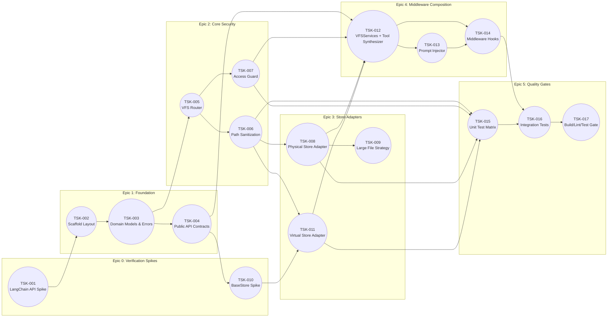

# Tasks.md: WorkspacesMiddleware

## 1. EXECUTIVE SUMMARY
- **Total Estimation:** 59 Story Points
- **Critical Path:** TSK-001 -> TSK-002 -> TSK-003 -> TSK-005 -> TSK-006 -> TSK-008 -> TSK-012 -> TSK-013 -> TSK-014 -> TSK-016 -> TSK-017

## 2. PROJECT PHASING STRATEGY
- **Phase 1 (MVP):** Deliver the complete stateless WorkspacesMiddleware contract (routing, Access Scope enforcement, Physical/Virtual Store adapters, VFSServices injection, prompt/tool orchestration, and full test matrix coverage).
- **Phase 2 (Post-Launch):** Operational tuning only (configurable large-file thresholds/messages, timeout knobs for remote Virtual Store backends, and expanded developer examples). No Phase 2 work is required for TechSpec compliance.

## 3. BUILD ORDER (DEPENDENCY GRAPH)


```mermaid
flowchart LR
    subgraph Epic 0: Verification Spikes
      T1((TSK-001<br/>LangChain API Spike))
      T10((TSK-010<br/>BaseStore Spike))
    end

    subgraph Epic 1: Foundation
      T2((TSK-002<br/>Scaffold Layout))
      T3((TSK-003<br/>Domain Models & Errors))
      T4((TSK-004<br/>Public API Contracts))
    end

    subgraph Epic 2: Core Security
      T5((TSK-005<br/>VFS Router))
      T6((TSK-006<br/>Path Sanitization))
      T7((TSK-007<br/>Access Guard))
    end

    subgraph Epic 3: Store Adapters
      T8((TSK-008<br/>Physical Store Adapter))
      T9((TSK-009<br/>Large File Strategy))
      T11((TSK-011<br/>Virtual Store Adapter))
    end

    subgraph Epic 4: Middleware Composition
      T12((TSK-012<br/>VFSServices + Tool Synthesizer))
      T13((TSK-013<br/>Prompt Injector))
      T14((TSK-014<br/>Middleware Hooks))
    end

    subgraph Epic 5: Quality Gates
      T15((TSK-015<br/>Unit Test Matrix))
      T16((TSK-016<br/>Integration Tests))
      T17((TSK-017<br/>Build/Lint/Test Gate))
    end

    T1 --> T2
    T2 --> T3
    T3 --> T4

    T3 --> T5
    T5 --> T6
    T5 --> T7

    T6 --> T8
    T8 --> T9

    T4 --> T10
    T6 --> T11
    T10 --> T11

    T4 --> T12
    T7 --> T12
    T8 --> T12
    T11 --> T12

    T12 --> T13
    T12 --> T14
    T13 --> T14

    T6 --> T15
    T7 --> T15
    T8 --> T15
    T11 --> T15

    T14 --> T16
    T15 --> T16
    T16 --> T17
```

## 4. THE TICKET LIST

### EPIC 0: Verification Spikes

> **(TSK-001) Spike: Verify LangChain Middleware Signatures**
> - **Type:** Spike
> - **Effort:** 2
> - **Dependencies:** None
> - **Description:** Verify current API signatures for `createMiddleware`, `beforeModel`, `wrapToolCall`, and `ToolMessage` against installed library versions before implementation starts.
> - **Acceptance Criteria (Gherkin):**
> ```gherkin
> Given the middleware APIs declared in TechSpec
> When signatures are checked against current package typings and docs
> Then a verified signature matrix exists for implementation
> And any mismatch is documented before coding begins
> ```

### EPIC 1: Foundation

> **(TSK-002) Scaffold Clean Architecture Layout**
> - **Type:** Chore
> - **Effort:** 2
> - **Dependencies:** (TSK-001)
> - **Description:** Create the source layout mandated by TechSpec (`domain`, `infrastructure`, `application`, `presentation`) and wire package entrypoints.
> - **Acceptance Criteria (Gherkin):**
> ```gherkin
> Given an empty workspaces-middleware package
> When scaffolding is generated per TechSpec section 5.1
> Then all required module directories and index files exist
> And internal imports resolve through @/* aliases
> ```

> **(TSK-003) Implement Core Domain Models and Errors**
> - **Type:** Feature
> - **Effort:** 2
> - **Dependencies:** (TSK-002)
> - **Description:** Implement `AccessScope`, Workspace/Mount domain models, `StorePort`, and domain error types (`PathTraversalError`, `AccessDeniedError`).
> - **Acceptance Criteria (Gherkin):**
> ```gherkin
> Given the domain layer modules
> When TypeScript compilation runs
> Then core models and StorePort contracts compile without infrastructure imports
> And domain errors extend Error with stable names/messages
> ```

> **(TSK-004) Implement Public API Contracts**
> - **Type:** Feature
> - **Effort:** 3
> - **Dependencies:** (TSK-003)
> - **Description:** Implement exported types for `WorkspacesMiddlewareOptions`, `MountConfig`, `RegisteredTool`, `VFSServices`, `ToolResult`, and `OperationType`.
> - **Acceptance Criteria (Gherkin):**
> ```gherkin
> Given the presentation type surface
> When developers define mounts and registered tools with Zod schemas
> Then contracts match TechSpec names and field shapes exactly
> And invalid option shapes fail type checking
> ```

### EPIC 2: Core Security

> **(TSK-005) Implement VFS Router Longest-Prefix Resolution**
> - **Type:** Security
> - **Effort:** 5
> - **Dependencies:** (TSK-003)
> - **Description:** Build POSIX-only router logic (`node:path/posix`) for canonical path coercion and longest-prefix Workspace resolution.
> - **Acceptance Criteria (Gherkin):**
> ```gherkin
> Given overlapping Workspace prefixes like /home and /home/src
> When resolving /home/src/file.ts
> Then the router selects /home/src as the winning mount
> And unresolved paths fail fast with explicit denial
>
> Given an incoming logical request path without a leading slash
> When the router normalizes the path
> Then the path is coerced to an absolute logical path beginning with /
> And normalization does not allow escaping the logical root /
> ```

> **(TSK-006) Implement Path Sanitization Contract**
> - **Type:** Security
> - **Effort:** 3
> - **Dependencies:** (TSK-005)
> - **Description:** Implement `validateFilePath` guarantees (reject traversal, reject `~`, reject Windows absolute paths, normalize slashes, enforce root boundary).
> - **Acceptance Criteria (Gherkin):**
> ```gherkin
> Given a raw request path from a tool call containing ../
> When path validation executes
> Then PathTraversalError is thrown
>
> Given a raw request path from a tool call containing ~
> When path validation executes
> Then PathTraversalError is thrown
>
> Given a raw request path from a tool call containing a Windows absolute prefix like C:/
> When path validation executes
> Then PathTraversalError is thrown
>
> Given a raw request path containing backslashes
> When path validation executes
> Then separators are normalized to forward slashes
> And normalized safe paths are returned as relative keys only
> ```

> **(TSK-007) Implement Access Guard Authorization**
> - **Type:** Security
> - **Effort:** 2
> - **Dependencies:** (TSK-005)
> - **Description:** Enforce operation permissions (`read`, `write`, `edit`, `list`, `search`) against `AccessScope` with deny-by-default behavior.
> - **Acceptance Criteria (Gherkin):**
> ```gherkin
> Given a READ_ONLY Workspace
> When a write-like operation is authorized
> Then AccessDeniedError is thrown
> And allowed operations pass without side effects
>
> Given a WRITE_ONLY Workspace
> When a read-like operation is authorized
> Then AccessDeniedError is thrown
>
> Given a request path that does not map to any configured Workspace
> When authorization is evaluated
> Then the operation is denied by default
> ```

### EPIC 3: Store Adapters

> **(TSK-008) Implement Physical Store Adapter with Symlink Defense**
> - **Type:** Security
> - **Effort:** 5
> - **Dependencies:** (TSK-006)
> - **Description:** Implement Physical Store operations on `node:fs/promises`, translate logical POSIX keys to host paths, and block symlink escapes using `O_NOFOLLOW` and/or `lstat`.
> - **Acceptance Criteria (Gherkin):**
> ```gherkin
> Given an authorized file operation in a physical mount
> When the adapter performs read/write/edit/list
> Then host filesystem I/O succeeds only within the workspace root
> And symlink-based escape attempts are rejected
> ```

> **(TSK-009) Implement Large-File Read Strategy**
> - **Type:** Feature
> - **Effort:** 3
> - **Dependencies:** (TSK-008)
> - **Description:** Add streaming reads above threshold, pagination via `offset/limit`, and truncation warning messaging for context-window safety.
> - **Acceptance Criteria (Gherkin):**
> ```gherkin
> Given a file larger than the default streaming threshold of 256KB
> When read is requested without pagination
> Then the adapter returns truncated content with the required warning suffix
> And offset/limit requests return the expected window
> ```

> **(TSK-010) Spike: Validate BaseStore Namespace/Key Mapping**
> - **Type:** Spike
> - **Effort:** 2
> - **Dependencies:** (TSK-004)
> - **Description:** Validate BaseStore behavior for namespace tuple + key mapping, and define deterministic prefix-listing strategy (`yieldKeys(prefix)`).
> - **Acceptance Criteria (Gherkin):**
> ```gherkin
> Given logical paths and a base namespace
> When BaseStore mapping behavior is evaluated
> Then a collision-free namespace/key strategy is documented
> And prefix listing behavior is verified for directory-like queries
> ```

> **(TSK-011) Implement Virtual Store Adapter**
> - **Type:** Feature
> - **Effort:** 5
> - **Dependencies:** (TSK-006), (TSK-010)
> - **Description:** Implement Virtual Store operations against BaseStore using normalized relative keys and configured namespace tuples.
> - **Acceptance Criteria (Gherkin):**
> ```gherkin
> Given an authorized operation on a virtual mount
> When read/write/edit/list is executed
> Then data is persisted and retrieved via namespace tuple + normalized key
> And list operations return expected entries for a prefix
>
> Given a network-backed virtual store operation that exceeds timeout limits
> When the timeout boundary is reached
> Then the operation fails gracefully with a Filesystem unresponsive result
> ```

### EPIC 4: Middleware Composition

> **(TSK-012) Implement VFSServices Builder and Tool Synthesizer**
> - **Type:** Feature
> - **Effort:** 3
> - **Dependencies:** (TSK-004), (TSK-007), (TSK-008), (TSK-011)
> - **Description:** Build thin VFSServices (`resolve`, `read`, `write`, `list`, `stat`) and tool-availability synthesis based on aggregate Access Scope.
> - **Acceptance Criteria (Gherkin):**
> ```gherkin
> Given mount scopes and registered tool operation declarations
> When VFSServices are created for a tool call
> Then resolution and authorization are enforced before store access
> And disallowed operations are excluded from the safe toolset
>
> Given middleware configuration with no mounts
> When the safe toolset is synthesized
> Then no filesystem operations are exposed
> ```

> **(TSK-013) Implement Filesystem Map Prompt Injector**
> - **Type:** Feature
> - **Effort:** 2
> - **Dependencies:** (TSK-012)
> - **Description:** Regenerate and inject the Filesystem Map on every `beforeModel` turn so prompt context always reflects current mount reality.
> - **Acceptance Criteria (Gherkin):**
> ```gherkin
> Given middleware invocation before each model turn
> When configured mounts or scopes differ between turns
> Then the injected Filesystem Map reflects the latest mount configuration
> And stale map content is never reused
> ```

> **(TSK-014) Implement createWorkspacesMiddleware Hook Orchestration**
> - **Type:** Feature
> - **Effort:** 8
> - **Dependencies:** (TSK-012), (TSK-013)
> - **Description:** Implement `createWorkspacesMiddleware` with `contextSchema` (`threadId`, `runId`), tool lookup, Zod parsing, operation authorization, handler invocation, and graceful `ToolMessage` boundary handling.
> - **Acceptance Criteria (Gherkin):**
> ```gherkin
> Given a registered developer tool call
> When args validate and operations are authorized
> Then middleware invokes handler(params, services) and returns ToolMessage(content)
> And thrown errors are converted to graceful ToolMessage failures
> And no Command/state channel file mutation is emitted
> ```

### EPIC 5: Quality Gates

> **(TSK-015) Implement Unit Test Matrix from TechSpec**
> - **Type:** Chore
> - **Effort:** 5
> - **Dependencies:** (TSK-006), (TSK-007), (TSK-008), (TSK-011)
> - **Description:** Implement unit coverage for all mandatory security scenarios in TechSpec section 5.6 plus large-file/pagination behavior.
> - **Acceptance Criteria (Gherkin):**
> ```gherkin
> Given a test case where path contains ../
> When router validation executes
> Then PathTraversalError is thrown
>
> Given a test case where path contains ~
> When router validation executes
> Then PathTraversalError is thrown
>
> Given a test case where path is Windows absolute like C:/
> When router validation executes
> Then PathTraversalError is thrown
>
> Given a symlink pointing outside workspace root
> When physical adapter read/write executes
> Then the operation is rejected by O_NOFOLLOW or lstat verification
>
> Given a read request to a non-existent file
> When middleware boundary handling executes
> Then ToolMessage returns File not found
>
> Given a write request to a READ_ONLY workspace
> When access guard evaluation executes
> Then AccessDeniedError is raised and returned as ToolMessage
> ```

> **(TSK-016) Implement End-to-End Integration Tests**
> - **Type:** Chore
> - **Effort:** 5
> - **Dependencies:** (TSK-014), (TSK-015)
> - **Description:** Validate full middleware flow with developer-provided thick tools across physical and virtual mounts.
> - **Acceptance Criteria (Gherkin):**
> ```gherkin
> Given an agent configured with registered tools and WorkspacesMiddleware
> When tools execute read/write/edit/list flows through VFSServices
> Then authorized operations succeed and unauthorized operations return graceful ToolMessage failures
> And runtime stability is preserved (no unhandled exception crash)
>
> Given two concurrent agent executions with isolated virtual namespaces
> When both agents read and write in parallel
> Then data remains isolated without cross-namespace contamination
> ```

> **(TSK-017) Execute Build, Lint, and Test Quality Gate**
> - **Type:** Chore
> - **Effort:** 2
> - **Dependencies:** (TSK-016)
> - **Description:** Run final package validation using repository-standard commands and confirm ESM-compatible output.
> - **Acceptance Criteria (Gherkin):**
> ```gherkin
> Given the completed implementation and test suites
> When build, lint, and test commands are executed
> Then all checks pass without disabling hooks or safety constraints
> And output remains ESM-compatible for Node and Bun environments
> ```

***
