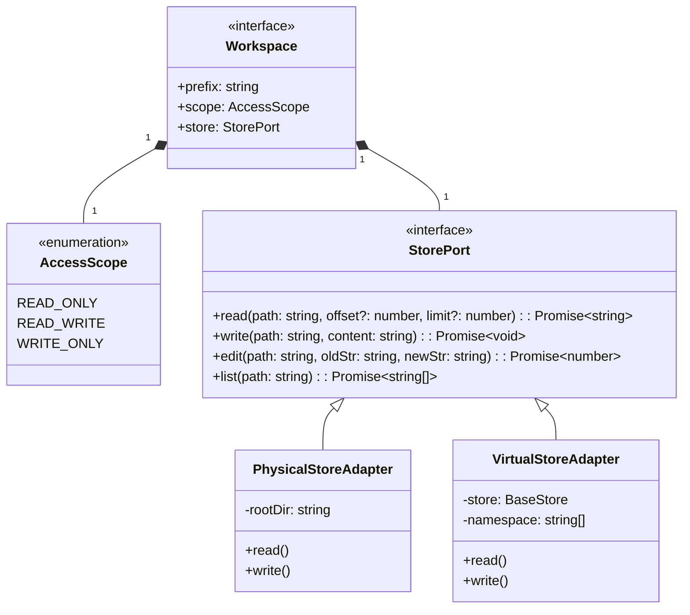

# Technical Specification (TechSpec.md): WorkspacesMiddleware

## 1. STACK SPECIFICATION (BILL OF MATERIALS)
- **Target Runtime:** Universal JavaScript (Node.js >= 20.x, Bun >= 1.1).
- **Language:** TypeScript 5.x (Strict Mode `true`, `noImplicitAny: true`).
- **Validation:** `zod` (^3.23.0).
- **LangChain Dependencies:** `@langchain/core`, `langchain`, `@langchain/langgraph`, `@langchain/langgraph-checkpoint`.
- **I/O Libraries:** `node:fs/promises` (Physical Store), `node:path/posix` (Logical Routing), `node:path` (Physical Routing).

## 2. ARCHITECTURE DECISION RECORDS (ADRS)

| Title | Context | Decision | Consequences |
| :--- | :--- | :--- | :--- |
| **ADR-001: Strict POSIX Logical Pathing** | Node.js handles paths differently on Windows (`\`) vs. Unix (`/`). If the VFS Router uses native `path.resolve`, longest-prefix matching will fail across OS environments. | The Core Domain (`VFS Router`) will exclusively use `node:path/posix` for all logical routing. Translation to OS-specific paths occurs only inside the `PhysicalStoreAdapter`. | Ensures deterministic virtual routing regardless of host OS. Requires strict sanitization before hitting disk. |
| **ADR-002: BaseStore Key Mapping** | LangGraph `BaseStore` expects a namespace tuple and a string key. We must map logical paths like `/project/docs/api.md` to this format without collisions. | `VirtualStoreAdapter` will accept a base namespace (e.g., `["workspaces", agentId]`). The physical key will be the relative logical path without leading slashes (e.g., `project/docs/api.md`). | Prevents key-collision with other LangGraph storage mechanics and allows clean sub-namespace searching. |
| **ADR-003: Stateless File Operations** | Previous implementations mutated LangGraph's ephemeral `state.files` object, causing massive payload bloat and OOM risks on large files. | `wrapToolCall` will execute I/O via the Store Adapters and return a standard `ToolMessage`. It will **never** return a `Command` that updates a `files` state channel. | Decouples file persistence from graph state limits. Agents must explicitly read files to access content. |
| **ADR-004: Ecosystem Interoperability** | Using Bun-specific APIs (`Bun.file`) would fracture compatibility with Node.js and Deno. | Use standard `node:fs/promises`. Bun's runtime will natively optimize these calls automatically. | Retains 100% ecosystem compatibility while preserving high performance in Bun environments. |

## 3. CORE DOMAIN INTERFACES (DATA MODELS)



## 4. API CONTRACT (PROGRAMMATIC INTERFACES)

### 4.1. Middleware Initialization Contract
The public API for the developer configuring the agent.

```typescript
export type AccessScope = "READ_ONLY" | "READ_WRITE" | "WRITE_ONLY";

export interface MountConfig {
  prefix: string;          // Logical path, e.g., "/project"
  scope: AccessScope;
  store: StorePort;        // The injected adapter
}

export interface WorkspacesMiddlewareOptions {
  mounts: Array<MountConfig>;
}
```

### 4.2. Tool Interfaces (The Deferred LLM Contracts)
While the precise Zod schemas will be harvested during the Execution phase, the underlying TypeScript interfaces that dictate the expected LLM inputs are firmly defined here. 

```typescript
// Read operation. Provisioned for RO and RW scopes.
export interface ReadFileContract {
  path: string;
  offset?: number;
  limit?: number;
}

// Write operation. Provisioned only for RW and WO scopes.
export interface WriteFileContract {
  path: string;
  content: string;
}

// Edit operation. Provisioned only for RW and WO scopes.
export interface EditFileContract {
  path: string;
  old_string: string;
  new_string: string;
}

// List operation. Provisioned for RO and RW scopes.
export interface ListDirectoryContract {
  path: string;
}
```

## 5. IMPLEMENTATION GUIDELINES

### 5.1. Clean Architecture Project Layout
To enforce the decoupling mandated by our ADRs, the project must adhere to the following directory structure. Dependency inversion must be utilized so the Core Domain never imports from `infrastructure` or `presentation`.

```sh
src/
├── domain/                    
│   ├── errors.ts              # e.g., AccessDeniedError, PathTraversalError
│   ├── models.ts              # AccessScope, MountConfig, Workspace
│   ├── store-port.ts          # StorePort interface
│   ├── vfs-router.ts          # Longest-prefix match and path normalization logic
│   └── access-guard.ts        # RBAC enforcer
├── infrastructure/            
│   ├── physical-store.ts      # node:fs implementation of StorePort
│   └── virtual-store.ts       # LangGraph BaseStore implementation of StorePort
├── application/               
│   └── tool-synthesizer.ts    # Generates safe toolsets based on AccessScopes
└── presentation/              
    ├── index.ts               # Public exports (createWorkspacesMiddleware)
    ├── middleware.ts          # LangChain wrapModelCall, wrapToolCall hooks
    └── prompt-injector.ts     # System prompt formatting ("Filesystem Map")
```

### 5.2. Coding Standards & Failsafes
1.  **Strict Path Coercion:** All paths entering the `VFS Router` must immediately be coerced into absolute logical paths starting with `/`. Traversal sequences (`../`) must be resolved logically and rejected if they attempt to escape the root `/`.
2.  **Stateless Iteration:** The `Filesystem Map` injected into the prompt must be regenerated dynamically via the `wrapModelCall` hook on every turn. This ensures that if mount configurations are somehow altered dynamically (e.g., via another higher-level orchestrator), the agent's prompt reflects the exact reality of that specific turn.
3.  **Exception Handling at the Boundary:** Any error thrown by the `infrastructure` layer (e.g., `ENOENT` from Node.js) must be caught by the `wrapToolCall` adapter and transformed into a graceful string message returned as a `ToolMessage` to the LLM. The Node.js event loop must never crash due to a bad LLM tool call.

***

