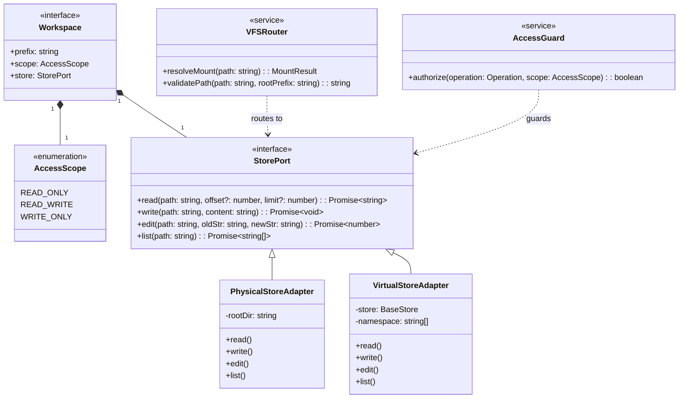

# Technical Specification (TechSpec.md): WorkspacesMiddleware

## 1. STACK SPECIFICATION (BILL OF MATERIALS)
- **Target Runtime:** Node.js >= 20.x, Bun >= 1.1 (Universal JS for library compatibility).
- **Language:** TypeScript 5.x (Strict Mode `true`, `noImplicitAny: true`).
- **Validation:** `zod` (^3.23.0).
- **LangChain Dependencies:** `@langchain/core`, `langchain` (peer).
- **Built-in Modules:** `node:fs/promises` (Physical Store), `node:path/posix` (Logical Routing), `node:path` (Physical Routing).

## 2. ARCHITECTURE DECISION RECORDS (ADRS)

| Title | Context | Decision | Consequences |
| :--- | :--- | :--- | :--- |
| **ADR-001: Strict POSIX Logical Pathing** | Node.js handles paths differently on Windows (`\`) vs. Unix (`/`). If the VFS Router uses native `path.resolve`, longest-prefix matching will fail across OS environments. | The Core Domain (`VFS Router`) will exclusively use `node:path/posix` for all logical routing. Translation to OS-specific paths occurs only inside the `PhysicalStoreAdapter`. | Ensures deterministic virtual routing regardless of host OS. Requires strict sanitization before hitting disk. |
| **ADR-002: BaseStore Key Mapping** | LangGraph `BaseStore` expects a namespace tuple and a string key. We must map logical paths like `/project/docs/api.md` to this format without collisions. | `VirtualStoreAdapter` will accept a base namespace (e.g., `["workspaces", agentId]`). The physical key will be the relative logical path without leading slashes (e.g., `project/docs/api.md`). | Prevents key-collision with other LangGraph storage mechanics and allows clean sub-namespace searching via `yieldKeys(prefix)`. |
| **ADR-003: Stateless File Operations** | Previous implementations mutated LangGraph's ephemeral `state.files` object, causing massive payload bloat and OOM risks on large files. | `wrapToolCall` will execute I/O via the Store Adapters and return a standard `ToolMessage`. It will **never** return a `Command` that updates a `files` state channel. | Decouples file persistence from graph state limits. Agents must explicitly read files to access content. |
| **ADR-004: Ecosystem Interoperability** | Using Bun-specific APIs (`Bun.file`) would fracture compatibility with Node.js and Deno. | Use standard `node:fs/promises`. Bun's runtime will natively optimize these calls automatically. | Retains 100% ecosystem compatibility while preserving high performance in Bun environments. |
| **ADR-005: Symlink Attack Prevention** | Per DeepAgents security model, an LLM could create symlinks to escape the workspace boundary. | `PhysicalStoreAdapter` must open files with `O_NOFOLLOW` flag (or verify via `lstat`) before any read/write operation. Symlink targets are rejected. | Prevents sandbox escape via maliciously crafted symlinks. Adds slight I/O overhead per operation. |
| **ADR-006: Middleware State Isolation** | LangChain's `createMiddleware` provides `stateSchema` for persistent state and `contextSchema` for per-invocation context. We need neither - files are external. | The middleware will use `contextSchema` to capture `threadId`/`runId` for logging but will not persist any workspace state in LangGraph's state channels. | Keeps the middleware stateless; simplifies checkpoint/resume scenarios since file state lives in the Store, not graph state. |

## 3. CORE DOMAIN INTERFACES (DATA MODELS)


```mermaid
classDiagram
    direction TB

    class AccessScope {
        <<enumeration>>
        READ_ONLY
        READ_WRITE
        WRITE_ONLY
    }

    class Workspace {
        <<interface>>
        +prefix: string
        +scope: AccessScope
        +store: StorePort
    }

    class StorePort {
        <<interface>>
        +read(path: string, offset?: number, limit?: number): Promise~string~
        +write(path: string, content: string): Promise~void~
        +edit(path: string, oldStr: string, newStr: string): Promise~number~
        +list(path: string): Promise~string[]~
    }

    class VFSRouter {
        <<service>>
        +resolveMount(path: string): MountResult
        +validatePath(path: string, rootPrefix: string): string
    }

    class AccessGuard {
        <<service>>
        +authorize(operation: Operation, scope: AccessScope): boolean
    }

    class PhysicalStoreAdapter {
        -rootDir: string
        +read()
        +write()
        +edit()
        +list()
    }

    class VirtualStoreAdapter {
        -store: BaseStore
        -namespace: string[]
        +read()
        +write()
        +edit()
        +list()
    }

    Workspace "1" *-- "1" AccessScope
    Workspace "1" *-- "1" StorePort
    VFSRouter ..> StorePort : routes to
    AccessGuard ..> StorePort : guards
    StorePort <|-- PhysicalStoreAdapter
    StorePort <|-- VirtualStoreAdapter
```

## 4. API CONTRACT (PROGRAMMATIC INTERFACES)

### 4.1. Middleware Initialization Contract

The developer configures the middleware by providing mount definitions and registering their custom tools. The middleware provides thin I/O services that tools consume.

```typescript
// ============================================================================
// TYPES: What the Developer Configures
// ============================================================================

export type AccessScope = "READ_ONLY" | "READ_WRITE" | "WRITE_ONLY";

export interface PhysicalStoreConfig {
  type: "physical";
  rootDir: string;
}

export interface VirtualStoreConfig {
  type: "virtual";
  namespace: string[];
}

export type StoreConfig = PhysicalStoreConfig | VirtualStoreConfig;

export interface MountConfig {
  prefix: string;          // Logical path, e.g., "/project"
  scope: AccessScope;
  store: StoreConfig;
}

export interface WorkspacesMiddlewareOptions {
  mounts: Array<MountConfig>;
  tools: Array<RegisteredTool>;  // Developer's custom tools
}
```

### 4.2. Developer Tool Contract (Thick Tool, Thin Service)

The middleware provides **thin I/O services**. The developer brings **thick tools** that contain all the logic. Tools receive resolved content and return new content.

```typescript
// ============================================================================
// TYPES: What the Middleware Provides to Developer Tools (Injectable)
// ============================================================================

/**
 * Thin I/O service - provides primitive file operations.
 * Developer tools MUST consume these to read/write files.
 */
export interface VFSServices {
  /**
   * Resolve a logical path to its mounted location and normalized key.
   * Performs path validation and access checks.
   */
  resolve(path: string): VFSResolution;

  /**
   * Read the FULL content of a file.
   * Returns the complete file contents as a string.
   */
  read(key: string): Promise<string>;

  /**
   * Write the FULL new content to a file.
   * Replaces entire file contents.
   */
  write(key: string, content: string): Promise<void>;

  /**
   * List files in a directory.
   * @param key - Directory key (without trailing slash)
   */
  list(key: string): Promise<string[]>;

  /**
   * Get metadata about a file.
   */
  stat(key: string): Promise<FileMetadata>;
}

export interface VFSResolution {
  mount: MountConfig;
  normalizedKey: string;  // Sanitized relative path
  scope: AccessScope;
}

export interface FileMetadata {
  exists: boolean;
  isDirectory: boolean;
  size?: number;
  modified?: Date;
}

// ============================================================================
// TYPES: What Developer Tools MUST Return
// ============================================================================

/**
 * Contract that ALL developer tools MUST return.
 * This is what the LLM sees in its context.
 */
export interface ToolResult {
  /** The message content that the LLM sees */
  content: string;
  
  /** Optional metadata for middleware/agent awareness */
  metadata?: {
    /** What operation was performed */
    operation?: "read" | "write" | "edit" | "list" | "search";
    /** Files that were modified */
    filesModified?: string[];
    /** Files that were read */
    filesRead?: string[];
  };
}

// ============================================================================
// TYPES: How Developer Registers Their Tools
// ============================================================================

/**
 * Operation types - declared by developer for access control
 */
export type OperationType = "read" | "write" | "edit" | "list" | "search";

/**
 * A tool registration from the developer.
 * Developer defines ANY signature they want - middleware just wraps it.
 */
export interface RegisteredTool {
  /** Tool name - passed directly to agent */
  name: string;
  
  /** Tool description - passed directly to agent */
  description: string;
  
  /** Zod schema for parameters - passed directly to agent's schema */
  parameters: ZodSchema;
  
  /** Operations this tool performs - for access control enforcement */
  operations: OperationType[];
  
  /**
   * The tool handler - developer provides FULL logic.
   * Receives parsed params + our services.
   * MUST return ToolResult.
   */
  handler: (
    params: unknown,      // Already validated against parameters schema
    services: VFSServices // Our thin I/O services
  ) => Promise<ToolResult>;
}
```

### 4.3. Path Sanitization Contract (DeepAgents Pattern)

Following the security model from LangChain's DeepAgents filesystem middleware, the VFS Router must implement the following sanitization guarantees:

```typescript
/**
 * Validates and normalizes a file path for security.
 * Throws PathTraversalError if the path attempts to escape the sandbox.
 * 
 * @param requestPath - The raw path from the LLM tool call
 * @param rootPrefix - The mounted workspace prefix (e.g., "/project")
 * @returns Normalized POSIX path (e.g., "project/docs/api.md")
 */
export function validateFilePath(
  requestPath: string, 
  rootPrefix: string
): string {
  // 1. Reject traversal sequences
  if (requestPath.includes("..") || requestPath.includes("~")) {
    throw new PathTraversalError("Path traversal not allowed");
  }
  
  // 2. Reject Windows absolute paths
  if (/^[a-zA-Z]:/.test(requestPath)) {
    throw new PathTraversalError("Absolute Windows paths not allowed");
  }
  
  // 3. Normalize separators to forward slashes
  const normalized = requestPath.replace(/\\/g, "/");
  
  // 4. Strip leading slash to create relative key
  const relativeKey = normalized.replace(/^\//, "");
  
  // 5. Verify the resolved path stays within rootPrefix
  const resolved = path.posix.resolve(rootPrefix, relativeKey);
  if (!resolved.startsWith(rootPrefix)) {
    throw new PathTraversalError("Path escapes workspace boundary");
  }
  
  return relativeKey;
}
```

**Security Guarantees (Per DeepAgents Pattern):**
1. **Traversal Prevention:** Rejects `../`, `~`, and Windows absolute paths (`C:/`)
2. **Symlink Guard:** When using `PhysicalStoreAdapter`, files must be opened with `O_NOFOLLOW` or verified via `lstat` to prevent symlink-based escapes
3. **Canonical Resolution:** All paths are resolved against the workspace prefix before I/O occurs
4. **POSIX Normalization:** Internal routing always uses POSIX paths; OS-specific translation happens only in the adapter layer

## 5. IMPLEMENTATION GUIDELINES

### 5.1. Clean Architecture Project Layout
To enforce the decoupling mandated by our ADRs, the project must adhere to the following directory structure. Dependency inversion must be utilized so the Core Domain never imports from `infrastructure` or `presentation`.

```sh
src/
├── domain/                    
│   ├── errors.ts              # e.g., AccessDeniedError, PathTraversalError
│   ├── models.ts              # AccessScope, MountConfig, Workspace
│   ├── store-port.ts          # StorePort interface
│   ├── vfs-router.ts          # Longest-prefix match and path normalization logic
│   └── access-guard.ts        # RBAC enforcer
├── infrastructure/            
│   ├── physical-store.ts      # node:fs implementation of StorePort
│   └── virtual-store.ts       # LangGraph BaseStore implementation of StorePort
├── application/               
│   └── tool-synthesizer.ts    # Generates safe toolsets based on AccessScopes
└── presentation/              
    ├── index.ts               # Public exports (createWorkspacesMiddleware)
    ├── middleware.ts          # LangChain wrapModelCall, wrapToolCall hooks
    └── prompt-injector.ts     # System prompt formatting ("Filesystem Map")
```

### 5.2. Coding Standards & Failsafes

1.  **Strict Path Coercion:** All paths entering the `VFS Router` must immediately be coerced into absolute logical paths starting with `/`. Traversal sequences (`../`) must be resolved logically and rejected if they attempt to escape the root `/`.
2.  **Stateless Iteration:** The `Filesystem Map` injected into the prompt must be regenerated dynamically via the `beforeModel` hook on every turn. This ensures that if mount configurations are somehow altered dynamically (e.g., via another higher-level orchestrator), the agent's prompt reflects the exact reality of that specific turn.
3.  **Exception Handling at the Boundary:** Any error thrown by the `infrastructure` layer (e.g., `ENOENT` from Node.js) must be caught by the `wrapToolCall` adapter and transformed into a graceful string message returned as a `ToolMessage` to the LLM. The Node.js event loop must never crash due to a bad LLM tool call.

### 5.3. Middleware Hook Implementation (Thick Tool Pattern)

Following LangChain's `createMiddleware` API (circa 2025/2026), the middleware wraps developer-registered tools and injects VFSServices.

```typescript
import { createMiddleware } from "langchain";
import { z } from "zod";

export const workspacesMiddleware = createMiddleware({
  name: "workspaces-vfs",
  
  // Capture thread context for logging/tracing without persisting in graph state
  contextSchema: z.object({
    threadId: z.string().optional(),
    runId: z.string().optional(),
  }),

  // Inject Filesystem Map into system prompt before each model turn
  beforeModel: async (state, runtime) => {
    const fsMap = generateFilesystemMap(runtime);
    // Inject into the first system message or prepend as system instruction
    return {};
  },

  // Intercept tool calls - wrap developer tools with VFSServices
  wrapToolCall: async (request, handler) => {
    const { toolCall } = request;
    const toolName = toolCall.name;
    
    // 1. Find registered tool
    const registeredTool = this.registeredTools.get(toolName);
    if (!registeredTool) {
      // Not our tool - pass through to default handler
      return handler();
    }

    // 2. Validate params against tool's Zod schema
    const params = registeredTool.parameters.parse(toolCall.args);

    // 3. Build VFSServices with access control
    const services = this.buildVFSServices(registeredTool.operations);

    // 4. Check access - authorize operations declared by tool
    for (const op of registeredTool.operations) {
      services.authorize(op); // Throws if denied
    }

    try {
      // 5. Execute developer's handler with injected services
      const result = await registeredTool.handler(params, services);
      
      // 6. Return ToolMessage with result content
      return new ToolMessage({
        tool_call_id: toolCall.id,
        content: result.content,
      });
    } catch (error) {
      // Transform to graceful error message - never let exception bubble
      return new ToolMessage({
        tool_call_id: toolCall.id,
        content: `Error: ${error.message}`,
      });
    }
  },
});
```

### 5.4. Developer Usage Example

This is how a developer uses the middleware - registering their thick tools:

```typescript
import { createAgent } from "langchain";
import { createWorkspacesMiddleware, type VFSServices } from "workspaces-middleware";
import { z } from "zod";

// DEVELOPER'S THICK TOOL - contains ALL the logic
const strReplaceTool = {
  name: "str_replace",
  description: "Replace exact text in a file",
  
  // ANY signature developer wants
  parameters: z.object({
    path: z.string(),
    oldStr: z.string(),
    newStr: z.string(),
  }),
  
  // Declares what operations this tool performs
  operations: ["edit"],
  
  // FULL LOGIC - developer handles everything
  handler: async (params: { path: string; oldStr: string; newStr: string }, services: VFSServices) => {
    // 1. Get FULL content from OUR service
    const resolved = services.resolve(params.path);
    const current = await services.read(resolved.normalizedKey);
    
    // 2. Developer does their logic (string replacement, AI, etc.)
    if (!current.includes(params.oldStr)) {
      return { 
        content: `Error: String not found in file`,
        metadata: { operation: "edit" }
      };
    }
    const updated = current.replace(params.oldStr, params.newStr);
    
    // 3. Write FULL new content to OUR service
    await services.write(resolved.normalizedKey, updated);
    
    // 4. Return OUR contract
    return { 
      content: `Replaced "${params.oldStr}" with "${params.newStr}"`,
      metadata: { operation: "edit", filesModified: [params.path] }
    };
  },
};

// Another example - semantic AI edit tool
const semanticEditTool = {
  name: "semantic_edit",
  description: "Edit file using natural language instructions",
  
  parameters: z.object({
    path: z.string(),
    instruction: z.string(),  // Developer's own signature
  }),
  
  operations: ["read", "write"],
  
  handler: async (params, services) => {
    // 1. Read full content via OUR service
    const resolved = services.resolve(params.path);
    const content = await services.read(resolved.normalizedKey);
    
    // 2. Developer does ANY logic (e.g., call AI)
    const edit = await myAI.editFile(content, params.instruction);
    
    // 3. Write via OUR service
    await services.write(resolved.normalizedKey, edit.newContent);
    
    // 4. Return OUR contract
    return { 
      content: edit.explanation,
      metadata: { operation: "edit", filesModified: [params.path] }
    };
  },
};

// Pass middleware to agent - tools go DIRECTLY to agent
const agent = createAgent({
  model,
  tools: [strReplaceTool, semanticEditTool],  // ← Direct pass!
  middleware: createWorkspacesMiddleware({
    mounts: [
      { prefix: "/project", scope: "READ_WRITE", store: { type: "physical", rootDir: "./workspace" } }
    ],
    tools: [strReplaceTool, semanticEditTool],
  }),
});
```

### 5.5. Large File Eviction Strategy

Per the DeepAgents middleware pattern, large file reads present memory risks. The `StorePort` implementation must:

1. **Streaming Reads:** Use file streams rather than `readFile` for files exceeding a configurable threshold (default: 256KB)
2. **Pagination Support:** The `ReadFileContract` supports `offset` and `limit` parameters; adapters must honor these
3. **Truncation with Warning:** If a file exceeds the LLM context window, truncate and append: `[...truncated. File size: X bytes. Use offset/limit to read remaining content.]`

### 5.6. Test Coverage Requirements

| Scenario | Expected Outcome |
|----------|-----------------|
| Path contains `../` | Throws `PathTraversalError` |
| Path contains `~` | Throws `PathTraversalError` |
| Path is Windows absolute (`C:/`) | Throws `PathTraversalError` |
| Symlink points outside workspace | Rejected (O_NOFOLLOW or lstat check) |
| Read non-existent file | Returns `ToolMessage` with "File not found" |
| Write to READ_ONLY workspace | Throws `AccessDeniedError` (caught and returned as message) |

***

