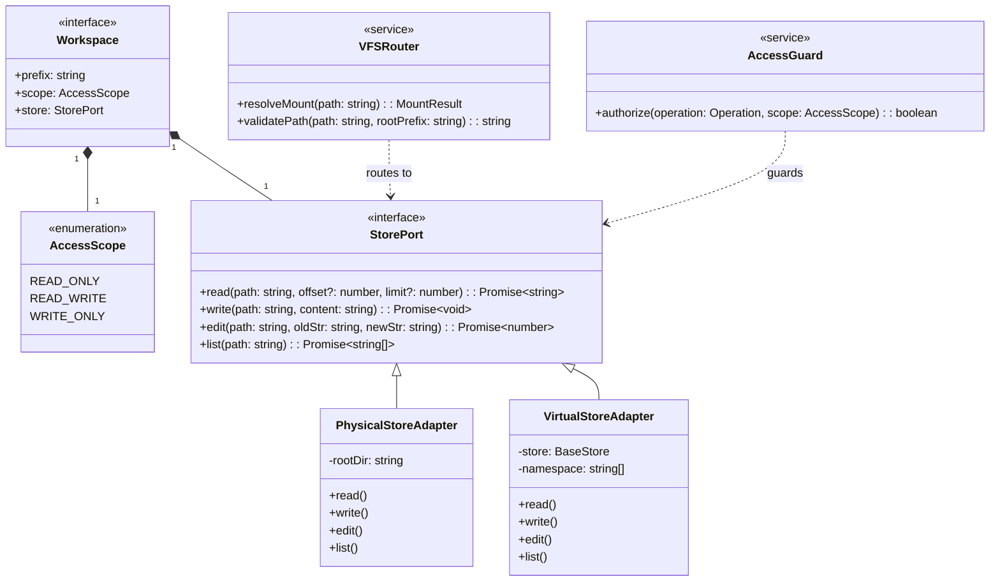

# Technical Specification (TechSpec.md): WorkspacesMiddleware

## 1. STACK SPECIFICATION (BILL OF MATERIALS)
- **Target Runtime:** Node.js >= 20.x, Bun >= 1.1 (Universal JS for library compatibility).
- **Language:** TypeScript 5.x (Strict Mode `true`, `noImplicitAny: true`).
- **Validation:** `zod` (^3.23.0).
- **LangChain Dependencies:** `@langchain/core`, `langchain` (peer).
- **Built-in Modules:** `node:fs/promises` (Physical Store), `node:path/posix` (Logical Routing), `node:path` (Physical Routing).

## 2. ARCHITECTURE DECISION RECORDS (ADRS)

| Title | Context | Decision | Consequences |
| :--- | :--- | :--- | :--- |
| **ADR-001: Strict POSIX Logical Pathing** | Node.js handles paths differently on Windows (`\`) vs. Unix (`/`). If the VFS Router uses native `path.resolve`, longest-prefix matching will fail across OS environments. | The Core Domain (`VFS Router`) will exclusively use `node:path/posix` for all logical routing. Translation to OS-specific paths occurs only inside the `PhysicalStoreAdapter`. | Ensures deterministic virtual routing regardless of host OS. Requires strict sanitization before hitting disk. |
| **ADR-002: BaseStore Key Mapping** | LangGraph `BaseStore` expects a namespace tuple and a string key. We must map logical paths like `/project/docs/api.md` to this format without collisions. | `VirtualStoreAdapter` will accept a base namespace (e.g., `["workspaces", agentId]`). The physical key will be the relative logical path without leading slashes (e.g., `project/docs/api.md`). | Prevents key-collision with other LangGraph storage mechanics and allows clean sub-namespace searching via `yieldKeys(prefix)`. |
| **ADR-003: Stateless File Operations** | Previous implementations mutated LangGraph's ephemeral `state.files` object, causing massive payload bloat and OOM risks on large files. | `wrapToolCall` will execute I/O via the Store Adapters and return a standard `ToolMessage`. It will **never** return a `Command` that updates a `files` state channel. | Decouples file persistence from graph state limits. Agents must explicitly read files to access content. |
| **ADR-004: Ecosystem Interoperability** | Using Bun-specific APIs (`Bun.file`) would fracture compatibility with Node.js and Deno. | Use standard `node:fs/promises`. Bun's runtime will natively optimize these calls automatically. | Retains 100% ecosystem compatibility while preserving high performance in Bun environments. |
| **ADR-005: Symlink Attack Prevention** | Per DeepAgents security model, an LLM could create symlinks to escape the workspace boundary. | `PhysicalStoreAdapter` must open files with `O_NOFOLLOW` flag (or verify via `lstat`) before any read/write operation. Symlink targets are rejected. | Prevents sandbox escape via maliciously crafted symlinks. Adds slight I/O overhead per operation. |
| **ADR-006: Middleware State Isolation** | LangChain's `createMiddleware` provides `stateSchema` for persistent state and `contextSchema` for per-invocation context. We need neither - files are external. | The middleware will use `contextSchema` to capture `threadId`/`runId` for logging but will not persist any workspace state in LangGraph's state channels. | Keeps the middleware stateless; simplifies checkpoint/resume scenarios since file state lives in the Store, not graph state. |

## 3. CORE DOMAIN INTERFACES (DATA MODELS)


```mermaid
classDiagram
    direction TB

    class AccessScope {
        <<enumeration>>
        READ_ONLY
        READ_WRITE
        WRITE_ONLY
    }

    class Workspace {
        <<interface>>
        +prefix: string
        +scope: AccessScope
        +store: StorePort
    }

    class StorePort {
        <<interface>>
        +read(path: string, offset?: number, limit?: number): Promise~string~
        +write(path: string, content: string): Promise~void~
        +edit(path: string, oldStr: string, newStr: string): Promise~number~
        +list(path: string): Promise~string[]~
    }

    class VFSRouter {
        <<service>>
        +resolveMount(path: string): MountResult
        +validatePath(path: string, rootPrefix: string): string
    }

    class AccessGuard {
        <<service>>
        +authorize(operation: Operation, scope: AccessScope): boolean
    }

    class PhysicalStoreAdapter {
        -rootDir: string
        +read()
        +write()
        +edit()
        +list()
    }

    class VirtualStoreAdapter {
        -store: BaseStore
        -namespace: string[]
        +read()
        +write()
        +edit()
        +list()
    }

    Workspace "1" *-- "1" AccessScope
    Workspace "1" *-- "1" StorePort
    VFSRouter ..> StorePort : routes to
    AccessGuard ..> StorePort : guards
    StorePort <|-- PhysicalStoreAdapter
    StorePort <|-- VirtualStoreAdapter
```

## 4. API CONTRACT (PROGRAMMATIC INTERFACES)

### 4.1. Middleware Initialization Contract
The public API for the developer configuring the agent.

```typescript
export type AccessScope = "READ_ONLY" | "READ_WRITE" | "WRITE_ONLY";

export interface PhysicalStoreConfig {
  type: "physical";
  rootDir: string;
}

export interface VirtualStoreConfig {
  type: "virtual";
  namespace: string[];
}

export type StoreConfig = PhysicalStoreConfig | VirtualStoreConfig;

export interface MountConfig {
  prefix: string;          // Logical path, e.g., "/project"
  scope: AccessScope;
  store: StoreConfig;      // Configuration for the store adapter
}

export interface WorkspacesMiddlewareOptions {
  mounts: Array<MountConfig>;
}
```

### 4.2. Tool Interfaces (The Deferred LLM Contracts)

While the precise Zod schemas will be harvested during the Execution phase, the underlying TypeScript interfaces that dictate the expected LLM inputs are firmly defined here. Following the pattern from LangChain's DeepAgents filesystem backend, these interfaces align with proven tool schemas that LLMs can reliably invoke.

```typescript
// Read operation. Provisioned for RO and RW scopes.
export interface ReadFileContract {
  path: string;
  offset?: number;
  limit?: number;
}

// Write operation. Provisioned only for RW and WO scopes.
export interface WriteFileContract {
  path: string;
  content: string;
}

// Edit operation. Provisioned only for RW and WO scopes.
export interface EditFileContract {
  path: string;
  old_string: string;
  new_string: string;
}

// List operation. Provisioned for RO and RW scopes.
export interface ListDirectoryContract {
  path: string;
}
```

### 4.3. Path Sanitization Contract (DeepAgents Pattern)

Following the security model from LangChain's DeepAgents filesystem middleware, the VFS Router must implement the following sanitization guarantees:

```typescript
/**
 * Validates and normalizes a file path for security.
 * Throws PathTraversalError if the path attempts to escape the sandbox.
 * 
 * @param requestPath - The raw path from the LLM tool call
 * @param rootPrefix - The mounted workspace prefix (e.g., "/project")
 * @returns Normalized POSIX path (e.g., "project/docs/api.md")
 */
export function validateFilePath(
  requestPath: string, 
  rootPrefix: string
): string {
  // 1. Reject traversal sequences
  if (requestPath.includes("..") || requestPath.includes("~")) {
    throw new PathTraversalError("Path traversal not allowed");
  }
  
  // 2. Reject Windows absolute paths
  if (/^[a-zA-Z]:/.test(requestPath)) {
    throw new PathTraversalError("Absolute Windows paths not allowed");
  }
  
  // 3. Normalize separators to forward slashes
  const normalized = requestPath.replace(/\\/g, "/");
  
  // 4. Strip leading slash to create relative key
  const relativeKey = normalized.replace(/^\//, "");
  
  // 5. Verify the resolved path stays within rootPrefix
  const resolved = path.posix.resolve(rootPrefix, relativeKey);
  if (!resolved.startsWith(rootPrefix)) {
    throw new PathTraversalError("Path escapes workspace boundary");
  }
  
  return relativeKey;
}
```

**Security Guarantees (Per DeepAgents Pattern):**
1. **Traversal Prevention:** Rejects `../`, `~`, and Windows absolute paths (`C:/`)
2. **Symlink Guard:** When using `PhysicalStoreAdapter`, files must be opened with `O_NOFOLLOW` or verified via `lstat` to prevent symlink-based escapes
3. **Canonical Resolution:** All paths are resolved against the workspace prefix before I/O occurs
4. **POSIX Normalization:** Internal routing always uses POSIX paths; OS-specific translation happens only in the adapter layer

## 5. IMPLEMENTATION GUIDELINES

### 5.1. Clean Architecture Project Layout
To enforce the decoupling mandated by our ADRs, the project must adhere to the following directory structure. Dependency inversion must be utilized so the Core Domain never imports from `infrastructure` or `presentation`.

```sh
src/
├── domain/                    
│   ├── errors.ts              # e.g., AccessDeniedError, PathTraversalError
│   ├── models.ts              # AccessScope, MountConfig, Workspace
│   ├── store-port.ts          # StorePort interface
│   ├── vfs-router.ts          # Longest-prefix match and path normalization logic
│   └── access-guard.ts        # RBAC enforcer
├── infrastructure/            
│   ├── physical-store.ts      # node:fs implementation of StorePort
│   └── virtual-store.ts       # LangGraph BaseStore implementation of StorePort
├── application/               
│   └── tool-synthesizer.ts    # Generates safe toolsets based on AccessScopes
└── presentation/              
    ├── index.ts               # Public exports (createWorkspacesMiddleware)
    ├── middleware.ts          # LangChain wrapModelCall, wrapToolCall hooks
    └── prompt-injector.ts     # System prompt formatting ("Filesystem Map")
```

### 5.2. Coding Standards & Failsafes

1.  **Strict Path Coercion:** All paths entering the `VFS Router` must immediately be coerced into absolute logical paths starting with `/`. Traversal sequences (`../`) must be resolved logically and rejected if they attempt to escape the root `/`.
2.  **Stateless Iteration:** The `Filesystem Map` injected into the prompt must be regenerated dynamically via the `beforeModel` hook on every turn. This ensures that if mount configurations are somehow altered dynamically (e.g., via another higher-level orchestrator), the agent's prompt reflects the exact reality of that specific turn.
3.  **Exception Handling at the Boundary:** Any error thrown by the `infrastructure` layer (e.g., `ENOENT` from Node.js) must be caught by the `wrapToolCall` adapter and transformed into a graceful string message returned as a `ToolMessage` to the LLM. The Node.js event loop must never crash due to a bad LLM tool call.

### 5.3. Middleware Hook Implementation (LangChain `createMiddleware` Pattern)

Following LangChain's `createMiddleware` API (circa 2025/2026), the middleware must implement the following hooks:

```typescript
import { createMiddleware } from "langchain";
import { z } from "zod";

export const workspacesMiddleware = createMiddleware({
  name: "workspaces-vfs",
  
  // Capture thread context for logging/tracing without persisting in graph state
  contextSchema: z.object({
    threadId: z.string().optional(),
    runId: z.string().optional(),
  }),

  // Inject Filesystem Map into system prompt before each model turn
  beforeModel: async (state, runtime) => {
    const fsMap = generateFilesystemMap(runtime);
    // Inject into the first system message or prepend as system instruction
    return {
      // Return partial state update - middleware can modify messages
    };
  },

  // Route tool calls to VFS, transform errors to ToolMessages
  wrapToolCall: async (request, handler) => {
    try {
      // 1. Validate path via VFS Router
      // 2. Authorize via Access Guard  
      // 3. Execute via appropriate Store Port
      // 4. Return ToolMessage with result
    } catch (error) {
      // Transform to graceful error message - never let exception bubble
      return new ToolMessage({
        tool_call_id: request.toolCall.id,
        content: `Error: ${error.message}`,
      });
    }
  },
});
```

**Key Hook Semantics:**
- **`beforeModel`**: Runs before each LLM invocation. Used to inject the dynamic Filesystem Map into the prompt.
- **`wrapToolCall`**: Intercepts every tool invocation. Must return either a `ToolMessage` or a `Command`. Returning a `Command` allows short-circuiting (e.g., retry or jumpTo).
- **`contextSchema`**: Provides typed per-invocation context (threadId, runId) without polluting graph state.

### 5.4. Large File Eviction Strategy

Per the DeepAgents middleware pattern, large file reads present memory risks. The `StorePort` implementation must:

1. **Streaming Reads:** Use file streams rather than `readFile` for files exceeding a configurable threshold (default: 256KB)
2. **Pagination Support:** The `ReadFileContract` supports `offset` and `limit` parameters; adapters must honor these
3. **Truncation with Warning:** If a file exceeds the LLM context window, truncate and append: `[...truncated. File size: X bytes. Use offset/limit to read remaining content.]`

### 5.5. Test Coverage Requirements

| Scenario | Expected Outcome |
|----------|-----------------|
| Path contains `../` | Throws `PathTraversalError` |
| Path contains `~` | Throws `PathTraversalError` |
| Path is Windows absolute (`C:/`) | Throws `PathTraversalError` |
| Symlink points outside workspace | Rejected (O_NOFOLLOW or lstat check) |
| Read non-existent file | Returns `ToolMessage` with "File not found" |
| Write to READ_ONLY workspace | Throws `AccessDeniedError` (caught and returned as message) |

***

